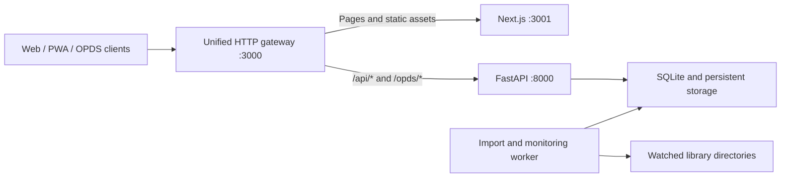

# Ermao Books

English | [简体中文](README.md)

Ermao Books is a self-hosted digital library for individuals and families. It organizes ebooks, PDFs, comics, and audiobooks stored on a NAS, home server, or local drive. The system provides folder monitoring and uploads, format conversion, metadata organization, online reading and listening, progress synchronization, OPDS, Send to Kindle, and data backup.

The database, accounts, reading progress, and system settings remain on your own device. Original books stay in the directories you specify, with no dependency on third-party cloud hosting.

- Current version: `0.5.5`
- Languages: Simplified Chinese and English
- License: [MIT](LICENSE)
- Community and feedback: QQ group `154560969`

## Core Features

### Library and Organization

- Upload books or monitor multiple folders to discover and import new files automatically.
- Search and filter by title, author, media type, format, tag, series, and reading status.
- Organize books with custom shelves, smart shelves, reading statuses, and series.
- Identify titles, authors, covers, chapters, and volumes automatically, with manual editing and intelligent metadata completion.
- Detect duplicate files, alternate media editions, and consecutive volumes, with merge, split, transfer, and bulk organization actions.
- Review import progress and failure reasons, then retry, rescan, or clean up tasks in bulk.

### Reading and Listening

- Read EPUBs, PDFs, and comics online with table-of-contents navigation, display settings, page-turning, and scrolling modes.
- Play single-file or multi-track audiobooks with chapter navigation, playback speed, seeking, volume, and a sleep timer.
- Save reading and listening progress automatically and synchronize it across devices signed in to the same server.
- Download original volume files, or send EPUB and PDF files to Kindle and review delivery status.

### Accounts, Access, and Operations

- First-run setup, multiple user accounts, profiles, and password management.
- SQLite database backup, restore, and download.
- Import activity, Kindle delivery history, system events, health checks, and log export.
- Responsive Web access and PWA installation.
- Optional OPDS 1.2 catalog access for browsing, search, downloads, and reading-progress synchronization in compatible readers.
- A native iOS and Android client is under active development. Server connection, sign-in, library browsing, shelves, and imports are available; the native reader is still in progress.

## Supported Formats

- Ebooks: EPUB, MOBI, AZW, AZW3, PRC, FB2, TXT
- Documents: PDF
- Comics: CBZ, CBR, ZIP, and RAR image archives
- Audiobooks (common): M4B, M4A, M4R, MP3, MP2, AAC, FLAC, WAV, RF64, W64, OGG, OGA, OPUS, WEBA
- Audiobooks (compatible import): AC3, E-AC-3, AIFF, AMR, APE, CAF, DTS, DSD, MKA, WMA, WavPack, and other audio formats recognized by `ffprobe`

Audiobooks are streamed with their original encoding and are not transcoded by the server. Import support does not guarantee that every device browser can decode a format. The player checks the current browser and reports unsupported containers and codecs. General-purpose video containers and DRM audio containers are not imported as audiobooks.

DRM-protected Kindle files are not supported.

## Docker Compose Installation (Recommended)

The production image supports `linux/amd64` and `linux/arm64`; Docker selects the correct architecture automatically. Prepare the library and application-data directories first:

```bash
mkdir -p ermao-library/library ermao-library/data/storage
cd ermao-library
```

- `library` stores original ebooks, PDFs, comics, and audiobooks.
- `data/storage` stores SQLite, cover caches, logs, session secrets, and other application data.

Then save the following as `compose.yaml`:

```yaml
name: ermao-books

services:
  web:
    image: gamersgu/shuku-starship-web:prod
    pull_policy: always
    container_name: shuku-prod-web
    restart: unless-stopped
    user: "${PUID:-1000}:${PGID:-1000}"
    environment:
      STORAGE_ROOT: /app/storage
      PORT: 3000
      HOSTNAME: 0.0.0.0
    ports:
      - "${WEB_PORT:-3000}:3000"
    volumes:
      - ${STORAGE_PATH:-./data/storage}:/app/storage
      - ./library:/libraries/books
      # Add other host libraries as needed:
      # - /srv/comics:/libraries/comics
    command: ["./scripts/start-unified-app.sh"]
    healthcheck:
      test: ["CMD-SHELL", "node -e \"fetch('http://127.0.0.1:3000/api/health').then(r=>process.exit(r.ok?0:1)).catch(()=>process.exit(1))\""]
      interval: 30s
      timeout: 5s
      retries: 5
      start_period: 30s
```

Start the service from the directory containing `compose.yaml`:

```bash
docker compose up -d
```

When startup finishes, open `http://your-server-address:3000`.

### Data Directories and Permissions

| Variable | Default | Purpose |
| --- | --- | --- |
| `WEB_PORT` | `3000` | Host port for Web access |
| `PUID` / `PGID` | `1000` / `1000` | Host user and group used by the container process |
| `STORAGE_PATH` | `./data/storage` | SQLite, derived files, covers, logs, and session secrets |

Library directories are not configured through environment variables. Map each host library directly to its own container path, such as `/srv/books:/libraries/books` or `/srv/comics:/libraries/comics`, then select that path as a watched folder in the application path tree. Browser-upload destinations must also be writable and must be inside an enabled watched folder.

The user represented by `PUID` and `PGID` must be able to read and write application data and upload destinations. Read-only access is sufficient for an existing library used only for scanning and reading. Do not enter a host-only path that has not been mounted into the container.

When `SESSION_SECRET` is not set explicitly, the unified image generates one securely at `secrets/session-secret` inside persistent storage. Always persist `/app/storage`; do not leave the database or secrets only in the container's writable layer.

Update the production image with:

```bash
docker compose pull
docker compose up -d
```

Updating or recreating the container does not clear mounted data. For public Internet access, place the service behind an HTTPS reverse proxy and expose only the Web entry point.

## First-Time Setup

1. Open the application and follow the wizard to create the initial administrator account.
2. Select the mounted and readable `/libraries/books` directory from the path tree, or configure it later under **Settings → Library Sources and Import**.
3. Place books in the corresponding host directory, or upload files from **All Books**.
4. Track parsing and conversion in the import tasks, then open the library to read or listen.
5. Configure Douban, Bangumi, or AI metadata providers under **Smart Organization** as needed.
6. For Send to Kindle, configure SMTP and the Kindle email address under **Email and Kindle**.
7. For third-party readers, enter the public URL and enable the catalog under **Settings → OPDS**.

A new database has no default username or password.

## Local Development

Required runtimes:

- Node.js `22.23.1` (see `.nvmrc`)
- pnpm `9.12.2` (see the root `package.json`)
- Python `3.11.15` (see `apps/api-python/.python-version`; managed by `uv`)

Do not run project tests with another Node.js version or with Python 3.12.

### Start Web, API, and Worker

```bash
pnpm install
cp .env.example .env
pnpm dev:test
```

The default URL is `http://localhost:3000`. `pnpm dev:test` starts the unified gateway, Next.js, FastAPI, and the Python worker together.

### Start the Native Client

Make sure the local service is reachable from the simulator or device, then run:

```bash
pnpm --filter @shuku/mobile start
# Or create and launch a native development build
pnpm --filter @shuku/mobile ios
pnpm --filter @shuku/mobile android
```

Native builds also require the appropriate Xcode or Android Studio toolchain.

### Common Quality Checks

```bash
# Web
pnpm --filter @shuku/web lint
pnpm --filter @shuku/web typecheck
pnpm --filter @shuku/web test
pnpm --filter @shuku/web i18n:check
pnpm --filter @shuku/web build

# Python API and worker
cd apps/api-python
uv run --extra dev pytest -q

# Mobile (after returning to the repository root)
pnpm --filter @shuku/mobile check

# Deployment and release
pnpm fnos:validate
pnpm release:validate
```

## Runtime Architecture

Production uses one unified image and one public port:



- Next.js and FastAPI listen only inside the container and are routed through the gateway.
- SQLite is currently the only database; the API initializes and upgrades the schema at startup.
- The Python worker handles folder monitoring, imports, conversions, and persistent queue tasks.
- Original library directories and system storage are mounted separately for easier backup and migration.

## Technology Stack

- Web: Next.js 16, React 19, TypeScript, Tailwind CSS
- Mobile: Expo 57, React Native 0.86, Expo Router
- API: Python 3.11, FastAPI, SQLAlchemy 2, Alembic
- Database: SQLite
- Import and conversion: persistent Python worker, Watchdog, libmobi, EbookLib, lxml, Mutagen, FFmpeg/ffprobe
- Readers and players: Foliate.js, PDF.js, custom comic reader adapter, HTML5 Audio
- Tooling: pnpm Workspace, Turborepo, Playwright, Pytest
- Deployment: Docker Compose, multi-architecture `linux/amd64` and `linux/arm64` images, fnOS, PWA

## Repository Layout

```text
apps/
├── api-python/       FastAPI, domain modules, database migrations, and worker
├── mobile/           Expo iOS and Android client
└── web/              Next.js Web application and PWA
packages/
└── reader-core/      Cross-client reader state and contracts
deploy/
└── fnos/             fnOS application template and build documentation
release-notes/        Release notes and update feed
scripts/              Local development, validation, publishing, and unified runtime scripts
```

## More Documentation

- [Python API, converters, and worker](apps/api-python/README.md)
- [Mobile visual and interaction guidelines (Chinese)](docs/mobile-app-design-guidelines.md)
- [Business-code layering and refactoring policy](docs/business-code-layering-and-refactoring.md)
- [fnOS template and local build](deploy/fnos/README.md)
- [Release notes](release-notes/README.md)
