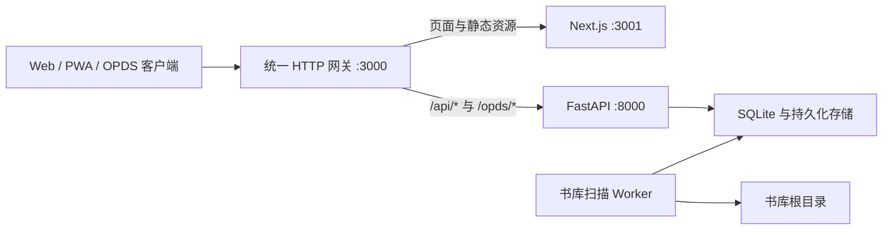

# 二毛图书（Ermao Books）

[English](README.en.md) | 简体中文

二毛图书是一套面向个人与家庭的自托管数字书库，用于整理 NAS、家庭服务器或本地硬盘中的电子书、PDF、漫画和有声书。系统以书库根目录的文件夹结构作为作品、版本和卷册的结构来源，并提供扫描导入、元数据整理、在线阅读与收听、阅读进度同步、OPDS、Kindle 发送以及数据备份。

数据库、账户、阅读进度和系统设置均保存在自己的设备上；原始读物保留在指定目录中，不依赖第三方云端托管。

- 当前版本：`0.5.5`
- 支持语言：简体中文、English
- 许可证：[MIT](LICENSE)
- 交流与反馈：QQ 群 `154560969`

## 核心能力

### 书库与整理

- 配置多个独立书库根目录，并以平铺、卷册或有声书组织方式扫描新增文件。
- 按标题、作者、媒介类型、格式、标签、系列和阅读状态搜索筛选。
- 使用自定义书架、智能书架、阅读状态和系列管理藏书。
- 自动识别书名、作者、封面和章节，支持手动编辑和元数据补全。
- 文件夹和文件的位置直接决定 Work、Version 与 Volume；系统不会根据标题相似度或元数据自动归组、合并或移动结构。
- 查看导入进度与失败原因，支持重试、重新扫描和批量清理。

### 阅读与收听

- 在线阅读 EPUB、PDF 和漫画，支持目录跳转、显示设置、翻页与滚动模式。
- 播放单文件或分轨有声书，支持章节切换、倍速、快进、音量和睡眠定时。
- 自动保存阅读与收听进度，并在登录同一服务器的设备之间同步。
- 下载原始卷册文件，或将 EPUB、PDF 发送到 Kindle 并查看发送状态。

### 账户、接入与运维

- 首次启动向导、多用户账户、资料与密码管理。
- SQLite 数据库备份、恢复和下载。
- 导入记录、Kindle 发送记录、系统事件、健康检查和日志导出。
- 可响应式使用 Web，或安装为 PWA。
- 可启用 OPDS 1.2 目录，通过兼容阅读器浏览、搜索、下载和同步阅读进度。
- 原生 iOS/Android 客户端正在开发中，现已覆盖服务器连接、登录、书库浏览、书架和导入；原生阅读器仍在建设中。

## 支持格式

- 电子书：EPUB、MOBI、AZW、AZW3、PRC、FB2、TXT
- 文档：PDF
- 漫画：CBZ、CBR、ZIP、RAR 图片包
- 有声书（常用）：M4B、M4A、M4R、MP3、MP2、AAC、FLAC、WAV、RF64、W64、OGG、OGA、OPUS、WEBA
- 有声书（兼容导入）：AC3、E-AC-3、AIFF、AMR、APE、CAF、DTS、DSD、MKA、WMA、WavPack 等 `ffprobe` 可识别的音频格式

有声书保持原编码直接播放，服务器不会转码。能够导入不代表每台设备的浏览器都能解码；播放器会检查当前浏览器能力，并在不支持时显示容器与编码信息。通用视频容器和 DRM 音频容器不会作为有声书导入。

不支持带 DRM 的 Kindle 文件。

## Docker Compose 安装（推荐）

生产镜像支持 `linux/amd64` 与 `linux/arm64`，Docker 会自动选择设备架构。先准备书库和应用数据目录：

```bash
mkdir -p ermao-library/library ermao-library/data/storage
cd ermao-library
```

- `library`：保存原始电子书、PDF、漫画和有声书。
- `data/storage`：保存 SQLite、封面缓存、日志、会话密钥和其他应用数据。

然后将以下内容保存为 `compose.yaml`：

```yaml
name: ermao-books

services:
  web:
    image: gamersgu/shuku-starship-web:prod
    pull_policy: always
    container_name: shuku-prod-web
    restart: unless-stopped
    user: "${PUID:-1000}:${PGID:-1000}"
    environment:
      STORAGE_ROOT: /app/storage
      PORT: 3000
      HOSTNAME: 0.0.0.0
    ports:
      - "${WEB_PORT:-3000}:3000"
    volumes:
      - ${STORAGE_PATH:-./data/storage}:/app/storage
      - ./library:/libraries/books
      # 可按需增加其他宿主机书库：
      # - /srv/comics:/libraries/comics
    command: ["./scripts/start-unified-app.sh"]
    healthcheck:
      test: ["CMD-SHELL", "node -e \"fetch('http://127.0.0.1:3000/api/health').then(r=>process.exit(r.ok?0:1)).catch(()=>process.exit(1))\""]
      interval: 30s
      timeout: 5s
      retries: 5
      start_period: 30s
```

在 `compose.yaml` 所在目录启动：

```bash
docker compose up -d
```

启动完成后访问 `http://服务器地址:3000`。

### 数据目录与权限

| 变量 | 默认值 | 用途 |
| --- | --- | --- |
| `WEB_PORT` | `3000` | 宿主机访问端口 |
| `PUID` / `PGID` | `1000` / `1000` | 容器进程使用的宿主机用户与用户组 |
| `STORAGE_PATH` | `./data/storage` | SQLite、封面、日志和会话密钥 |
| `LIBRARY_HOST_PATH` | `./library` | 默认书库根目录，对应容器内 `/libraries/books` |

每个宿主机书库都应直接映射到独立的容器路径，例如 `/srv/books:/libraries/books`、`/srv/comics:/libraries/comics`，然后在系统路径树中将对应路径添加为书库根目录并选择组织方式。浏览器上传目标必须可写、位于已启用的书库根目录内，并符合该根目录的结构约定。完整规则见[书库根目录结构](docs/library-root-layout.md)。

`PUID`/`PGID` 指向的用户必须能读写应用数据和上传目标；只用于扫描与阅读的现有书库至少需要读取权限。不要在系统中填写没有映射进容器的宿主机路径。

未显式设置 `SESSION_SECRET` 时，统一镜像会在持久化存储的 `secrets/session-secret` 中安全生成一个。请始终持久化 `/app/storage`，不要把数据库或密钥只留在容器可写层。

更新生产镜像：

```bash
docker compose pull
docker compose up -d
```

更新或重建容器不会清空已挂载的数据。通过公网访问时，请在前方配置 HTTPS 反向代理，并只暴露 Web 入口。

## 首次使用

1. 打开系统，根据向导创建初始管理员账户。
2. 在路径树中选择已挂载、可读取的 `/libraries/books`，并选择平铺、卷册或有声书组织方式；也可稍后进入“设置 → 书库来源与导入”配置。
3. 按所选组织方式放置读物，或将文件上传到符合结构约定的位置。
4. 在导入任务中查看解析和入库进度；完成后进入书库阅读或收听。
5. 按需在“智能整理”中配置豆瓣、Bangumi 或 AI 元数据来源。
6. 如需 Kindle 发送，在“邮件与 Kindle”中配置 SMTP 与 Kindle 邮箱。
7. 如需第三方阅读器访问，在“设置 → OPDS”填写公开 URL 并启用目录。

全新数据库不提供默认账号或密码。

## 本地开发

所需运行时：

- Node.js `22.23.1`（见 `.nvmrc`）
- pnpm `9.12.2`（见根 `package.json`）
- Python `3.11.15`（见 `apps/api-python/.python-version`，由 `uv` 管理）

不要使用其他 Node.js 版本或 Python 3.12 运行项目测试。

### 启动 Web、API 与 Worker

```bash
pnpm install
cp .env.example .env
pnpm dev:test
```

默认访问地址为 `http://localhost:3000`。`pnpm dev:test` 会同时启动统一网关、Next.js、FastAPI 和 Python Worker。

### 常用质量检查

```bash
# Web
pnpm --filter @shuku/web lint
pnpm --filter @shuku/web typecheck
pnpm --filter @shuku/web test
pnpm --filter @shuku/web i18n:check
pnpm --filter @shuku/web build

# Python API 与 Worker
cd apps/api-python
uv run --extra dev pytest -q

# 部署与发布
pnpm fnos:validate
pnpm release:validate
```

## 运行架构

生产环境使用一个统一镜像和一个公开端口：



- Next.js 与 FastAPI 仅在容器内部监听，由网关统一路由。
- SQLite 是当前唯一数据库；API 启动时从当前基线初始化 schema。
- Python Worker 负责扫描书库根目录、解析原始文件和执行持久化队列任务。
- 原始读物目录与系统存储分开挂载，便于备份和迁移。

## 技术栈

- Web：Next.js 16、React 19、TypeScript、Tailwind CSS
- API：Python 3.11、FastAPI、SQLAlchemy 2、Alembic
- 数据库：SQLite
- 导入与媒体解析：持久化 Python Worker、Watchdog、EbookLib、lxml、Mutagen、FFmpeg/ffprobe
- 阅读器与播放器：Readium TS/Kotlin/Swift、PDF.js 能力回退、自研漫画适配器、HTML5 Audio
- 工程：pnpm Workspace、Turborepo、Playwright、Pytest
- 部署：Docker Compose、`linux/amd64` 与 `linux/arm64` 多架构镜像、fnOS、PWA

## 仓库结构

```text
apps/
├── api-python/       FastAPI、领域模块、数据库迁移与 Worker
└── web/              Next.js Web 与 PWA
packages/
└── reader-core/      跨客户端的阅读器状态与契约
deploy/
└── fnos/             fnOS 应用模板与构建说明
release-notes/        版本说明与更新清单
scripts/              本地开发、验证、发布和统一运行脚本
```

## 更多文档

- [Python API 与 Worker](apps/api-python/README.md)
- [业务代码分层与重构策略](docs/business-code-layering-and-refactoring.md)
- [移动 App 第一阶段：Web → App 功能基线](docs/mobile-app-phase-1-web-to-app-functional-baseline.md)
- [移动 App 第二阶段：4 Tab 信息架构与导航规范](docs/mobile-app-phase-2-information-architecture.md)
- [移动 App 第三阶段：关键 User Flow 与 Wireframe 视觉锚点](docs/mobile-app-phase-3-user-flows-and-wireframes.md)
- [移动 App 第四阶段：方向 A“暖白书页”视觉规范 v1](docs/mobile-app-phase-4-visual-master.md)
- [移动 App 第五阶段：1:1 高保真视觉锚点](docs/mobile-app-phase-5-high-fidelity-anchors.md)
- [移动 App 第六阶段：服务器与认证高保真闭环](docs/mobile-app-phase-6-server-auth-high-fidelity.md)
- [移动 App 第七阶段：书库发现流高保真闭环](docs/mobile-app-phase-7-library-discovery-high-fidelity.md)
- [移动 App 全局开发规范：原生体验与设计还原](docs/mobile-app-development-global-guidelines.md)
- [fnOS 模板与本地构建](deploy/fnos/README.md)
- [版本说明](release-notes/README.md)
