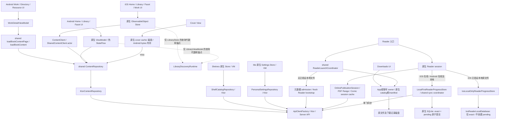

# Mobile Navigation and State Retention Audit

> SDK 版本历史快照：iOS 已获准升级官方 Readium 3.9.0；当前锁和验收见 [升级记录](../testing/ios-readium-3.9.0-2026-08-28.md)，不得按本页旧版本回退。

## 1. 审计基线

| 项目 | 记录 |
|---|---|
| 审计日期 | 2026-08-28，Asia/Shanghai；开始文件指纹时间 11:10:20 |
| 分支 | `develop`；未切换分支 |
| Commit | `9fcadcdadb2c2d1b26f332d08e9e243409c4fb71` |
| `git log -1 --oneline` | `9fcadcda feat: unify streaming readers and synchronize local mobile updates` |
| 开始时 `git status` | `On branch develop`；与 `origin/develop` 同步；75 个已跟踪文件修改、6 个未跟踪文件、无暂存变更，共 81 项 |
| 审计对象 | 当前工作树，包括上述未提交实现；不是仅审计 HEAD，也不是依据设计文档认定能力已实现 |
| 审计权限 | 只读源码、构建与现有测试、任务拆分；仅本文件由本审计新增。没有重构、改业务/测试代码、改接口、依赖、UI、配置、lockfile 或手工生成文件 |
| 文档位置 | 仓库有 `docs/testing`、`docs/verification` 和根目录历史审计，但没有统一 `audits/reviews` 目录，因此使用请求指定的 `docs/audits/mobile-navigation-state-audit.md` |
| 保护措施 | 对开始时 3,825 个已跟踪/未忽略路径记录文件指纹（普通文件 SHA-256，非普通文件另作标记）；不清理、不回退、不暂存已有改动。构建产物使用已有忽略目录，日志/测试结果在临时目录 |

**工作树在审计过程中有外部并行编辑。** 开始后检测到 8 个既有文件继续变化，并新增 `docs/testing/mobile-reader-online-first-2026-08-28.md`。受影响 Reader/Downloads 源码已重新读取，KMP/Android 与 iOS 测试重新执行。不能把第一轮测试无条件归给结束时源码，也不能把整个工作区描述成“只有新增审计文档”。精确结束状态及验证结果见本节末的验证记录。

### 1.1 实际技术栈、入口与模块边界

表中均为源码/锁定配置事实，不是对最新版依赖的推断。下文为控制表格宽度使用三个路径前缀：

- **I** = `apps/mobile/iosApp/ErmaoLibrary/`
- **A** = `apps/mobile/androidApp/src/main/kotlin/com/ermao/library/`
- **S** = `apps/mobile/shared/src/commonMain/kotlin/com/ermao/library/shared/`

所有行号以本次工作树为准；问题章节提供完整仓库路径。表格中的“保留”必须同时满足账号/权限命名空间未变化，不能用于绕过失效授权。

| 模块/入口 | 当前实现及证据 |
|---|---|
| 移动端模块 | `apps/mobile/settings.gradle.kts:19–24` 包含 `shared`、`androidApp`、`mobiCore`、`archiveCore`、`pdfiumNative`；另有 `iosApp` Xcode 工程、`native/mobi-core`、`native/archive-core` Swift/C 包 |
| iOS App 入口 | `I/ErmaoLibraryApp.swift:5–18,20–71,74–101`：SwiftUI `@main App` / `WindowGroup`；App 持有 `SessionStore`、`DownloadCenterStore` 的 `@StateObject`，内容客户端、封面缓存及 Reader composition |
| Android App 入口 | Manifest `apps/mobile/androidApp/src/main/AndroidManifest.xml:7–31`；`A/ErmaoLibraryApplication.kt:24–25,85–111` 装配 shared runtime、repositories、下载及进度中心；`A/MainActivity.kt:16–35` 为 `AppCompatActivity` + Compose `setContent`，`MainViewModel` 属 Activity |
| KMP 入口 | Android：`apps/mobile/shared/src/androidMain/kotlin/com/ermao/library/shared/AndroidComposition.kt:34–92,111–140`；iOS：`S/bootstrap/IosComposition.kt:42–104,107–157,187–198`，导出静态 `ErmaoShared` framework |
| shared 构建边界 | `apps/mobile/shared/build.gradle.kts:9–27,30–47`：Android JVM 17、`iosArm64`；共享业务/协议/网络，不共享原生 UI；没有共享 Room/SQLDelight 页面数据库配置 |
| 导航框架 | iOS：SwiftUI `TabView` + 每 Tab 一个 `NavigationStack(path:)`。Android：**Navigation 3 `NavDisplay` / `rememberNavBackStack` / `NavKey`**，不是 Navigation 2 `NavHost/NavController`；未使用 Hilt/Koin VM 注入 |
| 版本 | `apps/mobile/gradle/libs.versions.toml:2–24`：AGP 9.1.0、Kotlin 2.4.10、Ktor 3.5.1、coroutines 1.11.0、Lifecycle 2.10.0、Navigation 3 1.1.4、Compose BOM 2026.06.00、Readium Kotlin 3.3.0；iOS Readium 锁定 revision `f7d10d2bf5876408feae14d634416f69d1473fd8`，已由 Xcode package graph 核对 |
| 页面状态 | iOS 原生 `ObservableObject/@Published/@StateObject` + 局部 `@State/@SceneStorage`；Android 原生 `ViewModel/MutableStateFlow` + `rememberSaveable`、部分 `SavedStateHandle`。shared `LibraryDiscoveryRuntime` 只管查询/代数/锚点等，不持页面实体 |
| 网络 | 原生 adapter → shared Ktor repositories → `ApiClientFactory/ApiClient`；Android OkHttp、iOS Darwin。普通内容 Repository 没有实体 cache、TTL、SWR 或通用在途请求合并 |
| 本地数据 | 内容页实体主要在原生 Store/VM 内存；封面有原生磁盘缓存，Android 另有小容量 bytes 内存缓存；Reader 精确进度/待同步 SQLite，偏好/书签原生存储；Downloads manifest/catalog + 原文件。会话/凭据、部分导航 ID 持久化，与页面 GET 快照分开 |

### 1.2 证据等级与验证边界

- **静态代码链**：明确入口、生命周期 hook、状态赋值、下游 API/文件操作；不将 UI 重新计算等同加载。
- **运行验证**：仅将本次执行且有结果的 host test、真机 XCTest/UI test 记为运行证据；历史文档、子代理结论、测试名字和成功编译均不能替代实际操作验证。
- **未覆盖**：没有本次 A–D 全流程的页面/VM 实例计数、端到端 API 请求计数或像素偏移测量；没有 Android 真机、Activity/进程回收实测，也没有完整 iOS Scene/进程恢复实测。
- iOS fixture UI 测试运行原生页面，但其 `ContentClient` 是本地 fixture，不能证明真实 HTTP 请求次数、慢网络或 Reader 格式引擎启动；其 Reader composition 为 nil（`I/ErmaoLibraryApp.swift:20–49`）。
- 遵守仓库真机政策：Android ADB 无连接设备，不启动模拟器补证；iOS 使用已配对、Developer Mode enabled、已解锁的物理 iPhone 17 Pro Max，`iphoneos` 和有效自动签名，无签名绕过。

### 1.3 验证记录

验证日志根目录：`/var/folders/d8/2c367y3s79b_hrmg8d1b8vzm0000gn/T/mobile-navigation-audit-ypf3b5d4`。日志不提交到仓库，不包含本次新增的生产调试代码。该目录仅是本机可追溯附件，下面的结果摘要随审计文档保存。

#### 环境与命令结果

Xcode 为 26.6 / Build 17F113，Java 为 OpenJDK 17.0.20。Android SDK 位于 `/Users/guyu/Library/Android/sdk`。下面统计按**测试用例**计数，不把同一用例内的两个 assertion failure 算成两个失败用例。

| 执行位置 / 命令 | 结果与限制 |
|---|---|
| 仓库根目录：`git status`、`git branch --show-current`、`git log -1 --oneline` | 均成功；基线见上表和本节工作树记录。未切换分支、未清理/回退已有改动 |
| `xcodebuild -version`；`java -version` | 成功，版本如上 |
| 初次调用 `adb devices -l` | 当前 PATH 找不到 adb；随后定位已有 SDK，没有安装工具或改配置 |
| `/Users/guyu/Library/Android/sdk/platform-tools/adb devices -l` | 成功但 `List of devices attached` 后为空；**无 Android 真机 UI/Activity/进程恢复运行证据**，未以模拟器替代 |
| Xcode `-showdestinations`，使用已有 project/scheme 及禁止自动 package resolution 参数 | 成功，发现已配对物理 iOS 设备；`ios-destinations.log` |
| `xcrun devicectl device info details --device 00008150-0011112211A0C01C`；`... info lockState --device 00008150-0011112211A0C01C` | 成功；物理 iPhone 17 Pro Max、iOS 26.6、已配对/Developer Mode enabled；两轮前均 `passcodeRequired: false`。设备的自定义显示名不是型号依据 |
| Gradle 首轮：`:shared:testAndroidHostTest :androidApp:testDebugUnitTest :androidApp:assembleDebug :shared:compileKotlinIosArm64` | exit 0 / BUILD SUCCESSFUL；测试任务 UP-TO-DATE，不能当作本次新执行测试。日志 `mobile-build-tests.log` |
| Gradle 强制测试：`:shared:testAndroidHostTest --rerun :androidApp:testDebugUnitTest --rerun` | exit 0；当时 shared 332、Android 146 项通过，0 failures/errors/skips。日志 `mobile-tests-rerun.log` |
| Gradle 最终快照复验：完整命令见下 | exit 0；**shared 333 / Android 146 项全部通过**，分别 61/38 个 suite，0 failures/errors/skips；APK assemble 与 iosArm64 Kotlin 编译成功（增量 UP-TO-DATE），测试强制执行。日志 `mobile-verification-final.log` |
| iOS 第一轮 `xcodebuild ... test`，全 ErmaoLibraryTests + 五个指定 UI case | 真机编译、签名、安装成功；**exit 65 / TEST FAILED**。159 项中 153 通过、6 失败：单元 151/154 通过，UI 2/5 通过；0 skipped。`ios-tests.log`、`ios-navigation-tests.xcresult` |
| iOS 最终快照复验：同样 test selection，完整命令见下 | 真机编译、签名、安装成功；**exit 65 / TEST FAILED**。159 项中 **155 通过、4 失败**：单元 153/154 通过（失败用例含两个 assertion），UI 2/5 通过；0 skipped。`ios-tests-final.log`、`ios-navigation-tests-final.xcresult` |
| `xcrun xcresulttool get test-results summary --path <本轮 xcresult> --compact` | exit 64，DBError；改用 `xcrun xcresulttool get object --legacy --format json --path <本轮 xcresult>` 成功提取两轮 metrics / failure details。没有据解析失败伪造测试结果 |
| `xcrun xcresulttool export attachments --path <首轮 xcresult> --output-path <临时附件目录> --only-failures` | 成功；导出了已有失败附件，未将 accessibility 文本当作截图或视觉验收 |
| `apps/web`：`pnpm i18n:check` | exit 0，Validated **2053** messages in zh-CN/en-US；未使用写入 catalog 参数 |

最终 Gradle 命令（工作目录 `apps/mobile`）：

```sh
ANDROID_HOME=/Users/guyu/Library/Android/sdk ./gradlew --offline --console=plain \
  :shared:testAndroidHostTest --rerun \
  :androidApp:testDebugUnitTest --rerun \
  :androidApp:assembleDebug :shared:compileKotlinIosArm64
```

两轮 Gradle 预检也使用同一 `ANDROID_HOME`、`--offline --console=plain`，任务参数见表。没有请求升级/重新解析依赖。

最终 iOS 命令（仓库根目录；首轮只有 resultBundlePath 去掉 `-final` 后缀）：

```sh
ANDROID_HOME=/Users/guyu/Library/Android/sdk xcodebuild \
  -project apps/mobile/iosApp/ErmaoLibrary.xcodeproj \
  -scheme ErmaoLibrary -configuration Debug -sdk iphoneos \
  -destination platform=iOS,id=00008150-0011112211A0C01C \
  -disableAutomaticPackageResolution -onlyUsePackageVersionsFromResolvedFile \
  -parallel-testing-enabled NO \
  -resultBundlePath /var/folders/d8/2c367y3s79b_hrmg8d1b8vzm0000gn/T/mobile-navigation-audit-ypf3b5d4/ios-navigation-tests-final.xcresult \
  -only-testing:ErmaoLibraryTests \
  -only-testing:ErmaoLibraryUITests/ContentDiscoveryUITests/testLibraryNativeSearchSourcesAndOverflowFilterInEnglish \
  -only-testing:ErmaoLibraryUITests/ContentDiscoveryUITests/testLibraryNativeSearchSourcesAndOverflowFilterInChinese \
  -only-testing:ErmaoLibraryUITests/ContentDiscoveryUITests/testDirectoryResourcePushAndBackRestoresParentContext \
  -only-testing:ErmaoLibraryUITests/ContentDiscoveryUITests/testLibraryWorkDetailAndFacetJourney \
  -only-testing:ErmaoLibraryUITests/ShelfCatalogUITests/testCollectionPushSearchAndShelfBookNavigation \
  test
```

上述现有测试包含 navigation helper、Library/Facet/Home/Shelf Store/VM、Ktor MockEngine repository、Reader 进度/存储/下载测试。它们并不等于四个 Tab 的真实页面实例/API 次数、所有 Reader 格式或进程恢复都已验证。没有执行 Android connected instrumentation；没有执行全量 iOS UI suite。未执行与本次仅新增文档无直接关系的 Web lint/typecheck/test、Python 全套门禁。

#### iOS 未通过项与能证明的内容

| 测试 | 第一轮 | 最终轮 | 失败位置与证据边界 |
|---|---|---|---|
| `ReaderPersistenceTests.testExactProgressRoundTripsWithoutCreatingDurableSyncState` | 失败 | 失败 | `apps/mobile/iosApp/ErmaoLibraryTests/ReaderPersistenceTests.swift:155–172`：save/load 与章定位断言 `:163–169` 通过；`:171–172` 断言旧 `reader_outbox` / `reader_sequence_counters` 表存在失败。当前实现使用 `reader_local_exact` / `reader_progress_sync_v4`。这是测试表结构预期与实现不一致，**不是运行证明已提交进度丢失**；本审计不修改它 |
| `ContentDiscoveryUITests.testDirectoryResourcePushAndBackRestoresParentContext` | 失败 | 失败 | `apps/mobile/iosApp/ErmaoLibraryUITests/ContentDiscoveryUITests.swift:144` 下载 action `isHittable` 断言失败，发生在下级目录 push/back 之前；因此这轮未验证父详情滚动恢复 |
| `ContentDiscoveryUITests.testLibraryNativeSearchSourcesAndOverflowFilterInEnglish` | 失败 | 通过 | 首轮 `ContentDiscoveryUITests.swift:110` 找不到 `library.filter.action`；不能丢弃首轮失败只报告最终通过 |
| `ContentDiscoveryUITests.testLibraryNativeSearchSourcesAndOverflowFilterInChinese` | 通过 | 失败 | 最终轮同 `:110` 找不到 filter action。两轮日志各记录一次系统 BannerNotification interruption；仅凭日志不能将失败全部归为业务 bug 或全部归为系统通知 |
| `ContentDiscoveryUITests.testLibraryWorkDetailAndFacetJourney` | 失败 | 失败 | 首轮 `:231` 未等到 work；最终轮已到详情，但 `:235` 未找到预期标题。尚未完成整条 facet 返回验收，不能据此断言已有缓存/路径保持通过 |
| `DownloadStoreTests.testLiveAzw3TransferPreservesOriginalBytesAndParses` | 失败 | 通过 | 首轮 `apps/mobile/iosApp/ErmaoLibraryTests/DownloadStoreTests.swift:233` 为 `DOWNLOAD_DESCRIPTOR_INVALID: DOWNLOAD_COVER_PATH_INVALID`；外部 Downloads 契约代码变化后最终轮通过，**不将旧失败列成最终源码缺陷** |
| `DownloadStoreTests.testLiveStylesResourceTransferDiagnostic` | 失败 | 通过 | 首轮 NSCocoaErrorDomain Code 4，测试临时目录移除失败；最终轮通过。是已有 live diagnostic 测试，不是新写的生产逻辑 |
| `ShelfCatalogUITests.testCollectionPushSearchAndShelfBookNavigation` | 通过 | 通过 | 验证 fixture collection→shelf→book、连续返回与本地 search；没有请求次数、像素偏移或 Reader 真引擎计数断言 |

两轮结果包均报告 **25 条 warning**，包括既有 CBZNavigator/onChange 弃用、WorkDetail ViewBuilder 显式 return、测试 sendable capture、orientation/AppIntents/已签名 test binary stripping。未为审计改生产或测试来消除它们，**不宣称零警告或全部质量门禁通过**。两轮末尾还报告 `CoreDeviceCLISupport.DiagnoseError error 0`，设备诊断收集不完整；已生成 XCTest 结果和失败明细仍可读取。

#### 工作树漂移与结束保护

最终复验绑定 `2026-08-28T11:19:43.914892+08:00` 的 567 项移动端源码/配置及相关 ADR 指纹快照。复验后检查该快照未再变化；报告引用已按最终源码复核。第一轮与最终轮分别保留，没有混合两轮通过项声称整轮成功。

相对 11:10:20 初始基线，以下 **8 个既有路径**在审计期间由外部继续编辑，本审计未写入或还原：

```text
apps/mobile/iosApp/ErmaoLibrary/Features/Reader/IosReaderComposition.swift
apps/mobile/iosApp/ErmaoLibrary/Features/Reader/IosReaderModels.swift
apps/mobile/shared/src/commonMain/kotlin/com/ermao/library/shared/modules/downloads/domain/Downloads.kt
apps/mobile/shared/src/commonMain/kotlin/com/ermao/library/shared/modules/downloads/infrastructure/KtorDownloadsGateway.kt
apps/mobile/shared/src/commonTest/kotlin/com/ermao/library/shared/modules/reader/ReaderLaunchCoordinatorTest.kt
docs/adr/0024-online-publication-and-download-ownership.md
docs/testing/mobile-cover-menu-localization-2026-08-28.md
docs/testing/mobile-library-controls-2026-08-28.md
```

外部另新增 `docs/testing/mobile-reader-online-first-2026-08-28.md`。本审计唯一新增文件为 `docs/audits/mobile-navigation-state-audit.md`。因此，**“本次审计是否只新增文档”是；“整个工作区是否只有这份文档变更”否**。没有暂存/提交任何文件。

开始时完整短状态记录及结束检查见本节下方；原始 `git status` 同时保存在临时目录的 `status-start.txt`。

<details>
<summary>开始时 git status --short：75 个修改、6 个未跟踪</summary>

```text
 M .cursor/rules/architecture.mdc
 M AGENTS.md
 M apps/api-python/app/bootstrap/library.py
 M apps/api-python/app/modules/publications/domain/model.py
 M apps/api-python/app/modules/publications/infrastructure/fb2_adapter.py
 M apps/api-python/app/modules/publications/infrastructure/snapshot_cache.py
 M apps/api-python/app/modules/publications/infrastructure/txt_adapter.py
 M apps/api-python/app/modules/publications/presentation/http.py
 M apps/api-python/app/modules/publications/public.py
 M apps/api-python/app/modules/reader/presentation/v4.py
 M apps/api-python/tests/contract/api/test_reader_publication_http.py
 M apps/mobile/androidApp/src/androidTest/kotlin/com/ermao/library/AndroidShellSmokeTest.kt
 M apps/mobile/androidApp/src/main/kotlin/com/ermao/library/ErmaoLibraryApplication.kt
 M apps/mobile/androidApp/src/main/kotlin/com/ermao/library/features/downloads/application/DownloadActionsViewModel.kt
 M apps/mobile/androidApp/src/main/kotlin/com/ermao/library/features/downloads/ui/DownloadScreens.kt
 M apps/mobile/androidApp/src/main/kotlin/com/ermao/library/features/library/ui/LibraryScreen.kt
 M apps/mobile/androidApp/src/main/kotlin/com/ermao/library/features/reader/application/ReaderScreenController.kt
 M apps/mobile/androidApp/src/main/kotlin/com/ermao/library/features/reader/infrastructure/AndroidReaderPublicationStore.kt
 M apps/mobile/androidApp/src/main/kotlin/com/ermao/library/features/reader/infrastructure/Fb2SourceParser.kt
 M apps/mobile/androidApp/src/main/kotlin/com/ermao/library/features/reader/infrastructure/ReadiumEpubSession.kt
 M apps/mobile/androidApp/src/main/kotlin/com/ermao/library/features/reader/infrastructure/ReadiumPdfSession.kt
 M apps/mobile/androidApp/src/main/kotlin/com/ermao/library/features/reader/infrastructure/TxtReadiumPublicationFactory.kt
 M apps/mobile/androidApp/src/main/kotlin/com/ermao/library/features/reader/presentation/ReaderActivity.kt
 M apps/mobile/androidApp/src/main/kotlin/com/ermao/library/features/reader/presentation/ReaderScreen.kt
 M apps/mobile/androidApp/src/main/kotlin/com/ermao/library/features/shell/MainShell.kt
 M apps/mobile/androidApp/src/main/res/values-zh-rCN/strings.xml
 M apps/mobile/androidApp/src/main/res/values/strings.xml
 M apps/mobile/iosApp/ErmaoLibrary/Application/ContentUITestFixture.swift
 M apps/mobile/iosApp/ErmaoLibrary/ErmaoLibraryApp.swift
 M apps/mobile/iosApp/ErmaoLibrary/Features/Downloads/DownloadCenterStore.swift
 M apps/mobile/iosApp/ErmaoLibrary/Features/Downloads/DownloadCenterView.swift
 M apps/mobile/iosApp/ErmaoLibrary/Features/Downloads/DownloadModels.swift
 M apps/mobile/iosApp/ErmaoLibrary/Features/Downloads/SharedManagedDownloadTransfer.swift
 M apps/mobile/iosApp/ErmaoLibrary/Features/Library/LibraryView.swift
 M apps/mobile/iosApp/ErmaoLibrary/Features/Reader/IosEpubReaderSession.swift
 M apps/mobile/iosApp/ErmaoLibrary/Features/Reader/IosFb2PublicationFactory.swift
 M apps/mobile/iosApp/ErmaoLibrary/Features/Reader/IosManagedPublicationStore.swift
 M apps/mobile/iosApp/ErmaoLibrary/Features/Reader/IosMobiCore.swift
 M apps/mobile/iosApp/ErmaoLibrary/Features/Reader/IosOnlinePublication.swift
 M apps/mobile/iosApp/ErmaoLibrary/Features/Reader/IosPdfReaderSession.swift
 M apps/mobile/iosApp/ErmaoLibrary/Features/Reader/IosReaderComposition.swift
 M apps/mobile/iosApp/ErmaoLibrary/Features/Reader/IosReaderModels.swift
 M apps/mobile/iosApp/ErmaoLibrary/Features/Reader/IosTxtPublicationFactory.swift
 M apps/mobile/iosApp/ErmaoLibrary/Features/Work/NativeBookManagement.swift
 M apps/mobile/iosApp/ErmaoLibrary/Persistence/ManagedDownloadStore.swift
 M apps/mobile/iosApp/ErmaoLibrary/Resources/Localizable.xcstrings
 M apps/mobile/iosApp/ErmaoLibraryTests/DownloadStoreTests.swift
 M apps/mobile/iosApp/ErmaoLibraryTests/LocalizationTests.swift
 M apps/mobile/iosApp/ErmaoLibraryUITests/ContentDiscoveryUITests.swift
 M apps/mobile/mobiCore/src/main/cpp/mobi_jni.c
 M apps/mobile/mobiCore/src/main/kotlin/com/ermao/library/mobi/infrastructure/MobiCoreBook.kt
 M apps/mobile/mobiCore/src/main/kotlin/com/ermao/library/mobi/infrastructure/MobiReadiumPublicationFactory.kt
 M apps/mobile/native/mobi-core/Sources/CLibMobi/public/ermao_mobi.h
 M apps/mobile/native/mobi-core/Sources/CLibMobi/src/ermao_mobi.c
 M apps/mobile/shared/src/commonMain/kotlin/com/ermao/library/shared/core/network/ApiClient.kt
 M apps/mobile/shared/src/commonMain/kotlin/com/ermao/library/shared/modules/downloads/application/DownloadResourceRuntime.kt
 M apps/mobile/shared/src/commonMain/kotlin/com/ermao/library/shared/modules/downloads/domain/Downloads.kt
 M apps/mobile/shared/src/commonMain/kotlin/com/ermao/library/shared/modules/downloads/infrastructure/KtorDownloadsGateway.kt
 M apps/mobile/shared/src/commonMain/kotlin/com/ermao/library/shared/modules/reader/application/OnlinePublicationSession.kt
 M apps/mobile/shared/src/commonMain/kotlin/com/ermao/library/shared/modules/reader/domain/ReaderSession.kt
 M apps/mobile/shared/src/commonMain/kotlin/com/ermao/library/shared/modules/reader/infrastructure/Fb2PublicationDecoder.kt
 M apps/mobile/shared/src/commonMain/kotlin/com/ermao/library/shared/modules/reader/public.kt
 M apps/mobile/shared/src/commonTest/kotlin/com/ermao/library/shared/core/network/ApiClientBoundedResponseTest.kt
 M apps/mobile/shared/src/commonTest/kotlin/com/ermao/library/shared/modules/downloads/application/DownloadResourceRuntimeTest.kt
 M apps/mobile/shared/src/commonTest/kotlin/com/ermao/library/shared/modules/reader/OnlinePublicationSessionTest.kt
 M apps/web/i18n/messages/en-US.json
 M apps/web/i18n/messages/zh-CN.json
 M apps/web/lib/i18n-catalog.test.ts
 M apps/web/lib/i18n.test.ts
 M apps/web/scripts/generate-i18n-catalog.mjs
 M docs/adr/0024-online-publication-and-download-ownership.md
 M docs/mobile-app-phase-7-library-discovery-high-fidelity.md
 M docs/mobile-reader-architecture.md
 M docs/testing/mobile-reader-controls-2026-08-27.md
 M docs/testing/mobile-shelves-2026-08-27.md
?? apps/mobile/androidApp/src/main/kotlin/com/ermao/library/features/downloads/public.kt
?? apps/mobile/androidApp/src/main/kotlin/com/ermao/library/features/reader/presentation/ReaderDownloadTransition.kt
?? apps/mobile/shared/src/commonMain/kotlin/com/ermao/library/shared/modules/reader/application/ReaderLaunchCoordinator.kt
?? apps/mobile/shared/src/commonTest/kotlin/com/ermao/library/shared/modules/reader/ReaderLaunchCoordinatorTest.kt
?? docs/testing/mobile-cover-menu-localization-2026-08-28.md
?? docs/testing/mobile-library-controls-2026-08-28.md
```

</details>

结束检查：`git diff --check` exit 0，无空白错误；新增审计文档另经 `git diff --no-index --check /dev/null docs/audits/mobile-navigation-state-audit.md` 检查，无诊断输出（exit 1 表示相对空文件有新增内容，不是空白错误）。`git status --short` 仍有原 75 个修改，未跟踪项由 6 个变为 8 个，共 83 项、无暂存；新增两项分别是本审计文档和上列外部测试文档。分支及 HEAD 与开始一致，最终验证快照无新增漂移。


## 2. 当前导航结构

### 2.1 iOS

```text
ErmaoLibraryApp (SessionStore / Downloads 为 App owner)
└─ AppRootView：认证分支；身份改变才更换 Shell identity
   └─ AuthenticatedShellHost → MainTabView
      ├─ Home NavigationStack(paths.home)
      │  └─ Home → collection / Work Detail → directory → resource detail
      ├─ Library NavigationStack(paths.library)
      │  └─ Library 内置搜索、图书库来源、筛选 → Work Detail → facet / directory / resource detail
      ├─ Shelves NavigationStack(paths.shelves)
      │  └─ Shelves → collection / shelf → Work Detail → directory → resource detail
      ├─ Me NavigationStack(paths.me)
      │  └─ profile / security / language / about / administration / Downloads
      ├─ fullScreenCover(readerLaunch) → IosReaderBootstrapView → 原生格式 Reader
      └─ 局部 sheet/dialog：Library filter、书架选择、多资源下载、图书管理、Reader panels
```

证据：`I/Features/Shell/MainTabView.swift:150–155,179–206,209–243,295–361,388–419,499–547`。

四个路径数组由 Shell `@State` 持有，`ForEach(rootTabs)` 使用稳定 Tab ID；`switch presentation` 是构造各个固定 Tab，不是 `switch selectedTab` 只保留一个 Tab 树。切不同 Tab 不清 path；**重复点击当前 Tab** 明确 `popToRoot`（`:195–204,476–479`）。Work/Directory/Resource 都使用真实资源身份，不因“只有一本/一卷”自动开 Reader。

Reader 正常由 `fullScreenCover` 展示；fixture/无 composition 的 `.reader` handoff 在所属栈内。没有 `Reader → 替换 AppShell` 的调用链。下载中心会选中 Me 并 push，其他 Tab 路径保留（`:544–547`）。

iOS 没有独立 downloaded-book destination；已完成下载由 `I/Features/Downloads/DownloadCenterView.swift:207–218` 直接打开 Reader，不能将 Android 的已下载图书页套用到 iOS。

Shell identity 为 navigation generation + server/user/auth version + locale（`I/Application/AppRootView.swift:147–155`）；账号失效、权限变化和语言切换不是普通 Tab 切换。Library compact 与 regular 分别位于不同布局分支（`MainTabView.swift:295–302,365–386`），这是会重建本地 Library owner 的真实结构变化。

最小恢复已经实现：`:223–239,595–637` 将选中 Tab 和 work/bookContent/shelf ID 存入按 namespace 隔离的 `UserDefaults`，有数量/长度/合法性校验；**不会保存** facet、collection、settings、downloads、Reader modal 或页面 GET 数据。恢复后重新授权和取数属于当前冷启动合同。

### 2.2 Android

```text
ErmaoLibraryApplication (KMP runtime / repositories / account Downloads)
└─ MainActivity → ErmaoLibraryRoot
   └─ account+authorization+shellEpoch 的 SaveableStateProvider → MainShell
      ├─ homeBackStack    = [HomeRoot, BookDetailRoute / FacetRoute ...]
      ├─ libraryBackStack = [LibraryRoot, BookDetailRoute / FacetRoute ...]
      ├─ shelvesBackStack = [ShelvesRoot, ShelfDetailRoute, BookDetailRoute ...]
      ├─ meBackStack      = [MeRoot, settings / administration / Downloads / downloaded book ...]
      └─ 一个 NavDisplay(currentBackStack) 渲染当前选中 Tab
         └─ 每个 BookDetailRoute → BookContentNavigation
            └─ 子 NavDisplay + rememberNavBackStack
               [BookContentRoute.Root → Directory(sourceNodeId) → ResourceDetail(resourceId)]

独立 ReaderActivity
└─ ReaderScreen / Navigator Fragment / 原生 session
   └─ 必要时在 Reader 内展示 DownloadTransition；关闭 finish ReaderActivity
```

证据：`A/features/shell/MainShell.kt:181–185,296–305,379–440,514–538,663–749`；`A/features/shell/BookContentNavigation.kt:32–39,59–115`；`A/bootstrap/ErmaoLibraryRoot.kt:180–213`；`A/features/reader/presentation/ReaderActivity.kt:1075–1087,1139–1145`。

四份路由列表一直存在，但**只有一个外层 `NavDisplay` 的 entry state owner**。Navigation 3 1.1.4 会把最新传入列表外的 entry 当作 popped，默认 saveable decorator 的 `onPop` 会删除保存状态。故“保留四份路由”不能证明内层目录、滚动和展开状态保留，详见问题 N1。

外层没有 `rememberViewModelStoreNavEntryDecorator`；Home/Library/Me 等通常由 Activity VMStore 持有。BookContent 子导航明确配了 saveable 和 VM decorators，因此**同一子栈 push/pop** 与**外层 Tab 切换**不能混为一谈。Library 不是因每次 Compose 重组而 new VM；动态 shelf/facet/downloaded-book VM 反而存在 pop 后仍留在 Activity 的生命周期过长问题。

同 Tab 重选也会 pop 到根（`MainShell.kt:379–384`）；异 Tab 只改选择。Reader 使用独立 Activity，没有清 MainActivity 的 `CLEAR_TASK` 或用 Reader 分支覆盖 Shell。

### 2.3 必须追踪的真实流程 A–D

| 流程 | iOS 当前链路与结论 | Android 当前链路与结论 | 本次验证边界 |
|---|---|---|---|
| A：启动→Library→改条件/滚动→详情→Home→Library | App/Shell 保留 Library 路径，能回当前 book/目录；Library Store 的 query/filter/sort 仅随活 owner 保留。根 Library 的 appearance task 再执行就无条件 reload，丢结果页与 anchor；停在详情时首先出现的是详情非阻塞 refresh，不能说根列表此刻必定 visible/加载。封面 View 重建后异步读缓存 | Shell 一开始即建 LibraryVM 并加载；不同 Tab 切换本身不调用 Library load。filter/query/列表数据/anchor 在 Activity VM；外层 BookDetailRoute 仍在，但其子目录路径和 UI saveable 状态受 N1 清理，不能保证回原资源与偏移 | 已读完整入口到 Repository；没有本次全链路计数/定位实测，不能将路径数组测试当 A 已通过 |
| B：列表→Work→卷册/目录/资源→返回 Work→列表 | 每个 destination 创建独立 BookDetailStore，重复取同书元数据。父详情 `.task loadIfNeeded` 有 guard，`.onAppear refreshIfLoaded` 非阻塞再取；SceneStorage+BookDetailScrollView 有真实锚点恢复。返回 Library appearance task 清页重取；章节列表是资源详情内分页，不是独立 Edition 栈 | 每个 BookContentRoute 一个 entry VM；同子栈返回父 VM/列表 state 应保留，但 `ON_RESUME→refresh→loadBookContentPage` 再取 detail/contents/units。返回 Library 没有无条件网络 hook，VM 的当前结果/anchor 可用；管理变更例外 | iOS 目录 UI 测试在 push 之前按钮可点击断言失败，不能据此证明/否定返回恢复；没有 Android 设备证据 |
| C：详情/卷册→Reader→读若干页→退出→切 Tab | `readerLaunch→fullScreenCover→host→native session`；正常关闭由格式 View await `session.close` 保存后 dismiss。原栈独立保留，返回详情再刷新；再次切 Tab 不由 Reader 销毁 Shell | Intent→ReaderActivity→launch coordinator→bootstrap/local→native session；关闭 `session.close` 后 finish；MainActivity 恢复，详情 ON_RESUME 再取。跨 Tab 仍受 N1。Activity 重建重用旧 initialTarget 是独立风险 N4 | Reader 精确存储/同步有单测，未执行本次真实阅读→退出→Tab 全流程；不拿 fixture Reader handoff 代替原生引擎 |
| D：后台/前台、暂不可见、重建/回收 | `.active→SessionStore.refreshForForeground` 只重验会话，同 identity 不必重建 Shell；appearance task 是否重启取决于 View 生命周期，不等同 scene active。Reader 有 background flush / active retry。Scene/进程重建后导航 ID 部分恢复，普通 Store/图片内存失去，Reader modal 不自动复活 | MainActivity 非首次 onStart 重验 session；普通网络错误保 Shell。详情 resume 独立取数。配置重建有 Activity VM+saveable，Library 查询等无 SavedStateHandle，进程恢复不完整；Reader 配置变更主动释放 session/跳过 flush且再次解析原 Intent | 有会话与存储 unit/host 测试，不是 Scene/Activity/真实进程回收测试；进程被杀不能保证未提交的 debounce 窗口被保存 |

## 3. 当前状态所有权

| 状态 | 当前持有者 | 生命周期 | 切 Tab 是否保留 | 返回页面是否保留 | 进程重建是否恢复 | 是否合理 |
|---|---|---|---|---|---|---|
| 当前 Tab | I MainTabView `@State`；A `rememberSaveable` | Shell / saved state | 是，重选另有 popRoot 语义 | 是 | I 有 namespace UserDefaults；A 有 saved bundle 接线；端到端未验证 | 部分满足，不能声称完整页面恢复 |
| 四个 Tab 外层路径 | I RootTabPaths；A 四个 rememberNavBackStack | Shell | 路由列表是 | 未 pop 的路由是 | I 只存 work/content/shelf；A Serializable NavKey + saveable，需 auth key 匹配 | 结构已存在，A entry 状态有缺陷 |
| 下级目录/当前卷册资源 | I path 中 BookContentDestination；A 子 BookContentRoute + VM selectedResourceId | 导航 entry | I 路径保留；A 受 N1 影响 | 同栈 push/pop 保父 entry；两端仍刷新 | I 部分 ID 恢复；A 子 saved state 有基础但已清 entry 不可恢复 | A 不满足跨 Tab 深层返回 |
| Library 图书库来源、筛选、排序 | 原生 LibraryStore/LibraryViewModel + shared discovery snapshot；selectedLibraryID 另存 | I View owner；A Activity VM | 活 owner 时保当前参数 | 值可留；I 列表 reload 仍清内容 | 无这些参数的 durable / SavedStateHandle 接线 | Tab 生命周期应保留；跨进程需求需最小协议 |
| Library 搜索词 | 每 scope Store/VM，300ms debounce | 同上 | 活 owner 保留 | 同上；过期 failure 可覆盖新结果 | 不恢复 | 参数保留与结果身份不完全一致 |
| Library 视图模式 | Store/VM scope state | 同上 | 活 owner 保留 | 活 owner 保留 | 不恢复 | I compact/regular 结构切换仍丢 owner |
| Library 已加载页 | I scopeStates.results；A scopes 的 works/groups/page | Store/VM 内存 | A 可留；I appearance reload 清页 | A 普通返回可留；I reload 丢 | 不持久化 GET 页 | 返回丢当前内存页不是冷启动策略要求 |
| Library 滚动位置 | I 写入 scrollAnchor，但无 UI 恢复读取；A VM anchor ID+offset → LazyList/Grid 初始化并回写 | Store/VM + UI | I 不保证且 reload 清 anchor；A 可按 VM 恢复，需 item 仍在 | I 不满足；A 有实际恢复代码 | I/A 无业务锚点持久化；A 仅框架部分 state | I 为写而不用，N2/N3 |
| Home 纵向/横向列表 | 原生 ScrollView / LazyColumn/LazyRow | View/entry UI | I 同 identity 原生暂存；A 受 N1 清 state | 同栈未移除时可留；section 替换会失去 | 无业务锚点恢复 | 正常重绘与数据树替换需区分 |
| 图书详情纵向滚动 | I SceneStorage offset/anchor + BookDetailScrollView；A rememberLazyListState | Scene / entry | I 有明确机制；A 受 N1 | I 明确按 anchor+offset 恢复；A 同子栈 saveable | I SceneStorage 接线但 OS 恢复未测；A entry saved state 未测 | 已有局部能力，不能重做一套 |
| 详情展开/折叠 | I SceneStorage；A rememberSaveable(description) | Scene / entry | I 有机制；A 受 N1 | 同 entry 可留 | 部分机制，未实测 | 应保留原实现并补跨 Tab 测试 |
| 目录排序、显示模式、页码 | I BookContentViewState JSON/SceneStorage；A SavedStateHandle sort/page + 局部 rememberSaveable layout | destination / entry | I 机制已实现；A UI 与 VM 生命周期不一致 | 有读取恢复的代码；分页本身仍请求 | 字段可恢复，内容必须重新授权获取 | 合理的最小状态与 GET 数据分离 |
| 横向“卷册列表” | 当前目录为 grid/list，未发现独立旧式卷册 carousel；横向 breadcrumb 是 ScrollView/rememberScrollState | 当前详情 UI | 受 UI 生命周期影响 | 没有额外卷册游标 owner | 不单独恢复 | 不为不存在的旧页面虚构问题；Home 横向书列另列 |
| 章节/漫画页/PDF 页列表当前页 | I resourceDetailPage + viewState；A WorkVM readingUnits + SavedStateHandle | 资源详情 entry | I 有字段恢复；A nested path 受 N1 | 页码在，仍重取 reading-units | 页码部分恢复，实体不持久化 | A error 分支遮蔽旧页，N6 |
| Shelves scope/search | ShelfCatalogStore/VM 的 per-scope query | I View；A Activity | 活 owner 可留 | 可留 | 不持久化 | 滚动另属 UI，A 受 N1 |
| Me 账号/头像 | I Shell SettingsViewModel；A Activity MeVM | Shell / Activity | 是 | 是 | 账号由 verified session 重建；头像按原有缓存/请求取得 | 常规 Tab 保持合理 |
| Me 编辑草稿 | I Profile/Security 页 `@State`；A MeVM 的 profile/security StateFlow | I 当前页面；A Activity VM | I 未移除 entry 时有；A 活 VM 时有 | I pop 后重进不保；A 活 VM 时可保 | 不恢复；密码不应持久化 | 两端 owner 不同，不能当作统一 Shell 草稿 |
| 下载任务/状态/原文件 | I App DownloadCenterStore+ManagedDownloadStore；A account runtime+AndroidDownloadCatalog | App/账号；manifest/原文件磁盘 | 是 | 是 | 已有记录恢复，中断任务转 paused；不等于后台无限继续运行 | 已有唯一下载 owner |
| 下载页搜索/过滤 | I App Store；A DownloadCenterVM | App / Activity | 活 owner 可留 | 活 owner 可留 | 不恢复 | 与任务持久化分开 |
| Reader session、当前章/页/锚点 | I Ios*ReaderSession；A ReadiumEpub/Comic/PdfSession + Activity/controller | 一次 Reader 打开 | Reader 与 Tab Shell 分离 | 退出销毁 session，原页不归它持有 | 新 session 重新打开；显式 target 重放风险见 N4 | 不应要求永久保留 SDK session |
| 已提交阅读进度/待同步 | I 在线与 A 使用 shared coordinator + 原生 SQLite；I 已验证本地文件用 LocalOnly Store 只存 exact；均按 server/user/client/book/resource 身份 | durable 数据 | 是 | close flush；在线 I / 全部 A 再尝试同步，I 本地不建 pending | 本地 exact 已接线；有同步分支才有 pending 恢复；突杀未提交部分无保证 | 存储可用时成立；存储故障降级不保证保存 |
| Reader 偏好/书签 | shared contract + 原生文件/DB adapters | durable 数据 | 是 | 是 | 有本地恢复实现 | 不等于原 Library 查询或滚动恢复 |

主要源码定位：`I/Application/ContentStores.swift:145–188,224–301,748–809`；`I/Features/Work/WorkDetailView.swift:160–165,204–222,371–383`；`I/Features/Work/BookDetailScrollView.swift:90–107`；`A/features/library/application/LibraryViewModel.kt:42–83,224–230`；`A/features/library/ui/LibraryScreen.kt:396–425,563–590`；`A/features/library/application/DetailViewModels.kt:261–276,427–463`；`A/features/library/ui/WorkDetailScreen.kt:307,1227,1352,1385`。

草稿证据：`I/Features/Me/ProfileSettingsView.swift:8–14`、`SecuritySettingsView.swift:7–16`；`A/features/me/application/MeViewModel.kt:51–57,70–77`。**当前两端 Library 可见 picker 都是图书库来源 `selectedLibraryID`，不是 Books/Series/Authors 分组切换**（`I/Features/Library/LibraryView.swift:85–100`；`A/features/library/ui/LibraryScreen.kt:181–194`）。两端 `selectScope` 仍存在于 Store/VM，生产 UI 没有调用方；内部 scope 状态不能作为已实现的用户入口。

`S/modules/reader/domain/ReaderSession.kt:98–113` 的 `ReaderSession` 是 data class，移动端生产代码中未找到实例化，仅定义/public typealias；**不能把它画成当前全 App 的活 Reader 状态 owner**。实际 owner 是上表原生 sessions。

## 4. 当前数据加载链路

### 4.1 当前真实数据流



图中没有通用 shared PageStore、页面实体 DB 或理想化“所有 UI 都调用一个 UseCase”。Android 详情使用现有 shared `LoadBookContent`；iOS 的详情→目录→补资源编排仍在 Swift `BookDetailStore`，只复用 shared HTTP/DTO。后续若收口要复用这个已有 owner，不能新增第三套实现。

源码：`I/Application/SharedContentClient.swift:5–14,29–55,82–100,128–160,235–304`；`S/modules/library/application/LoadBookContent.kt:32–65`；`S/modules/library/infrastructure/KtorContentRepository.kt:42–74,162–234,249,297–302`；`S/core/network/ApiClientFactory.kt:22–38`；`S/modules/shelf/infrastructure/KtorShelfCatalogRepository.kt:25–52,74–76`。LibraryDiscoveryRuntime 创建点为 `I/Application/ContentStores.swift:173`、`A/features/library/application/LibraryViewModel.kt:78`；本地进度分支为 `I/Features/Reader/IosReaderComposition.swift:334–379`、`IosReaderProgressStore.swift:126–161` 与 `A/features/reader/presentation/ReaderActivity.kt:797–840`。

### 4.2 主要页面加载入口与缓存生命周期

| 页面 | 加载触发点 | Store/ViewModel | Repository | 缓存 | 重复加载风险 |
|---|---|---|---|---|---|
| Home / iOS | `HomeView:75–76` 每次 appearance task 调 load；用户刷新、management revision | `HomeStore`（`ContentStores:35–48,67–106`） | shared loadContinueReading / RecentReading / RecentAdded 三个 API | Store 各区块内存；owner 消失后无实体副本 | 每次 load 三请求；开始不清旧区块，失败替换该区块为 failure；无任务句柄合并 |
| Home / Android | `HomeViewModel:42–60` init、refresh、管理变更；`MainShell:399` revision effect | Activity HomeVM | shared loadHome 并发三 dashboard API | VM 内存；refresh 留旧，普通 retry 清 content | 无管理事件时切 Tab 不直接 init/load；有历史 revision 时重入重复刷新 |
| Library / iOS | `LibraryView:75–78` options-if-needed 后无条件 reload；source/query/sort/filter/refresh | View StateObject LibraryStore | KtorContentRepository loadBooks/filter-schema；groupings 为内部 scope 分支 | per-scope 内存、无按 libraryId 的共享实体 cache；销毁丢数据 | reload 置 loading、重置页数、清 anchor；失败不展示旧结果；分页 callback ID 错配 |
| Library / Android | `LibraryViewModel:80–88` Shell 创建即 init；选 source、300ms query、sort/filter、retry、loadNextPage | Activity LibraryVM + shared discovery | 同上 | scopes Map 内存；页出现不直接请求；VM 销毁后重新取 | reset 清 works/groups/page；相同 sort 再选也重取；普通返回可保留。内部 selectScope 也 reset，但当前 UI 未接该入口 |
| 搜索 | 双端是 Library 同一 query 管道；Shelves/Downloads 搜索为本地筛选，不存在独立 SearchStore | 上述 owner | Library 当前 books scope 调 `/api/books`；另两类无需 API | 与所属页相同 | 300ms 防抖不代表取消在途请求；同 scope 旧普通 failure 未尊重 generation，能清新结果 |
| Home collection | `I/Features/Library/LibraryView.swift:415–418` setSort + reloadIfNeeded | 独立 LibraryStore | loadBooks | View 内存 | 有已加载 guard，不与根 Library 无条件 task 混淆；分页同样 ID 错配 |
| Facet / iOS | `FacetView:64` task load；刷新/管理变更 | StateObject FacetStore，`ContentStores:607–612` | loadFacet | 当前页内存 | 每次 load 置 loading；分页错误保已加载结果 |
| Facet / Android | `A/features/library/application/DetailViewModels.kt:68–79,115–128` init；management revision、retry、分页 | Activity key 对应 FacetVM | loadFacet | VM 内存 | 普通重组不 init；历史 revision effect 在 re-entry 重放；新实体新 VM 请求 |
| Shelves / collection / shelf | I `ShelfCatalogView:53` guarded loadIfNeeded；A `ShelfCatalogViewModel:60` init；双方手动刷新/创建成功/管理变更 | I View ShelfCatalogStore；A Activity ShelfCatalogVM | KtorShelfCatalogRepository catalog + detail page1…已加载末页 | 每个路由独立内存；无共享 catalog cache | 新 shelf 路由重取 catalog；刷新开始留旧但错误变 Failed；I 取消可能卡 loadingMore |
| Me | I `MeRootView:148→SettingsViewModel:58–83` hasLoaded/inflight guard；A Shell VM init `MeViewModel:68,215–239` | I Shell SettingsVM；A Activity MeVM | PersonalSettingsRepository + avatar | 会话初始 snapshot、头像/版本内存；销毁后 session 重建或 API | 正常 Tab 返回不重取账号。旧 snapshot 不主动清空；A avatar 失败会清已有头像 bytes |
| Me Profile/Security/Language | 观察同一个原生 SettingsVM/MeVM；主要显式写操作，无每页初次账号 load | I 草稿为页局部 @State；A profile/security 草稿由 MeVM StateFlow 持有 | SettingsClient → shared personalsettings | 账号共享；草稿分别随页/Activity，密码不持久化 | 写后局部更新/会话 refresh；iOS locale 改变 Shell identity，不能归因普通重绘 |
| Me About | I `AboutSettingsView:44,61` loadServerVersionIfNeeded；A `MeScreens:346` 每次 task onRetry | 同 MeVM | loadServerAbout | 已有版本内存 | I 有已加载 guard；A `MeViewModel:188–212` 仅挡在途，已加载再次进入仍 GET，旧版本保持 |
| Work Detail | I task loadIfNeeded + onAppear refreshIfLoaded（`WorkDetailView:371–378`）；A VM init + ON_RESUME（`WorkDetailScreen:275`） | 每个 destination 的 BookDetailStore / 子 entry WorkVM | I 原生编排；A shared LoadBookContent；最后均 KtorContentRepository | 各页 content/resources 内存，不跨 entry 共享实体 | 首次与返回不同：返回通常保 detail 主体，但仍重取；A surface error 能遮旧目录 |
| 卷册/下级目录/资源详情 | 同 Work UI，按 SourceNode/Resource target 新建 entry；sort/page/显式 refresh | 同能力独立 destination owner，不是旧 Edition 模块 | detail→contents→必要 resources；资源页再 reading-units | 每页缓存当前 detail/page；销毁无 Repository 副本 | 每层重复 book GET；A 目录分页/排序还走完整 detail 链，I 局部 contents 翻页较窄 |
| 章节、漫画/PDF reading-units | 资源详情成功、页码变化、retry、父页 refresh | BookDetailStore / WorkVM 的当前 readingUnits page | `/api/books/{bookId}/resources/{resourceId}/reading-units` | 当前页；页码 SceneStorage/SavedStateHandle | A 每次父 resume 后再取；loading 时可留旧，error 渲染分支却遮旧页；I 章节分页保旧较完整 |
| Reader 入口 | 每次显式打开新 host/Activity；guard start 不因每次渲染重开；重试为显式 | 原生 bootstrap host/controller→格式 session | ReaderLaunchCoordinator→原生 Downloads catalog→admission metadata→v4 bootstrap | 已验证本地原文件可复用；在线 metadata/body/range 为 session 内存 | fresh bootstrap 是当前合同；无本地文件时还 GET resource/book，不能误认完整下载；重建旧 initialTarget 见 N4 |
| Downloads / Android downloaded book | I `DownloadCenterView:28` task reload 本地记录；A `features/downloads/application/DownloadCenterViewModel.kt:43,54–69,120–125` init 订阅 catalog revision；I 无独立 downloaded-book 页 | App I DownloadCenterStore；A Activity UI VM + Application account task owner | 原生 ManagedDownloadStore / AndroidDownloadCatalog；显式传输才 shared DownloadResourceRuntime | manifest/catalog + 已验证原文件磁盘；UI 数据/搜索内存 | 再进入/重新订阅通常是磁盘读取，不是网络下载；A 多个已 pop VM 留存使重复本地读取增加 |
| Me 管理子页 | 邮件/Kindle、用户、源目录、导入、整理、元数据、OPDS、备份、健康/日志：I 各 View `.task`；A `AdministrativeSettingsUi:74` load(route) | I Shell AdministrativeSettingsStore+**View 局部结果**；A Activity AdminVM **states[route]** | native adapter→shared KtorAdministrativeSettingsRepository | I 多数页面结果随 View；A VM route map，均无持久 GET page cache | I 多数每次出现清 loading；A `AdministrativeSettingsViewModel:37–43` 已 Content/Loading 有 guard。不能单看 LaunchedEffect 就判重载；active poll 和 force refresh 另计 |
| Work 书架选择/多下载/管理 Sheet | 显式打开时取元数据；树展开只取未加载/不在途节点 | I 书架选择状态归 Work 页；MultiDownloadTreeStore 归 Sheet；管理 Sheet 观察 Host StateObject | ShelfClient / ContentRepository / WorkManagementRepository | 多下载 Sheet 有 children/resources 内存 map；菜单 completed 有 256 项 cache + single-flight | 多下载重开新 owner；书架选择重开主动 fetch；管理复用 Host，不是全部 Sheet 重建 Store。显式元数据 fetch 并未隐式开始整文件下载 |

Me 管理入口覆盖定位：iOS `Features/AdministrativeSettings/{MessagingSettingsViews:32–33,100–105,156–157,188–196; UserSettingsViews:49–50,72–78,136–137,157–169,214–222; LibrarySettingsViews:42,64,108–110,142–145,184–188,225–228,287–289; OrganizationSettingsViews:28–164; MetadataSettingsViews:26–78; SystemSettingsViews:33–35,66–75,94–98,115–119,148–152,216–220}.swift`。A `AdministrativeSettingsUi.kt:74–80,237–253`，`AdministrativeSettingsViewModel.kt:37–70,113–120,167–181`。导入/健康轮询是显式工作，不是 Flow 收集自动网络请求；iOS 部分轮询每次将页置 loading，Android poll 保留 snapshot，页面离开后的 poll 取消也需要进入 T6/T10 的覆盖。

### 4.3 初次、刷新、分页与缓存不能合并成一个判断

| 状态类型 | 当前事实 |
|---|---|
| 首次加载 | 无数据时显示 loading 合理；新账号、新资源、新查询不应冒用旧身份内容 |
| 再次可见 | iOS Library/Facet 与双方详情存在主动入口请求；Me/Shelves guarded load、Android Library 普通返回则不是同一种行为 |
| 后台刷新 | Android Home、双方详情、Library management refresh 等已具有保旧路径；并非全 App 只有单一 Loading/Success/Error |
| 用户刷新 | iOS Library reset 与 Android Library retry 会移除结果；Shelves 开始保旧但失败移除；具体差异见 N6 |
| 分页 | shared discovery 有分页 phase/token，双端多处有 loadingMore/error；普通分页失败常保已加载页。但 iOS Library 的 UI token 接线不通，不能仅以 Store 单测判功能可用 |
| 缓存命中 | 内容页仅在当前 Store/VM guard 或作用域内存复用；Repository 不返回统一 cache-hit 结果。图片/Reader/Downloads 存在真实缓存命中 |
| 缓存过期/SWR | 普通内容 Repository 未实现 TTL、stale-while-revalidate 或通用 cache-first；已有页保留不自动等于 SWR，系统 HTTP 行为未抓包验证 |

shared `ContentResult` 只有 Content/Failure（`S/modules/library/ContentModels.kt:285–334`），loading 由原生 owner 持有。`LibraryDiscoveryRuntime` 首次/分页有相位，缺独立 refresh 相位；不能由它推导所有原生 UI 都会先清数据。

### 4.4 图片与其他资源的实际缓存

| 资源 | iOS | Android | 本专项判断 |
|---|---|---|---|
| 书封面、作者/系列代表书图、目录封面、漫画/PDF preview | `I/Design/ContentComponents.swift:22–23,44–68` 每 View `@State UIImage`；先 `AuthenticatedCoverCache` 磁盘读再解码，miss 才网络；磁盘上限 200 项/100 MiB（`Persistence/AuthenticatedCoverCache.swift:3–5,38–65`） | `A/features/content/ui/ContentComponents.kt:147–151,170–183` 新 producer 初值 null；`A/platform/persistence/AndroidCoverCache.kt:15–56` 18 项 bytes 内存 + 64 MiB 磁盘，再 decode；没有共享 decoded bitmap cache | 两端都不是每次出现必定重下；View 树移除重建先占位，再异步读取/解码，足以造成“整页重载”的观感风险 |
| 图片 key / URL | namespace + small-cover request path；cover 修改 token 显式变更才换 `.id` | namespace(server/user/auth) + 规范 small path SHA-256；managementRevision 也是 effect key | 未发现每次渲染随机 UUID/时间戳 URL；稳定 key 不能消除首次 miss 的并发请求 |
| 头像 | SettingsVM 缓存 bytes+ETag | MeVM bytes + UI remember decode | 与普通封面不是同一策略，不宣称有统一 image loader |
| 列表预取/并发 | 未找到可见列表外 cover 预取；没有跨 View 同 key 的在途合并 | 同样没有预取；cache mutex 外执行网络，cold miss 能重复请求 | 需要针对已有 owner 补限额内存/请求合并，不引入第二套图片缓存 |
| Reader 正文/Range | shared OnlinePublicationSession / 原生 SDK session | shared OnlinePublicationSession / PdfRangeLoader / 原生 Comic session | 有 bounded session cache；不是首页/详情实体 cache，更不是在线自动下载整本 |

### 4.5 共享缓存、订阅与持久化的正例

- `S/modules/reader/application/OnlinePublicationSession.kt:42–55,71–115,167–170`：按 href 有界 bytes map、成功重复读取合并、相邻章节窗口；章 8 MiB/辅助资源 32 MiB/总 64 MiB/64 资源，close 释放。`PdfRangeLoader.kt:23–32,72–85,97–107`、`PdfRangeMemory.kt:42–71` 有 range cache/同范围互斥合并。
- `S/modules/workmanagement/application/BookMenuStateCache.kt:19–45,49–64`：bookId→completed 256 项缓存、CompletableDeferred 合并、Semaphore(4)。它不是 BookDetail 实体缓存。
- `S/modules/downloads/application/DownloadResourceRuntime.kt:91–129,195–200`：已有任务/完成原文件复用、Downloading→Paused 恢复、取消时保留进度。Android catalog revision Flow 每次收集读取 JSON（`A/features/downloads/infrastructure/AndroidDownloadCatalog.kt:25–34,76–90,108–117`），不是重新下载。
- `S/modules/reader/application/ReaderProgressSyncCoordinator.kt:45–70,168–229,239–268`：在线 iOS / 全部 Android 进度本地 exact+pending 原子提交后单飞 drain；**可重试失败**保 pending，Conflict 丢弃对应 pending 并处理远端快照，Rejected 记录 terminalFailure 后结束本轮 drain。iOS 已验证本地文件使用 `IosLocalOnlyReaderProgressStore` 仅保存 exact，不建立同步 pending。原生 `AndroidReaderProgressDatabase` / `IosReaderLocalDatabase` 保存各自记录。正常退出和后台 hook 由原生 session 接线；bootstrap host 的 `stop()` 本身不等于保存进度。
- 原生热 StateFlow 再次收集只获取当前值；shared `DefaultMobileRuntime.observeSession` 注册 observation 不自己 verify（`S/modules/auth/application/DefaultMobileRuntime.kt:55–58`）。Swift actor 在 await 处可重入，不是 HTTP 请求合并器。
- **订阅/关闭的实际边界**：iOS App 持有一个 SessionStore，init 注册 weak observer，显式 close 会取消 operation/observation 并关闭 runtime（`I/Application/SessionStore.swift:23–59`），没有每个 Tab 重建会话观察器的链路。Android Me/Downloads/BookContent 使用 `collectAsStateWithLifecycle`，Library/Home/Facet 仍使用 `collectAsState`（`A/features/shell/MainShell.kt:242–245,306,400,520,540,688`；`BookContentNavigation.kt:100`）；后者不因 Activity 暂停自动停止收集，但热状态收集本身不发 HTTP。下载 UI retry 会先 cancel 旧 observation，再在 `viewModelScope` 收集本地 catalog（`A/features/downloads/application/DownloadCenterViewModel.kt:54–69`）。VM 清理会约束其 scope；外层 Activity owner 让被 pop 页的 VM 留存是 N1 的生命周期过长问题。iOS 内容页新建无句柄 Task 与调用方 `.task` 取消并不等价（N5），Shelves 有句柄却漏 loading 复位（N9）；不能笼统认定所有 Store 的取消正确。

### 4.6 现行策略与本次验收的差距

`docs/adr/0015-mobile-v1-verified-session-without-offline-mode.md:57–60,80–81` 禁止普通 GET/page 快照持久化，规定 initial/explicit refresh 失败显示错误；新增 versioned GET page cache 需产品决定与 ADR。`docs/mobile-app-phase-7-library-discovery-high-fidelity.md:121–126` 同时要求普通返回保当前内存页、不跳顶、不重复搜索；`:138,219–223` 仍要求首屏/显式刷新失败不恢复旧页。

因此：

1. **普通返回/切 Tab 无意 reload、丢 owner/锚点**是实际缺陷，不需要引入离线 GET 缓存才能局部修复。
2. **在途合并和当前会话内页面/元数据复用**可按既有 owner 局部审查；TTL 这个标签本身不表示违反 ADR。**显式刷新失败保旧、持久 GET/page 快照及新增离线回退语义**与现行约定有差距，后续任务必须先确认语义并更新关联规范/旧断言；本审计不擅自改它们。
3. **401/权限失效/资源不可访问清私有数据**是安全边界，不是应该保留的“旧数据”。不能为了消除 Loading 放宽授权。

## 5. 已确认问题

本节逐项记录当前实现可追溯的缺口；没有足够证据认定 P0。静态风险与运行证据分开，具体任务见第 9 节。

### [P1] N1 Android 单个 NavDisplay 切换四份栈，旧 Tab entry 的保存状态被清理

- 平台：Android。
- 用户现象：切回后仍能回到同一本书的外层路由，但下级目录/资源导航、详情/Home/Shelves 滚动与展开状态不能保证仍在；路由保存与页面保存不一致。
- 根因：四份 `rememberNavBackStack` 共用同一 `NavDisplay(currentBackStack)`，它的 saveable decorator 把不在当前传入 backStack 的 entry 当成 popped；内层 `rememberNavBackStack` 和详情 UI 状态也属于该 entry 保存范围。外层缺 VM decorator，部分 VM 反而留在 Activity，不能把问题简化为“所有 VM 都被销毁”。
- 触发路径：Library→Work→directory/resource→Home→Library；或 Home/Shelves 滚动后往返 Tab。
- 代码证据：`currentBackStack = when(selectedTab)` 后传给同一 NavDisplay；固定版本 SDK 的 `latestBackStack.contains(contentKey)` 为 false 时调用 `onPop`，saveable decorator 的 `onPop` 执行 `removeState(contentKey)`。
- 涉及文件和准确行号：`apps/mobile/androidApp/src/main/kotlin/com/ermao/library/features/shell/MainShell.kt:181–185,296–305,388–395`；`apps/mobile/androidApp/src/main/kotlin/com/ermao/library/features/shell/BookContentNavigation.kt:59–94`；`apps/mobile/androidApp/src/main/kotlin/com/ermao/library/features/library/ui/WorkDetailScreen.kt:307,1227,1352`。SDK 精确来源见下表。
- 是否经过运行验证：**静态代码显示存在该风险，尚未通过运行验证。** 已核对项目锁定 SDK 实现；现有 `MainShellNavigationTest` 只测 route JSON/列表 helper，不测 NavDisplay 的实际保存与清理。
- 影响范围：四个 Tab 的 entry UI 状态、book 子导航；动态 shelf/facet/downloaded-book Activity VM pop 后未必清理，下载 catalog 的遗留订阅继续读本地 JSON。
- 建议修复方向：给每个 Tab 保管自己的 decorated entries、saveable state 和 VM owner，区分暂不可见与真实 pop；复用已在 BookContentNavigation 使用的 Navigation 3 decorators，保留当前路由和原生导航框架。
- 预计修改模块：Android `features/shell`；相关 shelf/facet/download page 的 VM owner 接线。不更换 KMP/Reader/Repository 架构。
- 必须补充的测试：真实 NavDisplay A→子目录→B→A 的 route/scroll/expand/VM 创建清理/API 计数；同书多 Tab；真实 pop 释放 VM/订阅，切 Tab/旋转不误清；账户切换隔离。

固定 SDK 证据（来自官方 Google Maven 的对应源码包，不引用其他版本行为）：

| 源码包 | 精确实现 | SHA-256 |
|---|---|---|
| [Navigation 3 runtime Android 1.1.4 sources](https://dl.google.com/dl/android/maven2/androidx/navigation3/navigation3-runtime-android/1.1.4/navigation3-runtime-android-1.1.4-sources.jar) | `commonMain/androidx/navigation3/runtime/DecoratedNavEntries.kt:208–218,258–270`；`SaveableStateHolderNavEntryDecorator.kt:51–57` | `f1b83939167dddce8665775d0777fb015c8831e614e16af3de67a4df1fe4c279` |
| [Navigation 3 UI Android 1.1.4 sources](https://dl.google.com/dl/android/maven2/androidx/navigation3/navigation3-ui-android/1.1.4/navigation3-ui-android-1.1.4-sources.jar) | `commonMain/androidx/navigation3/ui/NavDisplay.kt:260–261,344–367` 默认只有 saveable decorator | `a0e51763b80b26aeca310297288c0550b93dc33a91968594cca18fa54a546658` |
| [Lifecycle ViewModel Navigation 3 Android 2.10.0 sources](https://dl.google.com/dl/android/maven2/androidx/lifecycle/lifecycle-viewmodel-navigation3-android/2.10.0/lifecycle-viewmodel-navigation3-android-2.10.0-sources.jar) | `commonMain/androidx/lifecycle/viewmodel/navigation3/ViewModelStoreNavEntryDecorator.kt:58–71,94–105,139–150` 借父 owner 保存 entry VM，不能假定整个子 NavDisplay 移除就等于逐个 pop | `2fdee2d987a47803e685b8f8f73f1c71d84958f80828b7580baccc964f542c39` |

### [P1] N2 iOS Library/Facet 再次出现主动清页，Library 锚点只写不恢复

- 平台：iOS。
- 用户现象：返回 Library/Facet 时结果区再次 Loading，多页数据丢失，原可见位置无法可靠恢复；筛选文字仍在并不意味着结果和滚动仍在。
- 根因：根 Library `.task` 无条件 `reload()`；reload 将 results 置 loading、页计数重置、scrollAnchor 置 nil。Library UI 记录 anchor 却没有读取它并 `scrollTo/scrollPosition` 的链路。Facet `.task load()` 同样清结果。
- 触发路径：选图书库来源并筛选/滚动→Work→返回列表；根 Library→其他 Tab→返回且 appearance task 再执行；Facet→Work→返回。停在详情时根列表不一定出现，不能将所有 Tab 往返一律计成根 reload。内部 Books/Series/Authors scope API 没有当前 UI 调用方，不作为用户复现路径。
- 代码证据：Library options 的 if-needed guard 只保护选项，不保护 books；`reloadIfNeeded()` 确实存在，但只在 Home collection 调用。View 的 loading 分支实际移除列表树。
- 涉及文件和准确行号：`apps/mobile/iosApp/ErmaoLibrary/Features/Library/LibraryView.swift:40–49,75–100,158–188,311–314,415–418`；`apps/mobile/iosApp/ErmaoLibrary/Application/ContentStores.swift:243–246,279–301,607–612`；`apps/mobile/iosApp/ErmaoLibrary/Features/Library/FacetView.swift:64`。
- 是否经过运行验证：**静态代码显示存在该风险，尚未通过运行验证。** Store 单测验证过 scope/anchor 字段，但没有验证实际 ScrollView 回到原像素位置或再次出现的请求次数；fixture UI 失败也不能代替这项证据。
- 影响范围：iOS Library 根页、Facet、已加载分页与封面内容树。Home collection 有 guard，Android Library 普通返回不无条件 load，不扩大为它们也每次出现清页。
- 建议修复方向：复用当前 LibraryStore/FacetStore/LibraryDiscoveryRuntime，将首次 load 与返回复用分开；以真实 stable item ID+offset 恢复滚动，并保留 anchor 所属已加载窗口。新查询或授权变化仍按新身份取数。
- 预计修改模块：iOS Library/Facet View、ContentStores 的 Library/Facet 部分；复用既有 shared discovery 快照契约。
- 必须补充的测试：两次 appearance 同 key 不再发首次请求；选图书库来源/筛选后两页以上→详情→返回保数据/anchor；query/filter/sort/viewMode 保持；慢 refresh 不闪空；初次空缓存仍 loading；权限变化仍清旧。

### [P1] N3 iOS Library/首页集合分页 ID 接线错配，后续页无法触发

- 平台：iOS。
- 用户现象：列表/网格到第一页底部不继续加载；尝试恢复后续页位置也没有对应数据。
- 根因：Store `LibraryResultItem.id` 为 `book:<id>`；网格/collection 传 `work:<id>`，列表传原始 `<id>`；分页 guard 是精确 ID 比较，没有转换。
- 触发路径：Library grid/list 或 Home collection 超过一页，最后六项 appearance→loadNextPageIfNeeded。
- 代码证据：`items.suffix(6).contains { $0.id == visibleItemID }` 对上述两类 UI callback 均不成立；真实 books result 确实包装成 `.book`，不是名称推断。
- 涉及文件和准确行号：`apps/mobile/iosApp/ErmaoLibrary/Application/ContentStores.swift:127–130,353–363,493–501,571–575`；`apps/mobile/iosApp/ErmaoLibrary/Features/Library/LibraryView.swift:231,241,448`；`apps/mobile/iosApp/ErmaoLibrary/Design/ContentComponents.swift:142,206`。
- 是否经过运行验证：**静态代码显示存在该风险，尚未通过运行验证。** 现有分页单测在 `apps/mobile/iosApp/ErmaoLibraryTests/ContentStoreTests.swift:418–435` 手工传正确的 `book:page-1`，绕过了真实 UI 接线；它通过不证明 UI 分页正常。
- 影响范围：Library 两种布局、Home collection；Facet 本来比较 raw ID，不归入此缺陷。
- 建议修复方向：由既有结果 item 身份生成 callback/anchor，消除 UI 自己拼接的第二种身份；不新建分页引擎。
- 预计修改模块：iOS LibraryView、Work collection 共用列表组件/事件接线及现有 ContentStore/UI tests。
- 必须补充的测试：真实 grid/list 回调超过 page size 后只请求一次下一页；collection 同测；失败重试保旧页；append 后已见项 key/位置不变；分页相关 anchor 一致。

### [P1] N4 Android Reader 重建重新消费最初章节/页目标，忽略后来阅读位置

- 平台：Android。
- 用户现象：从某章/某页进入后继续阅读，Activity 配置重建或恢复时又跳回最初指定章/页；这不等于原 Tab Shell 被销毁。
- 根因：`onCreate(savedInstanceState)` 没有区分首次 launch 与 recreation，删恢复的 Navigator 后再次读取原 Intent `reader.initialTarget`；格式 session 只要 target 非空便跳过 local/remote progress，并优先这个旧 target。配置变化 `onStop` 还跳过 flush，`onDestroy` 释放 session。
- 触发路径：resource reading-unit→Reader（显式 target）→读到更后位置→Activity recreate→新 session 使用同一旧 Intent。
- 代码证据：Intent 保存 target；onCreate 重读；createSession 原样传递；Epub/Comic/Pdf 的 target 分支优先于进度。这是一次性用户意图未标记消费，不是 SDK 随意改变位置。
- 涉及文件和准确行号：`apps/mobile/androidApp/src/main/kotlin/com/ermao/library/features/shell/MainShell.kt:669–670,714–724`；`apps/mobile/androidApp/src/main/kotlin/com/ermao/library/features/reader/presentation/ReaderActivity.kt:152–164,347–351,384–391,630–647,1139–1145,1207–1210`；`apps/mobile/androidApp/src/main/kotlin/com/ermao/library/features/reader/infrastructure/ReadiumEpubSession.kt:276–296,722–732`；同目录 `ReadiumComicSession.kt:172–184`、`ReadiumPdfSession.kt:153–164`。
- 是否经过运行验证：**静态代码显示存在该风险，尚未通过运行验证。** 现有持久化测试重建 DB 对象，不是 ReaderActivity recreate。没有证据证明已提交的进度被删除，故不升为 P0，也不声称所有 Reader 入口都丢进度。
- 影响范围：带初始章节/页参数的 reflow/comic/PDF 入口；config change 最后 500ms debounce 内位置还存在未提交窗口。无 initialTarget 的普通继续阅读不是同一失败链。
- 建议修复方向：区分首次显式目标与恢复目标；消费原始 launch 意图后从已有精确位置 owner 恢复，明确配置变化时保存/释放顺序；不让最初 target 覆盖之后的位置。
- 预计修改模块：ReaderActivity、现有 reader controller/session 恢复接线；沿既有 ReaderProgressStore/SyncCoordinator，保持原格式、online/Downloads 和安全边界。
- 必须补充的测试：章节→移动→recreate、PDF/漫画页同测；首次 target 仍优先；无 target 的继续阅读；500ms 内旋转；saved-instance 与真实进程恢复分开；原 Tab/详情保持；不得因恢复发生整本隐式下载。

### [P1] N5 页面再次可见和历史管理 revision 反复触发完整请求链，跨页无请求合并

- 平台：双端；Android 的 historical management revision 重放尤为明确。
- 用户现象：详情返回/Reader 退出/后台回来重复接口请求；一次编辑之后，再来回切 Tab 也不断刷新。成功时主体未必闪空，不能把所有请求描述成全屏 Loading。
- 根因：Android Work `ON_RESUME` 无条件 refresh；iOS Work `.onAppear refreshIfLoaded`、Home `.task load`、Facet `.task load` 无 freshness/dirty guard。Android `LaunchedEffect(managementRevision)` 每次进入 Composition 都重新消费同一非零 revision。内容 Repository 无在途 key registry；generation 只丢过期结果，不合并网络。
- 触发路径：目录→返回父详情、Reader→详情、前后台；编辑任一本书后 Home/Shelves/Facet/Work 再进入；同 book 在不同 entry 同时加载。
- 代码证据：Work refresh→shared LoadBookContent 每次先 GET book 再 contents/缺失 resources，resource detail 另取 reading-units；iOS actor 不阻止 await 重入。Android About 仅挡在途，已加载重入仍 GET；iOS大量 void load 内新 Task，不归调用它的 `.task` 自动取消。
- 涉及文件和准确行号：`apps/mobile/androidApp/src/main/kotlin/com/ermao/library/features/library/ui/WorkDetailScreen.kt:275`；`apps/mobile/androidApp/src/main/kotlin/com/ermao/library/features/library/application/DetailViewModels.kt:249,427–463,612–639`；`apps/mobile/androidApp/src/main/kotlin/com/ermao/library/features/shell/MainShell.kt:399,687`；`apps/mobile/androidApp/src/main/kotlin/com/ermao/library/features/shell/BookContentNavigation.kt:95–98,132`；`apps/mobile/androidApp/src/main/kotlin/com/ermao/library/features/shelves/public.kt:29`；`apps/mobile/iosApp/ErmaoLibrary/Features/Work/WorkDetailView.swift:371–378`；`apps/mobile/iosApp/ErmaoLibrary/Application/ContentStores.swift:35–48,758–809,891–956`；`apps/mobile/shared/src/commonMain/kotlin/com/ermao/library/shared/modules/library/application/LoadBookContent.kt:32–65`；`apps/mobile/shared/src/commonMain/kotlin/com/ermao/library/shared/modules/library/infrastructure/KtorContentRepository.kt:42–45,162–234,249,297–302`。
- 补充入口定位：`apps/mobile/iosApp/ErmaoLibrary/Features/Home/HomeView.swift:75–76`；`apps/mobile/androidApp/src/main/kotlin/com/ermao/library/features/me/ui/MeScreens.kt:346`；`apps/mobile/androidApp/src/main/kotlin/com/ermao/library/features/me/application/MeViewModel.kt:188–212`。
- 是否经过运行验证：**静态代码显示存在该风险，尚未通过运行验证。** 未测本次端到端 API 次数；这里的“请求”首先指 API 操作，未抓包断言 Darwin/HTTP 各种缓存头下必然发生多少 TCP/body 下载。
- 影响范围：Home、Work/下级目录/章节、Facet、Shelves、Android About。Repository 无缓存本身是当前实现选择，不单独判成违反现有 ADR；它放大不必要触发的代价。
- 建议修复方向：先治理意图：稳定 owner 记录已消费 revision/失效实体，返回仅按明确变化刷新；读进度用已有 presentation center 投影；再在内容 owner 做同 namespace/key 在途复用。不能只删 hook 又从另一个 hook 重发，也不能先增加持久 cache 掩盖错误生命周期。
- 预计修改模块：原生 Home/Library/Work/Shelves/Me application 层、shared library application/Repository。详情编排评估复用现有 `loadBookContentPage`，不增加第二/第三套请求流程。
- 必须补充的测试：无变更的 push/pop/Reader 返回/前后台不重取完整内容；一次 mutation 各相关页最多刷新一次，之后五轮 Tab 不增次数；相同 key 两个消费者只一次在途调用；跨账号不合并；取消、失败、真正新 revision 可重试。

### [P1] N6 普通刷新失败会移除或遮蔽旧数据，部分行为与现行策略有关

- 平台：双端。
- 用户现象：已有 Shelves 列表刷新失败后变错误页；iOS Home 已成功区块被 failure 替换；Android 详情主体仍在但旧目录/章节被 error 分支遮住。
- 根因：刷新开始保 Ready，并不意味着失败路径保旧。Shelves 的 fail 直接替换整个 union；Android Work VM 留 old content，但 UI 优先 error；Home retry 还可能清掉其他已成功区块。
- 触发路径：已成功页→手动刷新/返回自动刷新→Offline/timeout/服务端失败；详情→Reader→返回时失联。
- 代码证据：Shelves Ready→Failed；Work 的 `errorCode` 分支在 existing page 之前；iOS Home 各区块 `.failure`。**显式刷新失败清结果是 ADR0015/Phase7 的既有选择；本节记录与本次验收目标的真实差距，不擅自宣布旧政策已废弃。**
- 涉及文件和准确行号：`apps/mobile/iosApp/ErmaoLibrary/Features/Shelves/ShelfCatalogStore.swift:48–73,115–119`；`apps/mobile/iosApp/ErmaoLibrary/Application/ContentStores.swift:67–106`；`apps/mobile/androidApp/src/main/kotlin/com/ermao/library/features/shelves/application/ShelfCatalogViewModel.kt:65–89,139–142`；`apps/mobile/androidApp/src/main/kotlin/com/ermao/library/features/library/application/DetailViewModels.kt:465–477,612–639`；`apps/mobile/androidApp/src/main/kotlin/com/ermao/library/features/library/ui/WorkDetailScreen.kt:1405–1417,1692–1704`；`apps/mobile/androidApp/src/main/kotlin/com/ermao/library/features/home/application/HomeViewModel.kt:63–73`。
- 是否经过运行验证：**Store/VM 行为有运行证据**：本次通过的 iOS `ShelfCatalogTests.swift:21–34`、Android `ShelfCatalogViewModelTest.kt:48–58` 明确断言 Offline 后旧 catalog 消失。其他 UI/请求触发链仍是“静态代码显示存在该风险，尚未通过运行验证”。通过这些旧断言不代表满足新验收。
- 影响范围：上述列表/目录/章节和部分 Admin force refresh；普通分页错误多数保已加载内容，不能扩大成所有失败都清空。401/权限变化清私有数据必须保留。
- 建议修复方向：先确认现行策略与新验收的冲突；若批准保当前内存数据，将 initial/background refresh/explicit refresh/pagination/transient error/auth invalidation 分开；旧数据与刷新错误并存，不新建全 App 万能 UiState。
- 预计修改模块：相关原生 Store/VM/UI、shared discovery 明确结果契约；授权后才同步 ADR0015、Phase7 和旧测试/门禁。
- 必须补充的测试：首次无数据失败、已加载 refresh 失败、分页失败分别断言；旧数据/scroll 不消失；恢复成功不跳顶；401/403/资源不可访问仍隐藏私有内容；中英文错误和可访问重试；不得删旧测试来掩盖语义冲突。

### [P1] N7 搜索/筛选旧请求失败未尊重 generation，能够清空新查询结果

- 平台：iOS、Android Library。
- 用户现象：输入 B 已显示正确结果，较早请求 A 随后失败，使 B 结果变空/错误；当前搜索栏仍为 B，结果状态与查询不一致。
- 根因：成功分支 guard `acceptPage(token)`；普通 failure/catch 虽调用 `discoveryRuntime.fail(token, ...)`，却忽略其 false 返回值，继续覆盖 native results。旧请求没有被全部取消，300ms debounce 仅防触发。
- 触发路径：同一 books scope 内查询 A 慢请求→新查询/筛选/图书库来源 B→B 成功→A 以普通网络失败结束；也包括较早 reset 请求与较新分页交错。仅切到另一 scope 不会直接清那个新 scope，旧失败污染的是请求捕获的原 scope。
- 代码证据：shared `fail` 遇旧 generation/fingerprint 返回 false；两端 failure 分支仍写 UI；Android `applyFailure(reset=true)` 清捕获 scope 的 works/groups/page，iOS page1 failure 替换捕获 scope 的 results，不检查该 scope 已有更新一代的结果。
- 涉及文件和准确行号：`apps/mobile/androidApp/src/main/kotlin/com/ermao/library/features/library/application/LibraryViewModel.kt:237–261,272–275,299–309,368–380`；`apps/mobile/iosApp/ErmaoLibrary/Application/ContentStores.swift:407–411,434–443`；`apps/mobile/shared/src/commonMain/kotlin/com/ermao/library/shared/modules/library/application/LibraryDiscoveryRuntime.kt:198–209,239–243`。
- 是否经过运行验证：**静态代码显示存在该风险，尚未通过运行验证。** 当前测试覆盖旧 success 拒绝，未覆盖 A failure 晚于 B success 的原生状态回写。
- 影响范围：同 scope 快速搜索、筛选、图书库来源变更和重叠 refresh；内部跨 scope 的旧失败污染原 scope。不是 Repository 没磁盘 cache 才导致。
- 建议修复方向：复用现有 token/代数 owner，将普通 failure 的 native 写入也限制为当前请求；取消不伪装网络失败；认证失效仍通过既有会话安全路径处理。
- 预计修改模块：两端 Library application state 映射及已有 shared/runtime 测试，不改 API、不新增状态框架。
- 必须补充的测试：同 scope 可控 deferred A/B 的成功/失败所有先后次序；旧分页失败；内部跨 scope 失败只定位原 scope 且不得覆盖其新一代结果；同 key 重复请求；401 必须使对应账号会话失效，不被通用 stale guard 吞掉。

### [P2] N8 封面缺共享解码缓存和冷 miss 合并，View 重建后先占位再读缓存

- 平台：iOS、Android。
- 用户现象：列表树重新出现时一批封面先显示 placeholder，随后恢复，容易被感知为整页重新加载；同图冷缓存多处显示发起重复请求。
- 根因：解码图只在 View/producer 内。iOS 每次先磁盘读再 UIImage decode；Android 18 项 bytes cache 命中仍重新 decode。缓存查找与网络不属于同 key 的单飞操作。
- 触发路径：Library loading 移除列表后重建；Android Tab entry 清理后回来；Home 同一书同时出现在多个区块；同封面多个组件同时挂载。
- 代码证据：iOS `@State UIImage`；Android `produceState<ImageBitmap?>(null, keys...)`；cache miss 后各消费者独立 `loadCover`。稳定 URL/namespace 已存在，没有发现每次变化的随机查询参数。
- 涉及文件和准确行号：`apps/mobile/iosApp/ErmaoLibrary/Design/ContentComponents.swift:22–23,44–68`；`apps/mobile/iosApp/ErmaoLibrary/Persistence/AuthenticatedCoverCache.swift:3–5,38–65`；`apps/mobile/androidApp/src/main/kotlin/com/ermao/library/features/content/ui/ContentComponents.kt:147–151,170–183`；`apps/mobile/androidApp/src/main/kotlin/com/ermao/library/platform/persistence/AndroidCoverCache.kt:15–56,113–122`。
- 是否经过运行验证：**静态代码显示存在该风险，尚未通过运行验证。** 已有 cache 原子写/命名空间/LRU 单测通过；没有本次 placeholder 帧数或同图请求次数测量。
- 影响范围：封面、代表书图和复用该组件的漫画/PDF preview；Me avatar/Reader session 资源另有 owner。不能把磁盘命中误报为每次网络重下。
- 建议修复方向：复用现有原生 cover cache，增加有界 decoded-image 内存层和稳定 key 的在途复用，明确取消/失败/账号清理；先避免无意移除列表，再修图片局部闪烁。
- 预计修改模块：两端 Cover 组件和现有缓存 owner；不引入新图片依赖，不复制另一条鉴权下载链。
- 必须补充的测试：同图并发 cold miss 一次请求；取消一个消费者不破坏另一个；warm View 重建 no network/占位策略；LRU、磁盘解码失败、cover 变更、命名空间隔离；真实列表回切视觉帧验证。

### [P2] N9 iOS Shelves 刷新取消未复位 loadingMore，返回后分页可持续阻塞

- 平台：iOS。
- 用户现象：已加载书架在刷新中离开，回来后保持加载标志或无法继续分页，必须再次手动刷新才能恢复。
- 根因：refresh 把 `loadingMore=true`，取消分支直接 return，没有 defer/对应代数的复位；View onDisappear 取消保存的 action Task。Store 仍为 ready，返回 loadIfNeeded 因而不启动新刷新，loadMore 又被该标志 guard。
- 触发路径：ready Shelf→开始手动刷新→请求未完成时切 Tab/进详情→返回→尝试下一页。
- 代码证据：取消由拥有 Task 的 View 发出；`Task.isCancelled` 分支绕过复位；ready guard 和 loadingMore guard 组合构成持续阻塞。
- 涉及文件和准确行号：`apps/mobile/iosApp/ErmaoLibrary/Features/Shelves/ShelfCatalogView.swift:53–54,185`；`apps/mobile/iosApp/ErmaoLibrary/Features/Shelves/ShelfCatalogStore.swift:44–46,48–77`。
- 是否经过运行验证：**静态代码显示存在该风险，尚未通过运行验证。** 现有 ShelfCatalogTests 没有 suspended request→view cancel→return 场景。
- 影响范围：有旧 ready 数据的手动刷新取消路径；不是每次后台返回都会发生，也不是下载运行时被取消。
- 建议修复方向：由现有 Store action/generation 在所有取消出口恢复对应 loading phase，防旧取消结束覆盖新 action；不另建全局加载状态。
- 预计修改模块：iOS Shelves Store/View task 接线及现有 ShelfCatalogTests。
- 必须补充的测试：持住网络响应后取消，ready 数据和分页 idle 恢复；返回后下一页可用；新刷新已启动时旧 Task 退出不清新 loading；权限取消仍清内容。

### [P2] N10 Library 布局结构变化丢 owner，查询/滚动最小恢复范围不足

- 平台：iOS 的 compact/regular 转换；双端进程重建的参数恢复差距。
- 用户现象：iPad/尺寸类别结构变化后 Library 分类、搜索、过滤、排序/模式回默认；进程重新进入能恢复部分 book 路由，却不能恢复到相同查询和列表位置。
- 根因：iOS `LibraryView`/StateObject 位于 compact root 与 regular sidebar 两个结构分支；Library 交互仅在 Store。Android Library/Shelves query 等虽 Activity 内保留，但没有 SavedStateHandle 或小型持久参数，不能跨进程重建。
- 触发路径：Library 已改条件→compact↔regular；或 App/Scene 真实重建后恢复 book 路径再返回列表。
- 代码证据：iOS路径持久化只记录 Tab/book/destination/shelf；Android普通 Library VM构造默认 scope 状态。详情 SceneStorage/SavedStateHandle 与 Reader SQLite 不持有 Library 参数。
- 涉及文件和准确行号：`apps/mobile/iosApp/ErmaoLibrary/Features/Shell/MainTabView.swift:295–302,365–386,595–637`；`apps/mobile/iosApp/ErmaoLibrary/Features/Library/LibraryView.swift:10,31–37`；`apps/mobile/iosApp/ErmaoLibrary/Application/ContentStores.swift:145–188`；`apps/mobile/androidApp/src/main/kotlin/com/ermao/library/features/library/application/LibraryViewModel.kt:42–83`；`apps/mobile/androidApp/src/main/kotlin/com/ermao/library/features/shelves/application/ShelfCatalogViewModel.kt:34–63`。
- 是否经过运行验证：**静态代码显示存在该风险，尚未通过运行验证。** 用户不要求完整进程恢复，本项只界定当前支持边界，不把“未实现全进程恢复”升为核心故障。
- 影响范围：Library 页面重新创建与最小 UI 参数；部分 shelf/download 搜索。普通前后台且进程/owner 仍在时不是必然丢失。
- 建议修复方向：先让 Library owner 不随布局分支搬迁；明确应恢复的 query/filter/sort/mode/稳定 anchor/selected IDs，按 namespace 保存最小可校验参数，恢复后重新授权取数再定位。
- 预计修改模块：原生 Shell/Library 的状态 owner/恢复参数；复用现有 discovery snapshot、iOS ID 恢复和 Android SavedStateHandle；不把整页实体塞 Bundle/UserDefaults。
- 必须补充的测试：尺寸类别变化与 Activity recreation、真实进程恢复分别验证；恢复同查询同锚点；被删资源/权限变化安全降级；密码草稿/无效 modal 不恢复；不增加 GET 磁盘快照。

### [P2] N11 Android 详情内容部分按位置组合，未将稳定节点 ID 用于 item 身份

- 平台：Android。
- 用户现象：目录/章节排序、刷新插入或网格排列变化后，局部状态/封面短暂沿旧槽位保留；不能保证以稳定节点恢复位置。
- 根因：详情 LazyColumn 含条件匿名 item，目录/reading-units 在 item 内用 `forEach/chunked` 展示，没有给每个 SourceNode/ReadingUnit 的 Composition 绑定稳定 key。Library/Home/Shelves 列表已有 stable IDs，不能一概说整个 App 无 key。
- 触发路径：目录排序、页码/布局切换、服务端插入删除资源后刷新。
- 代码证据：领域节点/reading-unit 有稳定 ID，但这些渲染循环采用位置身份；Cover producer key 变化并不自动重建外层 UI identity。
- 涉及文件和准确行号：`apps/mobile/androidApp/src/main/kotlin/com/ermao/library/features/library/ui/WorkDetailScreen.kt:576–621,1435–1466,1723–1752`；`apps/mobile/androidApp/src/main/kotlin/com/ermao/library/features/content/ui/ContentComponents.kt:147–151`。
- 是否经过运行验证：**静态代码显示存在该风险，尚未通过运行验证。** 未做本次动态插入/排序的帧和滚动测量，不能断言每次排序都跳顶。
- 影响范围：详情的局部目录/章节展示；正常整体 body 重算不是问题。
- 建议修复方向：使用已有 resource/sourceNode/unit ID 为对应 item 与子节点绑定身份，明确布局变化时的 anchor；不改分组/排序业务规则。
- 预计修改模块：Android WorkDetail UI 的 item 接线与现有详情展示测试；可与图片回归一同验收。
- 必须补充的测试：reorder/insert/delete 后同节点状态不串位，封面与 ID 对应，当前 anchor 可找回；grid/list 两种布局、两个 locale；不以固定像素快照代替行为测试。

## 6. 正常但容易被误判的行为

| 行为 | 正常部分 | 本仓库何时才是真正重载/重建 |
|---|---|---|
| SwiftUI body 重算 | 重建 View 值不等于替换 StateObject；固定 Tab ID、路径和身份相同，原 Store 可继续存在 | appearance `.task/.onAppear` 调 load；compact/regular 分支移动 owner；账号/locale/Shell identity 真变更。不得把每次 body 计算算一次请求 |
| Compose Recomposition | 同一 ViewModelStoreOwner + key 的 `viewModel()` 返回已有对象；factory 表达式重算不代表 VM init 重跑 | entry 被 pop/state 被删除、新 key/new owner、init 真执行、LaunchedEffect 重新进入或 ON_RESUME 主动调用；N1 正是旧栈不在当前 NavDisplay 输入中 |
| Flow 再次收集 | 热 StateFlow 提供当前 value，本身不执行 Repository.load | 新 VM 的 init 或收集者显式 effect 调 load；Android catalog Flow 是每次收集/修订读本地文件，不能写成重下载 |
| 图片组件重新绘制 | 已有 UIImage/ImageBitmap 的 draw 不等于网络 | View 真正重建/producer 重新执行才读/解码；cold miss 才经 Repository 请求。磁盘命中也可能有 placeholder，不能据此断言服务器重复下图 |
| Reader 新 session/bootstrap | 显式关闭再打开在线 Reader，构建新 SDK session、重新授权 bootstrap 是当前合同；不应永久缓存原 SDK ViewController/Fragment | N4 是 recreation 错误重放初始目标；并非“有新 session”本身错误。退出 Reader 不清原 MainShell |
| 普通前后台 | 会话 revalidate、Reader pending retry/远端进度检查有明确用途；活进程的现有 owner 不必丢失 | 详情 resume/reappear 额外 load、授权/身份变化重建、真实进程死亡是不同路径，需分别测试 |
| 同 Tab 重选 popRoot | 两端代码明确实施；与切到另一个 Tab 再回来不同 | 如产品要改同 Tab 重选语义须单独确认，不能为修跨 Tab 状态保持顺手删除它 |
| 新资源/新查询首次 loading | 结果身份已变、需授权和实际取数，初次 spinner 合理 | 已加载同一查询普通返回却主动 clear/reset，才是本次应优先处理的路径 |
| UUID / `.id` / key | 请求 generation、mutation/task ID 或显式 cover revision 不等于随机页面 key | 本次未发现 Tab 根每次生成随机 key；稳定 source/resource ID 已存在，N11 是局部未使用它们而非数据无 ID |

本次关键词检查覆盖 SwiftUI 的 TabView/NavigationStack/NavigationPath、State/StateObject/ObservedObject/EnvironmentObject/SceneStorage、task/onAppear/id/UUID、selectedTab 条件与 fullScreenCover/sheet；Android 的 NavHost/NavController/rememberNavController、Navigation3 NavDisplay/rememberNavBackStack、Scaffold/NavigationBar、remember/saveable/viewModel、LaunchedEffect/DisposableEffect/LifecycleEventEffect、key/随机 key、SavedStateHandle/decorators，以及 Navigation2 的 saveState/restoreState/launchSingleTop/popUpTo/getBackStackEntry。**Navigation2 API 未成为本项目真实导航方案，不把缺少这些 API 单独判 bug。**

## 7. iOS 与 Android 差异

| 能力 | iOS 当前实现 | Android 当前实现 | 是否一致 |
|---|---|---|---|
| Tab 栈结构 | 每 Tab 原生 NavigationStack + Shell paths | 四个路由列表，单 NavDisplay；内层 book 子栈 | 否；A 的 entry 保存边界有 N1 |
| 根 VM/Store | 大部分 View StateObject；Me/Downloads 更长寿 | Home/Library/Me/Shelf/Facet 等大部分 Activity VM；详情子 entry decorator | 否，不能统一说“都在切 Tab 销毁” |
| Library 普通返回 | appearance task 无条件 reload | 没有 page-enter load；Activity VM 保当前结果 | 否 |
| Library 来源/search 语义 | 当前参数内存保留；返回 appearance 仍 reload；可见 picker 为 library source | 当前参数内存保留；普通返回不 reload；可见 picker 同样为 library source | 参数 owner 相近，返回加载不同；内部 grouping scope 均无 UI 调用方 |
| Library 滚动 | anchor 写入但未读回，reload 又清空 | VM anchor+offset 有实际 LazyList/Grid 恢复接线 | 否 |
| Library 分页 | UI `work:/raw` vs Store `book:` 错配 | VM 分页直接回调，不存在此 iOS token 错配 | 否 |
| 详情返回 | 有 SceneStorage + UIKit offset/anchor 恢复；onAppear 非阻塞 GET | 同子栈 saveable；ON_RESUME GET；跨 Tab state 丢失风险 | 部分一致：都刷新，保持机制不同 |
| 目录翻页 | 可只请求当前 contents | 走 LoadBookContent，重复获取 book metadata | 否 |
| Home 再入 | 每次 appearance task 三组请求；失败替换对应区块 | VM init + 显式刷新；历史管理 revision 重新消费；refresh 失败留旧 content | 否 |
| Me / About | Me/版本均有首次加载 guard | Me 稳定；About 每次进入仍请求 | 部分一致 |
| Shelves 刷新错误 | Ready→Failed；取消标志漏复位 | Ready→Failed；UI 没有独立有效 refresh indicator | 相同错误保留缺口，取消问题不同 |
| Admin 子页 | Store 长寿，但结果多为 View 局部状态，appear task 再取 | VM states[route] 有 load guard；force refresh 与 poll 错误语义不同 | 否 |
| Reader 展示 | fullScreenCover，host+原生 session | 独立 Activity+Navigator；有旧 initialTarget recreation 缺口 | Shell 均未被 Reader 替换 |
| Reader exact/pending | 在线用 SQLite + shared sync；已验证本地文件 LocalOnly 仅 exact，不建 pending | 在线与已下载文件均用 SQLite + shared sync | SQLite owner 相近，本地阅读是否同步不同；UI/配置恢复也不同 |
| Downloads | App StateObject；进入页读本地 manifest | account/Application runtime；UI VM 订阅本地 catalog | 下载唯一 owner 与原文件持久化一致 |
| 封面缓存 | 磁盘 + View UIImage，无共享解码缓存 | bytes 内存 + 磁盘 + View bitmap，无共享解码缓存 | 都缺冷请求合并，内存策略不一致 |
| 最小导航恢复 | UserDefaults 保存部分 Tab/Book/Directory/Shelf ID | rememberNavBackStack/saveable + 部分 SavedStateHandle | 均非完整恢复；本次无真进程回收验收 |
| 后台恢复 | session foreground revalidate；Reader flush/retry | Activity onStart revalidate；Reader onStop/resume，配置变化例外 | 机制存在，不能统称缺生命周期管理 |

## 8. 验收标准差距

判定针对第 2.3 节流程和当前源码；“已满足”也不将未做的真机端到端测试记为通过。“部分满足”指有明确已实现通路、同时存在可定位缺口；“无法验证”用于没有足够可见效果证据的结果。

| 验收项 | iOS | Android | 总体 | 依据与证据边界 |
|---|---|---|---|---|
| Tab 切换不出现首次 Loading | 未满足 | 部分满足 | 未满足 | I Library/Facet appearance 清页；A Library VM 保旧但 entry/revision 等例外；没有全链路计数 |
| 每个 Tab 保持独立导航层级 | 已满足 | 部分满足 | 部分满足 | I 四栈/路径实现明确；A 外层路径保留，但 N1 破坏内层目录 state |
| 返回列表保持滚动位置 | 未满足 | 部分满足 | 部分满足 | I Library 无锚点读取且清页；A Library 有读取链，但其他 Tab/entry 受 N1 |
| 返回详情保持滚动位置 | 部分满足 | 部分满足 | 部分满足 | I 有明确恢复实现，A 同子栈 saveable；跨 Tab/错误导致内容结构变化及运行覆盖有缺口 |
| 保留筛选和排序 | 部分满足 | 部分满足 | 部分满足 | 活 Store/VM 多数保参数；I adaptive owner 与双端进程参数恢复不足；来源/查询主动改变是新查询，另计 |
| 已有数据刷新时不清空页面 | 未满足 | 部分满足 | 部分满足 | I Library/Facet reset；A Library reset、Home retry；Work/Shelf 开始保旧不能抵消失败分支问题 |
| 同一资源不会重复并发请求 | 未满足 | 未满足 | 未满足 | 内容 Repository 无全局在途复用，页面可重叠 load；Reader/菜单/Downloads 的局部单飞不覆盖普通内容 |
| Reader 退出后回到原页面 | 部分满足 | 部分满足 | 部分满足 | 两端路由未替换 Shell且正常 close 返回；原页数据/偏移、A 随后跨 Tab 与 recreation 缺口仍在；本次未做完整原生阅读流程 |
| App 前后台切换不丢失页面状态 | 部分满足 | 部分满足 | 部分满足 | 活 owner 同 namespace 保留，详情主动刷新及失败分支仍影响内容；真实进程回收不完整，不能当普通前后台 |
| 网络失败时保留已有数据 | 未满足 | 部分满足 | 未满足 | Shelf 两端失败清空有 Store/VM 运行证据；I Home/Library 等不保；需先处理 ADR 冲突并保授权清理 |
| 图片不重复闪烁加载 | 无法验证 | 无法验证 | 无法验证 | 源码存在 View 重建→placeholder→异步读/解码链，但未测实际帧；缓存存在不等于无闪烁，也不等于重复网络 |

## 9. 修复任务拆分

以下均为**待授权开发任务**，本审计未实施。每项要求先复用既有 owner，范围不含全 App 架构重构、接口/依赖升级或 UI 重设计。T1–T4/T6 的无意重载、身份接线和恢复修复不需要先引入持久 GET 缓存。

### T1：修正 Android Tab entry 保存与 VM 释放边界（N1）

- 目标：四个 Tab 保持各自完整 outer+book 子导航、UI saveable 状态；真正 pop 才释放 entry VM/订阅。
- 修改范围：现有 Navigation 3 Shell 的 owner/decorator 接线，区分 root 长寿与动态 entry 生命周期。
- 明确不做什么：不换 NavHost/其他框架、不重写路线模型、不加全局 VM cache、不改 Reader 展示、不改变同 Tab 重选合同。
- 预计涉及文件：`A/features/shell/MainShell.kt`、`BookContentNavigation.kt`，`features/shelves/public.kt`、facet/downloaded-book entry factory（仅 owner 接线），现有 MainShellNavigationTest / AndroidShellSmokeTest。
- 验收标准：A→三级目录→B→A 回同节点同 offset；Home/Shelves 横竖滚动与展开保持；pop 清 VM，Tab 不清 VM，账号切换不残留私有状态。
- 必须增加的测试：用真实 NavDisplay/decorators 测 API/VM/observer 次数；多书、多 Tab、宽窄、Activity recreation；不能仅比较四个 List。
- 对其他任务的依赖：无；后续 T8 的恢复状态需基于稳定 owner。Android 真机可用是最终运行验收前提。

### T2：Library/Facet 重入复用与实际滚动恢复（N2）

- 目标：iOS 已加载页面普通返回不再进入首次 Loading，保留当前图书库来源、查询、成功页窗口及可见锚点。
- 修改范围：复用 LibraryStore/FacetStore 和 shared LibraryDiscoveryRuntime；将记录的 anchor/offset 真正接回 iOS 滚动容器；同一查询 identity 返回不 reset。Android 普通返回没有该无条件 load，不为此重写其 VM。
- 明确不做什么：不持久化 GET page、不缓存整本 Reader、不改变新查询/分类业务语义、不把所有 loading 一律删除。
- 预计涉及文件：`I/Features/Library/{LibraryView,FacetView}.swift`、`I/Application/ContentStores.swift` 的对应能力；既有 `S/modules/library/application/LibraryDiscoveryRuntime.kt` 契约及 ContentStore/Discovery/UI tests。
- 验收标准：相同 identity 两次 appearance 不重复首次请求；两页以上返回保内容和 anchor；query/filter/sort/viewMode 原样；真正新 query、首次空数据与失效授权仍正确加载/隐藏。
- 必须增加的测试：选定来源/搜索/筛选后列表→详情→下级→列表、Tab 往返、slow response；验证可见第一项+offset，而非只断言 Store.anchor 字符串；不以未接入 UI 的 grouping scope 单测冒充用户流程。
- 对其他任务的依赖：iOS 可独立；Android 跨 Tab 全验收依 T1；涉及多页的完整 UI 验收依 T3；刷新失败保旧部分需 T6 策略确认。

### T3：修复 iOS 分页与锚点 ID 传递（N3）

- 目标：Library grid/list、Home collection 真正触发下一页并使用同一 item 身份。
- 修改范围：只调整真实 UI callback 到现有 LibraryStore 分页入口的身份映射，复用权威 LibraryResultItem.id。
- 明确不做什么：不重构 Store、不新增分页引擎、不改 endpoint/page size、不修改 Facet 原本有效的 raw-ID 约定。
- 预计涉及文件：`I/Features/Library/LibraryView.swift`、`I/Design/ContentComponents.swift`，现有 ContentStoreTests / ContentDiscoveryUITests。
- 验收标准：两种布局和 collection 均能加载第 2/3 页，同页在途只一次；新页 append 不重建已有 item；error retry 不丢已成功页。
- 必须增加的测试：从真实 WorkGrid/WorkList callback 发出的 ID，而非手工构造正确 token；last-six 阈值、两种语言和返回场景。
- 对其他任务的依赖：无，适合小提交先做；与 T2 共用身份验收，但不是 T2 的大重构前置。

### T4：Reader recreation 区分一次性入口与当前进度（N4）

- 目标：显式章节/页仅首次进入生效；重建恢复后来位置，正常退出仍回原页面。
- 修改范围：Android ReaderActivity/controller 的 consumed-target / current locator 与现有 session 保存恢复顺序。
- 明确不做什么：不长期保存 SDK 实例、不变格式/解析引擎、不改共享进度 schema、不过度缓存 bootstrap、不接新的完整文件下载链。
- 预计涉及文件：`A/features/reader/presentation/ReaderActivity.kt`、`application/ReaderScreenController.kt`、现有 ReadiumEpub/Comic/PdfSession 相关恢复接线；现有 Reader instrumentation tests。
- 验收标准：从章 5 进入→读章 7→recreate 后仍章 7；PDF/Comic 同理；首次指定目标仍优先；后台/退出/local pending 正确；原 Tab 不变化。
- 必须增加的测试：首次/恢复区分、500ms 内 config change、真正进程恢复与 ActivityScenario.recreate 分开、精确定位而非百分比；无隐式全文件下载，cancel/账号变化不能迟到打开。
- 对其他任务的依赖：与 T1/T2 可并行；最终真实设备必需，不能用 DB 对象重建单测替代。

### T5：页面刷新触发与管理 revision 消费（N5）

- 目标：普通 re-entry/resume 不重复取全详情；一次 mutation 在每个相关页面最多消费一次，已有 About/Home 数据不无意重取。
- 修改范围：现有 native application owner 记录已处理 revision/明确 dirty 条件；ReaderProgressPresentationCenter 的已有局部进度投影继续复用；治理 iOS无句柄加载 Task 的明确所有权。
- 明确不做什么：不只改 hook 名称而把相同请求挪到另一 hook；不新增事件总线/通用 Store；不删除必要首次、用户刷新或权限 revalidation。
- 预计涉及文件：`I/Features/Home/HomeView.swift`、`I/Features/Work/WorkDetailView.swift`、`I/Application/ContentStores.swift`；`A/features/shell/{MainShell,BookContentNavigation}.kt`、`features/shelves/public.kt`、`features/library/application/DetailViewModels.kt`、`features/me/application/MeViewModel.kt`。
- 验收标准：无变化返回/前后台不重取完整 content；一次编辑后最多一次相关刷新，五轮 Tab 不重放；不相关 book 不被整页刷新；当前真实需要更新的 progress/权限仍及时变化。
- 必须增加的测试：实例计数+API operation计数，inflight resume、旧 revision 重入、新 revision、取消/写失败不发布变化、Reader 进度局部更新；记录重复链被移除的具体调用点。
- 对其他任务的依赖：T1 稳定 Android entry 后验收更可靠；不以 T7 缓存作为掩盖触发错误的前提。

### T6：明确刷新错误契约，补旧失败与取消的状态保护（N6、N7、N9）

- 目标：先明确普通刷新失败是否保同一页面当前内存结果；同时修复不需要产品变更的“旧 failure 改新 query”和“取消不复位”错误。
- 修改范围：按 Library/Shelf/Home/Work 能力分别处理 initial/refresh/pagination/error；复用 discovery.fail 返回值/既有 generation；iOS Shelf action 的取消清理。涉及保旧新语义时同步现行规范和反向断言。
- 明确不做什么：不引入独立离线模式、权限宽限、401/403 保旧、不做全仓万能 UiState、不降低门禁/删除失败测试。
- 预计涉及文件：两端 Library/Shelf application state、Android Work error 渲染；`S/modules/library/application/LibraryDiscoveryRuntime.kt`；授权后 `docs/adr/0015-mobile-v1-verified-session-without-offline-mode.md`、Phase7 和相关验收/门禁 tests。
- 验收标准：A 延迟失败不覆盖 B 成功；取消 refresh 后可继续分页；批准保旧的普通网络错误与旧内容并存；空数据初次错误和不可访问/认证失效正确遮蔽；分页旧页不丢。
- 必须增加的测试：可控 deferred A/B 所有交错、不同 generation 的 page error、cancel→新 load、背景/显式刷新/初次失败矩阵；中英文与可访问重试；原有权限测试不减弱。
- 对其他任务的依赖：N7/N9 可独立小提交；N6 保旧策略先获得明确产品决定。与 T2/T5 统一具体能力契约，避免各入口另写第二种规则。

### T7：内容元数据在途请求合并及受限复用（N5）

- 目标：相同 namespace/book/resource/sourceNode/query 的同时读取共用一次 API 操作；下级导航避免无必要重复取得相同 book/resources。
- 修改范围：既有 shared library application/ContentRepository/KtorContentRepository 的具名 owner；评估 iOS详情编排复用当前 shared LoadBookContent。只对真实同时消费者抽取共同机制。
- 明确不做什么：不新增通用 services/cache 框架、GET 磁盘快照、长存 bootstrap、Reader 正文整本 cache、隐式后台补齐或新数据库/依赖；不改变 API。
- 预计涉及文件：`S/modules/library/ContentModels.kt:291–334` 中既有 `ContentRepository` 接口、`S/modules/library/application/LoadBookContent.kt`、`S/modules/library/infrastructure/KtorContentRepository.kt`、原生详情 adapter/caller 与 Ktor MockEngine tests。
- 验收标准：相同 key 同时调用一次 HTTP；跨 namespace 绝不共享；失败可重试且不缓存成成功；取消一个消费者不破坏其他消费者；mutation 明确失效；缓存若获批准有容量/时限/清理与唯一 owner。
- 必须增加的测试：延迟响应并发计数、请求取消/失败/账户变化、目录分页不重复不变元数据、两个平台 adapter 同一 fixtures、一处 invalidation 影响所有消费者。
- 对其他任务的依赖：先完成 T5 无意触发治理；纯在途合并及当前会话内受限复用可独立审查；持久 GET 缓存或改变刷新失败/离线回退语义必须先经过 T6 与 ADR 的策略决定，不默认批准。

### T8：Library 稳定布局 owner 与最小恢复参数（N10）

- 目标：布局转换不重建交互 owner；明确恢复 selected IDs/query/filter/sort/mode/anchor 的边界，避免“路径回来了但列表条件重置”。
- 修改范围：原生 Shell/Library state owner、复用 discovery snapshot 和当前 namespace ID 恢复，按需接入 Scene/SavedState 小型参数。
- 明确不做什么：不承诺完整进程/SDK 对象恢复，不存密码/临时 Sheet、不把书实体/整页 JSON 塞 UserDefaults/Bundle、不增加网络 GET disk fallback。
- 预计涉及文件：`I/Features/Shell/MainTabView.swift`、`I/Features/Library/LibraryView.swift`、`I/Application/ContentStores.swift`；`A/features/library/application/LibraryViewModel.kt` 与现有 SavedState 使用点。
- 验收标准：compact↔regular/Activity recreate 后当前参数与 item anchor 一致；进程重建重新授权/取数后再定位；缺失节点、无权限或非法状态安全降级并给明确结果。
- 必须增加的测试：同进程布局、Activity 配置重建、真实进程重建分别断言，scope/账号隔离；禁止将系统原生 saveable 能力当成未测试的业务恢复保证。
- 对其他任务的依赖：T1/T2 稳定 owner 和锚点身份；T3 提供分页目标；不依赖新增永久内容 cache。

### T9：现有图片缓存复用与详情 item 身份（N8、N11）

- 目标：warm re-entry 减少解码/占位，cold 同图只一次请求；详情 reorder/insert 不沿旧位置复用不相关状态。
- 修改范围：两端既有 Cover/cache 的 decoded-memory/inflight owner；Android详情子 item 用已有 node/resource/unit ID。
- 明确不做什么：不换图片 SDK、不加新依赖、不做新鉴权 transport、不得把封面 cache 扩成 Reader 文件缓存；不改排序/目录业务。
- 预计涉及文件：`I/Design/ContentComponents.swift`、`I/Persistence/AuthenticatedCoverCache.swift`；`A/features/content/ui/ContentComponents.kt`、`A/platform/persistence/AndroidCoverCache.kt`、`A/features/library/ui/WorkDetailScreen.kt`；现有 cache/目录展示 tests。
- 验收标准：同图 cold 并发一次 API，warm 重建不网络；合理 decoded 限额与明确失效/取消；目录节点顺序变化时图/状态仍对应同 ID，锚点不串位。
- 必须增加的测试：cold/warm/eviction/损坏磁盘/取消多消费者/账号切换；stable key reorder；真机 placeholder 帧观察，不能仅用网络 0 次证明没有闪烁。
- 对其他任务的依赖：可独立做缓存机制；全页闪烁验收应在 T1/T2 之后，避免列表不断被移除掩盖结果。

### T10：扩展现有回归测试并补真机证据

- 目标：将现有 route/helper、Store 字段、DB 对象测试补到真实 A–D 入口、操作和副作用；收口本次失败的测试基线。
- 修改范围：优先扩展当前 AndroidShellSmokeTest、ContentDiscoveryUITests、ShelfCatalogUITests、ContentStore/Discovery/Reader tests；测试 fixture 的状态隔离/等待条件需要明确 owner，不改生产逻辑迁就断言。
- 明确不做什么：不留长期生产调试日志、不清真实用户 App 数据、不以模拟器代替规定真机、不新增 skip 或反复重跑只保留成功结果、不以全部格式在线打开作为本状态审计已完成证据。
- 预计涉及文件：`apps/mobile/androidApp/src/androidTest/kotlin/com/ermao/library/AndroidShellSmokeTest.kt`；`apps/mobile/iosApp/ErmaoLibraryUITests/{ContentDiscoveryUITests,ShelfCatalogUITests}.swift`；现有 ReaderPersistence/Store/repository tests 及对应验收记录。
- 验收标准：每项修复都有失败前/修复后同场景证据；A–D 记录目标 ID、可见 anchor/offset、页面/VM 数量、API 操作数；同时验证不出现的 clear/pop/reload/重复请求；所有适用测试无失败/跳过/新警告。
- 必须增加的测试：首次/已加载/断网/恢复/后台/重建矩阵；中文英文；页数超过一页；从多入口进入 Reader 并回原页面；UI fixture 不冒充真实网络，单元存储不冒充进程恢复。
- 对其他任务的依赖：随 T1–T9 分批补测试，最终验收依真实 Android/iOS 设备与已收口的当前测试基线；本次 ReaderPersistence 旧 schema 断言和导航 UI 失败必须先明确原因，不能直接删去。

建议顺序：**T1 → T2/T3 → T4 → T5 → T6 → T7 → T8/T9 → T10 最终真机回归**。T3、N7/N9 的小修和 T4 可与 Tab 修复并行；每批带对应测试，不把测试全推迟到最后。T6 的策略变更与 T7 的长期缓存不是前四项的阻塞前提。

## 10. 最终结论

1. **明显 Loading 的首要根因**是原生页面再次出现后调用 reset/load，而不是 SwiftUI body 或 Compose Recomposition 本身。iOS Library/Facet 明确清成功结果，Library 无实际滚动锚点恢复；Android Tab 外层 entry 保存边界错误，以及详情 resume/旧 management revision 又发请求，叠加部分错误分支移除旧内容。
2. **Tab 是否真保持**：iOS 四个原生栈和稳定 paths 已实现，不能说所有 Tab 被整体重建；但 Store 的进入加载会破坏已有页面数据。Android 四份 outer route List 保留，单 NavDisplay 不能保住离开 Tab 的 entry/内层导航 UI state；Activity VM 留存不等于页面保存。
3. **数据是否缓存**：普通内容实体只由当前原生 Store/VM 暂存，没有 Repository 实体 cache/通用在途合并/TTL/SWR，也没有持久 GET 页回退。封面、Reader session、管理菜单、Downloads、精确进度有各自真实缓存/持久化，不能笼统说“完全没缓存”。
4. **返回是否重复请求**：iOS Library/Facet appearance、Home appearance、两端详情重新可见确有请求触发链；Android 普通 Library 返回、Me guarded load 和 iOS Shelves 首次 guard不是同类。iOS详情一般保主体再刷；Android错误可能遮目录。是否每条交互都调用 hook、实际 HTTP/图像闪烁次数仍需真机计数。
5. **最优先的三个问题**：N1 Android Tab entry/子导航保存；N2 iOS Library/Facet 再入清页与锚点恢复；N4 Android Reader recreation 重放旧显式目标。N3 分页 ID 是边界清楚的小修，应一并优先。没有足够本次证据认定 P0/已提交进度被删除。
6. **先局部修复**：保留 SwiftUI、Navigation 3 和现有 KMP/原生 owner，先修 entry 生命周期、load 意图、ID/anchor 和恢复优先级。没有依据先做“重构整个共享状态管理”。后续内容请求复用必须回到当前 library owner；GET 持久缓存/失败保旧策略先解决 ADR 冲突，不在本审计自动授权。
7. **可否进入修复阶段**：可以以 T1–T4、N7/N9 等边界清晰任务进入下一轮授权开发；**不适合直接声称状态保持已经通过验收或展开全局架构重构**。Android 真机证据缺失、iOS 当前测试不全绿、未测完整请求/实例计数与进程恢复，必须作为修复阶段验收条件。此次到审计和任务拆分为止，没有实施这些修复。
