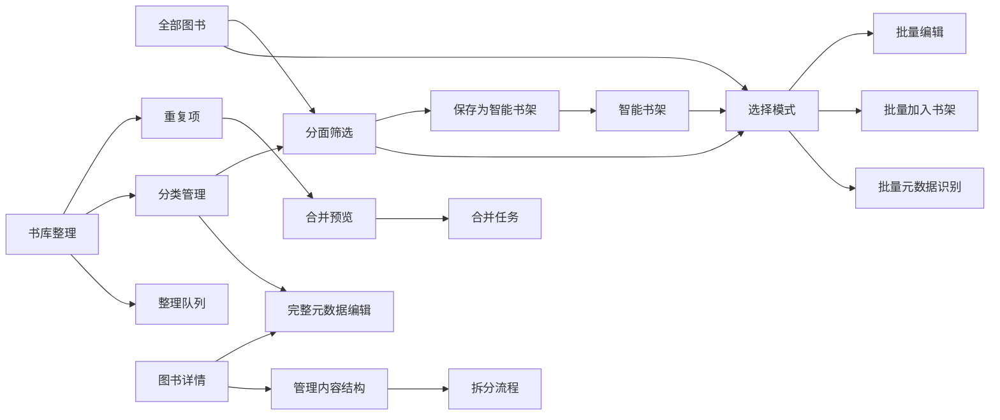
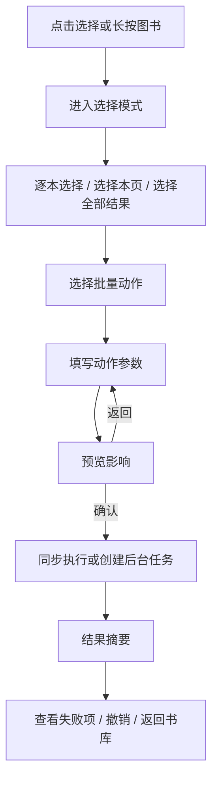
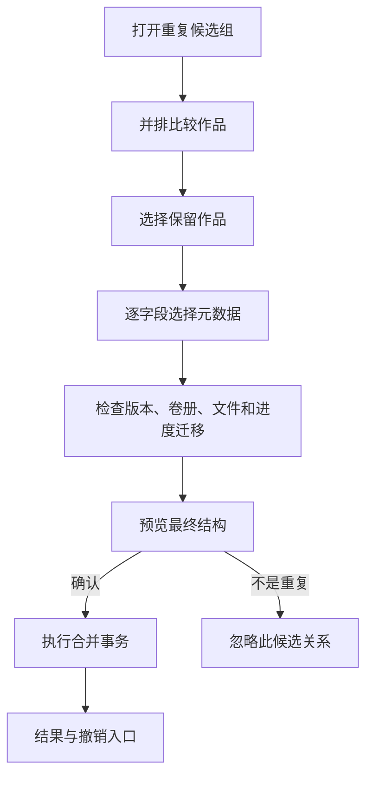

# 图书馆管理 P0 + P1 交互设计

> 状态：交互规格初稿，等待评审后进入数据模型与实现拆分  
> 制定日期：2026-07-22  
> 适用端：桌面 Web、响应式 Web、安装后的 PWA  
> 基线：现有“阅读优先”信息架构、暖色视觉语言、“作品—版本—卷册—文件”内容模型

## 1. 范围与目标

本轮覆盖：

1. P0：批量选择与批量管理。
2. P0：分面浏览器与精确组合筛选。
3. P0：保存搜索与智能书架。
4. P0：完整的重复合并与错误拆分。
5. P1：元数据模型补全与分类治理。

本轮交互设计不包含全文搜索、自定义字段、OPDS、纸书库存、借阅管理、USB 设备驱动、电子书源码编辑器和新的格式转换工作台。

成功标准不是“功能数量接近 Calibre”，而是让用户能够在一个持续增长的自托管书库中完成以下闭环：

```text
找到目标范围 → 选择图书 → 预览变化 → 批量处理 → 保存动态视图 → 持续发现并修复脏数据
```

## 2. 设计原则

### 2.1 阅读优先，管理按需出现

- 首页和主导航继续以阅读、全部图书、阅读状态和书架为主。
- 批量管理只在用户主动进入选择模式后出现。
- 重复项、分类治理、识别设置等跨书库能力继续下沉到设置中心。
- 图书详情默认展示阅读信息；完整元数据和结构管理通过二级入口进入。

### 2.2 “作品”是默认操作单位

- 书库列表、筛选、书架和批量操作默认选中作品。
- 版本、卷册和文件只在图书详情的“管理内容结构”及合并/拆分流程中出现。
- 批量删除作品时必须单独说明书库记录、派生文件和原始文件的影响范围。

### 2.3 默认不删除原始文件

- 合并、拆分、重命名分类、应用元数据均不删除原始文件。
- 删除原始文件必须是独立、显式、二次确认的操作。
- 重复文件只合并书库关系；源目录中仍存在的重复文件由用户另行处理。

### 2.4 高影响动作先预览，再执行

- 批量修改、分类合并、作品合并和拆分必须展示影响数量及变化摘要。
- 大于 50 部作品或需要移动结构关系的操作进入后台任务。
- 完成后提供结果摘要、失败项下载和可用时的撤销入口。

### 2.5 查询结果是快照

- “选择全部结果”在确认时保存查询条件及命中作品 ID 快照。
- 执行期间新加入或刚好符合条件的作品不会被自动纳入本次操作。
- 确认页显示“按当前结果处理 N 部作品”，避免动态范围不透明。

### 2.6 桌面和移动端能力一致

- 桌面使用侧栏、弹窗和底部浮动操作条。
- 移动端使用全屏筛选页、底部操作条和底部抽屉。
- 长按可以作为移动端进入选择模式的快捷方式，但必须同时提供可见的“选择”按钮。

## 3. 信息架构

### 3.1 主入口

| 能力 | 主入口 | 次入口 |
| --- | --- | --- |
| 分面筛选 | `全部图书 → 更多筛选` | 智能书架编辑器、系列/标签点击 |
| 批量管理 | `全部图书 → 选择` | 筛选结果页、普通/智能书架详情 |
| 智能书架 | 有筛选条件时的“保存为智能书架” | `书架 → 新建书架` |
| 重复合并 | `设置 → 书库整理 → 重复项` | 整理队列中的重复提醒 |
| 错误拆分 | `图书详情 → 管理内容结构 → 拆分` | 合并完成页的“撤销/拆分” |
| 完整元数据编辑 | `图书详情 → 编辑信息` | 批量管理、整理队列 |
| 分类治理 | `设置 → 书库整理 → 分类管理` | 筛选分面中的“管理分类” |

### 3.2 设置中心调整

`设置 → 智能整理` 更名为 `设置 → 书库整理`，保留现有路由兼容。

页签顺序：

1. 整理队列
2. 重复项
3. 分类管理
4. 识别设置
5. 数据源配置

移动端页签允许横向滚动，不把五项压缩为难以辨认的图标。

### 3.3 整体关系



## 4. 共用交互模式

### 4.1 选择范围

选择模式支持两种范围：

1. `已选项目`：用户逐本勾选的明确 ID 集合。
2. `当前全部结果`：当前搜索、筛选和书架规则命中的 ID 快照。

进入选择模式后：

- 桌面网格和列表显示复选框；点击卡片空白区域切换选中，点击标题仍可打开详情。
- 移动端卡片显示明确复选框；长按首本图书也可进入选择模式。
- 顶部显示“已选 N 本”，并提供“选择本页”和“选择全部 N 个结果”。
- 更改搜索或筛选前，如果已有选择，提示“保留已选”或“清空后继续”。默认保留明确选择，不自动扩展范围。
- 退出选择模式时不修改任何数据。

### 4.2 操作条

桌面底部浮动操作条：

- 加入书架
- 标签
- 阅读状态
- 编辑信息
- 更多

移动端底部操作条：

- 书架
- 标签
- 状态
- 更多

“更多”中包含元数据识别、隐藏、标记已整理、导出清单和删除。

### 4.3 预览确认

所有批量编辑确认页统一展示：

- 操作名称。
- 选中范围及数量。
- 将发生变化的数量。
- 无需变化的数量。
- 因冲突或权限被跳过的数量。
- 3–5 条真实变化示例。
- “不删除原始文件”等关键影响说明。

### 4.4 同步与后台任务

- 50 部及以下、仅改简单关系的操作可以同步完成。
- 超过 50 部、调用外部元数据、合并、拆分、分类大规模迁移必须进入后台任务。
- 任务开始后关闭页面不影响执行。
- 全局后台活动入口显示进度；任务详情提供成功、跳过、失败数量。
- 单项失败不回滚已成功的独立项目；结构合并和拆分必须单事务执行，失败时整体回滚。

### 4.5 撤销

- 标签、书架、状态、分类重命名和分类合并保留 7 天撤销记录。
- 作品合并保留结构快照，7 天内且目标作品未再次发生结构修改时可以一键撤销。
- 不满足自动撤销条件时，提供“打开拆分工具”，不显示不可执行的撤销按钮。
- 删除书库记录和删除原始文件不承诺撤销，必须在确认页明确说明。

## 5. P0：批量选择与批量管理

### 5.1 主流程



### 5.2 批量加入书架

1. 打开书架选择抽屉。
2. 每个书架显示三态：全部已加入、部分已加入、均未加入。
3. 用户可以同时勾选要加入的书架，并取消要移除的书架。
4. 确认页分别显示“加入 X 个书架”和“移出 Y 个书架”。
5. 智能书架不出现在可手动加入列表中，并显示说明“智能书架由规则自动决定”。

### 5.3 批量标签

1. 输入框按标准标签实体自动完成，不接受不可见的自由字符串直接保存。
2. 支持“添加标签”“移除标签”两个明确区域。
3. 新标签需要通过“创建‘标签名’”动作确认。
4. 同一标签不能同时出现在添加和移除列表。
5. 预览页显示受影响作品及标签差异。

### 5.4 批量阅读状态

1. 选择未开始、进行中或已完成。
2. 对同时拥有电子书、漫画、有声书的作品，先选择应用媒介：
   - 当前筛选媒介。
   - 所有已有媒介。
   - 指定媒介。
3. 更改为“未开始”不自动清除阅读进度。
4. 如需清除进度，必须通过独立危险选项，并二次确认。

### 5.5 批量编辑信息

首期允许：

- 设置或清空系列。
- 设置系列序号的固定值或按当前排序递增。
- 设置出版日期，允许只填年份。
- 设置语言。
- 设置出版社。
- 标记已整理。

出版日期、语言和出版社属于版本级字段。用户必须先选择作用范围：

- 各作品当前媒介的主版本。
- 各作品所有主版本。
- 各作品全部版本。

默认选择“各作品当前媒介的主版本”；当前页面没有明确媒介筛选时，默认改为“各作品所有主版本”。

每个字段均有写入策略：

- 仅补空值。
- 覆盖所有选中作品。
- 清空已有值。

默认选择“仅补空值”。覆盖和清空必须在确认页高亮。

### 5.6 批量元数据识别

1. 用户选择数据源组合，默认读取当前作品类型的识别设置。
2. 选择写入策略：
   - 只补空字段。
   - 生成建议，等待逐条确认。
   - 覆盖标题和作者，其余只补空值。
3. 创建后台任务。
4. 有唯一高置信度候选的项目按策略处理；多候选和无候选进入整理队列。
5. 结果页不阻塞用户继续管理书库。

### 5.7 批量删除

批量删除不放在首层操作条中。

确认分为两个独立选项：

- 删除书库记录及应用派生文件，保留原始文件。
- 同时删除原始文件。

第二项默认关闭，开启后要求再次输入删除数量。确认页必须列出来源目录数量和无法删除的只读文件数量。

## 6. P0：分面浏览器与精确组合筛选

### 6.1 入口与布局

- 点击现有“更多筛选”打开分面浏览器。
- 桌面：右侧 380–420px 筛选面板，列表结果仍然可见。
- 移动：全屏筛选页，底部固定“查看 N 本图书”按钮。
- 已应用条件在书库工具栏下方显示为可移除筛选标签。

### 6.2 分面顺序

1. 阅读状态
2. 媒介类型
3. 作者
4. 系列
5. 标签
6. 出版社
7. 语言
8. 文件格式
9. 来源目录
10. 加入时间
11. 元数据状态
12. 封面状态

作者、系列、标签和出版社支持在分面内部搜索。

### 6.3 组合语义

- 不同分面之间使用 AND。
- 同一分面中默认使用 OR。
- 标签分面额外允许切换为“同时包含全部所选标签”。
- 每个已选条件可以从筛选标签菜单改为“排除”。
- 搜索词与分面条件使用 AND。
- 条件摘要始终使用自然语言，例如：

```text
电子书 · 进行中 · 标签包含“科幻”或“太空歌剧” · 排除出版社“未知”
```

### 6.4 数量计算

- 每个分面值显示预计结果数量。
- 数量基于其他已应用分面计算，但忽略当前分面自己的已选值，便于用户继续扩展选择。
- 数量为 0 的项默认隐藏，可通过“显示无结果项”查看。

### 6.5 应用行为

- 桌面选择后即时更新结果并写入 URL，输入搜索时使用短暂防抖。
- 移动端先在本地形成草稿，点击“查看 N 本图书”后一次应用。
- 浏览器前进/后退必须恢复筛选、排序、页码和视图。
- 刷新页面后保留 URL 中的全部筛选条件。

### 6.6 空结果

空结果页显示：

- 当前条件摘要。
- “撤销上一个条件”。
- “清空全部筛选”。
- 不推荐用户上传图书或进入外部搜索，避免把筛选为空误解为书库为空。

## 7. P0：保存搜索与智能书架

### 7.1 创建入口

入口一：当前存在搜索或筛选条件时，结果标题旁显示“保存为智能书架”。

入口二：`书架 → 新建书架` 首先选择：

- 普通书架：手动增删图书。
- 智能书架：按规则自动收录。

### 7.2 从当前结果创建

1. 点击“保存为智能书架”。
2. 打开创建弹窗，自动带入当前规则摘要。
3. 填写名称和可选描述。
4. 选择是否显示在主导航书架列表。
5. 保存后显示当前命中数量，并提供“打开书架”。

### 7.3 从空白规则创建

1. 选择“智能书架”。
2. 打开与书库相同的分面规则编辑器。
3. 右侧或底部实时显示匹配数量和 3 本预览图书。
4. 填写名称后保存。

### 7.4 智能书架详情

- 标题旁显示“智能书架”弱标识和命中数量。
- 工具栏提供“编辑规则”和普通排序/视图切换。
- 不显示“手动添加图书”。
- 用户在书架内仍可进入选择模式并批量修改命中作品。
- 批量操作使用进入选择时的命中快照。

### 7.5 编辑与删除

- 编辑规则复用分面浏览器，并显示变更前后数量。
- “另存为”创建新的智能书架，不影响当前书架。
- “转换为普通书架”创建当前结果快照，并保留原智能书架，随后询问是否删除原智能书架。
- 删除智能书架只删除规则，不删除任何图书。

### 7.6 分类变更后的行为

- 智能书架规则引用分类实体 ID，而不是分类显示文字。
- 分类重命名后规则自动显示新名称。
- 分类合并后规则自动迁移到保留项。
- 被删除且没有替代项的分类会使规则出现“需要修复”，书架详情提供修复入口。

## 8. P0：重复合并与错误拆分

### 8.1 重复项列表

路径：`设置 → 书库整理 → 重复项`。

列表以“候选组”为单位，不以单个任务为单位。每组显示：

- 代表封面和标题。
- 候选作品数量。
- 置信度：高、中、低。
- 判断原因：文件哈希相同、ISBN 相同、标题作者相同、系列卷号冲突等。
- 涉及的版本、卷册和文件数量。
- “检查并处理”入口。

筛选支持置信度、原因、媒介类型和来源目录。

### 8.2 候选组处理



### 8.3 比较页

桌面使用并排列；移动端使用逐项分组卡片，不横向压缩。

比较内容分四组：

1. 基础信息：标题、作者、系列、标签、简介、封面。
2. 出版信息：出版社、出版日期、语言、标识符。
3. 内容结构：媒介、版本、卷册、文件、文件哈希、大小、来源。
4. 用户数据：阅读状态、进度、书架归属。

用户首先选择“保留为主作品”，随后逐字段决定保留值。默认规则：

- 标题、作者、系列：使用主作品。
- 标签、普通书架：合并去重。
- 空字段：自动用另一作品的非空值补齐。
- 不同媒介和不同格式：全部保留为版本。
- 相同完整哈希：书库中只保留一个有效文件关系，但不删除磁盘原文件。
- 匹配到相同内容指纹的进度：保留最近更新时间的定位。
- 无法确认对应关系的进度：随原版本保留，不强行覆盖。

### 8.4 合并预览

预览以树形结构显示最终结果：

```text
主作品
├─ 电子书
│  ├─ EPUB 主版本
│  └─ PDF 后备版本
├─ 漫画
│  └─ 12 个卷册
└─ 有声书
   └─ 1 个版本 / 24 个音轨
```

同时显示：

- 将隐藏或移除的旧作品记录。
- 将迁移的书架关系和标签。
- 阅读进度冲突及采用规则。
- 原始文件不会被删除。
- 是否支持自动撤销。

### 8.5 不是重复

- 用户可以标记“不是重复”。
- 系统保存作品对及当前身份指纹；在标题、作者、ISBN 或文件指纹未变化前不再次建议。
- 用户可以在重复项页的“已忽略”筛选中恢复候选关系。

### 8.6 合并结果

成功页提供：

- 打开合并后的图书。
- 查看迁移摘要。
- 7 天内撤销合并。
- 继续处理下一组。

失败时：

- 合并事务整体回滚。
- 候选组保持未处理状态。
- 显示用户可理解的失败位置，例如“迁移卷册时发现目标版本已变化”。
- 提供重试和查看日志，不提供部分完成状态。

### 8.7 拆分入口

路径：`图书详情 → 内容结构 → 管理内容结构 → 拆分`。

只有具备两个以上版本、卷册或媒介的作品显示拆分入口。

### 8.8 拆分流程

1. **选择内容**：选择要移出的整个版本或具体卷册；文件跟随所属版本/卷册自动选中。
2. **选择去向**：创建新作品，或移动到已有作品。
3. **填写目标元数据**：默认继承源作品；要求确认新标题，作者可继承。
4. **处理用户数据**：显示将跟随内容移动的进度；普通书架默认同时保留两部作品，可逐项取消。
5. **预览结构**：同时展示源作品和目标作品拆分后的结构。
6. **确认执行**：单事务完成；原始文件路径不移动。
7. **结果**：提供打开源作品、打开目标作品和可用时的撤销。

以下情况阻止确认：

- 源作品拆分后没有任何内容。
- 卷册仍被阅读单元或进度引用，但没有明确迁移方案。
- 目标作品存在同版本键冲突且用户尚未选择合并或保留后备版本。

## 9. P1：元数据模型补全

### 9.1 用户可理解的数据层级

| 层级 | 字段 | 交互归属 |
| --- | --- | --- |
| 作品 | 标题、多作者、系列、系列序号、标签、简介、主封面 | 图书详情“作品信息” |
| 版本 | 版本名称、出版社、完整出版日期、语言、ISBN/其他标识符、格式、来源 | 图书详情“版本信息” |
| 作者 | 规范名称、排序名、别名 | 分类管理“作者” |
| 分类 | 标签、系列、出版社的规范名称及合并关系 | 分类管理 |

当前仅有一个作者文本框的交互升级为多作者选择器：

- 支持搜索现有作者。
- 支持创建新作者。
- 支持拖动调整显示顺序。
- 第一位作者为主作者，但不会丢失其他作者。
- 选择作者别名时自动关联规范作者，并在输入后提示规范名称。

### 9.2 完整元数据编辑器

入口仍为图书详情“编辑信息”。

桌面使用宽弹窗或右侧编辑面板；移动端使用全屏页面。编辑器分为：

1. 作品信息。
2. 版本信息。
3. 封面。

作品信息：

- 标题。
- 作者列表。
- 系列和序号。
- 标签。
- 简介。

版本信息：

- 顶部先选择要编辑的版本。
- 版本名称。
- 出版社。
- 出版日期，允许只填年份或年月，但按完整日期模型保存精度。
- 语言，使用标准值选择器。
- 标识符列表，每项由类型和值组成；内置 ISBN、ASIN、DOI、豆瓣、Bangumi，允许其他类型。
- 格式、文件大小和来源目录只读展示，不在此处修改。

### 9.3 保存行为

- 编辑器先维护本地草稿，只有点击“保存信息”后才写入。
- 离开有未保存内容的编辑器必须确认放弃。
- 保存前验证作者、系列、出版社等分类实体是否仍有效。
- 如果其他页面刚刚合并了相关分类，自动替换为规范项并提示。
- 保存成功后详情页局部刷新，不返回书库顶部。

### 9.4 从数据源补全

“元数据识别”不再直接写入作品，而是把候选值加入当前编辑草稿：

1. 在编辑器点击“从数据源补全”。
2. 搜索候选并选择一项。
3. 左侧显示当前草稿，右侧显示候选值。
4. 用户逐字段勾选。
5. 点击“应用到草稿”。
6. 返回完整编辑器继续检查版本字段。
7. 点击“保存信息”后统一写入。

这样可避免标题已经写入、出版社或版本字段却仍未确认的半完成状态。

### 9.5 元数据缺失提示

- 图书详情不恢复大型诊断卡片。
- 仅在“编辑信息”按钮附近以弱提示显示“有 3 项信息可补全”。
- 点击后直接进入编辑器并定位缺失字段。
- 批量缺失项继续由智能书架或整理队列承载。

## 10. P1：分类治理

### 10.1 分类管理首页

路径：`设置 → 书库整理 → 分类管理`。

子页签：

1. 作者
2. 标签
3. 系列
4. 出版社

每个列表显示：

- 规范名称。
- 图书数量。
- 别名数量，标签和出版社可以为 0。
- 最近使用时间。
- 可能重复提示。

支持名称搜索、按名称排序、按图书数量排序，以及“仅看可能重复”“仅看未使用”。

首版分类保持扁平结构，不引入任意层级标签；重点解决同义、错字、空白和重复命名。

### 10.2 重命名

1. 选择单个分类，点击“重命名”。
2. 输入新规范名称。
3. 实时检查是否已经存在同名规范项。
4. 若不存在，显示受影响图书及智能书架数量后确认。
5. 若已存在，自动切换为“合并分类”流程，不能制造第二个同名项。

### 10.3 合并分类

1. 多选两个或以上分类，点击“合并”。
2. 选择保留的规范项。
3. 作者的其他名称默认转为别名；标签、系列、出版社可选择是否保留为搜索别名。
4. 预览受影响作品、智能书架规则和元数据候选。
5. 确认后创建迁移任务。
6. 完成页显示合并数量并提供 7 天撤销。

### 10.4 作者别名

作者详情包含：

- 规范名称。
- 排序名。
- 别名列表。
- 关联作品。

从图书编辑器输入别名时：

- 下拉项显示“村上春树（规范名）· Haruki Murakami（匹配别名）”。
- 保存作品时只存规范作者关系。
- 书库搜索同时匹配规范名称和别名。

### 10.5 删除与未使用分类

- 有关联作品或智能书架规则的分类不能直接删除。
- 用户必须先选择替代分类、移除作品关系，或进入合并流程。
- 无引用分类可以批量删除。
- 删除确认页明确说明不会修改图书文件内嵌元数据。

### 10.6 从分面浏览器进入治理

作者、标签、系列和出版社分面底部提供“管理分类”。

- 打开分类管理时带入当前分类类型和搜索词。
- 完成重命名或合并后返回书库，筛选条件自动迁移到规范分类。
- 不在筛选面板内直接提供危险合并操作。

## 11. 能力之间的联动规则

### 11.1 分类与筛选

- 筛选、智能书架和作品关系全部引用分类实体 ID。
- 显示名称变化不会破坏保存的规则。
- 分类合并必须同步迁移智能书架规则。

### 11.2 分类与元数据识别

- 外部候选返回的作者、标签、系列、出版社先经过规范化匹配。
- 命中别名时复用现有分类实体。
- 模糊匹配只给建议，不自动合并分类。

### 11.3 合并与智能书架

- 合并作品后，智能书架重新按规则计算，无需手工迁移成员关系。
- 普通书架取两个作品的并集，并去重为主作品。
- 拆分作品时，普通书架默认同时保留源作品和新作品；用户可在确认页调整。

### 11.4 合并与阅读进度

- 进度始终绑定到实际版本/卷册；结构迁移时跟随内容移动。
- 合并不以“百分比更大”为唯一覆盖规则。
- 同一内容指纹出现两条定位时，以最后更新时间为默认值，并在预览中标记冲突。

### 11.5 操作日志

以下操作必须写入结构化日志：

- 批量编辑。
- 创建和修改智能书架。
- 分类重命名与合并。
- 作品合并、拆分和撤销。
- 删除书库记录和原始文件。

日志记录操作者、范围、前后摘要、任务 ID 和失败原因，不记录第三方数据源凭据。

## 12. 空态、错误与恢复

### 12.1 空态

- 无重复项：“书库中没有待确认的重复作品”。提供重新扫描入口，不展示统计仪表盘。
- 无分类：“导入或编辑图书后，分类会在这里出现”。
- 智能书架无结果：显示规则摘要和编辑规则入口，不显示手动添加。
- 批量选择为 0：操作条不可见。

### 12.2 并发变化

- 确认前重新校验 ID、版本号和分类引用。
- 少量普通批量编辑发现变化时，显示“有 N 本已变化”，允许跳过或重新预览。
- 合并和拆分发现结构变化时不允许跳过，必须返回重新预览。

### 12.3 外部识别失败

- 网络错误、限流、无结果分别显示不同状态。
- 失败项目进入整理队列，可按原策略重试。
- 批量任务不因单本无结果而整体失败。

## 13. 键盘、触摸与无障碍

- 列表复选框、筛选值、批量操作、比较字段均可使用键盘访问。
- `Shift + 点击` 在桌面列表中连续选择。
- `Esc` 关闭筛选面板、编辑弹窗和比较弹窗，并恢复触发按钮焦点。
- 选择模式开始和结束时通过可访问状态文本播报已选数量。
- 移动端触控目标不小于 44px；底部操作条避开 PWA 安全区和现有底部导航。
- 合并比较不能只依赖颜色表达保留、冲突和缺失状态。

## 14. 建议实现顺序

### 阶段 A：数据和查询基础

1. 分类实体及作品/版本关系迁移。
2. 多作者、出版社、语言、完整出版日期和标识符模型。
3. 统一查询表达式和分面计数接口。
4. 操作任务、快照和撤销记录模型。

### 阶段 B：书库日常管理

1. 分面浏览器。
2. 选择模式和批量操作条。
3. 批量标签、书架、状态和基础信息。
4. 智能书架。

### 阶段 C：元数据和分类治理

1. 完整元数据编辑器。
2. 数据源候选应用到草稿。
3. 分类管理、重命名、合并、别名和撤销。
4. 批量元数据识别。

### 阶段 D：重复与结构修复

1. 重复候选聚类和列表。
2. 合并比较、预览和事务执行。
3. 图书详情拆分流程。
4. 合并撤销、已忽略候选和异常恢复。

## 15. 交互验收清单

### 批量管理

- 可逐本、本页和全部结果选择。
- 搜索或筛选变化时选择范围不会静默变化。
- 所有批量写入均有影响预览。
- 大批量任务可离开页面继续执行。

### 分面筛选

- URL 可以完整恢复查询状态。
- 同分面 OR、跨分面 AND、排除条件行为一致。
- 桌面与移动端得到相同结果。
- 空结果可一步撤销最后条件。

### 智能书架

- 可从当前结果和空白规则创建。
- 规则变化时成员自动更新。
- 不能手动把图书加入智能书架。
- 分类重命名和合并不会破坏规则。

### 合并与拆分

- 合并前能看见最终内容结构。
- 默认保留全部不同内容和所有原始文件。
- 合并失败整体回滚。
- 错误合并可撤销或通过拆分修复。
- 阅读进度、普通书架和标签迁移有明确规则。

### 元数据与分类

- 作品级和版本级字段不会混写。
- 多作者、别名和排序名可正确检索。
- 数据源候选先进入草稿，不直接部分写入。
- 分类重命名、合并、删除均显示影响范围。
- 分类管理结果能即时反映到筛选和智能书架。

## 16. 页面与状态清单

### 16.1 修改现有页面

| 页面 | 新增状态 |
| --- | --- |
| 全部图书 | 普通状态、筛选面板打开、选择模式、全部结果已选、批量操作参数、批量预览、批量结果 |
| 书架 | 新建类型选择、普通书架编辑、智能书架规则编辑、智能书架结果、规则需要修复 |
| 图书详情 | 完整元数据编辑、数据源候选比较、内容结构管理、拆分向导、拆分结果 |
| 设置／书库整理 | 整理队列、重复项、分类管理、识别设置、数据源配置 |

### 16.2 新增核心页面或面板

1. 分面筛选面板／移动全屏页。
2. 批量操作参数抽屉。
3. 批量影响预览与结果页。
4. 智能书架创建和规则编辑器。
5. 重复候选组列表。
6. 重复比较与合并预览页。
7. 分类管理列表、分类详情和合并预览。
8. 完整元数据编辑器。
9. 内容拆分向导。

### 16.3 不新增独立入口的能力

- 批量元数据识别属于批量操作，不进入主导航。
- 拆分属于图书内容结构管理，不建立全局拆分页。
- 分类重命名和合并属于分类管理，不直接塞进筛选面板。
- 元数据缺失仍通过弱提示、整理队列和智能书架表达，不恢复诊断仪表盘。
