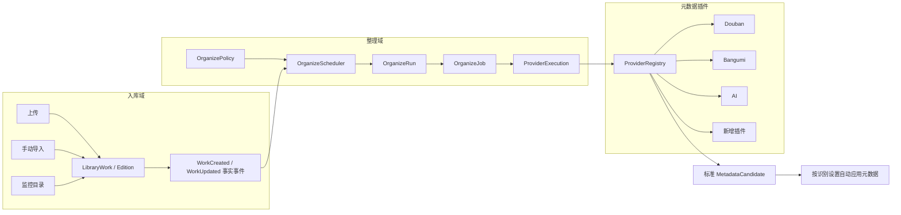
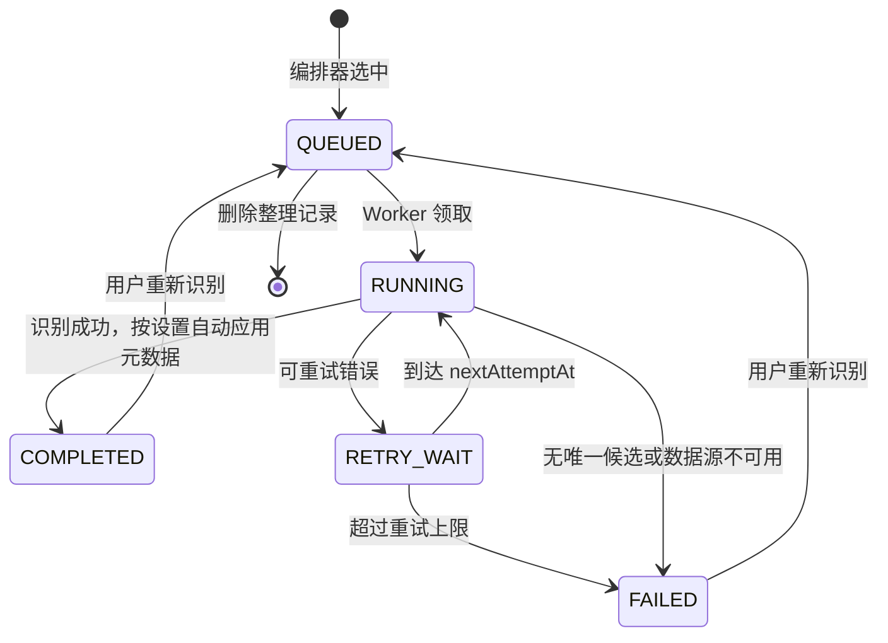

# 元数据整理能力重构：技术方案与交互设计

> 状态：已实现并完成视觉验收  
> 日期：2026-07-21  
> 范围：`设置 → 智能整理`、作品详情中的元数据识别入口、导入完成后的整理编排

## 设计决策

2026-07-21 已确认采用组合方向：

- 日常主页面使用 `direction-a-queue-hub.png` 的视觉语言，并按最终确认收敛为只读的完整整理记录列表。
- “识别设置”页签使用 `direction-c-settings.png` 的安静单列设置布局。
- 队列页不再展示运行状态带或快速设置 sheet；识别策略统一通过独立“识别设置”页签维护。
- `final-queue-with-settings-sheet.png` 作为第一轮历史稿保留，最终实现以精简后的记录列表为准。

## 1. 结论

本次重构的核心不是增加一个定时开关，而是拆开当前耦合在导入流程中的三件事：

1. **入库**只负责把文件变成可阅读的作品、版本和卷册。
2. **整理编排器**决定哪些作品、在什么时候进入整理队列。
3. **元数据插件**负责返回标准化候选，Worker 再根据识别设置自动应用元数据。

推荐采用“整理编排器主动拉取”模型：上传、手动导入和监控目录完成入库后，不再直接创建 `OrganizeJob` 或 `MetadataLookupTask`；整理编排器只根据“定时间隔”和“新增后自动执行”两类策略，独立选择符合条件的作品并创建任务。前台不再提供手动加入或立即扫描链路。

这既满足“新增后自动执行”，又保证导入模块不再拥有整理队列：新增事件只是事实，是否响应由整理策略决定。

## 2. 现状与问题定位

### 2.1 当前调用链


关键耦合点：

- `apps/api-python/app/worker/importer.py` 在导入成功后直接调用 `_create_or_refresh_organize_job` 和 `_enqueue_metadata_lookup`。
- 新作品初始化为 `organizeStatus = LOOKUP_PENDING`，队列状态和作品状态混在一起。
- 自动识别顺序在 `_enqueue_metadata_lookup` 中固定为豆瓣/Bangumi，AI 不在自动队列中。
- `metadata_lookup_queue.py` 只认识固定 provider id；`organize_service.py` 通过分支调用三个 provider 函数。
- 前端设置、作品详情识别弹窗和 API 都硬编码 `douban | bangumi | ai`。
- 设置存在 `SystemSetting` 的散列 key 中，缺少任务策略、插件描述、能力声明、连接测试和优先级模型。

### 2.2 当前行为风险

- 导入吞吐和第三方服务稳定性互相影响，职责边界不清。
- 禁用数据源、改变顺序或新增数据源需要同时修改后端分支、API 白名单和多个前端页面。
- “待整理”“识别中”“从未进入队列”没有清晰区分。
- 当前成功匹配会直接把作品标记为已整理，无法表达“识别完成但仍需确认冲突”。
- 任务只保存最终来源和一份原始 JSON，多插件尝试过程难以追踪与重试。

## 3. 目标架构



### 3.1 职责边界

| 模块 | 负责 | 不负责 |
| --- | --- | --- |
| Importer | 文件解析、作品/版本/卷册落库、记录通用作品事件 | 创建整理任务、选择元数据源 |
| OrganizeScheduler | 读取策略、发现符合条件的作品、去重创建 Run/Job | 解析文件、实现具体数据源 |
| OrganizeWorker | 领取 Job、生成插件执行计划、选择唯一候选、按策略应用、更新状态 | 认识豆瓣/Bangumi 的具体协议 |
| ProviderRegistry | 插件发现、manifest、配置校验、实例化、健康检查 | 决定作品是否入队 |
| Provider plugin | 搜索/推断、标准化候选、声明能力和配置 schema | 直接修改 LibraryWork |

## 4. 调度与主动入队

### 4.1 两类触发器

| 触发器 | 用户入口 | 行为 |
| --- | --- | --- |
| 定时 | 关闭 / 每 15 分钟至每天 / 自定义分钟 | 到期后扫描所有符合规则且没有活动任务的作品 |
| 新增后自动执行 | 独立开关 | 仅响应开关生效后新增完成的作品；由整理域消费事件并入队 |

“新增后自动执行”开启时也不恢复 importer 对整理表的写入。Importer 只发布通用 `WorkCreated` 事件；整理编排器读取自己的策略后决定是否创建任务。关闭开关不会丢失作品，之后仍可由定时策略选中。历史 `MANUAL` 记录只读保留，不能再从前台创建。

### 4.2 MVP 入队规则

默认符合以下任一条件即可进入候选集：

- 从未完成过元数据识别；
- 缺标题、作者、封面或简介；
- 文件解析得到的身份信息发生变化；
- 用户显式选择“重新识别”。

默认排除：

- 已隐藏作品；
- 用户明确“忽略整理”的作品；
- 已有 `LOOKUP_PENDING/PENDING/RUNNING/RETRY_WAIT` 活动任务的作品；
- 仅新增了完全相同文件、未改变作品信息的导入。底层仍用内容哈希防止文件被重复写入，但导入记录不再对外分类为“重复 / 非重复”。

### 4.3 去重与并发

- `OrganizeRun.dedupeKey` 唯一，例如 `schedule:2026-07-21T08:00`、`new-work:{workId}:{revision}`。
- 每个作品同一时刻最多一个活动 `OrganizeJob`。
- SQLite 中用带条件的唯一索引或事务内 `INSERT ... ON CONFLICT DO NOTHING` 保证多进程安全。
- Provider 级别保留当前退避思路，并支持插件 manifest 声明限流；建议默认并发 2、单插件并发 1。
- 设置变更只影响尚未领取的执行计划；进行中的调用允许完成，避免半状态。

## 5. 元数据插件协议

### 5.1 插件形态

V1 使用**进程内 Python 插件 + entry point 注册**。内置豆瓣、Bangumi、AI 也走同一协议；新增第三方插件通过构建镜像/安装 Python 包接入，不在管理页面上传并执行任意代码。

建议入口组：`shuku_starship.metadata_providers`。

```python
class MetadataProvider(Protocol):
    manifest: ProviderManifest

    def validate_config(self, config: dict) -> list[ValidationIssue]: ...
    def test(self, context: ProviderContext) -> ProviderHealth: ...
    def search(self, request: MetadataRequest) -> ProviderResult: ...
```

`ProviderManifest` 至少包含：

- `id`、`name`、`version`、`description`；
- 支持的 `workTypes`、格式和输出字段；
- `mode`: `search | infer`；
- 是否支持自动执行、人工搜索、封面；
- `configSchema` 与 `uiSchema`，用于生成配置表单；
- `secretFields`，API 只返回“已配置”状态；
- 默认优先级、超时、重试和限流建议。

标准输出统一为 `MetadataCandidate`：

```json
{
  "providerId": "bangumi",
  "externalId": "272395",
  "confidence": 0.91,
  "fields": {
    "title": "拜托请穿上，鹰峰同学",
    "author": "柊裕一",
    "description": "...",
    "tags": ["漫画"],
    "coverUrl": "https://..."
  },
  "aliases": ["鹰峰同学请穿上衣服"],
  "raw": {}
}
```

### 5.2 内置插件迁移

| 插件 | 默认适用 | 默认优先级 | 自动策略 |
| --- | --- | --- | --- |
| 豆瓣 | 电子书、有声书 | 100 | 精确标题优先，作者用于消歧 |
| Bangumi | 电子书、漫画 | 110 | 中文名、原名和别名共同匹配 |
| AI | 全部 | 900 | 外部源无唯一结果或本地标题异常时兜底 |

ProviderRegistry 根据作品类型过滤不兼容插件，再按优先级执行。出现唯一精确候选时停止后续请求；无唯一候选时继续下一数据源，全部失败后记录为失败，不生成人工审核候选。

### 5.3 字段应用安全策略

- 插件永远返回候选，不直接更新作品。
- Worker 默认自动补全缺失的简介、标签、系列、卷号、出版年、出版社和封面。
- “覆盖已有标题和作者”默认开启；开启时使用识别结果更新标题和作者，关闭时仅在标题为空或作者未知时补全。
- 本地已存在封面优先于远程封面。
- 每次识别在 `LibraryMetadata.rawJson` 中保存候选和 `appliedFields`，用于追溯数据源。

## 6. 数据模型

### 6.1 新增/调整表

| 表 | 关键字段 | 用途 |
| --- | --- | --- |
| `OrganizePolicy` | `enabled`, `scheduleMode`, `intervalMinutes`, `autoRunOnNew`, `rulesJson`, `overwriteTitleAuthor`, `updatedAt` | 类型化整理策略；当前单实例也保留表模型，避免继续扩散散列设置 key |
| `OrganizeRun` | `id`, `trigger`, `scopeJson`, `dedupeKey`, `status`, `queuedCount`, `startedAt`, `finishedAt` | 一次定时或新增事件批次；兼容历史手动批次 |
| `OrganizeJob` | 新增 `runId`, `trigger`, `status`, `reasonCodes`, `workRevision`, `startedAt`, `finishedAt` | 单作品队列项 |
| `MetadataProviderExecution` | `jobId`, `providerId`, `status`, `attempts`, `rawResultJson`, `errorSummary`, 时间字段 | 每个插件的可观测执行记录 |
| `Source` | 使用 `kind = metadata`，保存 `providerType`, `config`, health 字段 | 数据源实例、凭据与连接状态；`enabled/priority` 仅作为旧版本兼容汇总值 |
| `MetadataProviderPipeline` | `workType`, `providerId`, `included`, `enabled`, `position` | 分别保存电子书、漫画、有声书的数据源组合、启用状态与执行顺序 |
| `LibraryMetadata` | 复用 `source`, `rawJson` | 保存候选原始数据和实际自动应用字段 |

`MetadataSuggestion` 与 `DuplicateCandidate` 不再是整理域的功能模型：新流程不读、不写、API 不返回，旧表仅为历史数据库和备份恢复兼容暂时保留。

建议把 `LibraryWork.organizeStatus` 逐步收敛为派生/兼容字段。新代码以活动 Job 为队列事实，以最近一次 Run 结果为整理状态，避免一列同时表达“未入队、等待、识别中、已完成”。

### 6.2 状态机



### 6.3 兼容迁移

数据库 schema 从 v5 逐步升至 v8：

1. 建表和扩列，迁移前继续使用现有自动备份机制。
2. 将当前 `metadata.*` 设置转换为三条 `Source(kind=metadata)` 配置，并按插件适用范围初始化三类 `MetadataProviderPipeline`；保留旧 key 一个版本作为只读回退。
3. 为已有待执行/执行中的 `MetadataLookupTask` 创建 `trigger = legacy_import` 的 Run/Execution，保证升级时不丢任务。
4. 已完成历史任务保持只读；v6 暂时保留 `MetadataLookupTask` 作为 Worker 执行票据，但只能由整理编排器创建，Importer 不再写入。后续可在 Worker 完成原生 `OrganizeJob` 领取后移除该兼容层。
5. Importer 新建作品时不再写 `LOOKUP_PENDING`，也不创建 OrganizeJob；以 `UNASSESSED` 或空的最近执行记录表达“尚未整理”。

## 7. API 设计

### 7.1 策略与运行

| 方法 | 路径 | 说明 |
| --- | --- | --- |
| `GET` | `/api/organize/policy` | 获取间隔、新增自动执行和入队规则 |
| `PUT` | `/api/organize/policy` | 原子保存并返回 `nextRunAt` |
| `GET` | `/api/organize/runs` | 最近执行记录和统计 |
| `GET` | `/api/organize/candidates` | 查询尚未入队且符合条件的作品 |
| `GET` | `/api/organize/jobs` | 返回全部整理记录及统一状态、入队原因、数据源 |
| `POST` | `/api/organize/jobs/{id}/recognize` | 从任意状态清理旧执行痕迹并按当前启用插件重新入队 |
| `DELETE` | `/api/organize/jobs/{id}` | 删除整理记录、查询任务和执行明细；不删除作品或文件 |

公开 API 不再提供创建 Run 或按作品手动入队的端点，避免 UI 移除后仍保留旁路功能链路。内部 scheduler 继续复用编排服务创建任务。

### 7.2 插件

| 方法 | 路径 | 说明 |
| --- | --- | --- |
| `GET` | `/api/metadata/providers` | 返回数据源 manifest、配置/健康状态，以及电子书、漫画、有声书三条识别管线 |
| `PUT` | `/api/metadata/provider-pipelines/{workType}` | 原子替换某类读物的数据源成员、启用状态与顺序 |
| `PATCH` | `/api/metadata/providers/{id}` | 保存 schema 校验后的数据源配置 |
| `POST` | `/api/metadata/providers/{id}/test` | 连接测试，写入最近状态 |
| `POST` | `/api/works/{id}/metadata/search` | `providerId` 改为动态注册表校验，不再使用固定 union |

敏感字段沿用“只返回 configured/masked，不回传原值”的交互契约，并统一从 manifest 的 `secretFields` 生成，移除 API 中的固定敏感 key 集合。

## 8. 交互设计

### 8.1 信息架构

`设置 → 智能整理` 调整为三个页签：

1. **整理队列**：查看成功、失败、识别中、等待中的全部整理记录。
2. **识别设置**：配置定时执行、新增后自动执行、入队范围与安全应用规则。
3. **数据源插件**：启停、排序、配置、测试和查看能力。

历史执行记录直接进入“整理队列”主列表，不再区分活动队列和历史抽屉。

### 8.2 整理队列

页面首屏回答三个问题：共有多少条记录、当前有多少识别中/等待中任务、每条任务因何入队并使用了哪些数据源。

推荐布局：

- 标题区只保留刷新；删除“整理记录已同步 / 调整识别设置”运行状态带。
- 搜索框和状态筛选合并进列表表头，状态固定为 `成功 / 失败 / 识别中 / 等待中`。
- 每行展示作品、入队原因、状态、数据源和入队时间；行级操作仅保留“重新识别 / 删除”。
- 不提供复选框、批量操作和数据修改按钮；删除“添加标签”“应用建议”“应用建议并完成”“隐藏”“确认整理”。
- 不提供“从书库加入”“立即扫描”以及对应抽屉和请求链路。

空状态说明任务由定时策略或新增后自动执行产生，并保留进入识别设置的路径。

### 8.3 识别设置

设置采用两组而不是大量并列卡片：

**执行方式**

- 定时执行：关闭 / 每 15 分钟 / 30 分钟 / 1 小时 / 3 小时 / 6 小时 / 12 小时 / 每天 / 自定义。
- 显示根据当前时间计算的“下次执行：2026/7/21 14:30”。
- 新增后自动执行：独立开关，说明“只影响启用后新增完成的读物”。
- 只提供“保存设置”；保存策略不隐式触发扫描。

**入队与应用规则**

- 选择进入候选集的原因；MVP 默认全开，不暴露过细匹配参数。
- “覆盖已有标题和作者”默认开启；关闭后保留现有标题和作者，其他缺失字段仍自动补全。
- 识别范围只提供“尚未识别”和“缺少作者、简介或封面”两个筛选项。

离开有未保存变更时提示；保存成功后页面内更新下一次运行时间，不强制刷新。

### 8.4 数据源配置

- 页面上半部分拆成电子书、漫画、有声书三个识别区域；每个区域独立添加/移除数据源、启停并用上下移动调整执行顺序。
- 执行顺序只在同一读物类型内生效；一个数据源（例如 AI）可同时出现在多条管线中并拥有不同状态和位置。
- 页面下半部分为独立“数据源配置”列表，只展示插件名称/版本、适用读物、最近连接状态，以及测试/配置操作，不混入识别顺序。
- 配置在居中弹窗内由 manifest schema 生成，底部提供“保存并测试”“保存配置”。
- 不保留全局启用开关。`Source.enabled/priority` 由三条管线汇总，仅供旧调用链兼容。

### 8.5 任务详情与作品详情

- 任务详情只展示识别状态、整理摘要和当前元数据完整度，不展示或操作字段建议、重复/版本候选。
- 作品详情中的“元数据识别”弹窗改为读取启用且兼容的插件，不再硬编码三项。
- 手动搜索读取当前读物类型的已启用管线，避免绕过分区配置调用已停用的数据源。

### 8.6 关键状态与异常

| 状态 | 用户可见反馈 | 可执行动作 |
| --- | --- | --- |
| 无启用插件 | 队列仍可创建，但任务显示“没有可用数据源” | 前往插件设置 |
| 插件配置不完整 | 插件行显示“需要配置”，任务不调用该插件 | 配置并测试 |
| 限流/网络失败 | 展示下一次重试时间，不把作品标成整理失败 | 立即重试/等待 |
| 多候选冲突 | 继续下一数据源；无唯一结果时记录为失败 | 重新识别 / 调整数据源 |
| 历史取消/需确认记录 | 统一归入失败分类 | 重新识别 / 删除 |
| 关闭新增自动执行 | 后续新增不因新增事件入队，已有记录不清空 | 等待定时策略 |

### 8.7 响应式行为

- 桌面保持当前设置中心侧栏和表格语言。
- 小屏页签横向滚动；队列行转换为卡片，主操作保持单一。
- 移动端表格转换为只读卡片；插件配置使用可滚动的响应式弹窗。
- 定时间隔和下一次执行始终同时显示，避免只读到一个脱离上下文的数字。

## 9. 交付分期

### Phase 1：建立插件边界，不改变用户行为

- 抽取 Provider Protocol/Registry 和三个内置插件。
- API 与元数据弹窗改为动态 provider id。
- 使用 `Source(kind=metadata)` 存配置，完成旧设置迁移和连接测试。

### Phase 2：建立整理编排器并解除导入耦合

- 新增 Policy/Run/ProviderExecution 数据模型和 scheduler。
- Importer 停止创建整理任务，只写作品事实事件。
- 上线定时执行和新增后自动执行；公开入口不提供手动建任务。

### Phase 3：切换队列 UI 与可观测性

- 新三页签、运行状态、插件列表和四类状态映射。
- 完成全部历史任务的统一展示，行级提供重新识别与仅删除记录。

### Phase 4：收口兼容层

- 删除固定 provider 白名单和旧 `metadata.*` 写入。
- 评估移除 `MetadataLookupTask`、收敛 `LibraryWork.organizeStatus`。

## 10. 验收标准

- 任意上传、导入、目录监控完成后，Importer 不写 `OrganizeJob`/`MetadataLookupTask`。
- 关闭“新增后自动执行”时，新作品不会因新增事件进入队列；定时策略仍可加入。
- 开启后，新增作品只被加入一次，worker 重启或多进程不会重复。
- 定时间隔修改后 `nextRunAt` 可预测，关闭定时不会清空现有任务。
- 禁用某插件后，新任务不再调用它；进行中和待执行任务行为符合页面说明。
- 新增一个测试插件只需注册 manifest/实现协议，不修改 API 白名单、队列 worker 或前端来源枚举。
- 插件失败、无结果、多结果、限流、重启恢复都有稳定状态和可重新识别路径。
- 开启标题作者覆盖时会更新已有标题和作者；关闭时保留现值，其他缺失字段仍自动补全，两种情况均保存识别来源。
- 桌面和移动端均可搜索、按四类状态筛选、重新识别、删除整理记录和配置插件。
- 导入记录不返回或展示“重复”分类，底层内容去重仍保护书库文件。

## 11. 测试清单

- Importer 单元测试：三种入库入口均不直接创建整理任务。
- Scheduler 单元测试：开关、间隔、watermark、去重、时区、重启恢复。
- Registry 合约测试：manifest 校验、能力过滤、优先级、未知插件、配置 schema。
- Provider 合约测试：超时、限流、无结果、多结果、标准 Candidate。
- API 测试：策略保存、动态 provider、敏感字段遮罩、完整历史与四类状态映射。
- E2E：搜索、四类状态筛选、重新识别、删除记录、定时设置、插件启停和移动端卡片。
- 迁移测试：v5 数据库升级、旧设置迁移、已有 PENDING/RUNNING 任务不丢失。

## 12. 视觉稿附件

- `direction-a-queue-hub.png`：以高频队列操作为中心的桌面稿。
- `direction-b-run-console.png`：突出调度状态与主动执行控制的桌面稿。
- `direction-c-settings.png`：识别间隔、新增自动执行和入队规则设置稿。
- `final-queue-with-settings-sheet.png`：第 1、3 稿合并后的队列快速设置状态。

视觉稿沿用当前设置中心的暖白底、珊瑚色强调、轻分隔线和桌面侧栏，不代表新增一套设计系统。实现时应以现有 `SettingsCenterShell`、`SettingsTabs`、`Button`、`Badge`、移动端任务卡片和反馈组件为基础。
