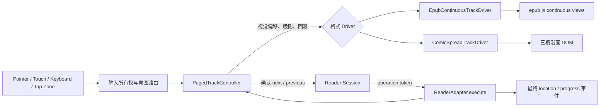
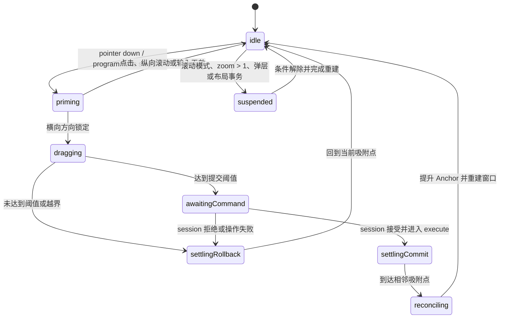

# 阅读器平移翻页 V1：改造设计与执行计划

## 1. 结论

本次采用“连续横向分页轨道 + 跟手拖动 + 吸附提交”的方案，统一覆盖 EPUB 和漫画：

- 一个翻页单位统一定义为 `Spread`。单页模式的一个 Spread 包含 1 页，双页模式包含 2 页。
- 控制器始终维护“上一 Spread / 当前 Spread / 下一 Spread”三个逻辑目标。漫画将它们实现为三个持久 DOM 槽位；EPUB 由 continuous stage 中的相邻排版页和 spine view 提供，翻页时移动真实内容轨道，而不是先替换内容再播放装饰动画。
- 手势移动阶段只改变视觉位置；到达提交阈值并完成吸附后，才更新 CFI、页码、进度和服务端阅读记录。
- EPUB 使用 epub.js `continuous` view manager 提供跨 spine 的连续内容窗口，但禁用 epub.js 自带 Snap；手势、吸附和提交由项目自己的控制器负责。
- 漫画保留现有页组、RTL 排列、图片缓存和预加载模型，将“每次整棵替换当前页 DOM”改为持久化三槽轨道。
- 键盘、点击热区、工具栏和滑动最终都进入同一个分页控制器，保证动画、边界和提交语义一致。
- EPUB 滚动阅读模式、漫画放大后的图片平移不进入分页轨道；它们保留原交互语义。

“多页模式”在 V1 中明确指双页 Spread。核心模型保留扩展到更多页的能力，但设置界面只开放单页和双页。

## 2. 目标与边界

### 2.1 V1 目标

- EPUB 单页分页：同一章节和跨章节都能连续平移，不出现 iframe 替换造成的空白闪帧。
- EPUB 双页分页：每次移动一个双页 Spread，章节边界的空白补页和页序稳定。
- 漫画单页与双页：支持 LTR、RTL、最后一个不完整 Spread、相邻图片预加载。
- 触摸和鼠标拖动跟手；松手后按距离、速度和边界决定前进或回弹。
- 点击热区、方向键和工具栏按钮使用同一种平移动画。
- 位置、书签和进度只在一次翻页被确认后变化；取消手势不产生阅读记录。
- DOM、iframe、图片解码和对象 URL 数量有明确上限，连续阅读不会线性增长内存。
- 尊重 `prefers-reduced-motion`，关闭动画后仍保持正确的翻页和位置提交。

### 2.2 V1 不包含

- 纸张卷曲、背面纹理、动态光照或 WebGL 页面弯曲。
- PDF 阅读器改造。
- EPUB 滚动模式中的横向翻页。
- 漫画放大倍率大于 1 时，用横向手势切页。
- 在一个 Spread 内停留到“半页”或逐列滑动；双页始终是原子翻页单位。
- 无限保留已访问章节或漫画图片。

## 3. 当前实现与必须解决的问题

| 能力面 | 当前实现 | 改造原因 |
|---|---|---|
| EPUB 渲染 | epub.js `default` manager、`spread: none` | 跨 spine 会销毁旧 iframe、创建新 iframe，无法做连续移动 |
| EPUB 动画 | 导航完成后对当前 iframe 做 145ms 小幅回弹 | 不是跟手翻页，跨 spine 会主动跳过动画 |
| EPUB 手势 | iframe 内只在 `touchend` 判断一次 swipe | 页面不跟手，且与外层输入链路分裂 |
| EPUB 定位 | CFI + href + spineIndex + progression | 可继续使用，但必须抑制拖动过程中的中间 `relocated` |
| 漫画渲染 | 每次 `replaceChildren()`，只挂载当前 Spread | 没有可移动的相邻页面轨道 |
| 漫画模型 | 已有单/双页、LTR/RTL、前后 Spread 和缓存窗口 | 可以直接成为三槽轨道的数据来源 |
| 外层输入 | ReaderShell 在 `touchend` 识别 swipe | 只能离散触发，且会和适配器跟手手势重复导航 |
| 操作一致性 | 导航通过 session operation token 进入适配器 | 新动画必须保留该准入门，不能绕过 session 直接改位置 |

现有 EPUB 位置恢复、布局事务、内容安全、字体和 locations 缓存继续复用；现有漫画页组和缓存算法继续复用。本设计只替换分页呈现与交互路径。

## 4. 总体架构



改造分为三层：

1. `PagedTrackController`：格式无关的状态机、阈值、速度、动画时长和队列。
2. Track Driver：将逻辑位移映射到 EPUB scroller 或漫画三槽 DOM，并完成相邻内容准备和槽位回收。
3. Reader Adapter：保留命令、operation token、位置、能力、偏好和错误事件等领域语义。

共享控制器放在 Web 阅读器层，不进入 `@shuku/reader-core`。reader-core 继续保持纯适配器协议，不感知 DOM、PointerEvent 或动画实现。

## 5. 统一分页模型

### 5.1 术语

| 名称 | 含义 |
|---|---|
| Logical Page | EPUB 排版页或一张漫画图片 |
| Spread | 一次翻页的原子视觉单位，包含 1 或 2 个 Logical Page |
| Anchor | 已提交的当前 Spread；恢复位置、书签和进度均以它为基础 |
| Slot | 轨道上的上一、当前、下一视觉容器 |
| Candidate | 手势可能提交到的相邻 Spread，尚未成为 Anchor |
| Settle | 松手后吸附到上一、当前或下一槽位的过程 |
| Reconcile | 提交后回收旧槽位、补充新相邻内容并无跳变地回到中心槽位 |

### 5.2 逻辑方向与物理方向分离

控制器只处理 `previous = -1` 和 `next = 1`，Driver 再根据阅读方向映射到物理位移：

| 阅读方向 | next 的手势 | next 的轨道目标 |
|---|---|---|
| LTR | 向左拖 | 右侧相邻 Spread 移入 |
| RTL | 向右拖 | 左侧相邻 Spread 移入 |

双页模式只改变一个 Spread 内部包含的页面和视觉排序，不改变控制器中的方向和状态机。

### 5.3 状态机



约束：

- 同一时刻只存在一个 Pointer 主手势和一个待确认 Candidate。
- `dragging` 期间不得发出 `location-changed` 或写入阅读进度。
- `settlingCommit` 到达目标后才能提升 Anchor。
- `reconciling` 必须在同一帧内完成“换 Anchor + 重置中心偏移”，用户看不到轨道跳回中心。
- 布局、偏好、跳转和 dispose 可以中断状态机；中断后以最后一个已提交 Anchor 为准。

### 5.4 建议控制器契约

新增 `apps/web/features/reader/v2/paged-track/`：

```ts
export type PageStep = -1 | 1;
export type PageTrackPhase =
  | 'idle'
  | 'priming'
  | 'dragging'
  | 'awaiting-command'
  | 'settling'
  | 'reconciling'
  | 'suspended';

export type PagedTrackSnapshot = {
  phase: PageTrackPhase;
  readingDirection: 'ltr' | 'rtl';
  viewportWidth: number;
  hasPrevious: boolean;
  hasNext: boolean;
  reducedMotion: boolean;
};

export interface PagedTrackDriver {
  snapshot(): PagedTrackSnapshot;
  prepare(step: PageStep, signal: AbortSignal): Promise<boolean>;
  setLogicalOffset(offsetPx: number): void;
  animateTo(target: -1 | 0 | 1, durationMs: number, signal: AbortSignal): Promise<void>;
  promote(step: PageStep, signal: AbortSignal): Promise<void>;
  recenter(): void;
  cancel(): void;
}
```

`PagedTrackController` 只通过该接口驱动 DOM，不读取 epub.js 内部对象，也不理解 CFI 或漫画页码。Driver 保证 `promote()` 成功后，Adapter 能取得唯一的最终位置。

## 6. 手势、吸附与动画

### 6.1 输入规则

- Pointer 移动超过 8px 后才判断方向，避免轻触抖动。
- 横向位移需大于纵向位移的 1.15 倍才取得手势所有权。
- 取得所有权前允许浏览器处理垂直滚动；取得后阻止兼容 click 和重复 swipe。
- 活跃文本选择、链接、表单控件和阅读器控制区不启动翻页。
- EPUB 的事件坐标由 iframe bridge 归一化到顶层 viewport；漫画直接监听轨道 viewport。
- 多指手势不启动分页；漫画 `zoom > 1` 时将横向手势完全交给图片平移。
- 触摸取消、窗口失焦、页面隐藏和 Pointer capture 丢失都执行回滚。

### 6.2 提交判定

首版默认参数集中在 `paged-track-config.ts`，不散落到两个适配器：

| 参数 | 默认值 | 用途 |
|---|---:|---|
| 方向锁定位移 | 8px | 区分点击和拖动 |
| 点击容差 | 12px | 保留中心点击和热区点击 |
| 距离阈值 | 视口宽度的 25% | 低速拖动的提交条件 |
| 速度阈值 | 0.45px/ms | 快速短划的提交条件 |
| 边界阻尼上限 | 视口宽度的 15% | 第一页/最后一页的橡皮筋反馈 |
| 吸附动画 | 140–280ms | 按剩余距离动态计算并限幅 |
| 程序化翻页 | 200ms | 键盘、按钮和点击热区 |

提交条件为“距离达到阈值”或“末段速度达到阈值”，且目标方向存在相邻 Spread。否则回到当前 Spread。

速度使用最近约 80ms 的样本计算，不使用 Pointer down 到 Pointer up 的全程平均值。动画采用单一 easing，例如 `cubic-bezier(0.22, 1, 0.36, 1)`。

### 6.3 位置实现

轨道的视觉位置以可滚动容器的逻辑 offset 表示，而不是把每一页截图成位图：

- 漫画的三个物理槽位各占一个 viewport 宽度；EPUB 的逻辑吸附间距使用 epub.js `layout.delta`，双页时仍等于一个 viewport。
- 稳态逻辑 offset 为 0。漫画对应物理中心槽位；EPUB Driver 记录当前 Anchor 的 `baseScrollLeft`，逻辑 offset 相对该基准计算。
- 拖动时关闭 snap 干预，实时写入 scroll offset。
- 松手后由控制器确定目标吸附点，并用 `requestAnimationFrame` 完成确定性动画。
- 漫画槽位保留 `scroll-snap-align`，用于尺寸变化和浏览器滚动恢复时的安全归位；EPUB 的 column 在 iframe 内，不能依赖父级 CSS snap，必须按 `layout.delta` 计算吸附点。
- 两种格式的提交判定都不依赖浏览器自行猜测 snap 目标。
- `scrollend` 可作为优化信号，但正确性依赖 RAF + 超时兜底，兼容没有稳定 `scrollend` 的 WebKit。

不使用 CSS `transform` 移动包含多个 iframe 的巨大合成层，避免 WebKit 在连续章节和大图片下产生额外纹理内存。

### 6.4 Reduced Motion 和关闭动画

- `prefers-reduced-motion: reduce` 或用户选择“关闭”时，吸附时长为 0。
- 仍然执行 prepare、promote、recenter 和最终位置提交，不能退回旧的内容替换路径。
- 跟手拖动保留，因为它是直接操控反馈；松手后的补间动画被移除。

## 7. 输入所有权与 session 操作

### 7.1 避免双重翻页

新增 Web 层可选能力，不修改 reader-core 的 `ReaderAdapter`：

```ts
export type ReaderInteractionPolicy = {
  horizontalPaging: 'shell-discrete' | 'adapter-interactive' | 'none';
};

export interface ReaderInteractiveAdapter {
  getInteractionPolicy(): ReaderInteractionPolicy;
}
```

- 新 EPUB 分页模式和漫画 `zoom <= 1` 返回 `adapter-interactive`。
- EPUB 滚动模式和漫画 `zoom > 1` 返回 `none`，Shell 与 Adapter 都不把横向移动解释为翻页。
- PDF 保持 `shell-discrete` 或不实现该扩展。
- ReaderShell 在 `adapter-interactive` 时不再运行自己的 `touchend -> readerSwipeIntent`，但继续处理键盘、点击热区、中心点击、工具栏和弹层 Escape。
- Adapter 获得横向手势所有权不等于获得所有点击所有权；点击语义仍沿用现有路由。

### 7.2 跟手手势不得绕过 operation token

跟手移动是临时视觉状态，不需要 operation token；真正提交必须走现有链路：

```text
pointerup 达到阈值
  -> Adapter 保存 pending gesture（方向 + gestureId）
  -> onInputIntent({ type: 'command', command: next/previous })
  -> ReaderEngineRuntime 调用 session.execute()
  -> session 创建 navigation operation token
  -> 同一个 Adapter.execute() 消费 pending gesture
  -> settleCommit -> promote -> 发出带 token 的最终 location
```

将 EPUB 现有 `onInputIntent` 抽成 EPUB/漫画共用的 `ReaderAdapterInputIntent`；其中 command 分支改为返回 `Promise<boolean>`，toggle-controls 和 escape 仍是无返回值通知。pending gesture 保存方向、gestureId 和创建时间，只能被紧接着到达且方向一致的 `execute()` 消费；500ms 未消费即自动回滚。若 session 拒绝、适配器发现边界、信号被中断或命令不匹配，pending gesture 同样回滚。

程序化 next/previous 没有 pending gesture，`execute()` 直接调用同一个控制器的 `step()`。`first`、`last`、进度跳转、目录跳转和书签恢复属于非相邻跳转：取消当前动画、直接重建 Anchor 和三槽窗口，不播放跨越多页的长动画。

现有 navigation intent queue 语义保留：快速按键的每个意图都必须前进一次。控制器串行消费相邻 step；积压时可以把后续单次动画缩短到 140ms，但不能合并或丢弃命令。

## 8. EPUB 落地设计

### 8.1 Manager 选择

分页模式改为：

```ts
book.renderTo(container, {
  manager: ShukuContinuousViewManager,
  flow: 'paginated',
  spread: spreadMode === 'double' ? 'always' : 'none',
  minSpreadWidth: spreadMode === 'double' ? 0 : Number.MAX_SAFE_INTEGER,
  forceEvenPages: spreadMode === 'double',
  snap: false,
  allowScriptedContent: true
});
```

`ShukuContinuousViewManager` 是项目拥有的薄封装，基于当前锁定版本 epub.js 的 continuous manager。所有不可避免的 manager/stage/view 内部访问都集中在 `epub-continuous-track.ts`，禁止在 Adapter、Shell 或控制器中散布类型断言。

不直接启用 epub.js 自带 Snap helper，原因是：

- 它主要基于旧 Touch Events，不能统一鼠标 Pointer、外层交互和当前 input router。
- 它自行判断速度和距离，会与 session 命令、位置抑制和项目动画配置形成第二套状态机。
- 项目需要明确的中断、回滚、operation token 和 reduced-motion 语义。

### 8.2 单页与双页

- 单页：`spread: none`，一个 viewport 对应一个排版页。
- 双页：`spread: always`，一个 viewport 对应一个双栏 Spread；epub.js 当前 layout 的 `delta` 等于 viewport 宽度，因此每次 step 仍移动一个完整 Spread。
- 双页启用 `forceEvenPages`，章节末尾需要时补空列，确保下一 spine 的左右页位置稳定。
- 当前 continuous manager 构造器会把 `viewSettings.forceEvenPages` 重置为 `false`；`ShukuContinuousViewManager` 必须在 `super()` 后显式把项目设置复制到 `viewSettings`。只向原 manager 传同名 option 不会生效。
- RTL 从 EPUB package metadata 读取，轨道方向和栏顺序均以该方向为准。
- 固定版式 EPUB 仍按 Spread 作为原子单位；首版样本矩阵必须单列验证，不假设与 reflowable 完全一致。

### 8.3 连续内容窗口

稳态目标：当前 spine view 加前后相邻 spine view，最多 3 个活跃 iframe；章节很短或 reconciliation 尚未完成时允许暂时最多 5 个，随后立即裁剪。

Driver 职责：

1. 打开后确保当前排版页两侧有可滚动内容。
2. 接近 view 边缘时调用 continuous manager 的检查/追加能力。
3. 相邻 spine 未准备好时显示当前页面并锁住该方向，不允许滑入空白区域。
4. view 被移除时解除 iframe 输入 bridge、布局监听、主题监听和关联资源。
5. 不改变 epub.js 的章节解析和 iframe 内容安全流程。

章节内部的相邻页依赖同一 iframe 的 column 布局；跨章节的相邻页依赖 continuous manager 同时保留相邻 iframe。因此旧 E2E 中“跨章节主动跳过动画”的预期要替换为“跨章节持续平移且无空白帧”。

### 8.4 EPUB 位置与进度

- `dragging`、`settling` 和 `reconciling` 期间缓存 epub.js `relocated`，不立即向 session 发事件。
- commit 完成后读取一次 `rendition.currentLocation()`，通过现有恢复工具生成最终 `EpubLocation`。
- 书签和恢复 Anchor 使用当前 Spread 起始 CFI，避免双页恢复到第二页后产生左右页漂移。
- 双页模式的显示进度可使用当前 Spread 的 trailing edge/end CFI；保存位置仍使用起始 CFI。两者在映射函数中明确分开。
- rollback 不发位置事件；边界橡皮筋也不发位置事件。
- locations 尚未生成完成时继续使用现有近似进度，生成完成后只校正显示值，不触发一次伪导航。

### 8.5 重排、尺寸和偏好变更

以下变化必须走同一事务：取消手势与动画 → 保存已提交起始 CFI → 重排 → 重建连续窗口 → 恢复 CFI → recenter：

- viewport resize、横竖屏切换；
- 字号、行高、字体、页面宽度；
- 单页/双页切换；
- paginated/scrolled 切换；
- 主题导致的资源尺寸变化；
- iframe 内图片、字体加载引发的布局稳定事件。

现有 `EpubLayoutCoordinator` 继续负责串行化这些事务。scrolled 模式保留现有渲染路径，不创建 `PagedTrackController`。

## 9. 漫画落地设计

### 9.1 DOM 改造

将当前每次 `replaceChildren()` 的宿主改为持久结构：

```text
.comic-viewport
└── .comic-track
    ├── .comic-spread-slot[data-slot="previous"]
    ├── .comic-spread-slot[data-slot="current"]
    └── .comic-spread-slot[data-slot="next"]
```

每个 slot 占一个 viewport 宽度；Spread 内部继续使用现有图片 fit、gap 和背景规则。提交后复用三个 slot 节点，只更新它们的角色和新进入窗口的一侧内容，不替换 viewport 或整棵 track。

### 9.2 页组语义

- 单页：每个 Spread 一张图片。
- 双页：沿用 `[1,2]`、`[3,4]` 的逻辑分组；RTL 只反转 Spread 内的视觉顺序，不改变 anchor 的逻辑页号。
- 最后一个奇数页形成单页 Spread，并在当前 viewport 中居中。
- 进度使用当前 Spread 最后一个逻辑页，恢复位置使用 Spread anchor。
- mode 或 direction 改变时，用现有 `comicNormalizePage()` 把已提交页归一化到新 Spread 的 anchor，然后重建三槽。

### 9.3 图片加载与缓存

继续复用现有 `comicCacheWindow()` 和 `comicPreloadWindow()`：

- 当前 Spread 的图片是 ready 的必要条件。
- 前后 Spread 后台预加载；未完成时 slot 显示与当前主题一致的轻量占位，不显示破图图标。
- 稳态缓存上限为当前加前后 Spread：单页最多 3 张，双页最多 6 张。
- 提交后释放离开窗口的对象 URL、解码结果和错误状态。
- `imageVariant` 变化时取消动画并使全部页 URL 失效，再从当前 anchor 重建。
- 相邻图片加载失败时允许回弹到当前页，并在目标 slot 显示可重试错误；不能把失败页当作已提交位置。

### 9.4 Zoom 仲裁

- `zoom <= 1`：Adapter 拥有横向分页手势，viewport 禁止自身横向自由滚动。
- `zoom > 1`：图片画布拥有双轴 pan，分页控制器进入 suspended；Shell 也不得把横向移动解释为翻页。
- 缩放回 1 时先把图片 pan 位置归零，再重建/居中分页轨道。
- pinch 过程中不改变 currentPage，不触发 Candidate。

## 10. 偏好与数据迁移

### 10.1 新偏好

本次将 schema version 从 2 提升到 3：

```ts
type ReaderPreferencesV3 = {
  schemaVersion: 3;
  epub: {
    // 其他字段不变
    spreadMode: 'single' | 'double';
    pageTurnAnimation: 'slide' | 'off';
    flow: 'paginated' | 'scrolled';
  };
  comic: {
    // 现有 direction、mode、fit、variant、zoom 不变
    mode: 'single' | 'double';
    pageTurnAnimation: 'slide' | 'off';
  };
};
```

迁移规则：

| 旧值 | 新值 |
|---|---|
| `epub.pageTurnAnimation = kindle` | `slide` |
| 没有 `epub.spreadMode` | `single` |
| 没有 `comic.pageTurnAnimation` | `slide` |
| 已有 `comic.mode` | 原值保留 |

API 解析在一个兼容周期内接受 schema 2 和 3，统一输出 schema 3。生成类型、默认偏好、展示设置转换、API 测试和 E2E fixture 同步更新。

### 10.2 设置界面

- EPUB 分页模式显示“页面：单页 / 双页”。滚动模式下该项保留但禁用，并解释“仅分页阅读可用”。
- EPUB 显示“翻页：平移 / 关闭”。
- 漫画继续显示“页面：单页 / 双页”，新增“翻页：平移 / 关闭”。
- 不再向用户暴露“Kindle 动画”命名；旧值只作为迁移输入存在。

## 11. 文件级改造计划

### 11.1 新增

| 文件 | 职责 |
|---|---|
| `apps/web/features/reader/v2/paged-track/paged-track-controller.ts` | 状态机、阈值、速度、队列、提交与回滚 |
| `apps/web/features/reader/v2/paged-track/paged-track-physics.ts` | 纯函数：方向锁、速度采样、目标和动画时长 |
| `apps/web/features/reader/v2/paged-track/paged-track-types.ts` | Controller/Driver/交互策略类型 |
| `apps/web/features/reader/v2/paged-track/paged-track-controller.test.ts` | 状态机和中断测试 |
| `apps/web/features/reader/v2/paged-track/paged-track-physics.test.ts` | 物理规则表驱动测试 |
| `apps/web/features/reader/v2/adapters/epub-continuous-track.ts` | epub.js continuous manager 的集中封装和 Driver |
| `apps/web/features/reader/v2/adapters/epub-continuous-track.test.ts` | view 窗口、delta、跨 spine 和裁剪测试 |
| `apps/web/features/reader/v2/adapters/comic-track.ts` | 漫画三槽 DOM 和 Driver |
| `apps/web/features/reader/v2/adapters/comic-track.test.ts` | slot 复用、单/双页、RTL 和错误页测试 |

### 11.2 修改

| 文件 | 改造点 |
|---|---|
| `packages/reader-core/src/types.ts` | schema 3、EPUB spreadMode、统一 slide/off、漫画动画偏好 |
| `packages/reader-core/src/preferences.ts` | schema 2 → 3 迁移和默认值 |
| `apps/web/features/reader/v2/adapters/epub-adapter.ts` | continuous Driver、位置抑制、共用输入意图、移除旧装饰动画 |
| `apps/web/features/reader/v2/adapters/comic-adapter.ts` | 持久 track、共用输入意图、zoom 仲裁 |
| `apps/web/features/reader/v2/adapters/comic-model.ts` | 若需要，补充 Spread descriptor；不改变现有页组语义 |
| `apps/web/features/reader/v2/input-router.ts` | 保留点击/键盘规则，抽出统一 Pointer 归一化和兼容 click guard |
| `apps/web/features/reader/v2/reader-engine-runtime.tsx` | 为两种 Adapter 接入命令回调和 interaction policy |
| `apps/web/features/reader/reader-shell.tsx` | 根据输入所有权关闭外层离散 swipe，保留其他交互 |
| `apps/web/features/reader/v2/presentation.ts` | 新设置字段映射 |
| `apps/web/generated/reader-v2.ts` | 重新生成 schema 3 类型 |
| `apps/web/e2e/reader-v2.spec.ts` | 替换跨章节跳过动画预期，新增完整矩阵 |

不修改 `packages/reader-core/src/adapter.ts`；交互策略是浏览器呈现层能力，不应污染纯 ReaderAdapter 合约。

## 12. 测试方案

### 12.1 共享控制器单元测试

- 8px 内是点击，超过后才锁方向。
- 横向/纵向比例不满足时不劫持滚动。
- 距离阈值、速度阈值、反向末速度和边界回弹。
- LTR/RTL 的逻辑方向一致。
- pointercancel、AbortSignal、resize、偏好切换和 dispose 回滚。
- reduced motion 仍完成 promote，只跳过补间。
- 连续 next/previous 每个意图恰好提交一次。
- 动画中收到非相邻跳转时，以最后已提交 Anchor 重建。

### 12.2 EPUB 测试

- 同一 spine 内单页前进/后退。
- 跨 spine 时前后 iframe 同时存在，动画不中断且没有空白帧。
- 双页每次移动一个 viewport；章节奇数页补位稳定。
- LTR、RTL、reflowable、固定版式样本。
- 拖动中间 `relocated` 不外发，commit 只发一次最终位置，rollback 不发。
- 字号、字体、行高、页面宽度、单/双页和 resize 后恢复同一 CFI Anchor。
- locations 生成前后的进度变化不会变成阅读记录。
- 链接、文本选择、表单控件、目录跳转和 iframe Escape/中心点击仍工作。
- 稳态 iframe 不超过 3，过渡期不超过 5。
- scrolled flow 不加载分页控制器。

### 12.3 漫画测试

- 单页和双页 slot 内容、anchor、进度与总页边界。
- LTR/RTL 的手势方向和双页内部顺序。
- 最后一个奇数页居中且不能继续拖出空白页。
- slot 节点在连续翻页中被复用，不整树替换。
- current 未加载不 ready；相邻未加载可占位；失败页回弹且可重试。
- 缓存窗口单页不超过 3 张、双页不超过 6 张。
- zoom > 1 只平移图片，zoom 回到 1 恢复分页。
- 拖动期间切 mode、direction、variant 会取消并从已提交页重建。

### 12.4 E2E 矩阵

| 格式 | 模式 | 方向 | 输入 | 必测结果 |
|---|---|---|---|---|
| EPUB | 单页 | LTR/RTL | 拖动、键盘、热区 | 跟手、吸附、跨 spine 无空白 |
| EPUB | 双页 | LTR/RTL | 拖动、按钮、目录 | 原子 Spread、CFI 恢复正确 |
| 漫画 | 单页 | LTR/RTL | 拖动、键盘、热区 | 图片顺序和进度正确 |
| 漫画 | 双页 | LTR/RTL | 拖动、按钮、末页 | 页组、奇数末页和边界正确 |

补充在 Chromium 和 WebKit 下验证：

- 慢拖超过阈值、快划未超过距离、未达阈值回弹。
- 动画过程中快速输入 10 次，最终恰好移动 10 个 Spread。
- 页面切后台、横竖屏切换、弹出设置和关闭阅读器时没有悬空动画。
- reduced motion 下无补间，但最终位置和进度正确。
- 外层 Shell 和 iframe 不发生一次手势导航两次。

## 13. 性能与验收标准

| 指标 | V1 验收线 |
|---|---|
| 输入到首次视觉移动 | 代表性移动设备上小于 50ms |
| 动画帧率 | 目标 60fps；settle 期间无超过 50ms 的主线程长任务 |
| 空白帧 | 同章节、跨章节、漫画相邻页均为 0 |
| 位置提交 | 每次 commit 恰好 1 次；rollback 为 0 次 |
| EPUB 活跃 iframe | 稳态 ≤ 3，短暂过渡 ≤ 5 |
| 漫画解码窗口 | 单页 ≤ 3 张，双页 ≤ 6 张 |
| 连续阅读内存 | 100 次翻页后不随页数线性增长，回收后回到稳定区间 |
| 重复导航 | 一次物理手势只能产生一次 next/previous |
| 可访问性 | reduced motion、键盘和焦点内控件行为不退化 |

性能采样记录当前页、窗口大小、活跃 iframe/图片数、prepare 时长、settle 时长和 dropped frame；生产日志不记录 CFI 正文或书内文本。

## 14. 迁移与发布顺序

### 阶段 0：基线与样本

- 固化 EPUB 同 spine、跨 spine、RTL、双页奇数章节和固定版式样本。
- 固化漫画单/双页、RTL、奇数末页、大图和坏图样本。
- 为现有位置提交次数、iframe 数和图片缓存数增加测试观测点。

退出条件：旧路径行为和性能基线可重复测量。

### 阶段 1：共享控制器和偏好迁移

- 实现 physics 纯函数、状态机、Driver fake 和全部中断测试。
- 加入 schema 3、默认值、旧值迁移、设置字段和生成 API 类型。
- 接入 interaction policy，但先不切换生产渲染路径。

退出条件：fake Driver 上的手势、程序化命令、队列和 operation token 闭环通过。

### 阶段 2：漫画先落地

- 实现三槽 DOM 和 slot 复用。
- 接入单页、双页、LTR/RTL、加载错误和 zoom 仲裁。
- 完成漫画单元、E2E 和内存窗口验收。

漫画先行的原因是页边界离散、现有 Spread 和缓存模型完整，可先验证共享控制器和 Shell 输入所有权。

### 阶段 3：EPUB 单页连续轨道

- 引入项目侧 continuous manager 封装。
- 接入 iframe Pointer bridge、跨 spine 窗口和 relocated 抑制。
- 完成重排恢复、目录/书签跳转和 WebKit 验收。

退出条件：跨 spine 无空白帧、CFI 不漂移、iframe 窗口有界。

### 阶段 4：EPUB 双页

- 接入 `spread: always`、force-even-pages、LTR/RTL 和固定版式验证。
- 完成双页进度 trailing edge 与恢复 start CFI 的分离。
- 开放 EPUB 单/双页设置。

### 阶段 5：灰度与清理

- 使用 `readerPagedTrackV1` 客户端能力开关灰度；漫画和 EPUB 可独立开关。
- 一个兼容版本内保留 EPUB default manager 回退路径，但新旧路径不得同时响应输入。
- 监控崩溃、回弹率、prepare 超时、窗口上限和位置异常。
- 指标稳定后删除旧 `animatePageTurn()`、旧 iframe `touchend` swipe 和漫画整树替换路径。

## 15. 风险与降级

| 风险 | 处理 |
|---|---|
| epub.js continuous manager 内部 API 缺少稳定类型 | 所有内部访问集中封装，并用锁定版本契约测试保护 |
| 相邻 EPUB spine 准备慢 | 不允许滑入空白；保留边界阻尼并在准备完成后开放方向 |
| iframe 事件与顶层 Pointer 不一致 | bridge 统一坐标、pointerId 和取消信号；WebKit 单列 E2E |
| 双页章节边界左右页漂移 | force-even-pages + 固定样本 + 起始 CFI 恢复 |
| Shell 和 Adapter 重复识别 swipe | interaction policy 明确单一所有者，加入“一手势一次命令”断言 |
| 动画时布局变化 | 取消到已提交 Anchor，经 LayoutCoordinator 重排后重建 |
| 大图或多 iframe 内存过高 | 三槽/三 view 稳态窗口、短暂硬上限和离窗即释放 |
| reduced motion 或低性能设备 | 时长归零；保留相同的状态与位置提交路径 |

回退开关只改变分页呈现实现，不迁回 schema 3 偏好和已保存位置。这样出现渲染兼容问题时，可以回到旧 manager，同时不破坏用户进度和设置。

## 16. 完成定义

只有同时满足以下条件，平移翻页 V1 才算完成：

1. EPUB、漫画的单页和双页模式全部通过共享控制器工作。
2. 触摸跟手、点击、键盘和工具栏使用一致的边界与提交语义。
3. EPUB 跨 spine 不再以“跳过动画”规避空白帧。
4. rollback 不保存位置，commit 只保存一次最终位置。
5. Shell、iframe 和 Adapter 之间不存在重复导航。
6. DOM、iframe、图片缓存和连续阅读内存满足硬上限。
7. WebKit、Chromium、RTL、reduced motion、resize 和偏好重排矩阵通过。
8. 旧偏好无损迁移，功能开关可以安全回退渲染路径。

## 17. 当前落地状态（2026-07-19）

本轮已经完成生产路径的主体改造：

- 共享分页物理层、状态机、手势准备/提交协议和串行导航队列。
- 漫画持久三槽轨道，覆盖单页/双页、LTR/RTL、图片解码门槛、缩放仲裁、resize 中断和有界缓存。
- EPUB continuous 轨道，覆盖单页/双页、跨 spine、iframe Pointer bridge、位置事件抑制、目录/CFI 跳转重基和布局事务。
- EPUB 精确物理锚点 ledger，处理 fractional `scrollLeft` 取整、prepend/trim 补偿、固定版双页 `2 × delta` 和动画末帧丢失。
- 偏好 schema 3、API/SQLite 默认、生成类型，以及 V2/`kindle`/不完整 IndexedDB 快照的惰性规范化回写。
- SQLite v3 重建在同一事务保留原行、外键和唯一索引；持久化文档只剔除无效叶字段，不覆盖同书其他有效设置。
- Shell 设置项和输入所有权切换；EPUB 与漫画都支持 `slide/off`，并尊重 `prefers-reduced-motion`。

当前自动验证结果：

- Web Node 测试 145/145。
- API 与 SQLite 测试 27/27。
- Chromium `reader-v2.spec.ts` 15/15；EPUB 指针兼容用例额外重复 10/10。
- TypeScript、ESLint、Python 编译、Next.js 生产构建与 `git diff --check` 通过。

发布阶段仍需完成两项环境/运维工作：接入 `readerPagedTrackV1` 灰度与旧 manager 回退开关；在具备完整 GTK/GStreamer 依赖的环境或真实 Apple 设备上完成 WebKit/iOS 和 100 次连续翻页性能验收。本机 WebKit 启动被缺失系统动态库阻断，不属于用例失败。
