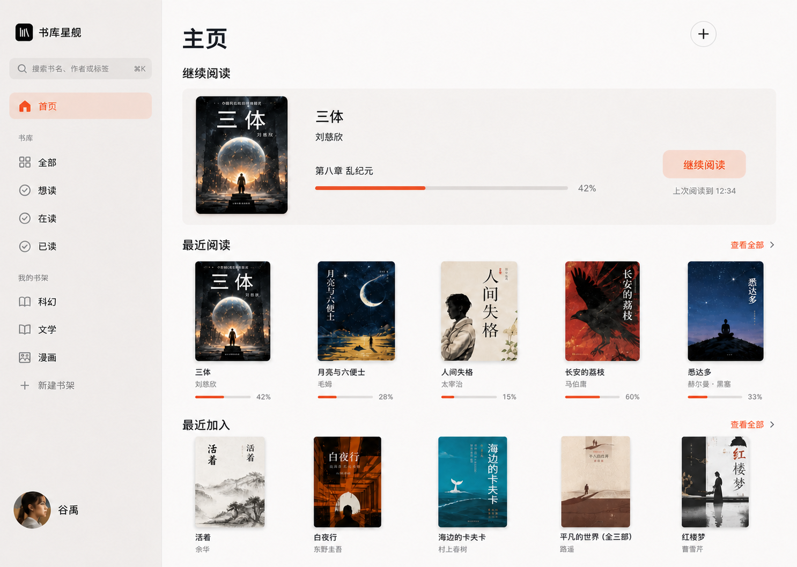
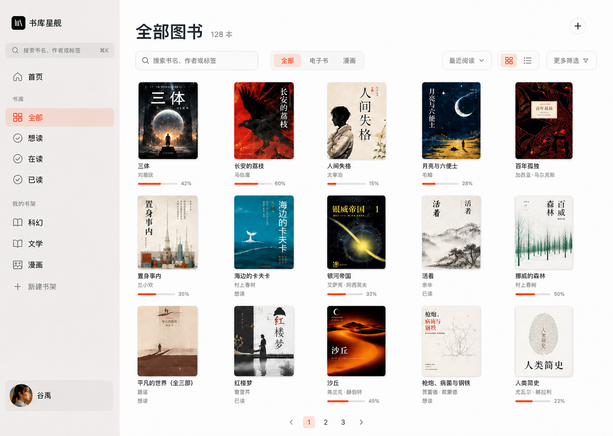
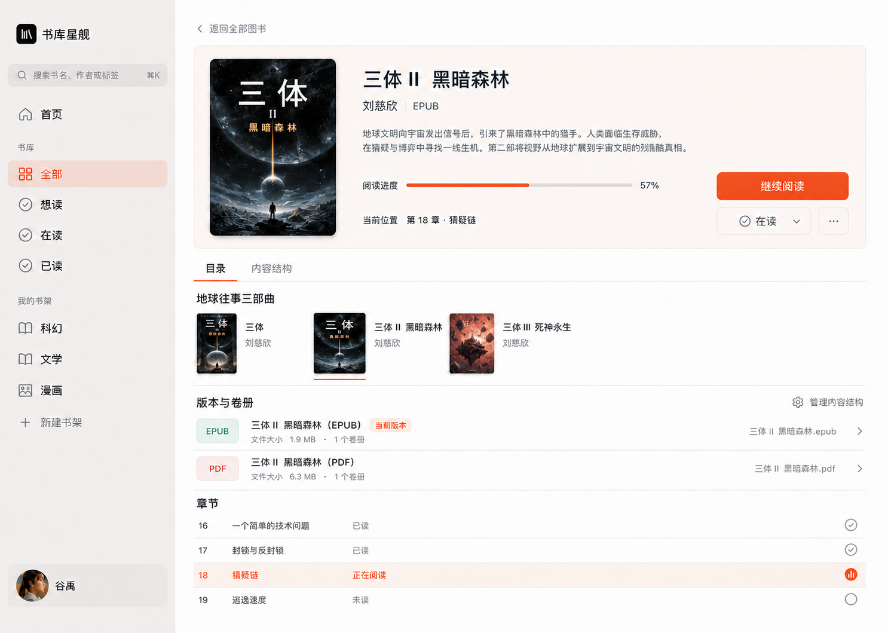
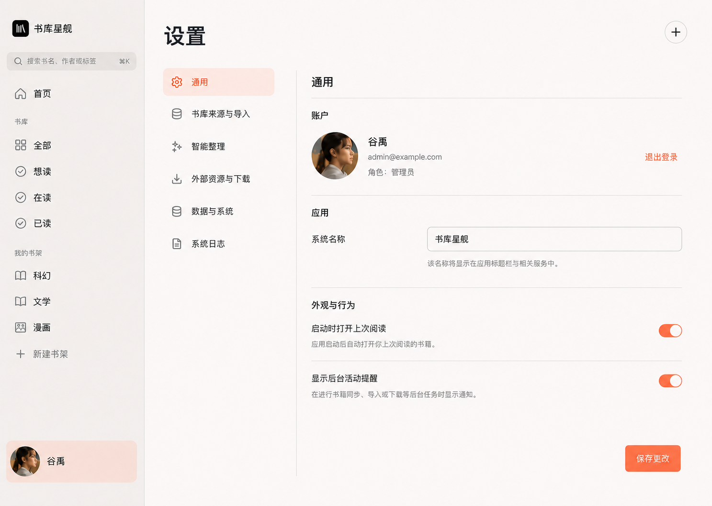
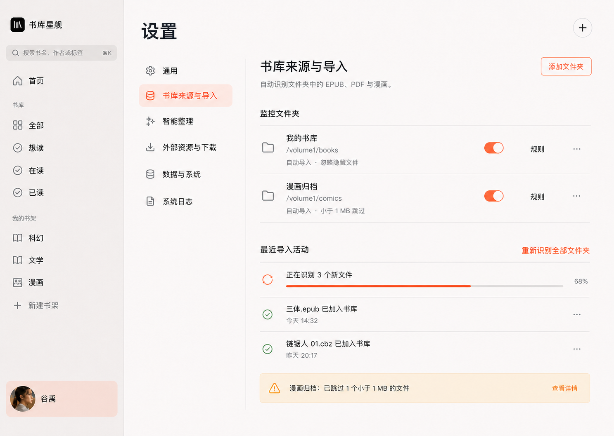
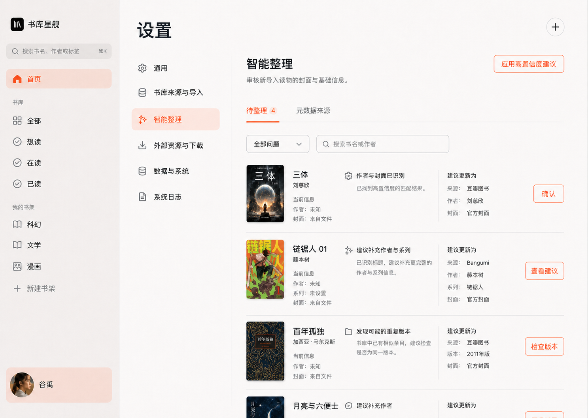
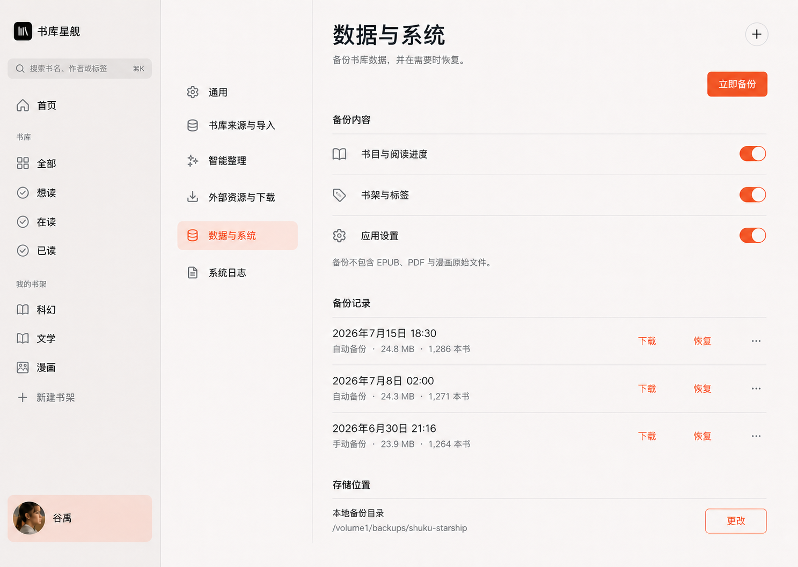
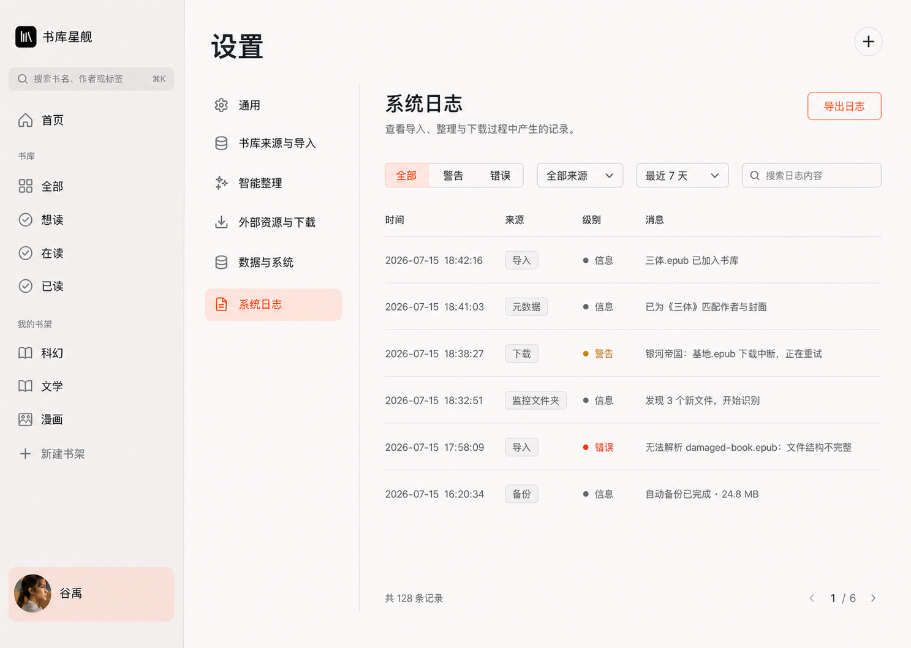

# 二毛图书系统应用化改造计划

> 状态：第一阶段桌面端重构已落地并完成视觉与自动化回归；破坏性字段/API/数据库迁移待后续阶段
> 制定日期：2026-07-15
> 最近更新：2026-07-16
> 视觉基线：方案 1「阅读优先」
> 项目范围：桌面端主应用；独立移动端界面本次保持现状

## 0. 当前落地状态

当前工作分支：`codex/system-app-redesign`。

本轮已经完成：

- 可见产品品牌已升级为“二毛图书”，并以用户提供的白猫照片为原型制作圆形抽象图标；Web、PWA 与 fnOS 使用同一套名称和应用图标，内部部署标识继续保留 `shuku-starship` 以兼容现有安装、备份和路径。
- 新版桌面应用壳、阅读优先首页、全部图书和图书详情。
- 左下角只保留头像作为唯一设置入口；用户名、“管理员”、右上角头像及下拉菜单均已移除。
- C8–C11 已融合到图书详情的“内容结构”和二级管理模式。
- E、F、G 已下沉到设置中心的“书库来源与导入”“智能整理”“外部资源与下载”。
- H5 日志能力已下沉到设置中心，并补齐级别、来源、日期、关键字筛选、导出、清理和详情脱敏。
- H4 管理概览和 H6 面向用户的服务状态已退出新版信息架构；底层健康检查继续保留。
- C12–C15 已从新版日常界面、筛选和详情展示中移除。
- 通用设置不再提供应用名称修改，品牌固定为“二毛图书”；账户增加头像、邮箱、密码修改和本地文件重置密码。
- 书库来源页已删除文件夹视图；监控文件夹表单改为紧凑主行和折叠扫描规则；最近导入默认每页 10 条并使用服务端分页。
- 豆瓣图书固定使用网页抓取，不再提供地址、模式或 API Key。
- 侧栏搜索仅承载本地书库入口；外部资源与下载能力退出产品界面。
- 桌面侧栏改为 `clamp(236px, 16vw, 264px)` 响应式宽度，内容区复用同一宽度变量；小于桌面断点时统一切换为底部导航，避免侧栏挤占正文。
- 设计参考、同视口实现截图和对照图已落地到 `docs/design/system-app-redesign/`。
- 品牌命名、图标语义、配色与资产位置记录在 [`BRAND_IDENTITY.md`](./BRAND_IDENTITY.md)。

本轮明确没有执行：

- C12–C15 的 API 响应字段、数据库字段及历史数据迁移。该步骤仍按“停止写入 → 移除展示与筛选 → 移除 API → 数据库迁移”的安全顺序在后续单独实施。
- 旧管理、系列及下沉功能路由的物理删除。当前保留为兼容入口，日常主导航已不再暴露。
- H11 独立移动端的视觉与交互重构。
- 数据库备份恢复演练及 EPUB/PDF/漫画三类阅读器的完整人工验收；现有自动化测试继续作为本轮回归保护。

## 1. 改造目标

本次改造不是单纯更换颜色和组件样式，而是把当前同时承担阅读器、书库管理、自动入库、元数据整理、外部资源获取和系统运维的后台式产品，重构为以阅读为主语的桌面应用。

核心目标：

1. 首页首先帮助用户继续阅读和找回最近读物。
2. 主导航只使用读者能够直接理解的概念。
3. NAS 导入、智能整理、外部书源和下载能力继续保留，但统一下沉。
4. 删除没有形成完整闭环、且显著增加界面与数据复杂度的功能。
5. EPUB、PDF、漫画阅读能力及现有输入方式保持完整。
6. 保留自托管部署所需的健康检查与后台运行能力，但不把它们展示成首页功能。

## 2. 设计稿

### 2.1 核心页面终稿

以下三张页面稿构成桌面端第一阶段的实现目标，现已作为代码重构和视觉验收基线落地。页面壳、侧栏、色彩、字体、封面尺寸与操作层级保持同一设计语言。

#### 首页

- 聚焦继续阅读、最近阅读和最近加入。
- 上传收敛到右上角“+”。
- 右上角不设置账户头像或下拉菜单。
- 左下角头像是唯一账户/设置入口，点击后进入设置页。
- 后台活动只以克制的状态点出现。
- 不展示统计卡、系统健康、存储占用和导入状态徽标。

#### 全部图书

- 提供本地搜索、类型筛选、排序、视图切换和更多筛选入口。
- 书籍直接陈列在基础页面上，不为每本书增加容器卡片。
- 阅读进度只在已开始读物下方出现。
- 不提供出版状态、追更状态、本地最新章节和管理诊断筛选。

#### 图书详情

- 首屏聚焦简介、进度、当前位置和继续阅读。
- 系列、版本、卷册和章节统一放入详情内容结构。
- 管理动作通过“管理内容结构”二级入口进入。
- 默认不暴露排序、移动、拆分和危险操作。
- 不展示 C12–C15 已删除字段。

### 2.2 设置中心页面稿

#### 通用设置

- 左下角头像是唯一账户/设置入口，并在设置页显示选中状态。
- 设置中心使用独立二级导航承载下沉功能，不污染全局主导航。
- 通用设置只包含账户头像、邮箱、密码、本地文件重置与退出登录。
- 不展示服务健康、存储统计和管理概览。

#### 书库来源与导入

- 监控文件夹、启停、规则和重新识别统一收敛到同一页面。
- 文件夹视图和孤儿文件入口删除；新增文件夹时主表单保持单行，扫描规则默认折叠。
- 导入活动使用普通任务行和进度线，不使用仪表盘状态卡。
- 最近导入默认每页 10 条，历史记录通过分页查看，只有第一页自动刷新。
- 只在存在需要处理的问题时显示克制的异常提示。

#### 智能整理

- 待整理任务和元数据来源作为同一功能域的两个页签。
- 每条任务直接对比当前信息、建议和来源。
- 高置信度建议可批量应用，其余建议逐条审核。
- 不出现出版状态、追更状态、本地最新章节和管理诊断卡。

#### 外部资源与下载

- 侧栏搜索仅提供本地书库搜索。
- 设置中心删除外部资源与下载设置。
- 结果行保留来源、格式、大小与下载动作，下载任务使用轻量进度行。
- 外部来源类型和 qBittorrent 配置退出产品界面；历史数据保留但不可从新版入口调用，避免级联丢失记录。

#### 数据与系统

- 页面仅承载备份范围、立即备份、备份记录、恢复与存储位置。
- 明确提示备份不包含 EPUB、PDF 与漫画原始文件。
- 不展示 CPU、内存、磁盘监控、服务健康或管理概览。
- 恢复属于高影响动作，落地时需要二次确认并清楚说明覆盖范围。

#### 系统日志

- 保留 H4–H6 中已确认需要的日志查询能力，并移入设置中心。
- 支持按级别、来源、时间与关键字筛选，保留导出日志入口。
- 信息、警告和错误只通过克制的文本与颜色区分，不做监控仪表盘。
- 不恢复已删除的服务状态、存储统计或管理诊断功能。

### 2.3 已选方向稿：阅读优先

该方案是本次改造的视觉和信息架构基线：

- 使用接近原生桌面应用的侧边栏结构。
- 首页以“继续阅读”为首要内容。
- 最近阅读、最近加入采用封面内容流，不使用统计仪表盘。
- 上传收敛为右上角“+”。
- 服务状态、存储占用、导入任务等不进入首页主视觉。
- 色彩从蓝色 SaaS 风格调整为克制的暖色阅读应用风格。

### 2.4 未选探索稿：书架优先

保留此稿作为书架陈列、封面尺寸和内容密度的辅助参考，不作为整体页面结构基线。

### 2.5 未选探索稿：沉浸工作台

保留此稿作为继续阅读区域、深色阅读焦点和书籍详情氛围的辅助参考，不作为整体页面结构基线。

## 3. 已确认的功能取舍

### 3.1 前台核心保留

以下能力继续作为读者日常可见功能：

- EPUB、PDF、漫画阅读。
- 阅读进度保存、恢复与跨端同步。
- 离线进度暂存和恢复联网后的顺序同步。
- 阅读目录、章节、页码、卷册和必要的版本切换。
- EPUB 主题、字号、行距、字体、页宽、翻页动画和分页/滚动设置。
- PDF 主题、缩放、适宽/整页设置。
- 漫画单/双页、方向、画质、适配和缩放设置。
- 键盘、指针、点击区域、触摸滑动和捏合缩放等已有导航方式。
- 首页继续阅读、最近阅读和最近加入。
- 本地书库搜索、网格/列表展示、排序和基础筛选。
- 手动上传 EPUB、PDF、CBZ、ZIP。
- 想读、在读、已读状态。
- 读物基础详情、简介、目录和阅读入口。
- 自定义书架的创建、编辑、删除和图书增删。
- 登录、退出和受控文件访问。
- 数据备份与恢复。
- PWA 安装、离线提示和安全更新机制。

### 3.2 E：NAS 自动导入——下沉

功能保留，但退出主导航：

- 监控文件夹新增、启用、停用和删除。
- 受限目录树选择。
- 忽略隐藏文件、自定义忽略规则和最小文件大小。
- Watcher 自动识别 EPUB、PDF、CBZ、ZIP。
- 手动重新识别监控目录。
- 导入任务进度、历史、错误和清理。
- 最近导入活动的 10 条分页和全量汇总。

目标位置：`设置 → 书库来源与导入`。

运行中或异常的导入任务可通过全局“后台活动”入口提示，但不设置常驻主导航项。

### 3.3 F：元数据智能整理——下沉

功能保留，但退出主导航：

- 待整理队列。
- 内嵌元数据、文件名和外部来源建议。
- 高置信度建议应用。
- 批量标签、批量隐藏和批量确认。
- 重复作品、版本和卷册风险处理。
- 豆瓣图书元数据。
- Bangumi 漫画元数据。
- OpenAI-compatible AI 元数据识别。
- 候选字段对比与应用。

目标位置：`设置 → 智能整理`。

图书详情中只保留一个克制的“编辑信息/智能整理”入口，不显示管理诊断卡片。

### 3.4 G：外部书源与下载——下沉

外部资源搜索与下载功能退出主导航和设置中心。
- 搜索结果历史、保存、忽略和删除。
- 下载队列、开始、取消、重试和状态处理。
- 下载完成后的监控入库联动。

目标位置：`设置 → 外部资源与下载`。

主搜索下拉仅提供本地结果。外部来源与 qBittorrent 配置均不再对外提供。

### 3.5 C8–C11：融合到图书详情

以下高级能力不再拆成分散页面，统一融合到图书详情的“内容结构”区域：

- 多版本查看、阅读、设为主版本和拆分。
- 卷册排序。
- 卷册移动到其他读物。
- 系列归属与同系列读物查看。

交互要求：

- 默认只展示当前版本、卷册和系列的阅读信息。
- 编辑、排序、移动、拆分等管理操作必须经过“管理内容结构”二级入口。
- 危险操作与普通阅读操作分组。
- 独立 `/series` 页面不再作为主导航或主要管理入口；系列浏览能力并入图书详情和书库筛选。

### 3.6 C12–C15：删除

以下功能从界面、接口、筛选逻辑和相关数据结构中删除：

- 出版状态：未知、连载中、已完结、休刊、取消等。
- 追更状态：未追更、追更中、暂停追更、忽略更新等。
- 本地最新卷、最新章节、最新标题和最新时间。
- 管理诊断、元数据缺失项统计及详情页诊断卡片。

对应字段包括但不限于：

- `publicationStatus` / `publicationStatusValue`
- `trackingStatus` / `trackingStatusValue`
- `localLatestVolume`
- `localLatestChapter`
- `localLatestTitle`
- `localLatestAt`

删除顺序必须遵循“停止写入 → 移除筛选与展示 → 移除 API 字段 → 数据库迁移”，避免旧客户端或旧数据造成运行错误。

### 3.7 H4–H6：只保留日志功能

- H4 管理概览：删除。
- H5 结构化日志：保留并下沉到 `设置 → 系统日志`。
- H6 服务状态：删除面向用户的状态页面、首页状态卡和常驻状态提示。

部署基础设施例外：

- `/api/health`、`/api/system/health` 等供 Docker、NAS、启动脚本和自动验收使用的底层健康检查继续保留。
- 后端仍应记录 Worker、数据库、存储读写等异常，只是不再把正常状态做成用户功能。
- 真正需要用户处理的异常通过后台活动入口或错误通知呈现。

### 3.8 H11：Web 与 PWA 共用响应式界面

浏览器与安装后的 PWA 统一使用现有 Web 信息架构和响应式布局，不再维护独立 `MobileReaderApp` 适配层。

- Manifest 从 Web 根路径启动。
- `/mobile`、`/mobile-preview` 仅作为旧入口兼容并重定向到首页。
- Reader V2 统一返回 Web 图书详情或书库。
- Service Worker 继续负责安装、离线回退、更新提示与进度同步，不改变页面信息架构。

## 4. 新版信息架构

### 4.1 主导航

主导航仅保留：

1. 搜索
2. 首页
3. 全部
4. 想读
5. 在读
6. 已读
7. 自定义书架列表
8. 新建书架
9. 左下角账户头像（进入设置）

不再出现在主导航：

- 待整理
- 下载队列
- 导入任务
- 管理
- 系统状态
- 监控文件夹

### 4.2 首页

首页内容优先级：

1. 继续阅读。
2. 最近阅读。
3. 最近加入。

首页右上角：

- “+”上传读物。
- 仅在有运行任务或异常时出现的后台活动入口。

全局账户与设置入口：

- 侧边栏左下角只保留一个头像入口。
- 点击头像进入设置页。
- 不再提供独立齿轮“设置”行。
- 不在右上角重复显示头像、账户菜单或下拉箭头。

首页删除或迁移：

- 总读物、漫画、电子书、存储占用统计不再作为首页卡片。
- 数据库、Worker、存储写入等正常状态不再展示。
- 导入、同步状态不使用常驻绿色徽标。

如需要显示总数，只在“全部图书”的标题或筛选结果中作为弱信息出现。

### 4.3 全部图书

保留：

- 网格/列表切换。
- 本地搜索。
- 最近阅读、最近加入、标题、作者、进度排序。
- 类型、想读/在读/已读筛选。
- 标签筛选可进入更多筛选。
- 分页。

删除：

- 出版状态筛选。
- 追更状态筛选。
- 最新卷/话相关筛选和展示。
- 缺元数据诊断式筛选。

“缺封面”“新导入”“已隐藏”等维护筛选迁移到智能整理或设置，不占普通书库筛选面板。

### 4.4 图书详情

首屏保留：

- 封面、标题、作者、简介。
- 阅读进度和当前位置。
- 开始/继续阅读。
- 想读、在读、已读。
- 目录或卷册入口。

次级区域：

- 编辑基础信息。
- 自定义/重新生成封面。
- 标签。
- 下载原始文件。
- 内容结构：系列、版本和卷册。
- 更多信息：格式、大小、出版信息和文件信息。

危险操作：

- 忽略读物。
- 删除数据库记录。
- 拆分版本。
- 移动卷册。

### 4.5 设置中心

建议设置分组：

1. 通用
   - 头像与邮箱
   - 修改密码与本地文件重置
   - 退出登录
2. 书库来源与导入
   - 监控文件夹
   - 扫描规则
   - 导入活动与分页历史
3. 智能整理
   - 待整理队列
   - 豆瓣/Bangumi
   - AI 元数据
   - 重复和版本处理
4. 外部资源与下载
   - 下载队列
5. 数据与系统
   - 备份与恢复
   - 系统日志

设置中心可以使用独立二级侧栏，但不把每项能力重新提升为全局导航。

## 5. 路由调整计划

### 5.1 保留并重新设计

- `/`：阅读优先首页。
- `/library`：全部图书与阅读状态视图。
- `/works/[id]`：新版图书详情与内容结构。
- `/reader/[id]`：保留 Reader V2 功能，统一视觉入口。
- `/shelves`：自定义书架管理。
- `/settings`：新版设置中心。
- `/login`：保留，视觉与新版统一。

### 5.2 下沉但保留能力

以下现有页面可以先保留路由以降低迁移风险，但从主导航移除，并由设置中心进入：

- `/organize/pending`
- `/organize/jobs/[id]`
- `/import-tasks`
- `/management/folders`

第二阶段再评估是否将保留项改为设置中心子路由，例如 `/settings/imports`、`/settings/organize`。

### 5.3 删除或迁移

- `/management`：删除管理概览页面。
- `/management/logs`：迁移或重定向到 `/settings/logs`。
- `/series`：取消独立主入口；系列浏览与管理融合到书库和图书详情。

删除路由前，为旧书签提供至少一个版本周期的重定向。

## 6. 数据与 API 调整

### 6.1 Reader API

- Reader V2 bootstrap、进度保存和受控文件接口保持兼容。
- 不修改现有 EPUB、PDF、漫画位置模型。
- 保留版本、卷册和章节导航所需字段。
- 保留离线进度队列的幂等和顺序保证。

### 6.2 书库 API

- 移除出版状态、追更状态和本地最新章节相关查询参数。
- 移除对应响应字段。
- 移除批量接口中对应的更新能力。
- 保留想读、在读、已读状态。
- 保留版本、卷册、系列和标签。

### 6.3 Dashboard API

- 首页继续使用继续阅读和最近读物数据。
- `dashboard/system-status` 不再由首页调用。
- 管理概览接口在确认无调用方后删除。
- 健康检查接口不删除。

### 6.4 数据库迁移

迁移前：

1. 创建可恢复备份。
2. 统计待删除字段的非空记录数量。
3. 确认没有后台 Worker 继续写入这些字段。
4. 更新 API 与 Worker 的兼容逻辑。

迁移后：

1. 验证现有书籍、版本、卷册、进度和书架数量不变。
2. 验证登录、上传、监控导入和阅读流程。
3. 验证旧备份恢复策略；必要时为旧备份增加字段忽略兼容。

## 7. 视觉系统落地原则

### 7.1 色彩

- 主背景：暖白或极浅暖灰。
- 侧边栏：半透明浅灰/米灰。
- 正文：接近黑色的石墨色。
- 主强调色：克制的珊瑚橙或暖橙。
- 蓝色只用于必要的系统链接或焦点，不再作为全局品牌色。
- 成功、警告、错误色只在真实状态需要用户处理时出现。

### 7.2 层级

- 优先使用间距、对齐、字重和分隔线组织内容。
- 不把每个区块做成卡片。
- 封面可以有轻量阴影，普通列表项尽量无阴影。
- 不使用卡片套卡片。
- 不使用仪表盘式统计矩阵填充首页。

### 7.3 字体与尺寸

- 使用系统中文无衬线字体作为主要 UI 字体。
- 正文以 14–16px 为基线。
- 页面标题约 32–40px。
- 区域标题约 20–24px。
- 元信息约 12–14px，但保证可读性。
- 图书标题允许使用更具阅读感的字体或字重，但不引入超过两套字体。

### 7.4 交互

- 主操作明确，每个区域最多一个强操作。
- 上传、编辑、管理和删除不争夺“继续阅读”的视觉优先级。
- 后台任务只在运行、失败或需要确认时提醒。
- 所有图标按钮必须有可访问名称和键盘焦点状态。

## 8. 分阶段实施计划

### 阶段 0：基线与保护

- 记录当前数据库 schema 和 API 字段。
- 运行现有类型检查、单元测试、构建和验收脚本。
- 为首页、书库、详情、设置和 Reader V2 建立关键截图基线。
- 确认工作区无未归属改动。
- 创建数据库备份与恢复演练记录。

完成标准：当前功能可复现，后续回归有明确基线。

### 阶段 1：应用壳与信息架构

状态：已完成。

- 重构桌面侧边栏。
- 移除待整理、下载队列、导入任务和管理的主导航入口。
- 增加阅读状态和自定义书架导航。
- 增加设置入口和条件显示的后台活动入口。
- 保留旧路由直接访问能力。

完成标准：普通用户只看到阅读相关导航，后台能力仍可从设置进入。

### 阶段 2：首页与书库

状态：已完成。

- 按已选设计稿重构首页。
- 首页只展示继续阅读、最近阅读和最近加入。
- 移除首页统计卡、系统状态卡和常驻状态徽标。
- 重构书库筛选与排序。
- 删除出版状态、追更状态和本地最新章节相关 UI。
- 将上传统一到“+”入口。

完成标准：打开应用后可以在一次操作内继续阅读，在两次操作内找到任意本地读物。

### 阶段 3：图书详情融合

状态：第一阶段已完成；旧系列路由暂作兼容保留。

- 重构详情页首屏阅读信息。
- 新建“内容结构”区域。
- 融合系列、版本、卷册排序和卷册移动。
- 将管理操作放入二级编辑状态。
- 删除管理诊断和 C12–C15 展示。
- 取消独立系列管理入口并增加旧路由重定向。

完成标准：阅读入口清晰，高级结构管理仍然完整但默认不干扰阅读。

### 阶段 4：设置中心与功能下沉

状态：已完成新版入口与主要能力整合；旧路由暂作兼容保留。

- 建立设置二级导航。
- 下沉 NAS 导入能力。
- 下沉智能整理能力。
- 下沉外部书源与下载能力。
- 将日志迁移到设置。
- 删除管理概览和面向用户的服务状态 UI。

完成标准：E、F、G 功能全部可达，但不再出现在日常阅读路径。

### 阶段 5：字段与接口删除

状态：待后续单独实施。本轮只完成了新版 UI、筛选与信息架构中的移除，不执行破坏性数据库迁移。

- 停止 Worker、API 和前端写入 C12–C15 字段。
- 删除对应查询、筛选、表单和响应字段。
- 增加数据库迁移。
- 处理旧备份与旧客户端兼容。
- 删除无调用方的管理概览接口。
- 保留部署健康检查。

完成标准：代码、API 和数据库中不再存在废弃业务能力，现有书籍和进度数据不受影响。

### 阶段 6：视觉统一与回归

状态：桌面端视觉对照与自动化回归已完成；阅读器全格式人工验收和独立移动端回归仍待执行。

- 统一颜色、圆角、间距、字体、焦点和空状态。
- 统一登录、设置和下沉页面的视觉系统。
- 检查窄桌面和大屏桌面布局。
- 对独立移动端只做回归测试，不进行主动改造。
- 完成 EPUB、PDF、漫画的全输入面导航回归。

完成标准：主应用视觉一致，Reader V2 和移动端不存在功能回退。

## 9. 验收清单

### 9.1 导航与首页

- [x] 主导航不再显示待整理、下载队列、导入任务和管理。
- [x] 首页首要内容是继续阅读。
- [x] 首页包含最近阅读和最近加入。
- [x] 首页不展示服务健康、数据库、Worker、存储占用等状态卡。
- [x] 上传通过右上角“+”完成。
- [x] 后台活动入口仅在有活动或异常时显著出现。

### 9.2 书库与详情

- [x] 全部、想读、在读、已读可以直接访问。
- [x] 搜索、排序、网格/列表和分页正常。
- [ ] 出版状态、追更状态和本地最新章节的 API/数据库字段已完成阶段 5 清理。
- [x] 新版 UI 已移除出版状态、追更状态和本地最新章节的展示与筛选；API/数据库字段仍待阶段 5 清理。
- [x] 详情页可以开始或继续阅读。
- [x] 系列、版本和卷册管理位于内容结构区域。
- [x] 详情页不显示管理诊断卡。

### 9.3 下沉功能

- [x] 设置中可以管理监控文件夹和扫描规则。
- [x] 设置中可以查看导入活动和错误。
- [x] 设置中可以进入智能整理。
- [x] 设置中可以管理外部来源和下载任务。
- [x] 设置中可以进行备份与恢复。
- [x] 设置中可以查看、筛选、导出和清理结构化日志。

### 9.4 删除与基础设施

- [ ] `/management` 管理概览已移除或重定向。
- [x] 面向用户的服务状态界面已退出新版信息架构。
- [ ] Docker/NAS 健康检查继续正常。
- [ ] C12–C15 字段不再被前端、API 或 Worker 使用。
- [ ] 数据库迁移不会删除书籍、文件、版本、卷册、进度和书架数据。

### 9.5 Reader 与响应式 Web/PWA 回归

- [ ] EPUB 分页/滚动、目录、主题、字体、字号、行距和进度恢复正常。
- [ ] PDF 翻页、缩放、适配、文本选择和进度恢复正常。
- [ ] 漫画单/双页、方向、适配、缩放、卷册和进度恢复正常。
- [ ] 键盘、点击区、中心控件、滑动和捏合行为正常。
- [ ] 浏览器与安装后的 PWA 使用同一套响应式 Web 页面。
- [ ] `/mobile` 与 `/mobile-preview` 旧入口会重定向到 Web 首页。
- [ ] 离线进度和恢复联网后的同步正常。

## 10. 本次明确不纳入

- 独立 PWA/移动端界面。
- 书签。
- 笔记、划线和批注。
- 阅读目标和阅读时长统计。
- 有声书。
- TXT 阅读。
- 社交、评分和推荐。
- 新的自动追更系统。
- 多用户书架分享。

这些能力不能在本次界面中以占位按钮、假数据或不可用入口出现。

## 11. 风险与控制

### 数据迁移风险

C12–C15 涉及数据库字段、API 返回和前端类型。必须最后删除数据库字段，并在迁移前生成备份。

### 下沉后可发现性风险

E、F、G 仍是高级用户需要的能力。设置中心应提供清晰分组和搜索，后台活动异常需要能直达对应页面。

### 路由兼容风险

已有用户可能保存 `/series`、`/management` 等书签。删除页面时需要重定向，避免直接出现 404。

### Reader 回归风险

应用壳、详情和数据类型变化可能影响 Reader V2 启动数据和返回路径。Reader 三种格式必须作为独立验收面处理。

### 移动端影响风险

虽然 H11 不在本次修改范围，移动端复用了书库 API 和 `WorkView`。删除字段时必须先清除移动端引用，不能依靠 TypeScript 强制断言掩盖问题。

## 12. 推荐实施顺序

建议按以下顺序进入实际开发：

1. 应用壳与新版侧边栏。
2. 首页。
3. 书库。
4. 图书详情和内容结构。
5. 设置中心与 E/F/G 下沉。
6. 日志迁移和管理概览删除。
7. C12–C15 API 与数据库清理。
8. 全量视觉统一和回归验收。

先完成可见结构，再执行破坏性数据清理，可以让每个阶段都有可运行、可验证的状态。
