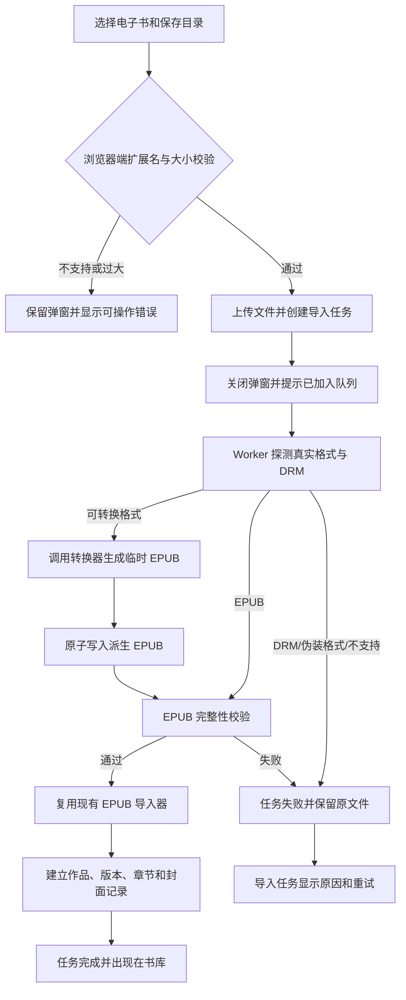
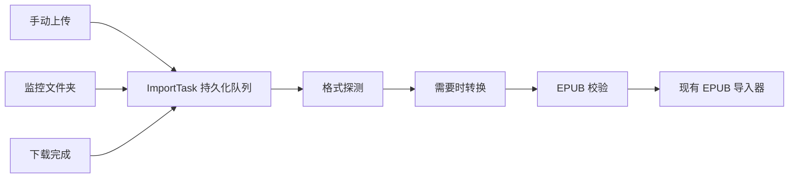

# 文本电子书自动转换 V1：产品设计与执行计划

## 1. 已确认的产品决策

- V1 只实现自动转换，不显示“高级模式”、占位入口或“即将推出”。
- 本功能只处理文本电子书；现有其他内容类型不在本次升级范围内。
- EPUB 继续直接导入；其他受支持的文本电子书先转换为 EPUB，再复用现有 EPUB 导入和阅读链路。
- 原始文件永久保留；阅读器只打开通过校验的 EPUB 派生文件。
- 转换必须在后台 Worker 执行，上传请求不等待转换完成。
- 高级模式留到 V2，届时再开放章节树、封面、图片、字体和样式资源调整。

## 2. V1 设计稿


### 2.1 入口

主入口保持不变：书库页右上角“添加”按钮打开“添加电子书”弹窗。

现有弹窗升级为以下结构：

1. 选择保存目录。
2. 选择电子书文件。
3. 选择完成后，展示文件名、格式、大小，以及“转换前将检查 DRM”。
4. 对非 EPUB 文件展示固定说明：“系统将自动识别章节、封面和书内资源，并生成 EPUB”。
5. 展示明确的格式结果，例如 `AZW3 → EPUB`。
6. 用户点击“开始转换”。

移动端沿用现有底部安全区和全屏弹层规范，字段顺序与桌面端一致，不增加独立流程。

### 2.2 点击“开始转换”后的反馈

- 文件上传成功后立即关闭弹窗。
- Toast 显示“已加入转换队列”，提供“查看任务”入口。
- 书库页不阻塞等待，不插入尚不可阅读的书籍卡片。
- “导入任务”页面展示后台进度；校验并入库成功后才出现在书库。

## 3. V1 范围

### 3.1 建议首发格式白名单

| 输入格式 | V1 行为 | 说明 |
|---|---|---|
| EPUB | 直接导入 | 不进入转换器 |
| MOBI | 自动转换为 EPUB | 检查 DRM/加密错误 |
| AZW、AZW3 | 自动转换为 EPUB | DRM 文件明确失败，不归类为损坏 |
| PRC | 自动转换为 EPUB | 与 MOBI 走同一转换策略 |
| FB2 | 自动转换为 EPUB | 保留目录、封面和内嵌图片 |
| TXT | 自动识别编码、章节并转换 | 低置信度编码不静默猜测，返回明确错误 |

AZW4、HTML/HTMLZ、DOCX、RTF、ODT 等格式留到后续小版本验证后再开放。格式白名单由产品控制，不直接等同于转换器宣称支持的全部输入格式。

### 3.2 V1 不包含

- 手动调整章节、合并章节或拆分章节。
- 替换封面、删除图片、管理字体或样式表。
- 手动选择 TXT 编码。
- 转换参数模板和逐书参数覆盖。
- 任务取消；V1 只提供失败后重试。
- 对 DRM 的移除或绕过。

## 4. 用户流程



### 4.1 监控文件夹与下载来源

手动上传、监控文件夹和下载完成后的文件都必须汇入同一个持久化导入队列：



这样可以避免三种入口分别维护转换逻辑，也让未启用监控的手动上传目录仍能自动完成导入。

## 5. 任务状态与进度

现有 `ImportTask` 生命周期继续保持 `PENDING / PARSING / COMPLETED / FAILED`，降低对旧接口和统计逻辑的影响。新增转换子任务保存更细的阶段：

| 阶段 | 建议总进度 | 用户文案 |
|---|---:|---|
| 排队 | 0–5% | 等待转换 |
| 格式探测 | 5–15% | 正在检查文件格式与保护状态 |
| 转换 | 15–70% | 正在生成 EPUB |
| EPUB 校验 | 70–85% | 正在检查章节与书内资源 |
| 导入书库 | 85–99% | 正在建立书籍和章节记录 |
| 完成 | 100% | 转换并导入完成 |

转换器无法稳定提供真实百分比时，不伪造细粒度进度；阶段内使用不确定进度动画，阶段完成时再推进总进度。

## 6. 失败与恢复设计

| 错误码 | 用户提示 | 可重试 |
|---|---|---:|
| `UNSUPPORTED_FORMAT` | 文件内容与受支持格式不匹配 | 否 |
| `DRM_PROTECTED` | 文件可能受 DRM 保护，无法转换 | 否 |
| `TEXT_ENCODING_UNCERTAIN` | 无法可靠识别文本编码 | V2 可人工处理 |
| `CONVERTER_UNAVAILABLE` | 转换服务暂时不可用 | 是 |
| `CONVERSION_TIMEOUT` | 转换超时，原文件已保留 | 是 |
| `CONVERSION_FAILED` | 文件转换失败，原文件已保留 | 是 |
| `INVALID_EPUB_OUTPUT` | 已生成文件未通过 EPUB 校验 | 是 |
| `FILE_TOO_LARGE` | 文件超过当前大小限制 | 否 |

失败后的共同规则：

- 不删除或覆盖原文件。
- 不产生半完成的书库记录。
- 临时产物使用 `.part` 后缀，校验通过后原子改名。
- 重试复用原始文件和源文件哈希，不要求用户重新上传。
- 同一源文件哈希、转换器版本和自动参数组合命中已验证产物时直接复用。

## 7. 与现有项目的结合

### 7.1 前端

- 改造 `apps/web/features/library/library-page.tsx`：扩充文件白名单、选中文件摘要、自动转换说明、格式结果和队列反馈。
- 继续使用现有 `TargetDirectoryPicker`，不新增第二套目录选择器。
- 改造 `apps/web/features/import-tasks/import-tasks-page.tsx`：显示转换阶段、源格式、目标格式、失败码和“重试”。
- “书库来源与导入”设置页继续嵌入现有导入任务组件，无需新增一级导航。
- 书籍详情在文件/版本信息中显示“原始格式”和“阅读格式”；不新增独立转换页面。

### 7.2 API 与 Worker

- `POST /api/works/import` 对所有合法上传都创建 `ImportTask`，返回任务 ID；接口只负责安全落盘和入队。
- 将手动上传、监控扫描、下载完成后的直接导入统一改为创建持久化任务。
- 新增持久化导入队列 Worker，领取 `PENDING` 任务并加租约，避免 API 与扫描 Worker 重复处理。
- 新增 `TextConversionService`：格式探测、转换器调用、超时、日志、结果校验和原子落盘。
- 转换成功后调用现有 `import_managed_book` 的 EPUB 路径，避免复制章节、封面和元数据入库逻辑。
- 新增 `POST /api/import-tasks/{id}/retry`，只允许重试可恢复的失败任务。

### 7.3 数据模型

新增 `BookConversionTask`，与 `ImportTask` 一对一：

| 字段 | 用途 |
|---|---|
| `id`, `importTaskId` | 任务标识和关联导入任务 |
| `mode` | V1 固定为 `AUTO`，为 V2 预留 |
| `sourceFormat`, `targetFormat` | 原始格式和阅读格式 |
| `sourcePath`, `outputPath` | 原文件和验证后的派生文件 |
| `sourceHash` | 去重和产物复用 |
| `converter`, `converterVersion` | 可追踪转换环境 |
| `optionsJson` | V1 保存自动参数快照，V2 可扩展高级设置 |
| `status`, `progress`, `attempts` | 队列与重试状态 |
| `errorCode`, `errorSummary` | 稳定错误分类和诊断信息 |
| `startedAt`, `finishedAt`, `createdAt`, `updatedAt` | 审计与耗时统计 |

数据库启动迁移、备份导出、恢复顺序和测试夹具必须同步加入新表。

### 7.4 文件布局

```text
原文件：用户选择的上传/监控目录，保持不变
临时文件：STORAGE_ROOT/temp/conversions/{taskId}/book.epub.part
验证产物：STORAGE_ROOT/conversions/{sourceHash}/{converterVersion}/book.epub
```

派生目录位于 `STORAGE_ROOT`，不会被监控器再次扫描，从根源上避免转换产物形成重复任务。

## 8. 转换器方案（已确认）

V1 不引入 Calibre，采用按格式分流的轻量转换方案：

- MOBI、AZW、AZW3、PRC：调用 libmobi 的 `mobitool -e` 生成 EPUB。
- TXT：项目内识别 UTF-8/UTF-16/GB18030 编码，自动识别章节标题，使用 EbookLib 封装 EPUB。
- FB2：项目内使用 lxml 安全解析书名、作者、语言、章节和内嵌图片，再使用 EbookLib 封装 EPUB。
- 所有格式继续复用统一任务、缓存、EPUB 校验、原子发布和来源追踪链路。

调用约束：

- libmobi 使用参数数组启动子进程，禁止 `shell=True`。
- 使用独立临时目录、固定超时、输出大小限制和日志截断。
- 通过 `mobitool -v` 探测 Kindle 格式转换能力；TXT/FB2 内部转换能力独立暴露。
- 实际转换器名称、版本、源格式和自动参数共同组成缓存键。
- TXT 只在编码置信度足够时自动转换；宁可明确失败，也不生成乱码 EPUB。
- DRM 文件直接返回不可重试错误，不提供解密或规避机制。

## 9. 执行计划

### 阶段 0：转换器技术验证

- 准备最小样本矩阵：MOBI、AZW3、PRC、FB2、UTF-8 TXT、GB18030 TXT、DRM/加密样本、损坏文件。
- 验证 libmobi 在 `linux/amd64` 与 `linux/arm64` 生产镜像中的安装、转换结果、峰值内存和镜像体积。
- 确定转换超时、文件大小上限和 TXT 编码策略。
- 退出条件：样本均能得到稳定的成功或稳定的错误分类。

### 阶段 1：数据与转换核心

- 新增 `BookConversionTask`、启动迁移、备份/恢复支持。
- 实现格式探测、错误码、转换器封装、临时目录和原子产物发布。
- 实现 EPUB 结构校验，并复用现有 EPUB 元数据解析做二次验证。
- 添加转换服务单元测试，所有外部进程在测试中使用假执行器。

### 阶段 2：统一持久化导入队列

- 让手动上传、监控扫描和下载完成统一创建 `ImportTask`。
- Worker 加入任务领取、租约恢复、幂等和重试。
- 转换成功后调用现有 EPUB 导入器，写回作品、版本和章节关联。
- 验证 Worker 重启后未完成任务可以安全继续，不生成重复作品。

### 阶段 3：API 与界面

- 升级上传弹窗，按 V1 设计稿实现桌面和移动布局。
- 上传成功后返回任务并提供“查看任务”。
- 导入任务页展示格式转换阶段、进度、错误原因和重试。
- 书籍详情补充来源格式、派生格式和转换器版本信息。

### 阶段 4：回归与发布门禁

- 后端：格式矩阵、损坏文件、DRM、超时、并发、重复上传、重试、Worker 重启测试。
- 前端：上传弹窗状态、任务轮询、失败重试、移动布局和键盘可访问性测试。
- 端到端：上传 AZW3 → 自动转换 → EPUB 校验 → 入库 → EPUB 阅读器打开。
- 部署：启动时校验转换器能力；缺失时保持 EPUB 直接导入可用，并禁止选择需转换格式。
- 发布观察：记录成功率、各阶段耗时、失败码分布和转换器版本。

## 10. V1 验收标准

- 用户可以上传白名单内的文本电子书并在一次点击后完成转换和入库。
- 转换期间用户可以离开页面，任务不丢失；Worker 重启后可以恢复。
- 成功产物能够被现有 EPUB 阅读器正常打开，并具有非空章节列表。
- DRM、损坏、超时和编码不确定都有明确且稳定的错误提示。
- 转换失败不会删除原文件，也不会留下半成品书籍记录。
- 重试不会创建重复任务、重复版本或重复派生文件。
- 现有 EPUB 直接导入链路行为不变。
- V1 的任何页面都不出现高级模式入口。

## 11. V2 预留

V2 在不改变 V1 自动路径的前提下，复用 `BookConversionTask.mode`、`optionsJson`、解析结果和派生文件体系，增加章节树、资源清单、预览、草稿保存与人工确认工作台。
