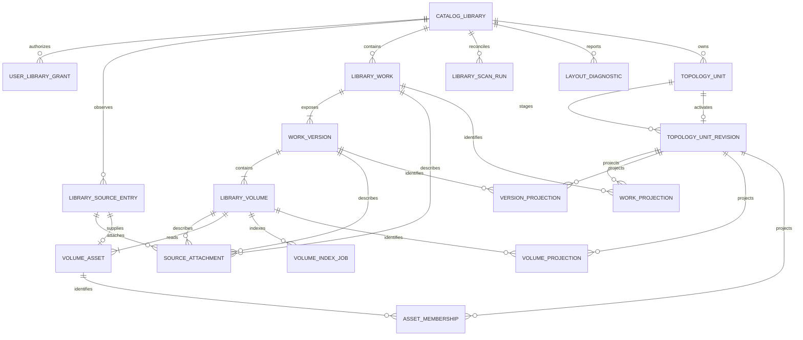

# 书库组织模式全量重构实施方案

> 状态：首个渐进式 PR 的实施基线。本文不改变运行时代码；最终决策以
> [ADR 0017](adr/0017-filesystem-authoritative-library-topology.md) 为准。

## 1. 目标与边界

本次重构把“监控文件夹 + 智能识别后整理”替换为“书库 + 明确目录协议”。创建书库
时必须选择 `FLAT`、`VOLUMES` 或 `AUDIOBOOK`。文件系统决定作品、版本、卷册和源文件
的隶属关系；识别、OPF、嵌入标签和在线元数据只负责描述。

这是一次全新数据代际。本文所说的“必须重新安装”有严格定义：清空应用自有的全部
数据库和软件数据（服务端 app-data、配置、日志/临时文件、派生缓存/任务/会话、Web/PWA
存储、移动端本地存储及本应用命名空间的凭据），然后按空系统重新初始化；它与用户书库
目录完全无关。

- 用户必须执行上述完整 app-owned reset，重新安装，重新创建首个管理员/用户与授权，之后
  再手工登记并扫描书库目录；
- 不迁移旧数据库、用户记录、进度、书签、下载、智能书架规则或任务；
- 不导入旧备份，不保留旧 API，不返回旧字段，不做 ID alias；
- 重装流程不记录、不迁移、不校验、不清理、不修改用户的书库源目录；
- 前后端与移动端按一个大版本同步发布。

本方案优先定义业务不变量、数据结构、扫描与事务、接口边界和 PR 切片。页面布局、
视觉样式和具体交互稿不在本轮范围内。

## 2. 当前实现与目标的冲突

| 冲突 | 当前假设 | 目标处理 |
| --- | --- | --- |
| 组织模式与媒体分类同名 | `mediaKindPolicy` 使用 `MIXED/EBOOK/COMIC/AUDIOBOOK` | 新 `organizationMode` 只表示目录语法；格式和 Reader 能力单独建模 |
| 作品身份由识别结果决定 | 标题、父目录、兄弟文件、OPF、AI 都可能参与归组 | 相对路径结构决定父子关系；元数据永不改结构 |
| 版本是三种媒体桶 | `(workId, mediaKind)` 唯一 | `VOLUMES` 的二级目录是版本；其他模式使用隐式版本 |
| 卷册支持数据库内移动 | move/split/reclassify/merge 不修改源文件 | 删除所有目录结构写命令 |
| 文件身份依赖绝对路径 | 挂载点变化即身份变化 | `libraryId + normalized relative path` 用于对账，公开身份为 opaque ID |
| watcher 只负责发现导入 | delete、目录 move、离线变化不能完整对账 | watcher 只加速；成功的 generation 全量扫描才结束缺失对账 |
| 已完成任务阻挡同路径更新 | 修改文件可能不再索引 | `volumeId + contentRevision` 产生幂等索引任务 |
| 删除数据库记录可保留源文件 | 下次扫描会复活 | 不提供 DB-only 或源删除；用户在文件系统管理删除 |
| ACL 依附监控目录 | 作品可能跨多个监控目录推导权限 | 每个作品必须属于一个书库，授权直接使用 `libraryId` |
| 有声书被当成分类 | 音轨组合和媒体类别混在一起 | `AUDIOBOOK` 只是一种多资产目录协议；音频技术能力来自格式探测 |
| “重新安装”被误解为只卸载程序 | 平台可能保留服务端卷、PWA 存储、移动端备份或凭据 | 强制清空全部 app-owned 数据后按空系统初始化；用户书库目录不属于 reset 范围，generation guard 只做旧状态拒绝，不解析或迁移旧数据 |

代码盘点中的主要耦合点：

- `apps/api-python/app/models/settings.py` 的 `MonitorFolder` 同时承载 root 与 media-kind policy；
- `apps/api-python/app/models/library.py` 将 Version 唯一约束为 `(workId, mediaKind)`，File 保存绝对路径；
- `apps/api-python/app/modules/imports/application/work_resolution.py` 与 `work_grouping.py` 让标题、父目录、兄弟、
  metadata 和识别结果参与作品归属；
- `apps/api-python/app/modules/library/infrastructure/structural_operations.py`、`volume_commands.py` 和 merge 逻辑
  可以只改数据库父子关系；
- `apps/api-python/app/worker/watcher.py` 和现有 scan 以“发现导入候选”为中心，不能完成 delete/move/full
  generation reconciliation；
- `apps/api-python/app/services/backup_service.py` 的旧 envelope 序列化 MonitorFolder/media-version/organize 状态；
- Web work DTO、smart-shelf 与 Reader bootstrap 强依赖 mediaKind/mediaVersion；
- Mobile Reader/Download 的现有单资产合同含 `mediaVersionId/mediaKind`，且音频 playback/
  multi-asset download 尚未闭环。

因此不能在旧 import/organize service 中继续加 mode flag；新 Catalog capability 必须只通过
公开 format/metadata ports 复用解析能力，在最终 cutover 替换 composition root。

还必须显式处理以下容易遗漏的业务问题：

- 同 stem 不同格式是否合并；答案是默认不合并。
- 混合 EPUB/PDF/漫画/音频是否允许；`VOLUMES` 允许，它们仍是独立卷册。
- 非空书库能否改模式；答案是不能，需删除注册后按新模式创建。
- 本地重命名后进度是否保留；仅在一对一身份可证明时保留，歧义时不得猜测。
- 书库临时离线是否等于删除；答案是否定的，失败扫描不能 finalize missing。
- 根目录嵌套如何判定；规范化后父子、相同、symlink 指向重叠都拒绝。
- sidecar、封面、OPF 和音轨标签是否影响归组；答案是否定的，只补充描述。
- 内容相同的两个副本是否合并；答案是否定的，两个路径就是两个资源。
- 重新挂载根目录是否丢 ID；只有显式 `RelocateLibraryRoot` 可声明是同一个书库。
- 多音轨有声书如何下载；必须发布有序原始资产清单，不能生成派生 ZIP。

## 3. 目标领域模型



对外继续使用“书库 / 作品 / 版本 / 卷册”。代码中新能力建议放在
`app/modules/catalog`，避免新代码依赖现有 `modules/library`、`modules/imports` 和
`modules/organize` 的私有实现。Reader 可以把一个卷册投影为 `Publication`，但
`Publication` 不反过来成为目录组织概念。

### 3.1 `CatalogLibrary`

| 字段 | 约束与语义 |
| --- | --- |
| `id` | opaque ID |
| `name` | 用户名称；不参与身份 |
| `rootPath` | 仅服务端管理员可见的规范绝对根路径 |
| `rootPathKey` | 根路径比较键，全局唯一 |
| `organizationMode` | `FLAT | VOLUMES | AUDIOBOOK`，激活后不可改 |
| `topologyVersion` | 初始固定为 `1`，激活后不可改 |
| `pathComparison` | `SENSITIVE | INSENSITIVE`，由非破坏性证据或管理员确认，激活后不可改 |
| `writePolicy` | `READ_ONLY | READ_WRITE` |
| `controlState` | `DRAFT | ACTIVATING | ACTIVE | PAUSED | REMOVING` |
| `observedHealth` | `UNKNOWN | HEALTHY | UNAVAILABLE | ERROR`，不是用户控制状态 |
| `configRevision` | 忽略规则、稳定时间等配置的乐观并发版本 |
| `topologyWriterFence` | 每次 writer lease acquire/takeover 单调递增；所有拓扑写入必须 CAS |
| `sourceMutationFence` | 短时跨进程 gate；串行 final publish/relocate 与控制/ACL 写 |
| `nextScanGeneration` | 单调递增的 generation 分配器 |
| `lastSuccessfulGeneration` | 最近完整成功 generation；不能由失败扫描推进 |
| `lastSuccessfulScanAt` | 健康状态事实 |

根路径只在文件适配器边界与祖先链路径投影拼接。普通 API、日志和错误不得泄露绝对路径。
忽略规则使用独立、显式类型和表，不把任意 JSON 直接传入领域层。

状态规则：Create 得到 `DRAFT`；接受 Activate 时同事务进入 `ACTIVATING` 并冻结结构字段，
返回 `202`；首次完整扫描成功后才进入 `ACTIVE`。失败时保持 ACTIVATING + error health，只能
重试或移除，不能换 grammar 解释已增量提交节点。布局诊断不等于基础设施失败。DRAFT 可修改
root/mode/path policy/write policy；Pause 停止新扫描和源写操作但不隐藏已有可读内容。
READ_WRITE → READ_ONLY 仅在没有运行中的 source operation 时允许。DRAFT 也可直接进入
REMOVING；它不能成为无法释放 root claim/ADMIN grant 的终止状态。

### 3.2 `UserLibraryGrant`

- 联合唯一键 `(userId, libraryId)`，grant 为层级 `ADMIN ⊃ CURATE ⊃ READ`。
- 创建者获得显式 ADMIN grant；全局管理员同样使用显式 grant，不依赖隐式全库查询。
- READ 浏览、阅读、下载和个人进度；CURATE 编辑描述 metadata；ADMIN 管理根、ACL、扫描、
  relocate、source placement 和移除。源写还必须同时满足 Library `READ_WRITE`。
- 每个需要查看或操作 Work/Version/Volume 的查询都在数据库条件中按 actor scope。
- `LibraryWork.libraryId` 非空且不可变；不允许跨库作品或跨库合并。
- session 返回单调 `authzVersion` 和 `{libraryId, grant, scopeEpoch}`；revoke/regrant 轮换
  scope epoch。普通 DTO 与含 rootPath 的管理员 DTO 是两个合同。
- 普通 grant 命令禁止删除/降级最后一个 ADMIN；只有 Library removal 可撤销全部 grants。

### 3.3 `LibrarySourceEntry` 与 `SourceAttachment`

完整相对路径不能在几十万后代上重复物化，否则重命名一个目录会产生超大事务。新模型使用
祖先链：

| 字段 | 约束与语义 |
| --- | --- |
| `id` | opaque source-entry ID |
| `libraryId` | actor scope 与根边界 |
| `parentEntryId` | synthetic root 自身为空，其余 entry 必填；深度受 grammar 限制 |
| `localName` / `localNameKey` | 原名与 comparison-normalized 局部名 |
| `entryType` | `SYNTHETIC_ROOT | DIRECTORY | FILE` |
| `filesystemIdentity` | 可空、平台证据，不作为跨库 identity |
| `sizeBytes` / `modifiedNs` | 变化提示，不证明内容相同 |
| `lastSeenGeneration` | missing projection 输入 |
| `absenceConfirmedAt` | watcher/subtree stat 明确不存在时设置；文件身份确认或目录完整 subtree scan 后清除 |
| `childrenPresenceEpoch` | 目录每次 reappearance/完整子树重验前递增，作旧 child 失效 fence |
| `observedParentPresenceEpoch` | child 被当前 parent enumeration 看见时复制 parent epoch |
| `layoutState` | `PRESENT | INVALID`；`MISSING` 由 generation/confirmed absence 投影 |
| `slotState` | `ACTIVE | RETIRED`；retired tombstone 不占当前名称槽 |

每个 Library 恰好一个 `$root` synthetic entry，由 `entryType=SYNTHETIC_ROOT AND
parentEntryId IS NULL` 的 typed CHECK 与按 `libraryId` 的 partial unique 强制；
`CatalogLibrary` 不保存反向 `rootEntryId`，避免循环 FK。非根 entry 必须有 parent。
`LibrarySourceEntry` 同时唯一 `(libraryId,id)`，其 `(libraryId,parentEntryId)` composite FK
只能引用同库 parent。当前槽使用 partial unique
`(libraryId,parentEntryId,localNameKey) WHERE slotState=ACTIVE`；retired 历史不占槽。

规范化碰撞的第二个物理名称不能插进 admitted slot，因此另存 scan-scoped
`PathCollisionObservation(libraryId, scanRunId, parentEntryId, localName,
localNameKey, evidence)`；该表保留双方原名并产生 diagnostic，不由 scanner 任意选一个。
move 进入 missing tombstone 的规则固定：内容身份匹配则复用 tombstone ID；证实不同则 retire
旧 tombstone 并由 moved ID 占槽；证据歧义则槽保持 INVALID，绝不猜测。
任何 active topology projection 还必须引用 `slotState=ACTIVE` 的 SourceEntry；引用 retired
tombstone 的旧 projection 仅保留历史/用户状态，退出普通查询且不占名称槽。

完整 relative path 是有限层祖先 join 后的边界投影。Work/Version/Volume 各自引用 root
entry；隐式 Version 可不引用 entry。查询时状态优先级固定为：任一 child 的
`observedParentPresenceEpoch != parent.childrenPresenceEpoch` 即 MISSING；否则完整 SourceEntry 和
Work/Version/Volume parent chain 中任一节点有 `absenceConfirmedAt` 或
`lastSeenGeneration < lastSuccessfulGeneration => MISSING`；否则任一祖先
`layoutState=INVALID => INVALID`；否则 `PRESENT`。内容 `PENDING/READY/UNREADABLE` 是另一条
轴，不能把 parser 错误伪装成目录 missing。目录 delete 只需标记一个 ancestor，不批量更新
后代；目录重现时逐层递增目录 epoch 并 stamp 实际看到的 child。完整枚举以 valid、INVALID 或
empty observation 任一终态结束后可清 marker；未看到的旧 child 因 epoch mismatch 仍为 MISSING。
中断则不清 marker，单个 create event 不能复活陈旧后代。

`SourceAttachment` 携带不可变 `libraryId`，使用可空 `workId/versionId/volumeId` typed
composite FKs 和 exactly-one CHECK（owner type 由该列推导），把同一物理 entry 附着到
同库 Work、Version 或 Volume，role 为
COVER/OPF/CUE/LRC 等。`VolumeAsset` 仅表示 Reader/下载真正消费的源文件。两者都引用
同库 SourceEntry，不复制物理路径，也不使用无法建立 FK 的任意 polymorphic owner ID。

以下 Work/Version/Volume/Asset 字段表描述逻辑 aggregate，不表示全部字段位于稳定 ID 表。
稳定表只保存 opaque `id`、不可变 `libraryId` 和非结构用户状态；表中 parent、rootEntry、
structureKey、sourceName、sort/order、role、asset membership 等标为结构事实的字段实际位于当前
`Topology*Projection`。查询必须经 `TopologyUnit.activeRevisionId` 选择 projection，不能直接扫
所有 revision。这样 staged/retired revision 不占 active 名称槽，稳定进度 ID 也不随目录变动。

### 3.4 `LibraryWork`

| 字段 | 约束与语义 |
| --- | --- |
| `id` | 阅读历史和业务引用使用的 opaque ID |
| `libraryId` | 非空外键；一个作品只属于一个书库 |
| `rootEntryId` | active WorkProjection：文件或一级目录 SourceEntry |
| `structureKey` | active WorkProjection：library ID + topology version + role + local name |
| `sourceName` | active WorkProjection：文件 stem 或一级目录原名 |
| availability | 从 root SourceEntry 推导 |
| metadata fields | `displayTitle`、作者、系列、标签等描述投影 |

删除 `monitorFolderId`、`mergeKey`、`organized`、`organizeStatus` 以及所有识别来源的
结构字段。`displayTitle` 变化不更新 `structureKey`。

### 3.5 `WorkVersion`

| 字段 | 约束与语义 |
| --- | --- |
| `id` | opaque ID |
| `libraryId` | 非空且不可变；与 Work/SourceEntry 的 composite FK 强制同库 |
| `workId` | active VersionProjection 的同库 parent edge |
| `kind` | `IMPLICIT | DIRECTORY` |
| `rootEntryId` | active VersionProjection；目录 SourceEntry，隐式 Version 为 `null` |
| `sourceName` | 目录版本名；隐式版本为 `null` |
| `structureKey` | parent Work ID + role + local name；不含祖先路径 |
| `sortKey` | 由自然路径排序策略产生 |
| availability | 从 own root entry 或隐式 Version 的 Work root entry 推导 |
| metadata fields | 可编辑 `displayName` 等描述投影，不覆盖 sourceName |

- `FLAT` 和 `AUDIOBOOK` 的每个 Work 恰好一个隐式 Version。
- `VOLUMES` 的每个二级目录恰好一个目录 Version。
- 不存在 `(workId, mediaKind)`，也不保存 `EBOOK/COMIC/AUDIOBOOK`。
- 用户可编辑版本显示名，但它不覆盖目录 `sourceName`。

### 3.6 `LibraryVolume`

| 字段 | 约束与语义 |
| --- | --- |
| `id` | Reader、进度、书签、下载和深链的稳定 ID |
| `libraryId` | 非空且不可变；与 Version/SourceEntry 的 composite FK 强制同库 |
| `versionId` | active VolumeProjection 的同库 parent edge |
| `rootEntryId` | active VolumeProjection：单文件或 bundle 目录 SourceEntry |
| `sourceKind` | `SINGLE_FILE | MULTI_ASSET_AUDIO` |
| `sourceName` | 文件 stem 或 bundle/volume 目录名 |
| `structureKey` | parent Version ID + role + local name；隐式单卷用 `$single`，不含祖先路径 |
| `sortKey` | 路径自然顺序；不可手工改 |
| `readingMorphology` | `REFLOWABLE | PDF | COMIC | AUDIO` |
| `contentState` | `PENDING | READY | UNREADABLE`；与 topology 状态分离 |
| `contentRevision` | 同路径内容变化时递增 |
| `requiredManifestRevision` | 任一 required byte/membership/order/delivery fact 变化时递增 |
| `optionalManifestRevision` | optional artwork/sidecar delivery 变化时递增 |
| `metadataRevision` | 纯描述 metadata/cover 变化时递增 |
| `requiredManifestDigest` | required source-asset canonical digest，下载/relocate 校验 |
| `publicationFingerprint` | parser/normalization projection，供 exact locator 诊断与验证 |
| availability | 从 root SourceEntry 推导 |

`readingMorphology` 和 source format 必须保留。取消电子书/漫画/有声书产品分类并不意味
EPUB locator、PDF 页码、漫画页索引和音频毫秒位置可以使用同一种解析器。服务端发布
delivery capability；Web/Android/iOS 的本机 `EngineCapability` 决定最终 `canOpen/canPlay`。

### 3.7 `VolumeAsset`

| 字段 | 约束与语义 |
| --- | --- |
| `id` | 稳定 asset ID |
| `libraryId` | 非空且不可变；与 Volume/SourceEntry 的 composite FK 强制同库 |
| `volumeId` | active AssetMembership 的同库 Volume edge |
| `sourceEntryId` | active AssetMembership 的唯一物理 SourceEntry 引用 |
| `activeKey` | active AssetMembership 唯一 `(libraryId, volumeId, sourceEntryId, role)`；不含路径 |
| `role` | `PRIMARY | AUDIO_TRACK | READER_SIDECAR`；普通 artwork 使用 Attachment |
| `sourceFormat` / `mimeType` | 边界校验后的明确枚举和值 |
| `contentDigest` | required downloadable asset 必填 full digest |
| `discNumber` / `assetOrder` | direct track 使用保留 group 0；Disc >=1；再按 natural name |
| `embeddedTrackNumber` | 描述 metadata，不参与结构/播放顺序 |
| `requiredForReading` | 区分 required 与 optional asset |
| `validationState` | `PENDING | READY | UNREADABLE`；presence 由 SourceEntry 推导 |

单文件卷册只有一个 `PRIMARY`。多音轨卷册有一个或多个 `AUDIO_TRACK`，可带 cover 和
sidecar；其下载与发布单位仍是整个 Volume。路径与 `assetOrder` 从 SourceEntry 祖先链和
topology policy 投影，track/Disc rename 不改 asset ID，也不级联改所有后代 key。

多资产 Volume 的 expected required set 包含 topology 接纳的全部 tracks。任一 expected track
尚未验证或无法 parser-open 时，整个 Volume `contentState != READY` 且
`canPlay/canDownload=false`；不能把损坏 track 静默排除后宣称剩余部分完整。只有一次成功
对账确认用户确实删除了该文件，才以新 content/required-manifest revision 形成较小 required
set；至少保留一个合法 track，否则 Volume 进入 INVALID。基础设施扫描失败不改变 active set。

### 3.8 扫描与诊断表

`LibraryScanRun`：

- `id`, `libraryId`, `generation`, `configRevision`；
- `modeSnapshot`, `topologyVersionSnapshot`, `rootIdentitySnapshot`；
- `topologyWriterFence`，所有 publish/finalize 都要 CAS；
- `PENDING | RUNNING | COMPLETED | FAILED | CANCELLED`；
- lease、heartbeat、阶段、边界计数、开始/结束时间；
- 唯一 `(libraryId, generation)`。

`LibraryScanWorkItem`：

- 只保存一个有界扫描切片或一个需对账的相对子树；
- 使用 lease、attempt、`availableAt` 和幂等键；
- 完成即删除，历史留在 `LibraryScanRun`。

`TopologyUnit` / `TopologyUnitRevision`：

- `TopologyUnit` 含 `id`, `libraryId`, `unitKind`, `workOwnerId?`, `versionOwnerId?`,
  `volumeOwnerId?`, `activeRevisionId?`；首次 staging 时 pointer 必须可空；三个 typed owner column 使用含 `libraryId` 的 composite FK
  与 exactly-one CHECK，`unitKind` CHECK 再限制允许的 owner type，不使用 polymorphic ID；
- `WORK_CONTAINER/AUDIOBOOK_WORK -> workOwnerId`，`VERSION_CONTAINER -> versionOwnerId`，
  `FLAT_VOLUME/SINGLE_FILE_VOLUME/MULTI_ASSET_VOLUME -> volumeOwnerId`；
- revision 含 `id`, `unitId`, `libraryId`, `scanRunId`, `unitRootEntryId`, `revision`, `state`；
- `STAGING | ACTIVE | SUPERSEDED | ABANDONED`；首次成功前没有 ACTIVE，任意时刻至多一个，首次
  激活后恰好一个 ACTIVE revision；
- `TopologyWorkProjection`、`TopologyVersionProjection`、`TopologyVolumeProjection` 与
  `TopologyAssetMembership` 以 `unitRevisionId` 保存 parent edge、root SourceEntry、structure key、
  source/sort name、role/order/manifest membership；stable identity table 不重复这些 current slots；
- owner 的 `activeRevisionId` 是唯一可见入口；projection unique 只在 unit revision 内成立，
  pointer CAS 同事务发布 index job/outbox，old/abandoned revision 不占 active structure key；
- 三个 owner column 分别建立 `WHERE ownerId IS NOT NULL` 的 partial unique，保证一个 typed owner
  只能有一个 unit；`(libraryId,id,activeRevisionId)` composite FK 指向同库、同 unit 的 revision，
  禁止 pointer 指到其他 unit；
- `FLAT` 单位为一个 root entry；`VOLUMES` 单位为一个 direct file 或一个 bundle Volume；
  Work 下非法直属文件只污染自身 diagnostic，不让合法 sibling Version 失效；
- VOLUMES Work/Version container 各自是 bounded one-row unit；首次合法 Volume 可在同一小事务
  激活新 container，后续 Volume unit 引用其 active stable ID；
- 每个 VOLUMES multi-asset Volume 都由 typed Volume unit 按最多 500 rows 或 250 ms 写 staging；
  `AUDIOBOOK` 则只由一个 typed Work unit 管理，其内部 Volume 不另建 unit；整个 Work 最多
  10,000 tracks 并同样分批写；最后一个带 writer fence 的 CAS 才切 owner active revision；
- incomplete staging 对查询不可见，旧 active revision 保留；cleanup 可分批删除 abandoned rows。

`WatcherJournalState` / `WatcherJournalEntry`：按 normalized subtree 合并；每 Library 最多
2,000 pending entries。溢出时用一个 `FULL_RESCAN_REQUIRED_AFTER_GENERATION` fence 替换路径
记录，只在常数大小 state row 推进 `latestEventSequence`；只有从最新 sequence 之后开始且成功
finalize 的 full scan 才可清 fence。

`LayoutDiagnostic`：

- `libraryId`, `generation`, `configRevision`, `scopeRelativePath`；
- 稳定 `code`、severity、结构化且经过验证的参数；
- `firstObservedAt`, `lastObservedAt`, `resolvedAt`；
- 不以本地化消息作控制流，不记录源书内容或未脱敏绝对路径。

`PathCollisionObservation` 与 admitted SourceEntry 分离，按 scan run 保存冲突双方的 preserved
local name、相同 comparison key 和最小 evidence；不能为了满足 active-slot unique 而丢弃第二项。

`VolumeIndexJob`：

- 唯一键包含 processor-specific revision vector：opening/navigation 使用
  content + required-manifest revision；artwork 使用 optional-manifest + metadata revision；
  search 使用其 content/metadata projection revision；provider enrichment 使用 metadata policy +
  request revision；都带 `processorKind/processorVersion`；
- 负责 parser probe、导航、封面、元数据、搜索索引等后置计算；
- 旧 revision 的 job 必须安全退出，不能覆盖新内容；只有 required format/opening validator
  可令 Volume `UNREADABLE`，artwork/provider/search 各有独立 processor state。

`SourceWriteOperation`：

- `id`, `libraryId`, actor, idempotency key, mode-specific destination；
- `PREPARED | FILESYSTEM_APPLIED | RECONCILE_QUEUED | COMPLETED | CANCELLED |
  ABANDONED_BY_LIBRARY_REMOVAL | FAILED | NEEDS_ATTENTION`；
- `targetSlotKey`、expected config/content revision、临时/最终结构字段、校验摘要、恢复决定；
- `stagingFence`, `cancelRequestedAt`, staging owner/heartbeat；每次 acquire/recover/cancel 单调递增；
- 任一文件改动前必须先提交 PREPARED，worker 可从实际文件状态继续或补偿。
- partial unique `(libraryId,targetSlotKey)` 只允许一个 active operation。
- `COMPLETED/CANCELLED/ABANDONED_BY_LIBRARY_REMOVAL/FAILED` 是 terminal（FAILED 必须证明没有
  未归属 staging/final bytes）；正常 recovery 中 `NEEDS_ATTENTION` 非 terminal。Removal drain
  遇到它不依赖已撤销 grant，而是自动保留全部不确定 bytes、写独立 audit event 后转 ABANDONED。
  ABANDONED 明确记录哪些已发布或无法安全认领的 bytes 被原样保留，不得伪装成 cleanup success。

每个 operation 另有 crash-released `OperationStagingLock`。writer 在一个实际 staging write
session 内持锁，并在每次 chunk/状态提交与 final publish 前 CAS `PREPARED + stagingFence +
cancelRequestedAt IS NULL`。Removal barrier 持久设置 cancelRequestedAt、递增 fence、禁止续租并
通知 runtime 取消；drain 必须等到取得该 operation lock 后才可验证/删除 staging 并 CAS terminal。
旧 writer 即使恢复也不能从 CANCELLED/ABANDONED 或旧 fence 回写。
锁顺序固定：publisher 持 operation lock 后短暂取 source-mutation gate；removal 只持 gate 提交
barrier 并释放，之后才逐个取 operation lock，绝不同时持 gate 等待 operation lock。

`CatalogOutbox` 与结构/ACL/源操作状态在同一事务写入，由 dispatcher 至少一次发布。消费者
按 event ID 幂等；不允许“commit 后 fire-and-forget”。

`AdministrativeAuditEvent` 位于 Library aggregate 外，保存 immutable event ID、formerLibraryId、
operationId、稳定 code、actor/system、时间和脱敏 evidence；不保存绝对 root 或源内容。Removal
不会 cascade 它，`SOURCE_BYTES_PRESERVED_DURING_REMOVAL` 因而在 aggregate 删除后仍可审计。

### 3.9 关键数据库约束

- 所有 ORM 使用 SQLAlchemy 2.x `Mapped[...]`；仓储不返回 ORM 实体到 HTTP 层。
- 所有外键明确 `on delete` 语义；进度等用户数据以 Volume 为资源边界。
- `rootPathKey` 全局唯一；Create/Relocate 在跨进程数据库 root-registry lease/fence 内二次拒绝
  父子重叠，不能使用仅限进程内的 mutex。
- Library/Work/Version/Volume/Asset/SourceEntry/Attachment 都携带不可变 `libraryId`；各父实体声明
  unique `(libraryId,id)`，所有 parent/source composite FK 都含 `libraryId`，数据库直接拒绝跨库链。
- SourceEntry synthetic root 使用 typed CHECK + partial unique；active 局部槽按
  `(libraryId,parentEntryId,localNameKey)` 唯一，retired tombstone 不占槽；CatalogLibrary 无循环
  `rootEntryId` FK。
- stable Work/Version/Volume/Asset 不持有唯一结构槽；active projection 的结构键只在
  `unitRevisionId + parentStableId` 作用域唯一，并由 `TopologyUnit.activeRevisionId` 决定可见性。
  AssetMembership 唯一键使用 sourceEntry ID + role，不含路径；SUPERSEDED/ABANDONED revision
  永不阻挡当前槽。
- 所有 topology mutation 都携带 `topologyWriterFence + run state + configRevision` CAS；zero-row
  表示 stale worker，整个事务 rollback，不能仅检查 lease expiry 时间。
- `LibrarySourceMutationGate` 使用 crash-released cross-process OS/database lock，不使用可能在
  rename/fsync 中途过期的 TTL lease；只覆盖短 final-publish/control linearization window。
- 所有分页有稳定排序和最大页大小；扫描、诊断、作品列表建立 actor scope + order 索引。
- migration 只用 Alembic/SQLAlchemy schema API，不写 SQL 字符串或运行时 service 调用。

### 3.10 Reader 与系统关联表

- `SystemInstance`：单例 `schemaGeneration=2`、不可变随机 `serverDataEpoch`、createdAt、
  `identityBootstrapCompletedAt`；schema migration 只建表，typed bootstrap 在首个业务写入前
  创建 generation marker + row。
- generation-2 `User`、credential/identity、`Session` 是 fresh schema 的最小组成，不引用或读取
  旧用户表；`BootstrapFirstAdministrator` 离线 CLI 完成前业务 HTTP/worker/scheduler 不启动。
- `UserVolumeProgress`：唯一 `(userId, volumeId)`，含 `contentRevision`、validated exact
  location、单调 progress revision、display projection 和时间戳；Work 不进入主键。
- `ReaderMutationReceipt`：唯一 `(userId, volumeId, mutationId)`，保存 base/result revision、
  contentRevision 和原结果以支持幂等 replay。
- `UserVolumeBookmark` / `UserReadingHistory`：都以 Volume 为资源边界并携带 content revision；
  Work/Version 只在查询时 join。
- metadata value/provenance、static shelf link 和 authorization scope 都使用明确 typed tables；
  Library removal 批处理有外键/应用顺序测试，不留下 dangling Volume 引用。

设备下载 catalog 仍由设备拥有；服务端生成受授权 immutable manifest。Library removal/revoke
通过 auth scope 轮换和 outbox 让客户端失效/清理，不假设服务端能直接删除离线设备字节。

## 4. 目录解释器

目录规则完整定义在 ADR 0017。实现时把它做成纯领域策略，而不是 scanner 内的分支：

```python
class LayoutInterpreter(Protocol):
    def interpret(self, entries: Iterable[ProbedEntry]) -> LayoutResult: ...

FlatLayoutInterpreter
VolumesLayoutInterpreter
AudiobookLayoutInterpreter
```

输入是经过 `SourceAdmissionProbe` 边界规范化和最低限度格式取证的 `ProbedEntry`，不包含
`Path` 对象、ORM 行或任意字典；输出为
不可变的 `WorkCandidate`、`VersionCandidate`、`VolumeCandidate`、`AssetCandidate` 和
`LayoutViolation`。纯领域测试不需要数据库和真实文件系统。

最小错误码集合：

| code | 触发条件 |
| --- | --- |
| `LIBRARY_ROOT_OVERLAP` | 根相同、嵌套或解析后重叠 |
| `LIBRARY_ROOT_UNAVAILABLE` | 根不存在、无权限或不可稳定读取 |
| `SYMLINK_NOT_ALLOWED` | 子项为 symlink/junction |
| `PATH_NORMALIZATION_COLLISION` | 比较键冲突 |
| `FLAT_NESTING_NOT_ALLOWED` | 平铺库出现任意非 ignored 根级目录 |
| `VERSION_DIRECTORY_REQUIRED` | 分卷库作品目录存在直属资源文件 |
| `BUNDLE_LAYOUT_AMBIGUOUS` | bundle 目录不能由一个 adapter 完整拥有 |
| `AUDIO_LAYOUT_MIXED` | 音频作品同时有直属 tracks 和 volume dirs |
| `AUDIO_NON_AUDIO_RESOURCE` | AUDIOBOOK 单元包含可阅读非音频资源 |
| `AUDIO_TRACK_LIMIT_EXCEEDED` | 一个 AUDIOBOOK Work 跨全部卷，或一个 VOLUMES audio bundle，超过 10,000 tracks |
| `SOURCE_CHANGED_DURING_SCAN` | 扫描前后 stat 不稳定 |
| `IDENTITY_MATCH_AMBIGUOUS` | rename 候选无法一对一证明 |
| `AUDIO_DEPTH_EXCEEDED` | 音频 Volume 中出现非透明的更深目录 |
| `SIDECAR_OWNER_AMBIGUOUS` | sidecar 有多个同等 owner 候选 |
| `PATH_NAME_UNSUPPORTED` | 主机名称不能安全映射到规范 Unicode 合同 |

错误的隔离单元是：`FLAT` 的根项、`VOLUMES` 的一个 direct file 或 bundle Volume、
`AUDIOBOOK` 的整个 Work。VOLUMES Work 下的直属 publication 自己产生
`VERSION_DIRECTORY_REQUIRED`，不能令合法 sibling Version 失效；Version 也不能作为无界事务
单位。一个错误单元不能污染其兄弟。新 invalid/empty unit 只生成 observation + diagnostic；
已有节点若被看见但布局错误则为 INVALID；只有完整成功枚举后未见才是 MISSING。

topology version 1 的 sidecar 表先固定为最小集合：

| pattern | owner | revision impact |
| --- | --- | --- |
| `<stem>.opf` | 同 scope 唯一同 stem Work/Version/Volume | metadata；若 Reader 消费其中导航则 content |
| `<stem>.jpg|jpeg|png|webp` | 同 scope 唯一同 stem node | metadata + optional manifest |
| `(cover|folder).(jpg|jpeg|png|webp)` | 所在 Work/Version/bundle scope 唯一 owner | metadata + optional manifest |
| `<track-stem>.lrc` | 同 Volume 唯一 track | Reader-relevant 时 content，否则 metadata |
| `*.cue` | 唯一 audio Volume | Reader-relevant content；不改 filesystem asset order |

多个同优先级候选或同 stem 多个 publications 均报 `SIDECAR_OWNER_AMBIGUOUS` 并不挂载。
以后扩大 pattern 或使旧 ignored 文件成为结构/attachment，需要 topology version 变化。
Reader artwork 解析采用 Volume attachment > Version attachment > Work attachment；同一层多个
候选仍为 ambiguous。bootstrap 以独立 `artwork` projection 返回，不把同一 SourceEntry 复制
成每个 VolumeAsset。

## 5. 扫描、watcher 与事务

### 5.1 全量扫描顺序

1. `StartLibraryScan` 授权、读取 Library、校验未有互斥 scan、分配 generation。
2. filesystem adapter 重新解析根并验证 root identity、重叠和读取权限。
3. 使用 ADR 0002 的有界 `scandir` 切片：最多 5,000 entries、500 candidates 或
   250 ms 后提交结果/heartbeat 并 cooperative yield；live lease 在进程内保留有界 ephemeral
   iterator/frontier，不序列化它，lease 丢失后从该 subtree root 幂等重扫。
4. `SourceAdmissionProbe` 执行 extension -> MIME -> magic/container -> 最低限度 bounded
   probe，生成明确的 primary/sidecar/audio/bundle evidence。probe 前后验证 stat；变化时按
   stability delay 重排，不发布半写内容。`.zip` 不直接等于漫画。
5. 按上述有界最小拓扑单元调用纯 `LayoutInterpreter`。任何 multi-asset Volume 与 AUDIOBOOK
   Work 都以 hidden `TopologyUnitRevision` 分成最多 500 rows/250 ms 的 staging transaction，
   并在完整校验后以一次 fenced `activeRevisionId` CAS 激活；旧 active revision 在此之前继续
   可见。任何 Version 都不能整体积累。
6. 在一个短事务中 upsert/activate Work/Version/Volume/Asset 单元、更新 seen generation、写
   diagnostic、processor-revision-keyed index job 与 transactional outbox；每次写都 CAS
   writer fence/run/config，repository 只能 `flush`，use case 拥有 commit。
7. 后置 worker 做昂贵 parser 验证、导航、metadata、cover 和 search index；只有 required
   format/opening 失败更新 `contentState=UNREADABLE`，其余 processor 独立失败且都不重新归组。
8. 根扫描全部完成后再次确认 root identity 与 config revision。
9. `CompleteScanGeneration` 用 CAS 验证 run/config/root/mode/topology version，推进 last
   successful generation；`lastSeenGeneration < lastSuccessfulGeneration` 投影为 MISSING，
   不在一个事务更新百万行。
10. 按 scan-start watermark 顺序重放 full scan 期间记录的 watcher journal。

扫描不在内存构造整棵目录树，也不为 180 万项创建 timer。可以重复发现与 upsert，但
不得产生重复结构节点或重复索引任务。全量扫描采用增量可见：已验证单元可以立即出现；
失败扫描可能留下这些正确增量，但绝不能令未见节点变为 MISSING。

同一 Library 同时只有一个 topology-writer lease；每次 acquire/takeover 递增
`topologyWriterFence`。full scan RUNNING/FINALIZING 期间 watcher 只写有序 journal；subtree
reconcile 不推进 full generation。每次 upsert、absence、unit activation、replay、finalize 都
CAS fence + run state + configRevision + allowed controlState，stale worker zero-row 后 rollback。布局 diagnostic 可以
与成功扫描并存；I/O/权限/根变化才使 discovery incomplete。
反复不稳定的 source 仍计为“路径已见”，保留旧 active revision 并记录
`SOURCE_CHANGED_DURING_SCAN`，等待后续 reconcile；它不会因未能解析新 bytes 被误标 missing。

### 5.2 watcher

- create/modify/delete/file move/directory move 都变成持久 `ReconcileSubtree` intent；
- stability delay 和 debounce 由队列控制；journal 按 normalized path/subtree 合并且每 Library
  最多 2,000 pending rows；溢出后替换成一个
  `FULL_RESCAN_REQUIRED_AFTER_GENERATION` fence，只更新常数大小 latest-event sequence；
- overflow fence 只有在最新 sequence 之后开始的完整 scan 成功后才清除；期间不再追加逐路径
  journal，确保既有界又不会把 overflow 误当已对账；
- move 事件保留 old/new relative path 与平台 identity，用于一对一 ID 迁移；
- watcher 断开、溢出或事件不可信时只触发完整 scan，不自行猜测删除；
- 周期全量扫描是最终一致性的保证。
- WorkItem 数量有高水位，不能为每个文件或永久目录各保留一行。
- delete 在 stability delay 后重新 stat；确认缺失才设置 entry absence marker，不推进 full
  generation。file reappear 在身份明确时可清 marker；directory reappear 只触发 full subtree
  reconcile，逐层推进 presence epoch；完整成功并得到 valid activation、INVALID 或 empty
  observation 任一终态后才清 marker，旧未见 child 由 epoch mismatch 保持 MISSING；已证明 move
  走原子 identity 更新。

### 5.3 文件变化和重命名

- 同一路径未知外部 required-byte 变化：保留 Volume ID，保守递增 contentRevision 与
  requiredManifestRevision；topology v1 不存在 source metadata writeback 例外。
- 同库已证明 rename：只更新被重命名节点的 local name/key；后代通过 ancestor chain 投影
  新路径，opaque IDs 和 child keys 不变。
- 两份相同内容同时存在：两个 Volume，绝不按 hash 合并。
- offline rename 无可靠证据：旧项 missing，新项新 ID，并报告歧义；不静默搬进度。
- 跨库 move：新 ID，因为 ACL 域改变。
- library root relocation：暂停、跨进程 root-registry lease/fence、预扫描结构/内容证据；每个当前 PRESENT
  Volume 都必须在新根唯一匹配，否则整个命令以 `LIBRARY_RELOCATION_MISMATCH` 拒绝，不做
  部分绑定；无关根只能新建 Library。

### 5.4 数据库与文件系统原子性

普通扫描只读源文件，不存在跨系统提交。只有 create-only source placement 使用恢复状态机：

```text
validate
-> commit PREPARED operation + idempotency key
-> write ignored temporary sibling on target filesystem
-> fsync/parse -> acquire topology writer fence + revalidate -> atomic no-replace publish
-> commit FILESYSTEM_APPLIED + reconcile intent + outbox
-> recover/compensate -> COMPLETED
```

staging 可以先完成；最终 publish 前获取短时跨进程 `LibrarySourceMutationGate`、捕获当前
topology fence，并重新校验
`controlState=ACTIVE`、actor 当前仍有 ADMIN、`writePolicy=READ_WRITE`、root、config、目标 parent
SourceEntry/identity、grammar、symlink containment，以及 AUDIOBOOK Work 已有 + staged 的
10,000-track 总量。gate 持有到 atomic publish 与 FILESYSTEM_APPLIED transaction 完成；Pause、
Remove、相关 grant revoke 和 READ_WRITE downgrade 获取同一 gate 后才能 commit，从而与最终
publish 串行化。它不在 staging/full scan 期间持有，控制命令可 bump topology fence 取消长扫描。
`LibraryFilesystem.publishNoReplace` 必须提供原子 create-only 语义
（如 `renameat2(RENAME_NOREPLACE)` 或等价 primitive）；不支持时返回
`ATOMIC_CREATE_UNSUPPORTED`，禁止 check-then-rename 覆盖。publish 后 fsync parent directory。
恢复时比较 staging digest、记录的 filesystem identity 与 final slot；不能证明是本 operation
发布的文件时进入 `NEEDS_ATTENTION`，绝不认领外部碰撞。所有路径都在 adapter 中相对根解析并
检查 traversal、symlink escape 和 TOCTOU。失败不得被当成成功。topology version 1 不提供源
删除或 metadata writeback；用户在文件系统删除后由 scan 对账。
临时 sibling 使用保留的 `.shuku-staging-<operationId>` 命名，scanner 明确忽略；用户目标
路径段禁止该前缀，防止 staging 与普通内容混淆。

## 6. 应用用例和端口

### 6.1 命令

- `CreateLibrary`：验证名称、根、模式、write policy、重叠和 path policy，进入 `DRAFT`。
- `ActivateLibrary`：接受命令时即进入 ACTIVATING 并冻结结构配置，再启动第一次 full scan；失败
  只允许重试或移除。
- `PauseLibrary` / `ResumeLibrary`。
- `UpdateLibraryScanRules`：乐观锁 `configRevision`，取消 stale work，要求 full scan。
- `RelocateLibraryRoot`：显式保持 Library ID 的根迁移，不移动源文件。
- `ScanLibrary` / `ReconcileLibrarySubtree` / `CompleteScanGeneration`。
- `PlaceUploadedSource`：只接受 mode-valid structural destination。
- `RemoveLibraryRegistration`：允许 DRAFT/ACTIVATING/ACTIVE/PAUSED 进入 REMOVING，分批删除
  完整 catalog aggregate、grants、
  metadata overrides、shelf links、progress/bookmarks/history，轮换 auth scope 并发出设备下载
  cleanup event；永不删除 root，ID 永不复用。

Remove 只在短窗口获取 `LibrarySourceMutationGate` 并提交 durable barrier：禁止新
source/topology lease、
递增 fences、controlState=REMOVING、撤销全部 scope epochs、让所有 Catalog/Reader/asset/
progress SQL 排除该 Library、为每个非终态 source operation 设置 cancelRequestedAt 并递增
stagingFence、取消普通 scan/reconcile intent，并写 invalidation outbox；然后释放 gate。所有
topology mutation 还必须 CAS `controlState != REMOVING`。

removal-owned drain 不等待普通 reconcile。它逐 operation 等待并取得 crash-released staging lock，
确认未 publish 的 PREPARED 在验证/清理 owned staging 后 CAS 为 CANCELLED；
FILESYSTEM_APPLIED/RECONCILE_QUEUED 转终态
ABANDONED_BY_LIBRARY_REMOVAL，已发布源文件保持原样且 reconcile intent 丢弃。若 ownership 无法
证明，worker 自动保留全部未知 bytes，向 Library aggregate 外的管理审计写
`SOURCE_BYTES_PRESERVED_DURING_REMOVAL` 后终态化 ABANDONED；不需要已经撤销的 Library grant，
也绝不擅自删除。crash 后因 REMOVING 已持久化，不会接收新 operation，removal worker 继续
drain。最后再次短暂获取 gate，确认无非终态 operation、记录
`removalDrainCompletedAt`，才开始分批 cascade。DRAFT 无 catalog 数据时也走相同 barrier，以
释放 root registry 与最后 ADMIN。

初版不提供 `DeleteSourceResource`、restore 或 missing purge。MISSING 用户状态保留到整个
Library registration 被显式移除。

不存在 `MergeWorks`、`SplitVolume`、`TransferVolume`、`ReclassifyVolume`、
`ReorderVolumes` 或 `MarkOrganized`。

### 6.2 查询

- `ListLibraries`, `GetLibraryHealth`, `ListLibraryScans`, `ListLayoutDiagnostics`；
- `ListWorks`, `GetWork`, `ListWorkVersions`, `ListVersionVolumes`；
- `GetVolumeReaderBootstrap`, `GetVolumeAssets`；
- 搜索、书架和继续阅读都从公开 catalog query contract 获取数据，不深引内部 repository。

普通 Catalog、搜索、智能书架、facet 和继续阅读只使用 actor 可见且 PRESENT + READY 的
Volume。Work 级 format/capability filter 表示“至少一个可见 Volume 匹配”，facet 统计 distinct
Work。静态书架对 MISSING/INVALID 节点保留 dormant link；继续阅读忽略它们，恢复 PRESENT
后重新生效。

### 6.3 ports

- `LibraryFilesystem`：root preflight、bounded discovery、stat、open、原子
  `publishNoReplace`、file/parent fsync 与 filesystem identity；
- `TopologyRepository` / `LibraryRepository` / `ScanRepository`；
- `UnitOfWork`：由 application 层控制事务；
- `SourceAdmissionProbe`：只返回结构准入所需的明确 evidence DTO；
- `ContentIndexer`：昂贵 parser/navigation/metadata 端口；
- `IndexQueue` / `Clock` / `IdGenerator`；
- `AuthorizationPolicy`；
- `CatalogOutbox`：与状态同事务持久化，commit 后至少一次投递稳定事件。

API route、worker、scheduler 和 CLI 都调用同一用例。route 不查询 ORM、不触碰 filesystem；
worker 只拥有 lease/retry/ack/shutdown 等进程边界责任。

## 7. 新 API 与外围合同

本次没有兼容期。新 OpenAPI 只发布 generation-2 合同，所有 JSON 在 presentation 层用
Pydantic 校验，Web/KMP 重新生成 wire types。

### 7.1 核心路径

```text
GET    /api/system/compatibility
POST   /api/libraries
GET    /api/libraries
GET    /api/libraries/{libraryId}
PATCH  /api/libraries/{libraryId}
PATCH  /api/libraries/{libraryId}/scan-rules
POST   /api/libraries/{libraryId}/activate
POST   /api/libraries/{libraryId}/pause
POST   /api/libraries/{libraryId}/resume
POST   /api/libraries/{libraryId}/scan
GET    /api/libraries/{libraryId}/scans
GET    /api/libraries/{libraryId}/diagnostics
POST   /api/libraries/{libraryId}/relocate-root
GET    /api/libraries/{libraryId}/grants
PUT    /api/libraries/{libraryId}/grants/{userId}
DELETE /api/libraries/{libraryId}/grants/{userId}
POST   /api/libraries/{libraryId}/source-placements
GET    /api/source-operations/{operationId}
DELETE /api/libraries/{libraryId}

GET    /api/works?libraryId=...
GET    /api/works/{workId}
GET    /api/works/{workId}/versions
GET    /api/versions/{versionId}/volumes
```

路径返回稳定 error code，不把本地化文案作为前端判断依据。内部绝对路径只允许管理员查看；
普通 work/volume 合同最多返回安全的相对路径。

所有列表使用 opaque cursor、确定性 ID tiebreaker 和 `limit=1..100`。activate、scan、
relocate、source placement 和 remove 返回 `202 Accepted` 与可轮询 resource。写命令使用
`Idempotency-Key` 和 `configRevision`/`contentRevision` 前置条件；remove 还要求明确的
Library ID confirmation。核心冲突码包括 `LIBRARY_MODE_LOCKED`、
`CONFIG_REVISION_CONFLICT`、`LIBRARY_READ_ONLY`、`SCAN_ALREADY_RUNNING`、
`SOURCE_EXISTS`、`SOURCE_CHANGED`、`ATOMIC_CREATE_UNSUPPORTED`、
`CONTENT_REVISION_MISMATCH`。

source placement 使用 discriminated destination，不接受自由绝对/相对路径：

```text
FLAT_FILE            { fileName, file }
VOLUMES_FILE         { workDirectory, versionDirectory, fileName, file }
VOLUMES_AUDIO_BUNDLE { workDirectory, versionDirectory, volumeDirectory, files[] }
AUDIO_SINGLE_FILE    { fileName, file }
AUDIO_SINGLE_VOLUME  { workDirectory, files[] }
AUDIO_NAMED_VOLUME   { workDirectory, volumeDirectory, files[] }

file  = { role, declaredSizeBytes, declaredMimeType, uploadPart }
files = [{ fileName, discDirectoryNumber?, role, declaredSizeBytes,
           declaredMimeType, uploadPart }]
```

`fileName` 是单一 path segment；`discDirectoryNumber` 若存在必须 `>=1`，服务端据 topology
policy 生成 Disc path。API 永不接受 files 内的自由 relative path。
一次 operation 原子发布一个完整 Volume；默认 create-only，目标存在返回 `409 SOURCE_EXISTS`。
服务端校验路径段、配额、长度、MIME/magic、grammar、bundle 完整性、ADMIN grant、
READ_WRITE 与 config revision，然后才提交 PREPARED operation；active operation 对
`(libraryId,targetSlotKey)` 唯一。最终 rename 前获取 `LibrarySourceMutationGate`、捕获 topology
fence，并重验 ACTIVE、当前 ADMIN、READ_WRITE、parent identity、symlink containment 与
AUDIOBOOK Work 现有 + staged track 总量；ACL/control/write-policy 变更走同一短时 gate。
若 Work/Version 父目录尚不存在，staging 从最高的缺失 grammar boundary 构造完整子树并一次
rename；不会先留下半个空 Work/Version 再发布文件。

### 7.2 必须删除的旧合同

- `/api/monitor-folders*` 和 `monitorFolderIds`；
- 旧 import scan/task 的公共语义；新扫描属于 Library；
- merge/duplicate/undo；
- reclassify/split/move/move-to/reorder/batch structural operations；
- `mediaKind`, `availableMediaKinds`, `mediaVersions`, `recentMediaKind`；
- `organized`, `organizeStatus`, classification suggestion；
- 接受任意绝对目标路径的 upload/manual import；
- 旧 backup v3、Reader v1-v4 和旧 mobile/web wire DTO。

智能书架不迁移旧规则。新安装仅支持书库、格式、Reader capability、作者、系列、标签、
进度等仍有明确语义的规则。元数据 provider 可按 format/capability 声明支持范围，但不能
通过 media kind 决定结构。

### 7.3 Reader 与下载

Reader v5 精确位置仍是 discriminated union：`REFLOWABLE | PDF | COMIC | AUDIO`。
schema generation、API major 和 Reader schema version 是三个独立值。bootstrap 以
`volumeId` 为资源入口，至少返回：

```text
work { id, title }
version { id, sourceName?, displayName? }
volume {
  id, sourceKind, contentRevision, requiredManifestRevision, optionalManifestRevision,
  requiredManifestDigest, publicationFingerprint, readingMorphology, contentState
}
assets [{ id, role, required, format, mimeType, sizeBytes, digest, order }]
artwork? { attachmentId, format, mimeType, sizeBytes, digest, authorizedEndpoint }
access = OriginalFile | HttpRangeFile | PublicationResources |
         ComicPageManifest | MultiAssetAudio
serverCapabilities { canStream, canDownload }
```

`access` 只含 opaque authenticated endpoint/manifest，不允许客户端持久化 tokenized URL。
平台把 source format/morphology/server capability 与本机 `EngineCapability` 取交集。它不
返回 `mediaVersionId` 或 `mediaKind`。
required digest 未完成时 `canDownload=false`。每个 asset/range 响应在打开 source handle 后
重新核对 stored filesystem identity/stat 与 manifest validator；可检测的不一致返回
`SOURCE_REVISION_STALE` 并投递 reconcile，客户端的 full digest 是最终发布门。

服务端进度主键是 `(userId, volumeId)`；Work/Version 仅是当前授权父投影。progress、
bookmark、locator、download mutation 都携带 `contentRevision`。进度写保留 `baseRevision`
和 UUID `mutationId`；旧内容会话写入返回 `409 CONTENT_REVISION_MISMATCH`。旧 revision 的
locator 只有在当前内容成功导航、重新捕获并验证后才能写成新 revision。
在此之前旧 revision progress/bookmark 保留为不可自动继续的 recovery candidate，不参与当前
completion 或 continue-reading 投影。
mutation 顺序固定为：当前授权检查 -> 已有 mutationId receipt 原样 replay -> 新 mutation 的
content/base revision 校验 -> apply + receipt 同事务提交。只有 applied success 写 receipt；
validation/conflict 不写，解决冲突后使用新 mutationId。

audio locator 使用稳定 `assetId + milliseconds + optional chapterId`，同时绑定 Volume 和
content revision；路径、文件名和数组位置都不能成为 locator identity。

多音轨音频必须满足：

- 不可变 required manifest 含 `volumeId + contentRevision + requiredManifestRevision + ordered
  required asset digests + requiredManifestDigest`；optional assets 使用独立 revision/manifest；
- required downloadable asset 的 full digest 必填，resume 带 strong validator；
- 在同一 app-owned filesystem 临时目录逐项校验/fsync，重新确认 revision 后原子替换整个
  bundle 并写 completion marker，禁止混合两个 revision；
- optional cover 失败或变化不阻塞/废弃 required bundle；同 contentRevision 的旧 required
  manifest 可继续 parser-open 但标记 source update available；
- 不打包、缓存或恢复为派生 ZIP/EPUB；
- Android/iOS/Web 播放器与 audio locator 落地前，各平台 `EngineCapability` 必须明确
  `canPlay=false`，不能把“已索引”宣称为“可播放”。

session 保留单调 `authzVersion`，Library grant 带 `scopeEpoch`。Reader/asset/range/page/
progress/bookmark 查询都经 Volume -> Library 在 SQL 中授权。显式在线 revoke 取消传输和
受保护会话；真正断网设备只能在下次验证时获知 revoke，临时网络失败本身不等于撤权。

### 7.4 Metadata 与 provenance

metadata target 明确为 Work、Version 或 Volume，不能从任意 Volume format 猜 mixed Work 的
provider。每个可编辑字段保存 value、provenance、source revision 和 user lock；优先级为：

```text
locked user override > user override > unambiguous sidecar > embedded metadata
                     > explicit provider result > structural sourceName fallback
```

较低层来源重扫不得覆盖较高层值。provider request 必须显式指定 target 和 provider profile；
它只更新描述 projection。topology v1 不提供 OPF/embedded/sidecar source writeback，用户编辑和
provider 结果只落数据库。扫描读到的 sidecar 若影响 Reader 导航则递增 contentRevision；纯外置
artwork 只递增 optional-manifest/metadata revision。外部 required bytes 的任何未知变化仍保守
递增 content + required-manifest revision。

新 smart-shelf rule schema 自带版本。Work 级 format/capability 条件采用“任一 actor 可见、
PRESENT + READY Volume 匹配”，facet 计 distinct Work。MISSING/INVALID 的静态 shelf link
休眠不删；继续阅读忽略，恢复后重新参与。

## 8. 全新安装与 schema generation 2

### 8.1 数据库

保留已发布 migration 文件为只读历史，新建独立 generation-2 Alembic lineage：

```text
apps/api-python/app/db/alembic_v2/
  env.py
  versions/0001_generation_system_and_catalog_core.py
```

v2 固定使用 `alembic_version_v2` 与 `application_schema_generation`。它有独立 declarative
registry/metadata，不导入旧全局 `Base.metadata`，migration 也不导入 runtime service。0001
只创建 generation-2 system/catalog core；后续能力各自追加 immutable v2 revision，fresh DB
在 cutover 应用到当时 head。任何 revision 都不执行 `INSERT ... SELECT`、raw SQL、
`sqlite3` cursor 或旧数据 backfill。

generation inspector 是 bootstrap 的第一个数据库动作，在 write connection、WAL/PRAGMA、
migration、trigger、seed、worker 和 HTTP 前以 read-only inspection 判定：

| 状态 | 行为 |
| --- | --- |
| 完全空库 | 创建 generation 2 baseline |
| marker=2 且 revision 属于已知 v2 lineage | 仅执行 v2 lineage 内升级 |
| 旧 Alembic revision | `DATABASE_REINSTALL_REQUIRED`，零写入 |
| 无 revision 但有任意业务表 | `DATABASE_REINSTALL_REQUIRED`，零写入 |
| generation marker 不一致 | `DATABASE_REINSTALL_REQUIRED`，零写入 |
| marker=2 但 revision 不属于当前已知 lineage | `APPLICATION_UPGRADE_REQUIRED`，零写入 |

应用启动不会自动 drop、备份或静默替换旧 DB；发现非空旧 DB 时只 fail closed。只有离线
重装/reset 工具才能在明确的 app-data root 边界内清空全部 app-owned 数据（数据库、派生
缓存、任务、会话、客户端存储和本应用凭据），随后从空库初始化；用户书库目录从不属于
重装/reset 的输入、候选或校验对象。

所有 schema write（空库初始化和已知 v2 revision 升级）都必须持有“按 canonical DB path
定位”的跨进程 exclusive schema lock；持锁后重新做 read-only inspection，其他 API/worker
进程等待释放后再检查，绝不并发运行 Alembic。两条顺序不能混用：

- empty：持锁复检为空 -> migrate v2 head -> typed ORM transaction 原子插入 marker=2 与
  `SystemInstance/serverDataEpoch` -> 验证三者 -> release；
- known v2 upgrade：持锁验证已有 marker/SystemInstance -> migrate known v2 lineage to head ->
  再验证 revision/marker/SystemInstance -> release。

首次初始化若在 marker/head 完整提交前中断，残留非空库在下次启动返回
`DATABASE_REINSTALL_REQUIRED`；不自动续建或清理。

schema bootstrap 后必须由离线 `BootstrapFirstAdministrator` CLI 原子创建唯一首个全局管理员并
设置 `identityBootstrapCompletedAt`。在此之前 business HTTP、worker、scheduler 与 Library
创建都拒绝启动；正常 CreateLibrary 再为 authenticated creator 创建显式 ADMIN grant。epoch
缺失或 identity marker 与业务数据矛盾属于 fatal corruption，不能静默补造。

### 8.2 备份

generation 2 初版不暴露应用 backup/restore endpoint。旧 v3 及任何旧 envelope 都不被新
runtime 读取。未来同代备份必须另写 ADR，解决 catalog opaque ID、root remap、用户状态、
derived data 和 secret exclusion；不能在本重构中用一个版本字段假装问题已解决。

### 8.3 客户端与部署

“必须重新安装”不是只卸载二进制，而是完成一次全平台 app-owned reset，再按空系统安装：

- Docker/服务端必须重建 app-data volume，并清空数据库、派生缓存、任务和会话；
- PWA 必须注销旧 service worker 并清除 origin Cache/IndexedDB/localStorage；
- Android 必须清空本应用私有数据并禁止旧 app data 通过 Auto Backup 恢复；
- iOS 必须清空本应用沙箱数据和本应用命名空间的 Keychain 凭据；
- 其他平台存储也必须清空本应用拥有的数据库、缓存、任务、会话、凭据和客户端状态；
- 上述清理不读取、不记录、不迁移、不校验用户书库目录；
- generation handshake 分开返回 schemaGeneration、API major、Reader v5 和随机
  serverDataEpoch；首次 generation-2 使用、登录与 cutover 必须在线验证并持久化最后一次成功
  verified envelope。响应 `Cache-Control: no-store` 且绕过 Service Worker/HTTP cache；
- 每个 private store header/namespace 使用 serverIdentity + serverDataEpoch + schemaGeneration +
  userId + 自己的 `storeCodecVersion`。progress/bookmark 另带 Reader schema version 与
  Volume/client ID；download catalog 另带 download-manifest/store version；都不含 scopeEpoch；
  protected cache/download 再加入 Library scopeEpoch 作为访问隔离；
- generation/epoch/codec 不匹配返回 `LOCAL_DATA_RESET_REQUIRED`，只 reset 对应 app-owned
  namespace，不解析、转换或迁移旧 blob。

首次在线启动顺序固定为：非私有 server profile -> live generation handshake -> 持久化 verified
envelope -> 读取仅含 epoch/schema/codec versions/user selector 的有界 private header -> 打开该用户
VerifiedSession -> 用其中 grant scope epochs 门禁各 Library protected store。后续离线冷启动先
比较本地 verified envelope 与 header；匹配即可恢复 VerifiedSession 和本地 Reader，同时异步
发起 live handshake。临时网络失败不撤权、不锁住已下载内容；live 成功但 epoch 不同才 reset。
VerifiedSession 自身不依赖内部尚未解码的 scope。

这不是兼容迁移：系统只检测 generation 并拒绝旧状态。强制重装完成后不保留任何旧
app-owned 数据；所有重置说明都必须把“应用软件数据”和“用户源书目录”分开，任何自动化
不得读取、记录、校验、迁移或删除后者。

### 8.4 Cutover runbook

1. 停止并锁住旧 API、worker、watcher、scheduler，验证无旧进程持有 app-data 写权限。
2. 离线 reset CLI 先 dry-run，只列出带 app-owned marker 的精确 DB/cache/client targets；拒绝
   `/`、home、workspace、app-data root 本身和 symlink 等非精确 app-owned 目标。
3. 管理员显式确认后清空全部 app-owned state；该流程不读取、不记录、不校验用户书库目录。
4. 初始化 v2 head 与新 serverDataEpoch，离线执行 `BootstrapFirstAdministrator`；HTTP/worker
   只在 `identityBootstrapCompletedAt` 成功提交后启动。
5. 清理并安装 generation-2 Web/PWA/Android/iOS，先完成 generation-2 handshake，再登录。
6. 手工新建 Library、选择 mode/ACL，运行首次 scan；旧 DB/backup 不再参与任何步骤。
7. 验证旧 client header 得到 426、旧 worker 无法启动；重装工具从未接触用户书库目录。

## 9. 渐进式 PR 链

实现采用 stacked PR。前置 PR 的新代码可以被测试，但在最终 cutover 前不接入生产
composition root，因此不存在双读、双写或两套结构同时成为真相。每个临时入口都以
“cutover PR 删除/启用”为明确移除条件。

### PR 0 — ADR 与实施基线（本 PR）

- 新增 ADR 0017 和本文；
- 固定术语、目录 grammar、身份、扫描、删除、重装与 schema 代际；
- 只改文档，不改变 runtime、数据库或 API。

验收：文档链接和格式检查通过；评审确认本文列出的硬决策。

### PR 1 — 纯目录领域与测试矩阵

- 新建 `modules/catalog/domain` 的 value objects、policies、errors；
- 实现三种纯 `LayoutInterpreter`、自然排序、path comparison、sidecar/bundle policy；
- 构建跨平台路径 fixture 和完整合法/非法目录矩阵；
- 不导入 ORM、FastAPI、filesystem 或旧 imports helper。

验收：domain unit tests 无框架/数据库即可运行；所有 error code 稳定。

### PR 2 — generation-2 ORM 与 fresh schema

- 独立 v2 registry/metadata；新 System、最小 User/Auth/Session、Catalog、ACL、scan、diagnostic、
  typed-owner TopologyUnit/projection、operation、outbox、aggregate-external audit ORM，含同库
  composite FK、synthetic root 与 active-slot partial unique；
- 固定 `alembic_version_v2`、generation marker 与首个 core revision；后续 schema 只加 revision；
- 旧库 fail-closed runner 的只读检测、覆盖 empty-init 与 v2 upgrade 的跨进程 schema lock、
  marker + SystemInstance typed bootstrap transaction 与离线 `BootstrapFirstAdministrator` CLI；
- fresh、重复启动、半初始化 fail-closed、旧 schema 零写入拒绝测试。

验收：只允许空库创建；不存在旧数据迁移、raw SQL 或 runtime service import。

### PR 3 — 书库配置与授权用例

- `CreateLibrary`、preflight、root overlap、ACL、pause/resume、scan rules；
- CreateLibrary 同事务给 authenticated creator 显式 ADMIN grant；全局 root registry 使用跨进程
  database lease/fence；
- 新 `/api/libraries` schemas 和 contract tests，router 暂不在生产组合根启用；
- actor-scoped ORM queries；
- 新 OpenAPI/generated artifacts 放独立 v2 namespace，不覆盖生产生成物。

验收：路径 traversal/symlink/嵌套根/权限矩阵完整。

### PR 4 — Source admission 与 bundle evidence

- 实现 extension/MIME/magic/container/minimal bounded probe 的 port 与 adapter；
- 输出 typed `ProbedEntry`、sidecar role、audio evidence 和完整 bundle evidence；
- 固定 topology-v1 支持格式、bundle adapter、Disc grammar 与 malformed fixtures；
- 不读取封面、导航、全文 metadata，也不创建 Catalog 节点。

验收：`.zip`/EPUB/漫画归档、音频/非音频、sidecar 不会被扩展名误判。

### PR 5 — generation 扫描、对账与拓扑物化

- bounded discovery、带 fencing token 的 single-writer lease、2,000 行有界
  watermark/journal/overflow rescan fence、配置快照；
- ProbedEntry -> LayoutInterpreter -> bounded short transactions；VOLUMES 逐 Volume，所有
  multi-asset Volume 与 AUDIOBOOK Work 使用 batched hidden TopologyUnitRevision + active-pointer
  fenced activation；
- incrementally visible units、CAS finalize、generation-derived missing；
- watcher intents 覆盖 create/modify/delete/file move/directory move；
- crash、lease expiry、取消、NAS 离线、root identity 改变恢复。

验收：百万级 fixture 内存有界；失败扫描不产生 missing 风暴；混合格式不生成媒体桶。

### PR 6 — 深度内容索引与 revision

- 接入现有 parser 的公开能力，禁止深引旧 grouping helper；
- content/required-manifest/optional-manifest/metadata revisions 与 canonical source digest；
- processor/policy-versioned navigation、cover、metadata、search jobs；
- parser failure 只更新 readiness/diagnostic，不改变 topology；
- 新路径从未实现标题、兄弟、AI、mediaKind 结构决策，旧生产路径暂不改。

验收：同 slot 内容替换触发正确 revision，旧 job/outbox 不覆盖新结果。

### PR 7 — 三种模式的 source placement

按小 PR 继续拆为 `FLAT`、`VOLUMES`、`AUDIOBOOK` 三个子栈：

- mode-specific discriminated destination 与 create-only API；
- typed files（无自由 relative path）、PREPARED operation、target-filesystem sibling staging、
  operation staging lock/fence、writer-fenced revalidation、atomic no-replace publication、parent
  fsync、recovery/outbox；
- AUDIOBOOK 完成 multi-asset manifest、source-topology-only track ordering 和 Work 级 10,000-track 边界；
- topology v1 明确没有源删除/restore endpoint。

验收：磁盘结构与 catalog 投影一一对应，metadata 改变不重组。

### PR 8 — Catalog queries 与非结构业务

- Work/Version/Volume 查询、搜索、书架、继续阅读、权限；
- typed filter、distinct-Work facet、cursor/limit、PRESENT/READY visibility；
- provenance metadata enrichment 只依赖 Catalog public API；topology v1 不提供任何 source
  metadata writeback；
- 新路径没有 smart grouping、duplicate merge、organized 消费者；
- generation 2 不注册 backup/restore endpoint。

验收：没有跨 capability private import；查询无 N+1、分页稳定、ACL 不泄漏。

### PR 9 — Reader v5 与服务端下载合同

- 先提交 language-neutral Reader v5 schema/fixtures；
- server bootstrap/access union、Volume-only progress、content revision mutation；
- assetId audio locator、baseRevision/mutationId/conflict；
- immutable single/multi-asset download manifest 与 authorized asset endpoints；
- 更新 generation-2 Reader 权威文档，明确替代旧 v4 段落。
- 提供仅测试构建可用的 v2 server acceptance composition root，显式不进入 production image；

验收：四种 locator round-trip、ACL/anti-enumeration、revision mismatch 和 manifest fixtures。

### PR 10 — 客户端新合同子栈

拆为 language-neutral adapter 之后的 Web、KMP shared、Android、iOS、多资产下载/播放子 PR：

- 只读取 v2 generated contract，不解析旧 DTO；
- 首次在线 handshake + versioned envelope header 早于 VerifiedSession restore；后续 offline cold
  start 使用最后 verified envelope，live revalidation 异步；progress identity 不含 scopeEpoch，
  protected cache/download 才加入 serverDataEpoch + Library scopeEpoch；
- 每个 store 自有 codec version，Reader/download schema 独立 fail-closed，不做本地数据转换；
- Volume/Asset 下载与平台 EngineCapability；
- 移除客户端 mediaKind 业务判断和 transfer/split/reclassify 动作依赖；
- Android Auto Backup、PWA storage、iOS Keychain 的 reset 责任与测试。
- Web/KMP/Android/iOS 提供 test-only v2 acceptance launcher/flavor，release 构建若包含该入口即
  fail；连接 PR 9 的测试 composition root，并记录 schemaGeneration=2、serverDataEpoch、Reader
  v5 与新 endpoint 证据。

PR 10 只增加 dormant、不可发布的 generation-2 client entrypoint/substack；production 默认仍走
旧客户端入口，直到 PR 11 在同一 coordinated cutover 中切换并删除旧活动路径。PR 1–10 每个
head 都必须保持旧 production stack smoke green，不能让半套新合同进入制品。

验收：单文件/多资产下载、进度 conflict、explicit revoke；Android/iOS 物理设备门禁。

### PR 11 — 原子 cutover 与活动旧 runtime 删除

- generation-2 runner、router、worker、scheduler、OpenAPI、clients 同步接入 composition root；
- 旧数据库稳定拒绝，空库完整启动；
- 删除旧 monitor/import/organize/merge/structural mutation 路由、models、services、workers、
  legacy-only tests 和启动项；用 generation-2 contract/behavior tests 替代覆盖，停止导入旧
  ORM model 到任何 active metadata；
- 停止旧 server/worker，离线 reset app-owned data，创建 serverDataEpoch/管理员，启动新栈；
- 所有业务请求要求 client generation 2，混代请求在进入业务 route 前返回
  `426 CLIENT_REINSTALL_REQUIRED`；
- 发布清空全部 app-owned data、且固定不接触用户书库目录的离线 reset CLI 与重装手册。

这是 coordinated release 边界。旧客户端和旧 worker 不得连接新服务；主应用拒绝旧 DB 后，
reset 必须由离线维护工具执行，删除候选只能来自预先固定的 app-data-owned 路径集合；用户
书库目录既不是候选，也不作为 reset 的输入或校验对象。

### PR 12 — 非运行时死代码与旧资产清除

- 删除旧生成合同、历史文案、设计说明、测试 fixture 和不再可达的设置资产；
- 旧 Alembic history 保持原地、不可修改且不由 v2 runtime 加载；
- 运行全仓依赖、重复实现和私有 import 审计。

验收：没有 monitor folder/media kind/organize structural 语义残留，没有临时 gate 或双实现。

PR 11 与 PR 12 是不可分别发布的 stack；只有 PR 12 head 可以生成正式制品。渐进 PR 用于
隔离评审和验证，不代表允许部署半个 schema/API 代际。

## 10. 测试与质量门槛

### 10.1 领域矩阵

- 三种模式每种合法树、空目录、非法深度、混合格式、同 stem、多副本；
- AUDIOBOOK 单文件、直属 tracks、多卷、Disc/CD/Disk、混用、超限；
- Unicode NFC/NFD、大小写冲突、不同文件系统 comparison policy；
- symlink、junction、hardlink、嵌套根、路径穿越和超长路径；
- natural order 在 zh-CN/en-US 和不同主机 locale 下完全一致。

### 10.2 应用与仓储

- authorization、validation、current state、domain decision、commit、event 的顺序；
- 乐观 `configRevision` 冲突和 stale work 退出；
- SQLite ORM constraints、rollback、eager loading、稳定分页；
- 同库 composite FK、synthetic-root/active-slot partial unique、normalized collision observation 与
  move-into-tombstone 三分支；
- TopologyUnit typed owner exactly-one/kind CHECK；AUDIOBOOK Work unit 与 VOLUMES Volume unit
  排他，不能让同一 AssetMembership 有两个 active pointer；
- scan crash/retry/lease expiry/takeover/cancel/worker shutdown；每个 stale writer mutation 都因
  fencing token zero-row 而 rollback；
- AUDIOBOOK staging batch/activation 与 VOLUMES 超大 Version 内存/事务有界；
- VOLUMES 10,000-track bundle 也分批，active pointer 切换前旧 projection 完整可见；abandoned/
  superseded projection 不占 active source/structure slot；
- single-writer、2,000 journal cap、overflow rescan fence、watermark replay、CAS finalize；full scan
  成功才 missing，offline/permission failure 不 missing；
- rename/copy/replace/delete/file reappear/directory subtree reappear 的 ID、ancestor availability 与
  content revision 规则；empty/INVALID reappearance 清 marker 且 presence epoch 不复活旧 child；
- 后置 job/outbox 幂等、processor-specific revision vector、旧 revision 不覆盖新 revision、
  artwork/provider/search failure 不令 Volume UNREADABLE；
- PREPARED source placement 在每个崩溃点的继续、补偿、外部碰撞识别和人工介入。
- upload final-publish 与 pause/remove/revoke/write-policy downgrade 竞态；DRAFT removal、scan
  fencing、REMOVING crash-resume、PREPARED->CANCELLED、published->ABANDONED drain、
  uncertain-bytes auto-preserve audit 与 cascade 后无回插。
- staging writer/removal 并发、operation fence takeover、cancel/lease-renew CAS、固定锁顺序与旧
  worker 无法从 terminal 状态回写。

### 10.3 合同与安全

- 新 API path、method、status、envelope、error code、角色矩阵；
- OpenAPI 不出现旧 monitor/mediaKind/structural mutation 字段或路径；
- 普通用户看不到绝对路径和其他 Library 数据；
- upload 的 containment、symlink escape、TOCTOU、atomic no-replace、unsupported filesystem、
  parent fsync、Work-level track limit 并发与 external-collision recovery；
- topology v1 没有 source delete/restore/backup endpoint；
- legacy/unknown/半初始化 DB 的 generation 拒绝发生在任何 WAL/seed/write 之前；并发 empty-init
  和 v2 upgrade schema lock、marker/SystemInstance 原子性、first-admin CLI 与 pre-identity
  startup gate；
- serverDataEpoch 重建、grant revoke、admin/ordinary DTO anti-enumeration。

### 10.4 Reader 与客户端

- EPUB/MOBI/TXT/PDF/CBZ/audio 的 format -> capability 映射；
- reflowable/PDF/comic/audio locator round-trip 与 content replacement；
- 单文件下载、多音轨断点续传、完整校验、原子发布、revision 失效；
- `baseRevision`/`mutationId`/`CONTENT_REVISION_MISMATCH` 与 audio assetId；
- 同地址 fresh generation-2 serverDataEpoch 变化不会读取旧私有 store；
- 首次在线 bootstrap、后续 offline cold start、异步 live handshake、no-store/cache bypass 与
  epoch-change reset；各 storeCodec/Reader/download schema mismatch 只清对应 app-owned namespace；
- 新服务器只与 generation-2 Web/Mobile 配套；不建立旧客户端矩阵；
- Android 和 iOS 最终验收使用已连接物理设备，不以 emulator/simulator 代替。
- PR10 test-only launcher 的设备证据必须证明命中 v2 acceptance server；release artifact 反向测试
  保证不包含 launcher，同时旧 production stack smoke 继续通过。

### 10.5 每个适用 PR 的 gate

```text
ruff format --check .
ruff check .
mypy app
pytest --cov=app --cov-report=term-missing
pnpm lint
pnpm typecheck
pnpm test
pnpm i18n:check
```

另执行 fresh schema、migration、worker、PWA、Reader、Playwright 和物理设备 smoke。不能通过
降低严格度、跳过测试、全局 ignore 或保留“以后清理”的兼容层换取通过。

## 11. 完成定义

只有同时满足以下条件，整个重构才完成：

1. 三种目录模式的业务 grammar 和错误语义与 ADR 一致。
2. filesystem 是唯一结构真相，metadata 不参与父子关系。
3. SourceEntry/Work/Version/Volume/Asset、Library Grant 和 revision 有明确数据库不变量。
4. scan、watcher、missing、rename、content revision 和故障恢复均有覆盖。
5. 不存在 media-kind 版本桶、智能结构归组或 DB-only 结构命令。
6. Reader/下载保留格式与形态能力，多音轨不产生派生出版物。
7. generation 2 只从空库创建，所有旧 DB/backup/client state 都 fail closed，serverDataEpoch
   可区分同地址数据库重建。
8. 重装/reset 从未删除或修改用户书库根目录。
9. API、worker、Web、Android、iOS 同代发布并通过适用质量门槛。
10. 没有双读、双写、alias、旧端点、临时 gate、重复实现或未归属的 follow-up。
