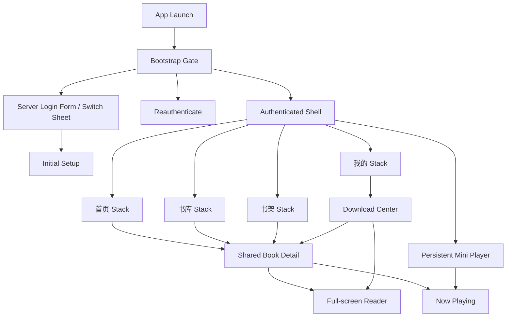
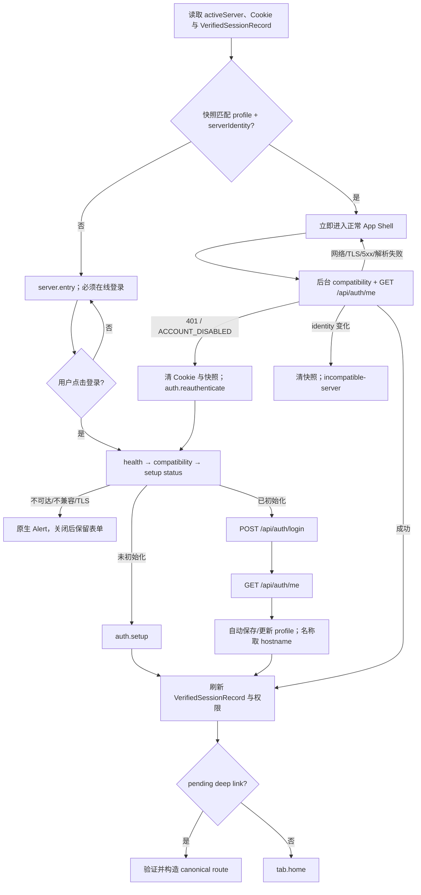
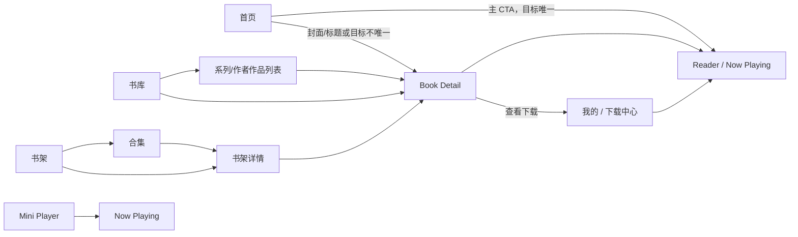

# 移动 App 第二阶段：4 Tab 信息架构与导航规范

> 2026-08-27 书架确认稿：[行式书架目录 v2](mobile-shelves-row-layout.md) 新增顶部搜索与“全部 / 书架 / 合集”筛选，采用左文字右三封面、合集二级成员列表；仅覆盖旧书架构图与搜索限制。

> 2026-08-27 Mobile 导航修订：[图书内容导航契约](mobile-book-content-navigation.md) 决定根节点与下级节点页面：目录推进目录页，可读资源推进独立资源详情；不按资源数量分流、不在原页切换，不修改后端或 Web。

> 状态：已采纳的页面、导航与覆盖层设计基线
> 决策日期：2026-08-11
> 适用范围：从零重建的 `apps/mobile` 及其导航、深链、会话门、Reader、播放器和原生覆盖层
> 上位约束：[`mobile-app-phase-1-web-to-app-functional-baseline.md`](mobile-app-phase-1-web-to-app-functional-baseline.md)
> 下游规范：[`mobile-app-phase-3-user-flows-and-wireframes.md`](mobile-app-phase-3-user-flows-and-wireframes.md)
> 横切实现规范：[`mobile-app-development-global-guidelines.md`](mobile-app-development-global-guidelines.md)

> v1.0.0 会话契约（2026-08-26）：[`ADR 0015`](adr/0015-mobile-v1-verified-session-without-offline-mode.md) 是会话恢复与 GET 失败的唯一真源。首发只有正常 App Shell 与鉴权 Gate，不定义客户端宽限期、第二套 Shell、手动网络模式或 GET 页面缓存回退；完成下载仍通过 Download Center 和正常 Reader 打开。

> ADR 0020 身份与 Book Detail 统一修订（2026-08-26）：[`ADR 0020`](adr/0020-mobile-book-resource-asset-cutover.md) 取代本文全部 `Work / Version / Volume / File` 身份、路由和深链。Mobile 只使用 `Book(bookId) → ReadableResource(resourceId) → ResourceAsset(assetId)`；所有入口共享内容页面实现，各目的地独立保存来源和浏览上下文；目录保留 Web 的数据、排序和分页合同。详情动作及其对象范围直接跟随 Web Work Detail 当前实现与权限过滤，不由 App 单独定义，也不把 `bookDetailManagement` 解释为全局开关。

## 1. 文档目的与优先级

本文件把第一阶段功能基线收敛为可直接指导低保真设计、路由建模和原生实现的 App 信息架构。它定义：

- 四个一级目的地；
- 完整页面树、页面层级和 canonical route；
- 启动、认证、跨 Tab、Reader、播放、下载和 deep link 跳转；
- 页面、Sheet、Menu、Dialog、系统界面的选择规则；
- 多服务器、已验证会话恢复、权限变化和状态恢复边界；
- 导航层公共类型和设计验收矩阵。

优先级从高到低：

1. 明确取代阶段文档的 Accepted ADR 决定当前身份、API、权限与破坏性切换边界；
2. 第一阶段功能基线决定未被 ADR 取代的功能、真实 API、权限和阶段范围；
3. 本文件决定页面归属、层级、跳转和原生表现形态；
4. 后续视觉规范决定布局、样式、组件和动效；
5. 全局开发规范决定系统容器、可主题化原生控件、App 自有业务视觉和许可业务动效的实现与验收边界；
6. Web 菜单、响应式布局和旧移动端遗留实现不构成 App 设计依据。

若本文件需要的能力不被第一阶段真实 API 支持，必须先补契约或明确降级，不能仅凭页面设计开始实现。

## 2. 已锁定的产品决策

| 决策 | 已采纳规则 |
|---|---|
| 一级导航 | `首页 / 书库 / 书架 / 我的` |
| 多服务器 | P0 可保存多个 server profile；无有效会话时直接展示服务器地址、账号、密码表单；登录成功后自动保存 profile，名称取 URL hostname；同时只有一个 active server；非活动服务器不播放、不下载、不后台同步 |
| 书库结构 | 根页用顶部分段控件切换 `全部 / 系列 / 作者`；搜索归书库，不在首页建立第二套搜索 |
| 首页续读 | 目标唯一且可验证时直达 Reader/Now Playing；否则进入作品详情 |
| 冷启动 | 普通冷启动进入首页；只有 OS 短时状态恢复可以直接恢复 Reader |
| 会话恢复 | 存在匹配 `VerifiedSessionRecord` 时先进入正常 Shell，再执行兼容性与 `/me` 验证；暂时网络失败不退出 Shell |
| 明确失效 | `401`、账户停用或服务器 identity 变化时清 Cookie 和会话快照并离开私有 Shell |
| 主动退出 | 清除 Cookie 与已验证会话；下载和其他私有数据仍遵循各自既有清理规则 |
| 连接检查 | 填写、回填和切换服务器时不请求网络；只在点击登录后检查可达性、兼容性、setup status 与 TLS |
| TLS 例外 | 页面不展示证书设置；只有登录连接遇到不受信任的 SSL 证书时，才用平台原生 Alert 询问是否接受风险并连接，接受只绑定当前标准化服务器 identity |
| P1 入口 | 可以在路由规范中预留归属，但交付前不显示占位或“即将推出”入口 |

### 2.1 TLS 决策风险声明

接受不受信任的 SSL 证书会降低服务器身份保障，并可能使登录凭证、会话、元数据和媒体流暴露于中间人攻击。该能力是用户在具体连接失败后作出的显式风险选择，不是服务器页面中的常规设置。

实现必须满足：

- 页面和登录表单不得显示证书验证行、TLS Switch、`systemTrust` 或 `insecureSkipAllValidation` 等技术设置；
- 登录默认始终先使用系统证书验证；
- 只有点击登录且连接遇到不受信任证书时，才显示一个平台原生阻断 Alert；
- Alert 必须说明凭证和阅读数据可能被截获，并使用“取消 / 接受风险并连接”；
- 接受结果只按标准化服务器 identity 生效；新服务器在登录和 `/me` 成功前只能用于本次尝试，禁止全局开关或影响其他 profile；
- 关闭 Alert 后保留当前表单草稿，不创建独立 TLS route；
- 任何日志、分析或错误信息不得记录 Cookie、密码、证书私钥或完整凭证。

## 3. 总体导航模型

App 使用“根状态机 + 四个持久 Stack + 两个全局沉浸层”：



导航不变量：

- 四个 Tab 各自保存 Stack、查询、筛选、滚动和选择状态；切换 Tab 不重置。
- 再次点击当前 Tab：有栈深度时 pop-to-root；已在根页时滚到顶部；不隐式刷新。
- `book.detail`、`reader.session`、`audio.now-playing` 只有一份页面定义。
- 页面实例身份为 `routeKey + entityId`；重复打开相同实例时复用、聚焦或刷新，不重复叠栈。
- Sheet、Menu、Dialog 不进入页面历史，也不能成为 deep link 的直接落点。
- compact 使用底部 Tab；expanded 保留相同四个目的地，自适应为 navigation rail/sidebar 与列表—详情 split view。
- iOS 保留边缘返回；Android 接入系统和预测性返回；核心动作始终有可见按钮。

## 4. 完整页面树

标记：`P0` 为首发；`P1` 为已确认归属但不阻塞首发；`State` 不是独立 route。

```text
L0 AppRoot
├── BootstrapGate                                      [State]
├── server.entry                                       [P0 Full-screen]
│   ├── form-empty / form-restored / form-dirty         [P0 Page State]
│   ├── authenticating / login-invalid                  [P0 Page State]
│   └── switch sheet / delete / connection alerts       [P0 Overlay State]
├── auth.setup(serverId)                               [P0 Full-screen]
└── auth.reauthenticate(serverId)                      [P0 Global Gate]

L1 AuthenticatedShell
├── tab.home                                           [P0 Tab Root]
│   ├── continue-reading                               [Section]
│   ├── recent-reading                                 [Section]
│   ├── recent-added                                   [Section]
│   └── books.collection(kind)                         [P0 Page]
│       kind = recent-reading | recent-added
│
├── tab.library                                        [P0 Tab Root]
│   ├── scope = books | series | authors               [Segmented State]
│   ├── library.search(scope, query)                   [P0 Page]
│   ├── books.facet(kind, facetId)                     [P0 Page]
│   │   kind = series | author
│   └── library.advanced-rules                         [P1 Full-screen]
│
├── tab.shelves                                        [P0 Tab Root]
│   ├── shelves.collection-detail(collectionId)        [P0 Page]
│   └── shelves.detail(shelfId)                        [P0 Page]
│       kind = static | smart
│
└── tab.me                                             [P0 Tab Root]
    ├── account.profile                                [P0 Page]
    ├── account.security                               [P0 Page]
    ├── preferences.language                           [P0 Page]
    ├── downloads.center                               [P0 Page]
    │   └── downloads.detail(downloadId)               [P0 Page]
    ├── downloads.settings                             [P0 Page]
    ├── servers.center                                 [P0 Page; 复用 server.entry 表单与切换 Sheet]
    ├── about.app                                      [P0 Page]
    ├── import.confirm-upload                          [P1 Full-screen]
    ├── kindle.settings                                [P1 Page]
    └── kindle.tasks                                   [P1 Page]

L2–L4 Shared Content and Immersive Routes
├── book.detail(bookId, resourceId?)                   [P0 Shared Page]
├── reader.session(resourceId, location?)              [P0 Full-screen]
│   renderer = reflowable | comic | pdf
└── audio.now-playing(resourceId, assetId?, location?) [P0 Full-screen Cover]

O1 Contextual Presentation
├── Sheet
├── Menu
└── Snackbar / Banner / Inline State

O2 Blocking or System Presentation
├── Dialog
├── Document / Photo Picker
├── Share Sheet
└── System Permission UI
```

## 5. 页面层级与注册表

### 5.1 L0：服务器与认证门

| Route | 目的 | 主要入口 | 返回/完成 |
|---|---|---|---|
| `server.entry` | 直接填写或回填服务器地址、账号、密码；登录下方切换或删除当前服务器 | 无有效登录会话；“我的 → 服务器”管理模式 | Gate 模式下不可返回 Shell；管理模式返回“我的”；成功 `/me` 后自动保存 profile 并进入首页或 pending intent |
| `auth.setup` | 创建首位管理员 | setup status 为未初始化 | 成功建立 Cookie 会话并进入首页 |
| `auth.reauthenticate` | 明确 401 后恢复认证 | 任意受保护页面 | 同一用户成功后恢复合法 intent；不同用户清四栈回首页 |

`server.entry` 内部状态为 `form-empty / form-restored / form-dirty / authenticating / login-invalid / switch-sheet / delete-confirmation / unavailable-alert / incompatible-alert / unsafe-ssl-alert`。它们不是 route，不进入返回历史。填写、回填和 Sheet 选择不做网络检查；只有点击登录进入 `authenticating`。登录及 `/me` 成功后才自动保存或更新 profile，`displayName` 固定取标准化 URL hostname。

`BootstrapGate` 是互斥状态机，不得由零散布尔值控制。至少覆盖：

```text
no-server
checking-server
tls-risk
server-connection-failed
incompatible-server
setup-required
setting-up
setup-failed
signed-out
authenticating
login-failed
account-disabled
authenticated
session-expired
```

### 5.2 L1：首页

`tab.home` 只承担日常续读，不扩张为第二个书库：

- 继续阅读：最多一个最优 resume 主卡；封面/标题进详情，主 CTA 按第 7.2 节直达内容。
- 最近阅读：横向内容区；“查看全部”进入 `books.collection(recent-reading)`。
- 最近入库：横向内容区；“查看全部”进入 `books.collection(recent-added)`。
- 三个区块分别拥有 loading、empty、error、success 状态；一个失败不阻塞其他区块。
- 首页不提供独立搜索状态；以后增加搜索按钮时只能切换到书库并打开 canonical `library.search`。

### 5.3 L1：书库

`tab.library` 顶部分段为：

| Scope | 内容 | 搜索 | 筛选 |
|---|---|---|---|
| `books` | 当前用户可见图书 Grid/List | 搜索图书 | 基础 Filter Sheet；排序/视图 Menu |
| `series` | 系列聚合列表 | 搜索系列 | 不复用作品筛选 |
| `authors` | 作者聚合列表 | 搜索作者 | 不复用作品筛选 |

规则：

- 三个 scope 分别保存 query、scroll position 和加载状态。
- 切换 scope 不重置另外两个 scope。
- `library.search(scope, query)` 是一个共享搜索页面模型，不为三个 scope 建副本。
- 系列/作者点击进入 `books.facet(kind, facetId)`；route 使用稳定 ID，名称只用于显示。
- `books.facet` 返回时恢复聚合列表的 query 和滚动。
- P1 高级规则编辑使用独立全屏页，不压入基础 Filter Sheet。

### 5.4 L1：书架

`tab.shelves` 根页按顺序展示：

1. 合集；
2. 未归集的静态书架与智能书架。

规则：

- `COLLECTION → shelf → book` 是固定层级；合集不能直接显示图书。
- 静态书架允许加入、移除作品。
- 智能书架 P0 只展示规则摘要和计算结果；不能手工增删作品。
- 创建/编辑静态书架和合集使用 Sheet。
- P1 智能书架规则编辑使用全屏页。
- P1 未交付前不出现不可用编辑按钮或“即将推出”。

### 5.5 L1：我的

“我的”固定分组：

| 分组 | 页面/动作 |
|---|---|
| 账户 | 资料、头像、密码、退出登录 |
| 下载与存储 | 下载中心、下载设置、空间与网络策略 |
| 服务器 | 当前服务器登录表单、切换已保存服务器、删除当前服务器、Web 管理入口 |
| 偏好 | 语言 |
| 产品 | 关于、App 版本、服务器版本 |
| P1 | 手工导入、Kindle 设置与发送队列；交付前整组隐藏 |

Web 管理只在 `canManageSystem` 或 `isAdmin` 时显示，使用系统浏览器打开当前服务器地址，不建立 App 内管理 Stack。

### 5.6 共享详情与沉浸层

| Route | 层级 | 规则 |
|---|---|---|
| `book.detail` | L2/L3 | 解析 Book 绑定节点后显示目录或资源详情；子节点原生推进，逐层返回并恢复各目的地上下文，不创建 Version 身份 |
| `reader.session` | L4 | 隐藏 Tab 与 mini player；资源内 TOC、页码/位置使用 replace/update，不堆返回历史 |
| `audio.now-playing` | L4 Cover | 播放状态独立于页面；关闭后回到精确来源；退出时仍在播放才创建 mini player，暂停退出不显示；已显示的 mini player 内暂停后保留恢复入口 |
| `downloads.detail` | L2/L3 | 展示一个持久下载任务的状态、错误和恢复动作；不使用临时 Sheet 代替 |

## 6. 启动与认证恢复

### 6.1 固定启动顺序



### 6.2 已验证会话快照

每次 `/api/auth/me` 成功后写入不带有效期的记录：

```text
profileId + serverIdentity
profile + user identity + authorization
lastValidatedAt
```

该记录只用于立即恢复正常 Shell、权限显隐和下载 namespace，不创建新的授权期限。无记录时断网不能进入私有 Shell。明确失效时清除记录；暂时网络错误只让对应网络页面显示局部加载失败。首发没有 Offline Shell、模式切换、剩余天数或缓存服务器页面。

## 7. Tab、内容与跨层跳转

### 7.1 主要任务流



### 7.2 首页继续阅读

- 唯一且可验证的电子书、漫画或 PDF `ReadableResource`：用 `resourceId` 打开 `reader.session`。
- 唯一且可验证的音频 `ReadableResource`：用 `resourceId` 打开 `audio.now-playing`；需要精确媒体目标时附带 `assetId`。
- 多个资源、不完整 bootstrap、失效的最近 `resourceId` 或无法唯一决定目标：进入 `book.detail(bookId, resourceId?)`，仅在存在合法最近记录时预选 `resourceId`。
- 封面和标题永远进入 `book.detail`；只有明确标注的“继续阅读/继续收听”CTA 直达内容。

### 7.3 图书、作者和系列

- 任意图书卡进入共享 `book.detail(bookId)`，携带 origin context。
- 从 Book Detail 点击作者/系列时，在当前 Stack 压入共享 `books.facet`；返回仍回详情，不强制切换 Tab。
- 单个 `ReadableResource` 自动选中并显示资源详情，但不自动进入 Reader；多个资源显示服务端真实内容目录，不使用客户端推断的 Version 或 Volume 轨道。
- 内容目录保留真实来源节点、面包屑、文件夹、可读资源、分页、网格/列表切换以及 Web 相同的六种排序；进入深层目录和返回后恢复目录上下文。
- 资源详情按 `readerType` 显示章节及已读状态、漫画/PDF 页面预览或音轨信息，并覆盖加载、空、导入中、导入失败和分页错误状态。
- 图书入口按服务端绑定节点类型解析，不按最近记录或第一个资源选择页面；明确的继续阅读入口仍使用其合法 resourceId。

### 7.4 下载

- Book Detail 发起下载后停留原页，并显示排队/进行/完成状态。
- “查看下载”切换到 `tab.me → downloads.center`；不把原 Tab 加入返回历史。
- 通知打开完成任务时进入对应 `book.detail(bookId, resourceId)`；失败任务进入 `downloads.detail`。
- 下载中心打开已下载内容时呈现 Reader；关闭 Reader 回下载中心。
- “离线下载”和“导出原文件”是不同意图；P1 导出使用系统 Share Sheet。

### 7.5 Reader 与音频

- Reader 打开时隐藏 Tab 和 mini player，但后台音频可以继续，由系统媒体控制。
- Reader 返回先完成本地 progress 事务；成功后立即退出，网络 flush 不阻塞。
- 只有本地持久化失败时才阻断退出，并给出重试或明确放弃本次本地变更的选择。
- Compact 下由应用自有的统一底部容器共同承载 mini player 与四项 Tab 控件；两者共享一个连续 Surface，系统 TabBar/NavigationBar 不参与渲染。Expanded 下继续使用 Rail/Drawer，mini player 固定在内容底部或 Rail 邻近区域；点击 mini player 打开 Now Playing。
- Now Playing 返回或下滑只折叠，不暂停播放。
- “查看图书”先折叠 Now Playing，再在当前 Stack 复用或压入 `book.detail`。
- 切换音频 `ReadableResource` 替换当前队列；资源内切换 `ResourceAsset` 或 locator 只更新播放状态，不增加页面历史。

## 8. 多服务器与切换

未登录 `server.entry` 与登录后 `servers.center` 共享同一登录表单和切换 Sheet 模型；后者是从“我的”压入的全屏页面并保留 Shell 导航。两者都不建立服务器详情、独立添加或独立编辑子页面。用户输入新地址并登录成功即创建 profile；登录失败不保存。`displayName` 由标准化 URL hostname 自动生成，密码只存入平台安全凭证存储，不进入普通 profile。每个 profile 至少保存：

```text
id
displayName
baseUrl
serverIdentity
isActive
tlsMode
```

切换规则：

1. 关闭 Reader；
2. 折叠并停止旧服务器音频；
3. 暂停旧服务器下载；
4. 检查 progress/bookmark outbox；
5. Sheet 选择目标 profile 只回填登录表单，不执行以上副作用；
6. 用户点击登录且凭证验证成功后，无待同步数据时激活目标；
7. 有待同步数据时用 Dialog 提供“同步后切换 / 隔离后切换 / 取消”；
8. 激活目标 profile 并重建 `serverIdentity + userId + authzVersion` namespace；
9. 不恢复旧服务器的四个 Stack，进入新服务器首页。

删除服务器必须说明会移除当前 profile 的会话、下载和缓存；待同步 outbox 只有在用户明确理解后果时才允许删除。删除完成后清空服务器地址、账号和密码，不自动选择其他 profile。

## 9. Deep Link 与状态恢复

### 9.1 类型化 Navigation Intent

App 只接受：

```text
home
library(scope?, query?, filters?)
book(bookId, resourceId?)
reader(resourceId, location?)
audio(resourceId, assetId?, location?)
shelf(shelfId)
downloads(downloadId?)
```

处理顺序：

```text
解析并验证未知输入
→ 匹配 serverIdentity
→ server/setup/session gate
→ GET /me
→ 权限与资源验证
→ 构造 canonical underlay
→ 跳转目标
```

约束：

- ID、枚举、位置和 filters 必须边界验证；显示名称不作为 route identity。
- 禁止在 deep link 中携带 Cookie、token、密码、任意文件路径或 callback URL。
- Book/Reader/Audio 冷启动默认以 Library 根为 underlay。
- App 已运行时 deep link 以全局 intent 呈现；关闭后回原现场。
- `/listen` 只可映射成 `audio` intent，不建立页面。
- 旧 `work(workId, ...)`、`versionId`、`volumeId`、`fileId`、`chapterId`，以及 Reader v1/v2、edition、OPDS、external-source、notes 和 Web 管理路径一律拒绝并进入安全错误页；不得按值复用、猜测或映射到新身份。

### 9.2 恢复规则

允许恢复：

- active server；
- selected Tab；
- 四个稳定 Stack 中仍合法的 route intent；
- 列表 query、filter、scroll anchor；
- 有效 Reader intent，仅用于 OS 短时状态恢复；
- mini player 的播放会话。

不恢复：

- Menu、Sheet、Dialog；
- 删除、退出、不安全 SSL 接受确认；
- Document/Photo Picker 或 Share Sheet；
- 登录和敏感表单输入；
- 普通冷启动时的 Reader 全屏页面。

Deep link 优先于已保存 route；普通冷启动无 deep link 时进入首页并显示继续阅读。

## 10. 权限与失败导航

| 事件 | 导航规则 |
|---|---|
| `401` | 清除当前 Cookie 与已验证会话快照，进入全屏 reauthenticate |
| `403` 动作失败 | 留在当前页，刷新 `/me`；能力已撤销时回最近合法页面 |
| `404` | 统一“内容不存在或当前不可访问”；提供返回和所属 Tab 根，不泄露存在性 |
| `authzVersion` 变化 | 遮蔽旧 UI、暂停媒体、切 namespace、逐页重验；不可访问走统一 404 |
| 网络、超时、TLS、`5xx` 或协议解析失败 | 已恢复会话保留普通 Shell；请求页面各自显示局部可恢复错误 |
| `CONTENT_FINGERPRINT_MISMATCH` | 阻止旧进度写入；Dialog 只允许重新加载新版本或退出 Reader |
| P1 能力未交付 | 完全隐藏入口，不显示 disabled/coming soon |
| Web-only 能力 | 不创建 App route；有权用户只看到“在 Web 管理”外部链接 |

同一错误只由最近的业务层级呈现一次，禁止 Banner、Snackbar、Dialog 重复报错。

## 11. Page、Sheet、Menu、Dialog 选择规则

```text
可 deep link、长期状态、多步骤、分页 → Stack / Full-screen Page
有界选择、短表单、辅助面板 → Sheet
2–7 个即时命令或简单单选 → Menu
不可逆动作或必须阻断的冲突 → Dialog
文件、照片、分享、系统权限 → System UI
普通成功、撤销、可恢复错误 → Snackbar / Banner / Inline
```

### 11.1 通用覆盖层约束

- 同时最多存在一个 App 自有 modal。
- 禁止 Sheet → Sheet、Dialog → Sheet、Menu 保持展开后再开其他覆盖层。
- Menu 触发 Page、Sheet、Dialog 前先关闭自身。
- Sheet 子步骤在同一 modal navigation stack 内推进。
- Sheet 内只允许为放弃脏数据或确认破坏动作临时叠一个 Dialog。
- Deep link 不能直接打开 Sheet、Menu 或 Dialog。
- Android 返回顺序：Menu → Sheet 内子页 → Sheet → Full-screen presentation → 当前 Stack。
- iOS 边缘返回保留；Reader、Now Playing 和 full-screen Sheet 仍提供可见关闭/返回按钮。
- 无脏数据时 Sheet 下滑/系统返回等同取消；有脏数据时确认放弃。
- `完成` 用于即时生效设置，`应用` 用于筛选草稿，`保存` 用于持久表单。

### 11.2 Sheet 注册表

| Sheet | 内容与提交规则 |
|---|---|
| `library.filter` | 仅 books scope；草稿模式；应用提交；清除全部重置；取消丢弃草稿 |
| `reading-status` | 阅读状态单选；成功后 Snackbar 提供撤销 |
| `shelf-picker` | 多选静态书架；智能书架/合集显示不可选原因；统一保存 |
| `shelf-create-edit` | 创建/编辑静态书架或合集；键盘/动态字体不足时升全高 |
| `reader-navigation` | 目录与书签 segmented control；不得出现笔记；选择后关闭并跳转 |
| `reader-settings` | 外观、翻页、方向即时预览并本地保存；关闭使用“完成” |
| `audio-chapters-queue` | 章节与队列；选章后保持 Sheet，便于连续浏览 |
| `audio-sleep-timer` | 关闭、固定时长、章节结束、自定义时间均在同一 Sheet |
| `kindle-send` | P1；确认个人目标与发送内容；未配置时关闭后进入设置页 |

`shelf-picker` 内创建新书架时，推入同一 Sheet 的内部子页；保存后返回列表并自动选中，禁止再开第二个 Sheet。

### 11.3 Menu 注册表

| Menu | 允许动作 |
|---|---|
| `library-sort` | 当前项带选中状态；点击立即生效 |
| `library-view` | Grid/List 单选；点击立即生效 |
| `book-overflow` | 阅读状态、加入书架、离线下载；目录、资源和图书管理动作严格复用 Web Work Detail 当前对象范围与权限过滤，未授权动作不渲染；P1 Kindle/导出入口 |
| `shelf-overflow` | 编辑、删除入口；删除必须转 Dialog |
| `download-overflow` | 暂停、继续、重试、移除本地副本入口 |
| `audio-speed` | 有限倍速预设；自定义倍速以后使用 Sheet |
| `reader-more` | 不属于主工具栏的即时动作；核心阅读导航不得只藏在这里 |

Menu 禁止承载表单、错误说明、权限教育和长列表。

### 11.4 Dialog 注册表

Dialog 仅用于：

- `logout`；
- `shelf-delete`；
- `download-remove` 与批量移除；
- `server-switch-unsynced`；
- `server-remove`；
- `discard-dirty-form`；
- P1 `upload-cancel`；
- `cellular-download-once`；
- `reader-content-changed`；
- `collection-not-empty`；
- `server-unavailable-on-intent`；
- `server-incompatible-on-intent`；
- `tls-insecure-connection-confirmation`。

规则：

- 动作按钮必须描述对象和结果，例如“删除书架”“移除 3 个下载”“接受风险并连接”，禁止只写“确定”。
- 普通页面数据网络错误、空状态、普通 403/404、表单 422 和成功反馈不使用 Dialog；`server.entry` 登录意图产生的不可达、不兼容和不安全 SSL 是明确例外，使用平台 Alert 后回到保留的表单。
- `reader-content-changed` 只提供“重新加载新版本”和“退出阅读”，禁止强制覆盖服务器进度。
- 从静态书架移除作品直接执行并提供 Snackbar 撤销，不弹确认。
- 普通下载失败使用行内重试；空间不足提供“管理下载”。
- 集合非空 `409` 提供“管理集合”和“取消”，不得伪装删除成功。

### 11.5 系统界面

- P1 文件导入：Document Picker / Share Extension；选完文件后进入全屏确认上传页。
- 头像：系统 Photo/Document Picker。
- P1 原文件导出：系统 Share Sheet。
- Web 管理：系统浏览器或安全浏览器界面，打开前显示目标服务器域名。
- 系统权限：在实际触发相关能力时请求，不在首次启动批量索权。

## 12. P1 页面归属

P1 不新增一级目的地：

| 能力 | 归属 | 规则 |
|---|---|---|
| 高级动态规则 | 书库 Stack 全屏页 | 从 Filter Sheet 或智能书架编辑进入；交付前入口隐藏 |
| 手工导入 | “我的”或系统 Share Extension → 全屏确认上传 | `canManageSystem` 才显示；当前只承诺前台 multipart 上传 |
| Kindle 设置/队列 | “我的” | 发送入口在作品 Menu，配置/队列为持久页面 |
| 原文件导出 | 作品动作 → 系统 Share Sheet | 与受管离线下载严格区分 |
| 批量加入书架 | 书库选择模式 | 原生选择模式和底部操作栏，不创建独立 route |

P2 和 Web-only 能力在阶段提升前不进入页面树。

## 13. 公共导航模型

实现时冻结以下稳定边界，所有外部输入先以 `unknown` 验证再映射：

```text
TabId = home | library | shelves | me

LibraryScope = books | series | authors

AppRoute =
  server | auth | home | library | shelf | account |
  downloads | book | reader | audio

NavigationIntent =
  home |
  library(scope?, query?, filters?) |
  book(bookId, resourceId?) |
  reader(resourceId, location?) |
  audio(resourceId, assetId?, location?) |
  shelf(shelfId) |
  downloads(downloadId?)

ServerProfile =
  id + displayName + baseUrl + serverIdentity +
  isActive + tlsMode

TlsMode =
  systemTrust |
  insecureSkipAllValidation

VerifiedSessionRecord =
  profileId + serverIdentity + userId +
  authorizationSnapshot + authorizationVersion +
  lastValidatedAt
```

`tlsMode` 是网络层内部持久化边界，不是用户可见设置。页面和登录表单不得显示其名称、当前值或 Switch。若实现仍使用 `insecureSkipAllValidation`，必须使用完整、显式的内部名称，禁止缩写为 `allowTls`、`trustServer` 等会掩盖风险的布尔值。

## 14. 平台适配与无障碍

- 所有可见组件必须在设计交付和实现前按全局开发规范归入 A/System-owned、B/Native-themed、C/App-owned 或 D/Approved-motion；覆盖层外壳和返回行为始终属于平台。
- iOS 使用 NavigationStack、系统 Sheet detents、Menu、Alert/confirmation dialog、系统文件和照片选择器。
- Android 使用导航目的地、Modal Bottom Sheet、Overflow Menu、AlertDialog、Document Picker 与预测性返回。
- iPad/expanded 可把 Sheet 自适应为 form sheet、popover 或侧面板，但任务、提交和取消语义不变。
- iOS 触摸目标至少 44pt；Android 至少 48dp。
- modal 打开时焦点进入标题，关闭后回到触发控件。
- Sheet 拖拽柄、滑动、边缘返回均不能成为唯一操作方式。
- 动态字体导致内容不足时 Sheet 自动升为 full-height，不截断提交按钮。
- VoiceOver/TalkBack 必须读出标题、选择状态、结果数量、下载状态、同步状态和错误。
- segmented control、多选、scrubber、漫画缩放和 Snackbar 撤销必须提供辅助技术可操作的替代动作。
- 支持 reduced motion；转场不能成为理解状态的必要条件。
- 所有可见文案在 `zh-CN` 和 `en-US` 中具有等价语义；危险级别不能因翻译被弱化。
- 系统控件密集页面必须分别提供 iOS/Android 参考，不得用一张平台无关设计稿冻结系统组件的圆角、阴影、几何和动效。

## 15. 设计与实现验收矩阵

### 15.1 导航

- 四个 Tab 独立保存 Stack、筛选、搜索和滚动。
- 重按 Tab 的 pop-to-root/scroll-to-top 行为符合规范。
- compact 底栏与 expanded rail/split view 信息架构等价。
- Book Detail、Reader、Now Playing 和 Facet 没有来源专用重复页面。
- Android/iOS 返回行为、modal 关闭顺序和来源恢复一致。
- 普通冷启动回首页；OS 短时恢复 Reader；deep link 优先于保存的 route。

### 15.2 服务器、认证与权限

- 多服务器添加、编辑、切换和删除不串用 namespace。
- 非 active server 不执行播放、下载或同步。
- 无有效会话时 `server.entry` 直接显示地址、账号、密码；鉴权过期时回填最近成功 profile 与安全存储中可用的凭证。
- 登录是唯一主动作；下方左侧切换服务器打开原生 Sheet，右侧删除当前 profile 并在确认后清空表单。
- 新服务器只在登录和 `/me` 成功后自动保存，名称取标准化 URL hostname；失败草稿不覆盖最后成功 profile。
- 填写、回填和 Sheet 选择不做网络检查，也不展示在线、兼容性或证书状态。
- 不安全 SSL 只在点击登录且证书验证失败时用一个平台原生 Alert 提示，接受只作用于明确服务器 identity。
- `/me` 成功刷新不带有效期的 `VerifiedSessionRecord`；冷启动先恢复普通 Shell，再后台验证。
- 明确 401、账户停用或服务器 identity 变化会清除 Cookie 与会话快照；暂时网络失败不会退出 Shell。
- `authzVersion` 变化后旧内容立即遮蔽并逐页重验。
- 403/404 保持防枚举，不泄露资源存在性。

### 15.3 阅读、音频与下载

- 首页续读在目标唯一时直达，不唯一时回退详情。
- Reader 返回等待本地事务但不等待网络。
- mini player、Now Playing、锁屏音频和跨 Tab 播放不被导航销毁。
- 下载中心是持久页面，下载错误、暂停、恢复和空间状态不依赖临时 Sheet。
- Publication fingerprint 仅作诊断；同一 `bookId + resourceId` 的进度不得因 Asset、解析器或 fingerprint 变化而创建新槽、拒绝写入或阻止恢复。
- 离线下载和原文件导出使用不同动作与文案。

### 15.4 覆盖层与状态

- 同时最多一个 App modal；无 Sheet 套 Sheet。
- Menu/Sheet/Dialog 选择符合注册表。
- loading、empty、error、permission、success、conflict 各有且只有一个主要呈现层。
- 表单 422 贴近字段；普通成功使用 Snackbar/播报；可恢复错误保留输入。
- 动态字体、VoiceOver/TalkBack、reduced motion、`zh-CN`、`en-US` 均完成验收。
- P1 未交付前无占位入口；排除和 Web-only 能力没有 App route。

本规范完成后，移动端下一设计阶段应从四个 Tab 根页面和三个核心任务流开始低保真设计：续读、发现并开始阅读、下载并从本地工件打开。
