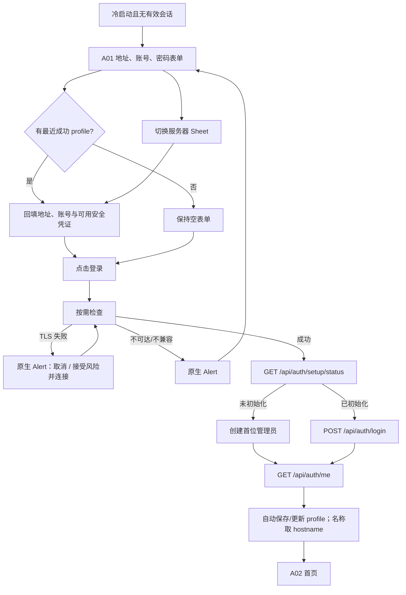
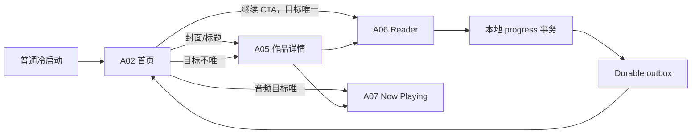
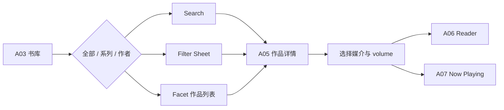
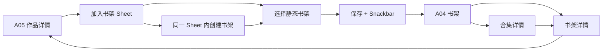
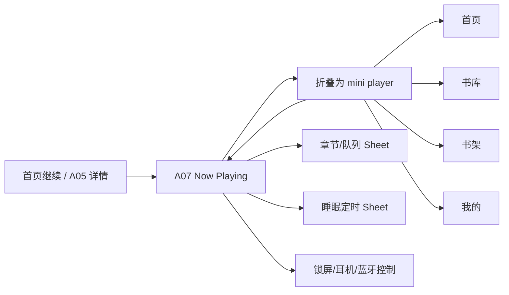
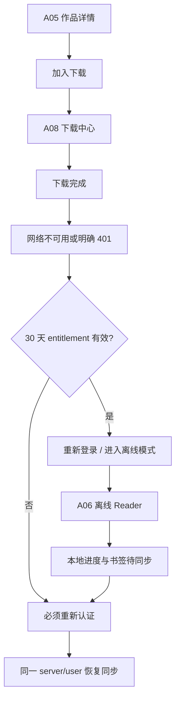
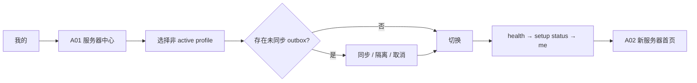

# 移动 App 第三阶段：关键 User Flow 与 8 个 Wireframe 视觉锚点

> 状态：已采纳的低保真任务流与屏幕结构基线
> 决策日期：2026-08-11
> 适用范围：`apps/mobile` 的任务流、低保真原型、页面内容分区、交互优先级和关键状态
> 上位约束：[`mobile-app-phase-1-web-to-app-functional-baseline.md`](mobile-app-phase-1-web-to-app-functional-baseline.md) 与 [`mobile-app-phase-2-information-architecture.md`](mobile-app-phase-2-information-architecture.md)
> 下游视觉约束：[`mobile-app-phase-4-visual-master.md`](mobile-app-phase-4-visual-master.md)
> 横切实现规范：[`mobile-app-development-global-guidelines.md`](mobile-app-development-global-guidelines.md)

## 1. 文档目的

本文件不定义最终品牌视觉、颜色、字体、圆角、阴影或动效风格。它固定低保真阶段必须保持稳定的产品结构：

- 用户从哪里进入、完成什么任务、如何返回；
- 哪些页面是跨流程的视觉锚点；
- 每个锚点的内容顺序、主要动作、次要动作与状态位置；
- compact 与 expanded 如何保持同一信息架构；
- 哪些 Sheet、Menu、Dialog 会从锚点触发；
- 哪些真实 API、权限和本地状态支撑屏幕；
- 进入高保真设计和可交互原型前必须验证什么。

后续视觉设计可以改变表现方式，但不得改变本文件定义的任务优先级、页面职责、动作显著性和失败恢复路径。若需要改变，必须先修订本文件和第二阶段 IA。

## 2. 线框基准与交付格式

### 2.1 参考尺寸

| 模式 | 参考画板 | 用途 |
|---|---|---|
| Compact iOS | 390 × 844 pt | 主要手机线框基准 |
| Compact Android | 412 × 915 dp | 验证 Android 系统栏、返回与较宽手机 |
| Expanded | 834 × 1194 pt | 验证 tablet、navigation rail 和 split view |

尺寸只用于检查信息容量，不是固定设备白名单。所有内容必须适配安全区、横竖屏、系统文字缩放和平台系统栏。

### 2.2 低保真层级

每张锚点线框必须按以下顺序标注区域：

1. 系统/安全区；
2. 导航与页面身份；
3. 任务上下文；
4. 主内容；
5. 主动作；
6. 次动作或状态；
7. mini player；
8. Tab bar 或沉浸层关闭方式。

线框中使用真实产品字段名，例如 `work.title`、`volume.format`、`download.progress`，不编造演示书名、用户数据或未存在的功能。

### 2.3 线框状态最小集合

每个锚点至少交付：

- default；
- loading；
- empty（适用时）；
- recoverable error；
- offline/stale；
- permission/content unavailable（适用时）；
- success/active；
- large text；
- expanded。

Reader、下载和服务器锚点还必须覆盖 conflict、interrupted 与 resume。

## 3. 8 个视觉锚点

| ID | 锚点 | Canonical route | 选择原因 |
|---|---|---|---|
| A01 | 服务器入口与中心 | `server.entry` / `servers.center` | 自托管产品的真实第一入口，也决定多服务器、安全和缓存边界 |
| A02 | 首页 | `tab.home` | 日常续读的最高频起点 |
| A03 | 书库 | `tab.library` | 搜索、筛选、系列和作者的唯一发现入口 |
| A04 | 书架 | `tab.shelves` | 个人组织与静态/智能/合集语义的承载页 |
| A05 | 作品详情 | `work.detail` | 媒介、卷册、阅读状态、下载和开始/继续动作的决策中心 |
| A06 | Reader | `reader.session` | EPUB/漫画/PDF 的沉浸消费与进度同步中心 |
| A07 | Now Playing | `audio.now-playing` | 后台音频、章节、系统媒体和跨 Tab 持续播放中心 |
| A08 | 下载中心 | `downloads.center` | 受管离线、空间、失败恢复和 401 宽限的可见中心 |

未选为视觉锚点不等于没有页面。初始化、重新认证、“我的”根页、搜索结果、Facet 列表和账户页在第 13 节定义支持性线框要求；普通登录就是 A01 的默认内容，不再是独立页面或先选服务器后的展开状态。

## 4. 关键 User Flow 总览

| Flow | 用户目标 | 起点 | 成功终点 | 主要锚点 |
|---|---|---|---|---|
| F01 | 连接自托管服务器并进入 App | 冷启动 | 首页 | A01、A02 |
| F02 | 继续上次阅读 | 首页 | Reader 并产生本地进度 | A02、A06 |
| F03 | 发现内容并开始阅读 | 书库 | Reader/Now Playing | A03、A05、A06/A07 |
| F04 | 创建/使用个人书架 | 作品详情或书架 | 书架详情中的作品 | A05、A04 |
| F05 | 连续收听有声书 | 首页/详情/mini player | 后台持续播放 | A02/A05、A07 |
| F06 | 下载并在离线/401 后继续使用 | 作品详情 | 离线 Reader + 待同步状态 | A05、A08、A06 |
| F07 | 切换服务器且不混淆数据 | 我的/服务器中心 | 新服务器首页 | A01、A02 |
| F08 | 从内容变化或权限变化中安全恢复 | Reader/详情 | 新内容、合法页面或所属 Tab 根 | A05、A06、A08 |

## 5. F01：首次连接、初始化与登录



### 5.1 Happy path

1. 无有效登录会话时，A01 首屏直接显示服务器地址、账号、密码；首次使用保持为空，鉴权过期时回填最近成功 profile 与安全存储中可用的凭证。
2. 用户可直接输入新地址，也可点击登录下方左侧“切换服务器”，从平台原生 Sheet 选择其他 profile 并自动回填。
3. Sheet 选择只填表，不发起请求；页面不提前显示可达性、兼容性或证书状态。
4. “登录”是唯一主动作；点击后才执行 `/api/health`、兼容性和 setup status 检查。
5. 未初始化进入 setup；已初始化提交当前账号与密码。
6. 成功会话保存 Cookie，随后必须请求 `/me`。
7. `/me` 成功后自动保存或更新 profile，`displayName` 取标准化 URL hostname，并保存 `serverIdentity + userId + authzVersion` namespace 与 30 天 offline entitlement。
8. 进入 A02 首页，不恢复旧服务器页面。

### 5.2 分支与失败

| 情况 | 呈现 | 下一动作 |
|---|---|---|
| 地址格式错误 | 字段内错误 | 修正地址 |
| 服务不可达 | 点击登录后平台原生 Alert | 取消、修正地址、重试 |
| 服务不兼容 | 点击登录后平台原生 Alert | 取消、修正地址；不得忽略或强制连接 |
| TLS 不受信任 | 点击登录后的单个原生 Alert | 取消；或接受风险并连接；页面不显示证书设置 |
| 登录 401 | 默认登录表单字段错误，不清地址和账号 | 重试 |
| setup 409 | 重新请求 setup status，回 A01 并回填服务器与账号 | 登录 |
| 账户停用 | 全屏账户不可用状态 | 切换服务器或联系管理员 |
| 网络中断 | 保留表单和 profile 草稿 | 重试 |

### 5.3 完成条件

- active profile 唯一；
- Cookie 持久化成功；
- `/me` 成功并建立 namespace；
- entitlement 起始时间写入；
- 首页只加载当前授权范围数据。

## 6. F02：日常续读



规则：

- 普通冷启动不自动弹 Reader；A02 的继续卡承担恢复入口。
- CTA 目标唯一才直达；多媒介、多卷、bootstrap/fingerprint 失效进入 A05。
- A06 返回先完成本地事务，不等待网络 flush。
- 首页重新获得焦点时只更新受影响的继续/最近阅读区块，不重载整页。
- 同一 volume 的重复点击复用正在存在的 Reader session。

失败恢复：

- bootstrap 网络失败且已有完整离线副本：使用本地快照并标记离线。
- bootstrap 网络失败且无副本：回 A05，显示可恢复错误。
- 本地进度写失败：阻断离开 Reader，提供重试或明确放弃本次本地变更。
- fingerprint 冲突：进入 F08，不写入旧位置。

## 7. F03：发现、筛选并开始阅读



### 7.1 全部 scope

- 原生搜索进入 canonical `library.search(works)`。
- Filter Sheet 只影响 works；草稿在“应用”后生效。
- 排序和 Grid/List 使用 Menu，点击立即生效。
- active filters 在结果区上方以可移除条件摘要呈现，不把完整筛选器常驻页面。
- 结果使用服务端分页；滚动位置按 scope 保存。

### 7.2 系列/作者 scope

- 使用同一 A03 外壳切换 scope。
- 搜索只查当前 grouping kind，不复用作品筛选。
- grouping 点击进入 `works.facet(kind, id)`。
- 返回恢复 grouping query 和 scroll anchor。

### 7.3 作品决策

- A05 默认选中最近使用媒介，否则选择服务端稳定排序第一项。
- 主 CTA 对应当前选中 volume；卷列表每一项也有明确打开动作。
- EBOOK/COMIC/PDF 进入 A06；AUDIOBOOK 进入 A07。
- 下载、加入书架和阅读状态不能竞争主 CTA 的视觉等级。

## 8. F04：个人书架组织



规则：

- 只有静态书架可在 picker 中选择。
- 智能书架和合集可以展示，但必须说明不可直接加入的原因。
- 创建新静态书架在同一 Sheet 内推进，保存后返回并自动选中。
- 保存后留在 A05，Snackbar 提供“查看书架”；不强制切 Tab。
- 从静态书架移除作品直接执行并提供撤销，不弹 Dialog。
- 合集始终遵守 `collection → shelf → work`。

## 9. F05：有声书持续播放



规则：

- 首次播放成功后立即建立系统音频会话和 mini player。
- 折叠 Now Playing 不暂停；切 Tab 不销毁播放状态。
- 章节 Sheet 选章后保持展开，便于连续浏览。
- 倍速使用 Menu；睡眠定时使用 Sheet。
- 锁屏、耳机和蓝牙动作与 A07 状态双向同步。
- 续流 401 暂停播放并进入 F06 的重新认证/离线判断，不能假装继续播放。
- 音频进度同样进入 durable outbox，UI 不依赖网络成功后才更新。

## 10. F06：下载、离线与 401 宽限



### 10.1 下载

- A05 的下载动作是次级明确动作，不与开始/继续 CTA 合并。
- 入队后停留 A05，并提供“查看下载”。
- A08 显示进行中、已完成、失败三个稳定分组。
- 普通失败行内重试；空间不足引导管理下载。
- 移除离线副本使用 Dialog，并明确不会删除服务器作品。

### 10.2 离线

- 服务不可达但 entitlement 有效时直接进入 Offline Shell。
- 明确 401 时先显示重新认证页；用户可选择进入离线模式。
- 离线模式不要求设备 PIN/生物识别。
- 只展示完整可打开的下载，不展示不可用在线作品占位。
- 顶部持续显示离线状态、剩余宽限期和待同步数量。
- 30 天从最近一次成功 `/me` 计算，本地使用不能延长；时间异常回拨视为到期。

### 10.3 恢复联网

- 同一 server/user 登录成功后恢复 outbox；不同用户不能看到或消费旧队列。
- `authzVersion` 改变后先切换 namespace，再逐个验证下载授权。
- 不再可访问的内容立即锁定并从可读列表移除。
- 主动退出登录立即终止 entitlement、删除可读缓存并隔离 outbox。

## 11. F07：多服务器切换



切换前必须：

- 退出 Reader；
- 停止旧服务器音频；
- 暂停旧服务器下载；
- 检查 progress/bookmark outbox。

切换后：

- 不恢复旧服务器 Tab Stack；
- 新建 `serverIdentity + userId + authzVersion` namespace；
- 非 active profile 保留自己的隔离数据，但不执行后台任务；
- 失败时回 A01，并保持旧 profile 为 active，不能落入半切换状态。

## 12. F08：内容变化、撤权与安全恢复

| 触发 | 当前页面 | 呈现 | 安全出口 |
|---|---|---|---|
| `CONTENT_FINGERPRINT_MISMATCH` | A06 | 阻塞 Dialog | 重新加载新版本；退出 Reader |
| 作品/volume 404 | A05/A06 | “内容不存在或当前不可访问” | 返回；所属 Tab 根 |
| `authzVersion` 改变 | 任意私有页 | 遮蔽旧 UI，刷新权限 | 仍合法则恢复；否则统一 404 |
| 下载授权失效 | A08 | 锁定并移出可读分组 | 重新认证；移除本地副本 |
| 本地进度持久化失败 | A06 | 阻断离开 | 重试；明确放弃本次本地变更 |
| 书签同步失败 | A06 | 内联“待同步/失败” | 重试；继续本地阅读 |
| 服务器不可用 | 在线页面 | Banner/inline | 重试；进入已下载内容 |

禁止提供“强制覆盖服务器进度”或通过错误文案泄露资源是否真实存在。

## 13. 支持性页面线框要求

这些页面不占 8 个锚点名额，但必须与锚点一起进入原型：

| 页面 | 最小结构 |
|---|---|
| 服务器入口表单 | A01 默认显示地址、账号、密码；登录是主动作；切换 Sheet 与删除当前服务器位于其下；登录时才检查 |
| Setup | 服务器身份摘要、首位管理员字段、创建动作、字段错误、网络恢复 |
| 普通 Login | A01 默认内容；地址、账号、密码、登录动作、切换/删除与 setup required 分支 |
| Reauthenticate | 会话失效说明、登录动作；entitlement 有效时显示离线入口与剩余天数 |
| 我的根页 | 账户、离线与存储、服务器、偏好、产品分组；P1 整组未交付时隐藏 |
| 搜索 | 当前 scope、输入、结果、清除、无结果、错误；返回恢复 scope |
| Facet 作品列表 | 系列/作者身份、作品列表、分页、返回 grouping context |
| 书架/合集详情 | 身份、规则/成员摘要、作品或书架内容、overflow、空状态 |
| 下载详情 | 任务阶段、文件/volume、已传输、速度/剩余时间、失败原因、恢复动作 |

## 14. A01：服务器入口与中心 Wireframe 规格

### 14.1 锚点状态

主锚点使用“最近成功 profile 已回填”的未登录/鉴权过期 Gate 状态；另交付首次使用或删除后的空表单、切换服务器 Sheet、删除确认、401 字段错误、不可达、不兼容和不安全 SSL 变体。管理模式复用同一表单与 Sheet，但增加系统返回与 Shell 导航。

### 14.2 Compact 内容顺序

| 区域 | 内容 |
|---|---|
| Navigation | 品牌标题“登录二毛图书”与说明“连接你的私人书库”；Gate 模式无返回，管理模式显示系统返回 |
| Login form | 服务器地址、账号、密码；上次成功 profile 可自动回填，首次使用为空 |
| Primary action | 全宽“登录”，是页面唯一强层级动作 |
| Secondary actions | 主按钮下方左“切换服务器”、右“删除当前服务器”；切换打开平台 Sheet，删除使用 destructive 文本语义 |
| Footer | 凭证安全保存说明；正常时不显示连接、兼容性或 TLS 状态 |

### 14.3 交互

- 用户输入未保存地址后直接登录；只有登录和 `/me` 成功才自动创建 profile，名称取 URL hostname。
- 点击“切换服务器”打开平台原生 Sheet；选择其他 profile 后关闭 Sheet 并回填表单，不自动登录。
- 点击“删除当前服务器”进入平台确认；完成后清空地址、账号和密码，不自动选择另一 profile。
- 填写、回填和 Sheet 选择不发起检查，也不显示在线、离线、不兼容或证书徽标。
- 登录检查期间锁定当前表单；取消或视图销毁后旧结果不得覆盖新输入。
- 不可达、不兼容和不安全 SSL 使用平台原生 Alert；关闭后完整保留表单草稿。
- 登录成功切换 active namespace 前若存在 outbox，仍使用切换 Dialog。

### 14.4 Expanded

- 左侧保留登录表单，右侧可把切换服务器 Sheet 自适应为 form sheet 或侧面选择面板；主登录动作仍属于表单。
- 选择 profile 只回填，登录成功才激活；不使用双栏同时展示两个服务器的私有内容。

### 14.5 必备状态

```text
form-empty
form-restored
form-dirty
login-invalid
authenticating
switch-sheet
delete-confirmation
unavailable-alert
incompatible-alert
unsafe-ssl-alert
switching
switch-failed
```

## 15. A02：首页 Wireframe 规格

### 15.1 锚点状态

主锚点使用“有一个继续阅读目标、最近阅读和最近入库均有数据”的日常状态。

### 15.2 Compact 内容顺序

| 区域 | 内容 |
|---|---|
| Navigation | 大标题“首页”；不放搜索；可显示当前服务器的轻量连接状态入口 |
| Global status | 仅在 offline、stale、待同步时出现 Banner；正常时不占空间 |
| Continue card | 封面、`work.title`、媒介/volume、当前位置或章节、百分比、上次时间、明确“继续阅读/继续收听”CTA |
| Recent reading | 标题、查看全部、横向作品列表；卡片展示封面、标题、进度 |
| Recent added | 标题、查看全部、横向作品列表；卡片展示封面、标题、媒介摘要 |
| Mini player | 有播放会话时固定在 Tab bar 上方 |
| Tab bar | 首页选中；四项始终保持顺序 |

### 15.3 关键动作

- Continue CTA：目标唯一时直达 A06/A07。
- Continue 封面/标题：进入 A05。
- 最近内容卡：进入 A05。
- 查看全部：进入 `works.collection`，返回恢复首页 scroll。
- 下拉刷新：只刷新三个 dashboard 请求；各区独立完成。

### 15.4 空与错误

- 无继续目标：移除 Continue card，不显示大面积占位；最近内容上移。
- 全部为空：一个紧凑空状态，引导进入书库，不显示上传动作。
- 单区错误：在该区显示重试；其他区正常。
- Offline：显示缓存时间、剩余 entitlement 和“查看下载”。

### 15.5 Expanded

- 继续卡占主要栏；最近阅读/最近入库可以并列或在次栏堆叠。
- 不把首页扩展为管理 dashboard。
- rail 取代底部 Tab；mini player 固定在内容底部或 rail 邻近的系统安全位置。

## 16. A03：书库 Wireframe 规格

### 16.1 锚点状态

主锚点使用 `scope=works`、有两个 active filters、Grid 模式和可继续分页的状态。

### 16.2 Compact 内容顺序

| 区域 | 内容 |
|---|---|
| Navigation | 标题“书库”；原生搜索入口；右侧 overflow 仅放视图/排序 |
| Scope control | `全部 / 系列 / 作者` 三段，始终在搜索与结果之间保持稳定位置 |
| Context row | works scope 显示结果数、Filter 入口、active filter 摘要；series/authors 显示 grouping 结果数 |
| Results | works 为响应式 Grid/List；series/authors 为清晰可扫描的 grouping list |
| Pagination | 触底加载；局部 loading/重试；不使用页码器 |
| Mini player | 有播放时位于 Tab 上方 |
| Tab bar | 书库选中 |

### 16.3 Works 结果卡

至少展示：

- 封面；
- `work.title`；
- 作者或系列的一个主要上下文；
- 可选媒介标识；
- 阅读进度只在有意义时显示。

标准 `390pt` Compact 宽度默认每行展示三部作品，保持一屏三本的浏览密度；封面仍为 2:3，标题与作者各保留一个可读行。动态字体、长英文或更窄宽度导致文字或触摸目标不足时，必须自适应为两列或 List，不能通过继续缩小字体强行维持三列。

### 16.4 交互

- 搜索进入 `library.search(currentScope)`。
- scope 各自保存 query、scroll、loading。
- Filter Sheet 只在 works scope 可用。
- active filter 可单独移除；“清除全部”只在 Filter Sheet 中完成。
- 排序/视图 Menu 点击立即生效。
- grouping 点击进入 facet；作品点击进入 A05。

### 16.5 状态

- Loading：首屏骨架与 scope control 保持可见。
- Empty library：说明当前授权范围没有作品，不显示管理入口。
- Empty filter/search：保留条件并提供清除。
- Offline：只展示最后缓存结果，明确不能保证完整；已下载内容有明确标记。
- Permission refresh：遮蔽旧结果，重新验证后恢复或清空。

### 16.6 Expanded

- 左侧 scope/搜索/结果列表或网格，右侧可承载 A05 详情。
- 选择作品不替换左侧上下文。
- Filter 可自适应为侧面板，但仍使用草稿/应用语义。

## 17. A04：书架 Wireframe 规格

### 17.1 锚点状态

主锚点包含两个合集、多个静态书架、一个智能书架和一个未归集书架。

### 17.2 Compact 内容顺序

| 区域 | 内容 |
|---|---|
| Navigation | 标题“书架”；添加 Menu；不使用全局搜索 |
| Collections section | 合集名称、包含书架数、进入指示；合集与书架视觉语义必须可区分 |
| Shelves section | 未归集静态/智能书架；名称、类型、作品数、可选描述 |
| Local status | 智能书架规则不支持时在对应行显示，不弹全局错误 |
| Mini player | 有播放时位于 Tab 上方 |
| Tab bar | 书架选中 |

### 17.3 交互

- 添加 Menu：P0 只提供静态书架、合集；P1 智能书架编辑未交付前隐藏。
- 点击合集进入 collection detail；点击书架进入 shelf detail。
- 长按/overflow 提供编辑、删除入口；删除转 Dialog。
- static shelf 详情提供添加作品；smart shelf 不提供。
- collection detail 只能显示成员书架，不显示作品。

### 17.4 空与冲突

- 全空：主动作“新建书架”，P1 不显示 disabled 入口。
- 合集空：在合集详情引导加入书架。
- 静态书架空：引导添加作品。
- 智能书架空：说明当前没有符合规则的作品。
- 删除非空合集 `409`：Dialog 提供“管理合集”和“取消”。

### 17.5 Expanded

- 左侧合集/书架列表，右侧详情。
- 选择合集后右侧展示成员书架；再选择书架时在右侧内部 Stack 推进。
- 不使用拖放作为唯一整理方式。

## 18. A05：作品详情 Wireframe 规格

### 18.1 锚点状态

主锚点使用“作品同时具有电子书、漫画和有声书三个媒介、电子书有多个 volume、存在阅读进度”的状态，并以“简介 / 媒体版本”作为详情内容区的一级切换。

### 18.2 Compact 内容顺序

| 区域 | 内容 |
|---|---|
| Navigation | 系统返回、页面标题可折叠、overflow Menu |
| Identity header | 封面、`work.title`、作者、系列/出版状态；封面不是唯一点击目标 |
| Status summary | 当前阅读状态、总进度和最近位置；作者、系列保留为可进入共享 Facet 的触摸入口 |
| Primary CTA | 固定对应当前媒介/volume 的“开始/继续阅读”或“开始/继续收听” |
| Detail content tabs | 有简介时显示 `简介 / 媒体版本`；简介为空时隐藏该一级切换并直接展示媒体内容 |
| Media control | 仅存在两个及以上媒体版本时显示 `电子书 / 漫画 / 有声书` segmented control；单媒体版本直接进入其卷册或章节内容 |
| Volume / chapter list | 多卷时展示当前媒介的 volume；单卷电子书直接回退到图书章节。阅读进度固定在卷册/章节标题下方，格式、大小/时长再降一级 |
| Mini player | 非 Reader 且有音频会话时显示 |

### 18.3 动作层级

1. 开始/继续；
2. 选择 volume；
3. 离线下载；
4. 加入书架；
5. 阅读状态；
6. P1 Kindle/导出。

下载、书架和状态动作不得与主 CTA 使用同等强调。

### 18.4 交互

- 切媒介只更新当前详情状态。
- 点击 volume 更新选中项；明确打开动作进入 A06/A07。单卷电子书不增加无意义的卷册层，直接展示章节并允许从当前章节继续。
- 作者/系列进入共享 facet，并保留详情为返回来源。
- 详情中的下载使用独立图标状态：未下载为云朵、进行中为带暂停符号的环形控件、完成为勾选圆圈；再次点击进行中控件提供暂停与取消。阅读进度不得复用该位置或形态。
- 加入书架打开 picker Sheet。
- overflow 只包含次要动作；编辑与设置封面仅在服务端授权和契约支持时出现，否则通过明确的 Web 管理入口承接，不伪造原生成功。

### 18.5 状态

- Loading：先显示身份骨架，再加载媒介与卷册。
- 无可读 volume：解释内容当前不可打开；不显示失效 CTA。
- 某媒介加载失败：只影响该媒介，其他媒介可用。
- 404/权限：统一内容不可访问页。
- Offline：只允许打开已下载 volume；在线 volume 标明不可用，不提供伪重试。
- Fingerprint changed：选中 volume 标记内容已更新，进入 Reader 前重新 bootstrap。

### 18.6 Expanded

- 左侧固定身份/封面/主 CTA，右侧媒介与 volume 内容。
- 主 CTA 与当前 volume 选择始终在同一视觉上下文。
- 从书库 split view 进入时可在右侧显示，不强制全屏。

## 19. A06：Reader Wireframe 规格

### 19.1 锚点状态

主锚点使用 controls visible 状态；另交付 controls hidden、TOC/书签 Sheet、设置 Sheet、offline、sync pending、fingerprint conflict。

### 19.2 通用层级

| 层 | 内容 |
|---|---|
| Content plane | 电子书正文、漫画页或 PDF 页；占据安全区内最大面积 |
| Top controls | 可见返回、简化标题/章节、当前书签动作、更多 |
| Interaction plane | 触摸区、水平/垂直导航、缩放；不能遮挡系统返回 |
| Bottom controls | 进度 scrubber、位置/页码、目录/书签、阅读设置 |
| Sync status | 只在待同步、失败、离线、内容变化时出现；正常时不常驻 |

Tab bar 与 mini player 在 Reader 中隐藏。

### 19.3 Reflowable

- 支持分页与滚动模式的明确切换。
- 目录跳转、书签跳转和当前位置更新不堆积页面历史。
- 文本选择不在 P0 承诺批注功能；不得出现笔记入口。
- 系统字体缩放和 Reader 字号设置分别处理，均不能导致控制层不可达。

### 19.4 Comic

- 水平翻页或纵向滚动；阅读方向明确。
- 捏合/双击缩放，同时提供辅助技术可操作的缩放动作。
- 只预取有限窗口；加载失败在具体页提供重试。

### 19.5 PDF

- 首发只承诺分页。
- 提供捏合缩放、页码和 scrubber。
- Range/密码/页面加载错误在内容层呈现，不用泛化 Dialog。

### 19.6 控制行为

- 内容中心点击切换 controls visible/hidden；必须另有可发现的恢复方式。
- 返回先完成本地 progress 事务，不等待网络。
- 目录与书签共用 large Sheet；不得出现笔记 Tab。
- 阅读设置即时预览并保存，关闭使用“完成”。
- 添加/移除书签是即时动作，并提供撤销。
- 待同步使用轻量状态；同步失败不阻止继续本地阅读。

### 19.7 阻断状态

- 本地持久化失败：阻断退出。
- Fingerprint mismatch：Dialog 只提供重新加载新版本或退出。
- 内容不再授权：关闭覆盖层后显示全屏不可访问状态。
- 30 天 entitlement 到期：退出 Reader 后进入 reauthenticate；不能继续打开新 session。

### 19.8 Expanded

- 横屏/大屏可显示双页或更宽正文，但不得同时显示不相关 App 导航。
- TOC 可自适应为侧面板；仍是同一个 `reader-navigation` modal 语义。

## 20. A07：Now Playing Wireframe 规格

### 20.1 锚点状态

主锚点使用正在播放、有章节、有下一轨且睡眠定时关闭的状态。

### 20.2 Compact 内容顺序

| 区域 | 内容 |
|---|---|
| Top | 折叠按钮、当前服务器/播放目标的必要上下文、更多 |
| Artwork | 当前作品封面；不承担唯一返回动作 |
| Identity | `work.title`、volume/track、当前章节 |
| Timeline | 已播放/总时长、可访问 scrubber、缓冲/离线状态 |
| Primary controls | 上一章节/轨、后退、播放暂停、前进、下一章节/轨 |
| Secondary controls | 倍速、章节/队列、睡眠定时、查看作品 |
| Playback status | loading、buffering、offline、sync pending、error |

### 20.3 行为

- 折叠或系统返回不暂停，回到 mini player。
- 倍速 Menu 显示当前值；自定义倍速不在 P0。
- 章节/队列 Sheet 选章后保持打开。
- 睡眠定时 Sheet 在同一层完成所有选择。
- 查看作品先折叠，再在当前 Stack 打开 A05。
- 切 volume 替换播放队列，不增加页面历史。
- 系统媒体动作立即更新 A07、mini player 和本地进度。

### 20.4 Mini player 规格

至少显示封面缩略、标题/章节、播放暂停、轻量进度和展开动作。不能遮挡 Tab，不能把关闭播放作为误触高风险动作。

### 20.5 状态

- Buffering：保留控制并明确加载，不跳回详情。
- 网络失败且已下载：无缝使用本地文件。
- 网络失败且无副本：暂停并显示行内重试。
- 401：暂停续流，进入 reauthenticate/offline 判断。
- 当前内容失权：停止播放、清 mini player、显示统一不可访问状态。

### 20.6 Expanded

- 封面与播放信息可形成左右两栏；控制顺序不变。
- 章节 Sheet 可自适应侧面板，但不能与另一个 modal 同时存在。

## 21. A08：下载中心 Wireframe 规格

### 21.1 锚点状态

主锚点包含一个进行中、两个已完成、一个失败任务，并显示存储占用和 Wi-Fi 策略。

### 21.2 Compact 内容顺序

| 区域 | 内容 |
|---|---|
| Navigation | 返回“我的”、标题“下载”、选择/管理动作 |
| Global status | offline/401 宽限 Banner、剩余天数、待同步数量；正常时隐藏 |
| Storage summary | 已用空间、可释放空间、下载设置入口 |
| Active section | 任务标题、volume/格式、进度、已传输/总量、状态、暂停/继续 |
| Completed section | 已下载内容、大小、最后打开、离线可用状态 |
| Failed section | 稳定错误摘要、重试；不弹逐项 Dialog |
| Mini player | 有播放会话时显示 |

### 21.3 交互

- 点击已完成内容进入 A06/A07；返回回 A08。
- 点击失败任务进入 `downloads.detail` 或行内展开稳定原因。
- overflow 提供暂停、继续、重试、移除离线副本。
- 移除使用 Dialog；批量移除显示数量和预计释放空间。
- 蜂窝网络单次越过策略使用 Dialog；长期策略进入下载设置页。
- 选择模式只承载批量移除/重试，不提供服务器内容删除。

### 21.4 离线与 401 宽限

- Offline Shell 进入 A08 时只显示完整可打开下载。
- Banner 同时显示“离线模式”和 entitlement 剩余天数。
- 待同步 progress/bookmarks 是独立状态，不与下载失败混为一谈。
- entitlement 到期时内容锁定并进入 reauthenticate；不静默删除。
- 主动退出登录后可读列表清空，隔离 outbox 不向其他用户展示。

### 21.5 状态

```text
empty
queued
downloading
paused
completed
failed-retryable
failed-terminal
insufficient-space
waiting-for-wifi
offline-grace
entitlement-expired
permission-revoked
```

### 21.6 Expanded

- 左侧任务/内容列表，右侧下载详情或存储摘要。
- 选择一项不自动播放；明确“打开”动作才进入 Reader/Now Playing。

## 22. 跨锚点共享组件契约

| 组件 | 出现位置 | 约束 |
|---|---|---|
| Work card | A02、A03、A04 | 同一内容模型；可因上下文调整辅助信息，但标题/封面/进入详情语义一致 |
| Progress | A02、A05、A06、A07 | 同一用户进度；百分比、页码、时间不混用错误格式 |
| Media/volume identity | A05、A06、A07、A08 | `work → mediaVersion → volume` 层级一致 |
| Offline badge | A03、A05、A08 | 只表示完整可离线打开，不表示普通缓存命中 |
| Sync status | A02、A06、A07、A08 | `synced / pending / failed / conflict` 语义一致 |
| Server identity | A01、登录/重认证、我的 | 名称与域名一致；不暴露 Cookie 或内部路径 |
| Mini player | A02、A03、A04、我的、A05、A08 | 同一播放会话；Reader 中隐藏 |
| Content unavailable | A05、A06、A08 | 统一防枚举文案和安全出口 |

## 23. Compact/Expanded 响应规则

| Compact | Expanded |
|---|---|
| 四项底部 Tab | 四目的地 rail/sidebar |
| 单列 Stack | 列表—详情 split view |
| Bottom Sheet | Form Sheet、popover 或侧面板 |
| Now Playing 全屏 Cover | 全屏或限宽沉浸层，播放语义不变 |
| Reader 全屏 | Reader 仍沉浸；可双页/更宽布局 |
| mini player 在 Tab 上方 | mini player 固定在 rail 邻近或内容底部安全区域 |

适配不能改变：

- canonical route；
- 返回目的地；
- 主动作；
- modal 提交/取消语义；
- 权限、离线和冲突行为。

## 24. 文案与本地化锚点

关键动作必须有 deliberate `zh-CN` / `en-US` 对应：

| zh-CN | en-US |
|---|---|
| 首页 | Home |
| 书库 | Library |
| 书架 | Shelves |
| 我的 | Me |
| 继续阅读 | Continue Reading |
| 继续收听 | Continue Listening |
| 下载以供离线使用 | Download for Offline Use |
| 查看下载 | View Downloads |
| 进入离线模式 | Continue Offline |
| 内容不存在或当前不可访问 | This content is unavailable or no longer accessible |
| 接受风险并连接 | Accept Risk and Connect |
| 重新加载新版本 | Reload Updated Content |

动态书名、作者、系列、书架、服务器名称、文件名和域名不得翻译。英文长文本、动态字体和复数必须在 wireframe 上验证，不允许只验证中文短标签。

## 25. 可访问性线框标注

每张锚点必须标注：

- 阅读顺序和初始焦点；
- iOS 44pt / Android 48dp 最小触摸目标；
- 图标的可访问名称；
- selected、expanded、playing、downloaded、pending 等状态；
- 非手势替代：返回、翻页、缩放、拖动、下滑关闭；
- Snackbar 撤销的可访问播报；
- 动态字体溢出策略；
- reduced motion 下不依赖转场表达的状态变化；
- Reader content 与控制层的屏幕阅读器边界。

## 26. 低保真原型连接要求

下一步可交互低保真原型至少必须连通：

1. A01 登录表单 → 新地址输入或切换 Sheet 回填 → 登录时按需检查 → Login/Setup → 自动保存 profile → A02；
2. A02 Continue CTA → A06 → 返回 A02；
3. A03 Filter/Search → A05 → A06；
4. A05 Shelf Picker → A04；
5. A05/A02 → A07 → mini player → 切 Tab → A07；
6. A05 Download → A08 → Offline A06 → Reauthenticate；
7. A01 Server Switch → A02；
8. A06 Fingerprint Conflict → Reload/Exit。

原型不能只做点击热区跳图。筛选草稿、Tab 状态保留、Reader controls、mini player、下载状态、离线 Banner 和覆盖层关闭顺序必须具有可观察状态变化。

## 27. Wireframe 验收矩阵

### 27.1 Flow 完整性

- F01–F08 均有明确入口、成功终点、取消、失败和恢复。
- 所有流程只使用第一、第二阶段允许的 route 与能力。
- P1 未交付入口在 P0 原型中隐藏。
- Web-only、Reader 旧版、edition、OPDS、外部书源和笔记不存在。

### 27.2 8 个锚点

- A01–A08 均有 compact default、关键状态、large text 和 expanded 规格。
- 每个锚点的页面身份、主动作和返回行为在首屏可理解。
- A02、A03、A04、A05、A08 的 mini player/Tab 占位一致。
- A06/A07 的沉浸层不会错误暴露 Tab。

### 27.3 状态与数据

- 真实 API 字段映射到正确页面层级。
- loading、empty、error、offline、permission、success、conflict、stale 不重复呈现。
- entitlement、authzVersion、fingerprint、outbox 和 download 状态均有可见落点。
- 404 文案不泄露权限或资源存在性。

### 27.4 原生交互

- 所有控件和覆盖层已按全局开发规范标记 A/B/C/D 所有权，App 自有视觉与系统拥有外壳的边界可被实现者直接识别。
- Sheet/Menu/Dialog 使用符合第二阶段注册表。
- 无 Sheet 套 Sheet；Deep Link 不直达 modal。
- Android 预测性返回与 iOS edge-back 均有线框说明。
- Document/Photo Picker、Share Sheet 和系统媒体能力不使用自制替代。
- 系统控件密集锚点分别说明 iOS/Android 原生形态，不把跨平台同形作为验收目标。

### 27.5 国际化与无障碍

- `zh-CN`、`en-US` 均有关键屏幕长文本验证。
- 动态字体不遮挡 CTA、Filter Apply、Dialog destructive action 或 Reader controls。
- VoiceOver/TalkBack 可完成 F01–F08，不依赖不可访问手势。
- reduced motion 不影响状态理解。

本规范通过后，视觉设计必须围绕 A01–A08 建立统一方向；不得先挑单个“好看页面”再反推其他流程。
