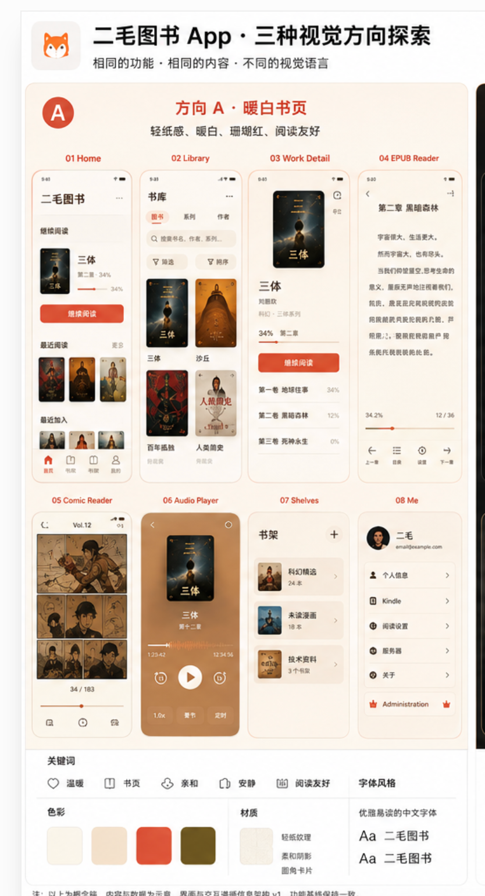

# 移动 App 第四阶段：方向 A“暖白书页”视觉规范 v1

> 状态：已采纳的视觉规范 v1
> 版本：1.1
> 决策日期：2026-08-11
> 适用范围：`apps/mobile` 的高保真设计、主题令牌、共享 UI、原型和所有可见状态
> 上位约束：[`mobile-app-phase-1-web-to-app-functional-baseline.md`](mobile-app-phase-1-web-to-app-functional-baseline.md)、[`mobile-app-phase-2-information-architecture.md`](mobile-app-phase-2-information-architecture.md) 与 [`mobile-app-phase-3-user-flows-and-wireframes.md`](mobile-app-phase-3-user-flows-and-wireframes.md)
> 横切实现规范：[`mobile-app-development-global-guidelines.md`](mobile-app-development-global-guidelines.md)

## 1. 规范目的与权威顺序

本文件把方向 A“暖白书页”从概念板升级为可实现、可测试、可审查的正式视觉契约。后续高保真页面、原型、共享组件和主题实现不得重新猜测颜色、间距、字体、封面、进度、图标或动效规则。

发生冲突时按以下顺序处理：

1. 第一阶段决定能力、真实 API、权限和数据状态；
2. 第二阶段决定页面、导航和 Page/Sheet/Menu/Dialog 语义；
3. 第三阶段决定页面内容顺序、动作优先级和 Wireframe 结构；
4. 本文件决定视觉令牌、排版、材质、图标和动效；
5. 全局开发规范决定视觉意图如何映射为系统容器、可主题化原生控件、App 自有业务视觉和分层验收；
6. 概念板只提供视觉方向证据，不能覆盖以上规范。

视觉参考：



## 2. 不可协商的视觉原则

> **纸感来自暖色背景、中文排版、封面和内容节奏，不来自大量仿纸卡片、噪点纹理或装饰性材质。**

具体约束：

- 页面基底使用安静、轻暖的实色，不默认叠加纸纹、噪点、颗粒或图片纹理；
- 通过字号、行距、留白、分隔线和封面建立阅读节奏；
- 普通列表使用连续 Surface，不把每行包装成独立卡片；
- 只有“继续阅读”等真正独立的任务对象可以使用轻量容器；
- Cover 可以有轻微暖色投影，普通列表、Reader 内容面和设置行无投影；
- 不使用玻璃拟态、装饰渐变、霓虹、高光塑料、厚重阴影或嵌套卡片；
- 不用大面积珊瑚红铺背景，不让猫 Logo 在多个页面重复成为主视觉；
- Material Symbols 可以作为 Android 系统字形，但不能把 Material 卡片、颜色或布局语法带入产品；
- 视觉语言必须温暖、亲和、安静、原生、内容优先，并优先保障中文阅读。

## 3. 外观模式与设计接口

视觉层冻结以下语义接口：

```text
AppAppearance = system → appLight | appDark

ReaderAppearance = day | warm | green | night | black | system
system → 系统浅色时 day，系统深色时 night
```

规则：

- App 外壳始终跟随系统浅/深外观，不新增手动主题设置入口；
- App Dark 是“暖白书页”的暖墨色派生，不是方向 B“夜航书房”；
- Reader 默认使用 Warm，用户可以选择 Day、Warm、Green、Night、Black 或跟随系统；
- 五套 Reader 主题与 Web Reader 使用同一组背景、正文、链接和强调色；
- “暖白书页”继续作为默认视觉方向，但不再限制 Reader 的主题选择范围；
- 外观切换不能销毁页面、Reader、音频、下载或未同步状态。

## 4. 颜色令牌

页面只能使用语义令牌，不得直接硬编码本表色值。状态色继续使用平台语义 success/warning/error，不得用品牌珊瑚红替代错误、危险、离线或权限状态。

### 4.1 核心映射

| Token | App Light | App Dark | Reader Paper | Reader Night |
|---|---:|---:|---:|---:|
| `canvas` | `#FBFAF8` | `#151311` | `#FDF6EA` | `#151311` |
| `surface` | `#FFFDF9` | `#1D1A18` | `#FFF9F1` | `#211E1B` |
| `surfaceRaised` | `#FFFFFF` | `#26221E` | `#FFFDF9` | `#29241F` |
| `textPrimary` | `#17191D` | `#F3ECE4` | `#2B2118` | `#EFE7DD` |
| `textSecondary` | `#6F6A65` | `#B7ADA2` | `#6F5E50` | `#B9AEA2` |
| `textTertiary` | `#8A837D` | `#90867C` | `#8A796A` | `#91867B` |
| `divider` | `#E6E1DB` | `#37312C` | `#E6D9C8` | `#3B352F` |
| `brandAccent` | `#FF4F2A` | `#FF6B48` | `#FF4F2A` | `#FF6B48` |
| `actionAccent` | `#C83B23` | `#FF7A58` | `#B44125` | `#FF7A58` |
| `accentSoft` | `#FFF0EA` | `#3A211A` | `#F5DDCC` | `#3A211A` |
| `onAction` | `#FFFFFF` | `#26110B` | `#FFFFFF` | `#26110B` |

### 4.2 珊瑚红职责

- `brandAccent`：阅读进度、选中 Tab、选中图标、品牌识别和非文字焦点；
- `actionAccent`：实心主按钮、文字链接和必须满足普通文字对比度的交互；
- `accentSoft`：选中背景、轻提示和局部弱分区，不承载低对比正文；
- `onAction`：只用于 `actionAccent` 上的前景内容；
- 每页最多一个实心 `actionAccent` 主 CTA；
- 开始/继续阅读和播放优先于下载、书架与阅读状态。

### 4.3 对比度基线

以下组合是 v1 的验收基准：

| 组合 | 对比度 |
|---|---:|
| App Light `textPrimary / canvas` | `16.87:1` |
| App Light `textSecondary / canvas` | `5.13:1` |
| App Light `actionAccent / canvas` | `4.90:1` |
| App Light `onAction / actionAccent` | `5.11:1` |
| App Dark `textPrimary / canvas` | `15.82:1` |
| App Dark `textSecondary / canvas` | `8.39:1` |
| App Dark `onAction / actionAccent` | `7.00:1` |
| Reader Paper `textPrimary / canvas` | `14.66:1` |
| Reader Paper `textSecondary / canvas` | `5.76:1` |
| Reader Paper `actionAccent / canvas` | `5.25:1` |
| Reader Paper `onAction / actionAccent` | `5.64:1` |
| Reader Night `textPrimary / canvas` | `15.13:1` |
| Reader Night `textSecondary / canvas` | `8.51:1` |
| Reader Night `actionAccent / canvas` | `7.22:1` |

`textTertiary` 只用于禁用、装饰性或同时具有其他可访问名称的信息；不能单独承载关键状态或操作。

## 5. Surface 与层级

每个外观只有三层通用表面：

1. `canvas`：页面与 Reader 的基础平面；
2. `surface`：导航、连续列表、Sheet 内容和局部任务区域；
3. `surfaceRaised`：系统语义要求抬升的 Menu、Dialog、popover 或明确浮层。

规则：

- “Paper”是 Reader 外观，不是可复用卡片变体；
- 同一首屏不能连续堆叠多个 `surfaceRaised`；
- 先使用留白、对齐和 Divider，再考虑独立容器；
- 普通列表行不使用圆角背景或阴影；
- Reader controls 可以使用对应外观的 `surface`，Reduced Transparency 时必须变为不透明；
- Sheet、Menu、Dialog 的外形、抬升和遮罩服从平台系统组件，不重绘假原生容器。

## 6. 8pt 间距体系

| Token | 值 | 典型用途 |
|---|---:|---|
| `space.0` | `0` | 无间距 |
| `space.0_5` | `4` | 图标光学修正、紧密内间距 |
| `space.1` | `8` | 图标与标签、相邻紧密元素 |
| `space.1_5` | `12` | 控件内部、列表辅助内容 |
| `space.2` | `16` | Compact 页面边距、常规组件间距 |
| `space.3` | `24` | 内容区块间距 |
| `space.4` | `32` | 一级章节间距 |
| `space.5` | `40` | 大型空白与沉浸控制区 |
| `space.6` | `48` | Android 最小触摸目标与大区块 |
| `space.8` | `64` | Expanded 大区块和沉浸留白 |

规则：

- 8pt 是主节奏，4pt 与 12pt 只用于组件内部或光学修正；
- Compact 页面水平边距固定以 16pt 为基线；
- Expanded 页面水平边距使用 24–32pt；
- 内容区块使用 24pt，一级章节使用 32pt；
- iOS 触摸目标至少 44pt，Android 至少 48dp；
- 动态字体或长英文导致空间不足时换行、切换列表或升为全高页面，不能压缩触摸目标。

## 7. 圆角、边界与投影

| Token | 值 | 使用范围 |
|---|---:|---|
| `radius.control` | `12` | App 自有按钮、输入和短表单控件 |
| `radius.task` | `16` | “继续阅读”等独立任务容器 |
| `radius.coverCompact` | `8` | 首页、书库、书架、列表 Cover |
| `radius.coverHero` | `12` | Work Detail、Now Playing 大 Cover |

- Sheet、Menu、Dialog、Picker 和系统权限界面不套用 App 圆角令牌；
- Divider 使用单像素/平台 hairline，不通过粗边框制造卡片；
- 只允许 Cover 使用轻微、暖色、低扩散投影；
- Reader 正文、普通列表、设置行、Tab bar 和 mini player 不使用投影；
- 焦点环使用平台焦点机制与语义 Accent，不依赖阴影表示选中。

## 8. Cover 契约

- 所有作品 Cover 使用 `2:3` 展示框；
- 不裁掉原始封面，默认 `contain`；
- 非标准比例保持 `contain`，展示框多余区域保持透明，不使用品牌色、中性色或取样色补齐；
- 网格、列表、首页与书架使用 `radius.coverCompact = 8`；
- Work Detail 与 Now Playing 使用 `radius.coverHero = 12`；
- Fallback Cover 与真实 Cover 使用相同尺寸和圆角；Fallback 只显示语义图标，不绘制占位底色；
- Comic/PDF 页面内容不属于 Cover，不强制 `2:3` 或 Cover 圆角；
- 封面下方或叠加的进度不能遮挡书名、作者和关键画面。

## 9. 字体与排版

### 9.1 字体角色

- App 导航、按钮、列表、设置和元数据使用平台系统中文无衬线；
- iOS 优先系统字体与 PingFang SC，Android 优先系统字体与 Noto Sans CJK；
- Reader Paper 默认宋体；系统字体不可用时使用仓库已有 Source Han Serif SC 回退；
- Reader Night 延续用户选中的阅读字体，不因切换外观强制更换；
- 用户仍可在 Reader 设置中切换支持的阅读字体；
- 同一页面最多出现系统无衬线与 Reader 正文字体两个角色；
- 不使用负字距压缩中文。

### 9.2 语义层级

| Role | Size / Line height | Weight | 用途 |
|---|---:|---:|---|
| `display` | `32 / 40` | `700` | 页面内容中的大型身份标题 |
| `title` | `24 / 32` | `700` | Work、集合和主要详情标题 |
| `sectionTitle` | `20 / 28` | `600` | 内容区块标题 |
| `headline` | `17 / 24` | `600` | 行标题、卡片主标题 |
| `body` | `16 / 24` | `400` | 正文与主要说明 |
| `callout` | `15 / 22` | `400` | 辅助说明和状态 |
| `label` | `14 / 20` | `500` | 控件、Tab 和短标签 |
| `caption` | `12 / 16` | `400` | 时间、格式和非关键辅助信息 |
| `button` | `16 / 22` | `600` | 主次按钮 |
| `readerChapter` | `20 / 30` | `600` | Reader 章节标题，宋体 |
| `readerBody` | `18 / 32` | `400` | Reader Paper 默认正文，宋体 |
| `readerAuxiliary` | `13 / 18` | `400` | Reader 控制与进度，系统无衬线 |

原生导航栏标题采用平台语义字号，不被本表强制覆盖。所有层级必须支持 Dynamic Type/字体缩放；用户设置的 Reader 字号、行高和段落规则优先于默认值。

## 10. Progress 规范

### 10.1 Cover 进度

- 高度 2pt；
- 左右内缩 8pt；
- 圆头轨道；
- 不显示百分比文字；
- 进度使用 `brandAccent`，轨道使用 Divider 的增强透明度；
- 100% 使用系统 Check glyph，不使用烟花、粒子或进度环。

### 10.2 普通阅读进度

- 高度 3pt，圆头轨道；
- 百分比使用 `caption` 和等宽数字；
- 进度文字不能成为唯一可访问说明；
- 同步导致回退时立即校正，不播放倒退动画。

### 10.3 下载进度

- Work Detail 的行内下载控件使用与阅读进度不同的图标状态：云朵表示未下载、环形控件表示进行中、勾选圆圈表示完成；进行中控件再次点击提供暂停与取消，不在卷册行重复显示数字百分比；
- Download Center 的持久任务仍使用高度 4pt 的进度，并同时显示百分比或“已传输/总量”；
- 未知总量使用平台原生 indeterminate indicator；
- 失败状态转为行内错误和重试，不用循环闪烁进度。

### 10.4 Reader 与 Audio scrubber

- 使用平台系统 Slider；
- 可见轨道保持 2–3pt；
- iOS 完整触摸区至少 44pt，Android 至少 48dp；
- VoiceOver/TalkBack 可读当前位置、总量和调整步进；
- 不自研 Slider thumb、拖拽物理或通用手势动画。

## 11. 图标规则

- iOS 使用 SF Symbols；Android 使用 Material Symbols 的系统标准字形；
- Tab、返回、关闭、更多、搜索、筛选、分享、下载、播放和系统状态图标禁止自绘；
- 默认图标 24pt/dp，工具栏允许 20pt/dp；
- 选中 Tab 使用 filled，未选中使用 outline；
- 同一平台保持统一笔画重量与 optical size，不混用不同风格图标库；
- 只有猫品牌标识及没有平台对应项的业务图标允许自定义；
- 自定义业务图标必须提供 iOS/Android 等价语义、单色版本和无障碍名称；
- 所有 icon-only 控件必须提供 `zh-CN`/`en-US` 无障碍标签；
- 返回、前进、撤销等方向性图标支持 RTL 镜像；
- 猫 Logo 是品牌资产，不作为普通功能图标或装饰水印。

## 12. 动效原则

### 12.1 原生优先

以下行为全部采用 iOS/Android 原生组件及其系统动效：

- Navigation、Tab、Sheet、Menu、Dialog、Picker；
- 系统返回、iOS edge-back、Android predictive back；
- 按压、选中、焦点、键盘和系统权限反馈；
- Slider、Switch、分段控件、原生 loading indicator；
- mini player → Now Playing 的系统全屏 Cover。

v1 不建设通用动画库，不添加全局 spring、卡片悬浮、缩放按压、自定义页面转场或 matched-geometry。

### 12.2 允许的业务动效

| Motion | 参数 | 规则 |
|---|---|---|
| Reader controls show | `180ms ease-out` | 透明度与最多 8pt 位移 |
| Reader controls hide | `150ms ease-in` | 透明度与最多 8pt 位移 |
| Reader 手势 settle | `140–280ms` | 按剩余距离计算 |
| Reader 程序跳页 | `200ms` | 仅分页模式 |
| determinate progress | `150ms linear` | 只平滑正常向前更新 |

书签、下载成功、加入书架和阅读状态更新使用系统反馈与 Snackbar，不另做庆祝动画。

### 12.3 降低动态效果

- Reduced Motion 下 Reader controls 取消位移；
- Reader 翻页 settle 与程序跳页时长归零；
- 必要状态变化最多使用短 crossfade，也可以无动画；
- Reduced Transparency 下所有 Reader controls、Sheet 和浮层使用不透明 Surface；
- 禁止 Cover 旋转、持续呼吸、装饰波形、循环闪烁和自定义 skeleton shimmer。

## 13. 原生组件与业务视觉边界

- 每个组件必须按全局开发规范归入 A/System-owned、B/Native-themed、C/App-owned 或 D/Approved-motion；所有权按“谁拥有行为”判断，不按“谁能修改颜色”判断；
- 业务视觉统一颜色、排版、封面、Progress、内容间距和状态层级；
- 通用控件的行为、触摸反馈、导航手势和系统动效由平台拥有；
- 不为“看起来一致”而重写平台 Switch、Slider、Picker、Alert 或返回手势；
- 系统容器采用“原生外壳 + 品牌内容”：外形、遮罩、拖拽、焦点和转场归平台，内部内容、间距、Divider、业务状态与 CTA 层级归 App；
- 语义适配器只暴露任务、角色、内容、值和无障碍信息，不暴露 `sheetCornerRadius`、`thumbShape` 或返回动画时长等平台所有参数；
- iPad/expanded 自适应为 form sheet、popover、侧栏或 split view 时保持同一任务语义；
- Android 使用系统导航与 predictive back，但不把页面视觉改造成通用 Material dashboard；
- iOS 使用 NavigationStack 与系统 presentation，不用 Web 式自绘 header 取代原生导航。

设计还原分为三种精度：App 自有业务视觉必须精确落实本文件令牌和层级；系统控件必须平台适配；大字体、长英文、Reduced Motion/Transparency、横屏和系统栏变化必须用户自适应。后两类变化不属于设计偏差。

## 14. 页面应用重点

| 页面 | v1 应用重点 |
|---|---|
| Server Center | 清晰、安全、可信；暖色不能弱化 TLS 风险 |
| Home | 一个强继续任务，最近内容用 Cover 与留白形成节奏 |
| Library | 搜索、scope、筛选与网格保持扫描效率；标准 390pt Compact 每行三本，文字放大时自适应降列或切 List |
| Shelves | 用层级、缩进和 Cover 组图区分合集与书架，不依赖多色卡片 |
| Work Detail | 单张 Cover 与书名优先，主 CTA 唯一；单资源直接显示对应资源详情，多资源显示真实内容目录；封面氛围背景清晰但从约 45% 高度连续淡入语义页面背景，不出现硬分界；正常保留 Shell 导航 |
| Reader | Paper/Night 正文优先，控制层克制且原生 |
| Now Playing | 允许更沉浸的暖铜色调，但仍使用 v1 令牌和原生控制 |
| Downloads | 状态、空间和恢复动作优先，失败使用行内反馈 |
| Me | 系统设置行；猫 Logo/头像只出现一次，不成为背景装饰 |

## 15. 概念板非约束内容

以下只用于理解视觉方向，不能作为功能或路由要求：

- 演示书名、作者、头像、邮箱、进度和数量；
- Kindle 与 Administration 行；
- 独立 EPUB Reader、Comic Reader 页面身份；
- 图中没有展示的 Server Center、Downloads、离线宽限、错误和权限状态；
- 英文页面编号、设备状态栏和演示图标；
- 任何未经前三阶段验证的入口。

EPUB、Comic 与 PDF 仍是同一 `reader.session` 的 renderer，不因视觉参考拆成三套导航体系。

## 16. 验收矩阵

### 16.1 视觉与令牌

- 所有色值通过语义令牌引用；
- 关键正文、次级文字、交互文字和实心按钮达到普通文字至少 `4.5:1`；
- `brandAccent` 与 `actionAccent` 没有混用；
- 页面没有纹理噪点、仿纸卡片、装饰渐变、非必要投影或嵌套 Surface；
- Cover 比例、圆角、透明展示框和 Progress 在不同页面一致。

### 16.2 外观与页面

- 8 个第三阶段锚点均覆盖 App Light 与 App Dark；
- Reader 另覆盖 Paper、Night 与 system；
- App Dark 仍能辨认方向 A，不漂移为方向 B；
- loading、empty、error、offline、permission、success、conflict 与 stale 状态使用同一系统；
- compact 与 expanded 信息层级和视觉语言等价。

### 16.3 平台与无障碍

- iOS/Android 通用交互使用对应平台原生组件；
- 每个组件均有 A/B/C/D 所有权记录；系统控件密集页面分别具有 iOS/Android 设计与真实组件证据；
- Dynamic Type/字体缩放不遮挡 CTA、Sheet 底部动作和 Reader controls；
- `zh-CN`/`en-US`、VoiceOver/TalkBack、Reduced Motion、Reduced Transparency 均有验收记录；
- 图标具备本地化名称，方向性图标支持 RTL；
- 触摸目标满足 iOS 44pt、Android 48dp。

### 16.4 动效

- 除本文件列出的 Reader 与 Progress 动效外，不存在通用自研动效系统；
- Navigation、Sheet、Menu、Dialog、Picker、返回和 mini player presentation 使用系统动效；
- Reduced Motion 下业务动效正确归零或降级；
- 不存在 Cover 旋转、循环装饰、庆祝粒子或 skeleton shimmer。

### 16.5 设计还原与视觉回归

- App 自有内容区域严格对照语义令牌、页面结构与高保真锚点；
- 系统组件区域按平台和 OS 大版本建立独立基准，不与另一平台或概念 PNG 逐像素比较；
- 系统区域可以使用局部遮罩或合理容差，但不得扩大整页阈值掩盖业务内容偏差；
- 无障碍、系统设置和平台升级引起的正确重排不能为了截图通过而被禁用。

## 17. 本阶段边界

- 不创建或重建 `apps/mobile`；
- 不添加机器令牌文件、空组件目录或动画依赖；
- 不修改 `reader-core`、Web Reader 或后端运行时；
- 不把本规范的设计接口误写成现有 API 合同；
- 等移动工程真正建立时，再从本规范生成平台 token 并增加自动化检查。

下一阶段以本规范和第三阶段 8 个锚点为共同输入，制作独立全尺寸高保真页面。
