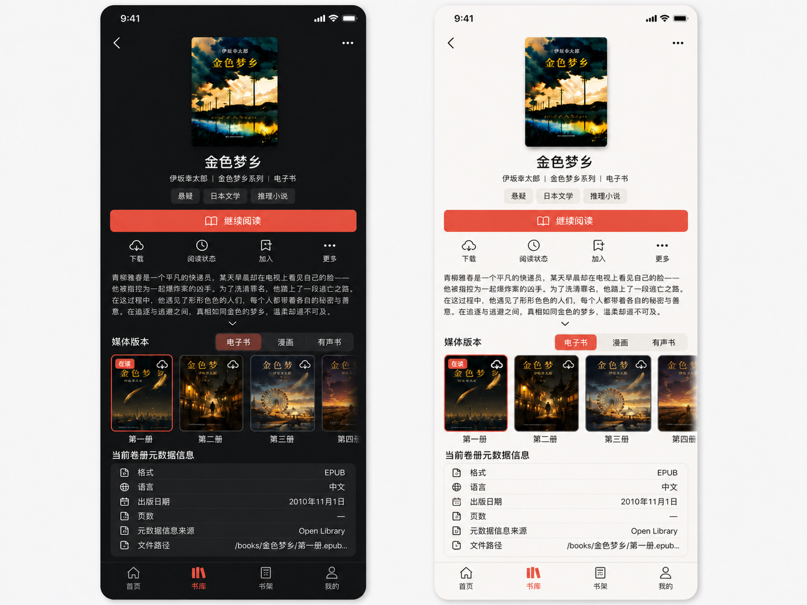

# 移动 App 第五阶段：1:1 高保真视觉锚点

> 横切实现规范：[`mobile-app-development-global-guidelines.md`](mobile-app-development-global-guidelines.md)

## 1. 目的与约束优先级

本文件固化方向 A“暖白书页”按画布尺寸 1:1 输出的高保真页面锚点，供后续锚点、状态变体和原生实现校准；1:1 只描述画布与构图，不要求系统组件逐像素复制。当前已覆盖 Compact 的 Home、Library、Work Detail、Shelves、Me、Downloads，以及沉浸层 Reader Paper 与 Audio Now Playing。服务器登录与管理已由 Phase 6 v3 的任务闭环接管，不再以本阶段旧版 Server Center 单页或 Phase 6 v2 网格稿为准。

约束优先级固定为：

1. Phase 1 决定功能、API、数据与权限事实；
2. Phase 2 决定页面归属、导航、返回和覆盖层；
3. Phase 3 决定任务流、内容顺序和动作优先级；
4. Phase 4 决定令牌、排版、Cover、Progress、图标与动效；
5. 全局开发规范决定系统组件所有权、允许定制范围、平台差异和分层视觉验收；
6. 本文件的图像只冻结页面级构图和视觉密度。

图像不得覆盖前四阶段和全局开发规范的文字约束。实现时仍须使用语义令牌与平台原生组件，不能从 PNG 采样颜色、重绘系统图标或把图像中的演示封面视为产品数据。App 自有内容区域应严格还原；系统组件区域只冻结语义、位置和内容，不冻结系统圆角、阴影、字形度量与动效。

## 2. 共同画布

- 画布：除 Work Detail 概念组外使用 `390 × 844`，不含设备外框和演示板；Work Detail 当前概念组保留带设备框的评审稿，真实平台验收截图仍按设备原生画布归档；
- 外观：Shell 页面使用 `App Light`，Reader 使用 `Paper`，Audio 使用方向 A 的暖铜沉浸外观；
- 内容：八页复用同一用户、服务器和作品身份；出现媒体内容时继续复用同一封面、作者、阅读位置和进度；
- 视觉：暖白 Canvas、黑色正文、克制珊瑚红、2:3 Cover、系统无衬线与原生图标；
- 纸感只来自背景、排版、封面和内容节奏，不增加仿纸卡片、UI 噪点或装饰纹理；
- System status bar 未纳入锚点，未来实现由原生安全区和系统状态栏接管。
- 当前 PNG 不能充当 iOS 与 Android 共用的系统组件像素基准；实现阶段必须分别生成真实平台基准。

## 3. Home

文件：[Home App Light v1](assets/mobile-app-hifi-v1/home-app-light-v1.png)

冻结项：

- 大标题“首页”，不放搜索；
- “继续阅读”是首屏唯一独立任务容器和唯一强 CTA；
- 最近阅读与最近入库通过 Cover、标题和留白形成连续节奏，不堆叠卡片；
- 两组横向内容在 390pt 宽度下保留三个可扫描目标；
- 四项 Tab 顺序固定，首页使用 filled 选中图标与 Accent。

## 4. Library

文件：[Library App Light v1](assets/mobile-app-hifi-v1/library-app-light-v1.png)

冻结项：

- 搜索、`全部 / 系列 / 作者`、结果上下文和作品网格按任务顺序连续排列；
- 活动筛选使用内联摘要，不使用整条彩色胶囊或筛选卡片；
- 标准 `390pt` Compact 默认三列 2:3 Cover 网格，一屏每行展示三本；
- 标题与作者各保留一个可读行，Dynamic Type 或窄屏空间不足时自适应为两列或 List，不继续压缩字体；
- 只有存在阅读进度的作品显示 Progress；
- 四项 Tab 顺序固定，书库使用 filled 选中图标与 Accent。

## 5. Work Detail

文件：[Work Detail 选中卷册元数据 Light/Dark v6](assets/mobile-app-hifi-v1/work-detail-selected-volume-metadata-light-dark-v6.png)

`work-detail-selected-volume-metadata-light-dark-v6.png` 是 Work Detail 唯一页面级视觉基线。详情页 v2–v5 旧图已从权威资产目录删除，禁止作为布局、覆盖层或回归验收依据。v6 是并列 Light/Dark 概念板，冻结 App 自有内容构图、密度和层级；真实实现仍分别使用 iOS/Android 原生画布和系统组件，不按设备外框逐像素仿制。字段、交互和状态的文字合同以 [`mobile-app-work-detail-selected-volume-design.md`](mobile-app-work-detail-selected-volume-design.md) 为准。

冻结项：

- 使用系统返回与折叠标题语义，不自绘 Web 式 Header，也不在顶部显示 overflow；Work Detail 正常显示 AuthenticatedShell 四项导航，只有 Reader 隐藏；
- 只显示一张当前作品 Cover，不显示封面轮播、圆点或虚构的备用封面；Cover 与作品名组成第一视觉层，作者、系列和阅读状态依次降级；
- Cover 全局使用透明展示框，不为真实封面或 Fallback 补充背景色；详情身份区按“标题、作者 / 系列 / 当前媒介、填充背景标签、阅读状态”组织，作者与系列不再拆成独立行；
- 主 CTA 下方快捷动作固定为“下载 / 阅读状态 / 加入 / 更多”；`加入` 使用书架语义图标并打开 `shelf-picker`，`更多` 展开图书控制菜单。详情页右上角不显示三点或管理入口；
- 简介、媒介选择、横向卷册轨道和选中卷册元数据在同一滚动流中连续展示，不使用“简介 / 媒体版本”一级 Tab；简介展开控件使用居中 chevron；“媒体版本”在左、真实媒介选项在右，单媒体版本也显示唯一选项；详情页不显示目录；
- 多卷 Volume 使用与 Mobile Work card 统一的 2:3 横向轨道：标准 Compact 单项约为内容宽度三分之一，首屏完整显示三项并露出下一项；大字体或窄屏可增加单项宽度但不得压缩文字或触摸目标。轨道支持分页加载、尾部行内重试和稳定滚动锚点；
- 左上显示卷序号，阅读进度以 2pt 轨道紧贴封面底部，当前卷使用 2pt `brandAccent` 描边；单卷也显示同一卷册轨道，保证元数据、下载状态和授权长按管理入口不分叉；
- 下方“当前卷册元数据信息”严格跟随当前选中卷册，固定显示格式、语言、出版日期、页数、元数据信息来源和文件路径。缺失值显示 `—`；示例 EPUB 无页数，因此 v6 的页数值为 `—`。被动元数据行不显示导航箭头；
- 媒介控件只显示当前作品真实具备的媒介；v6 示例完整显示电子书、漫画和有声书，三者均为可用媒介，不把有声书画成禁用或“即将支持”；
- 卷册主视觉不显示编辑按钮。长按卷册封面打开卷册控制菜单，卷册标题不触发管理；平台辅助技术和非触摸输入在封面提供“卷册操作”等价动作；
- “未开始 / 未读”是默认状态，不在身份区重复显示；只有正在阅读或已完成时显示阅读状态；
- 下载状态与阅读进度严格分离：云朵直接开始下载，环形控件可暂停/取消，勾选圆圈表示完成；详情行不显示“下载中 68%”一类文字；
- 格式访问优先级沿用 Phase 1：可重排格式未完成下载时，主动作表达“下载后阅读”且不得进入 Reader；PDF/漫画在线主动作仍是流式阅读，云朵只表示另存完整离线工件。本构图规则不得覆盖这一功能差异；
- 编辑、识别、封面和其他管理能力由详情页控制菜单进入聚焦 Sheet；下载、阅读状态、加入书架和更多保持详情页快捷入口。能力与权限不足时隐藏对应操作或给出真实原因，不使用伪成功状态；
- 图书控制菜单与卷册控制菜单使用触点锚定的紧凑半透明悬浮卡：卷册长按取真实按压坐标，`更多`取触发控件位置，卡片在安全区内自动翻转/夹取，不固定在右上角。宽度、紧凑标题、行密度和任务 Sheet 合同以 [`mobile-app-work-detail-management-interaction-design-v2.md`](mobile-app-work-detail-management-interaction-design-v2.md) v2 为准；[`work-detail-book-control-menu-floating-card-v1.png`](assets/mobile-app-hifi-v1/work-detail-book-control-menu-floating-card-v1.png) 仅继续约束半透明材质、层级和危险项分区，不再约束固定右侧位置或旧宽度。菜单不是底部 Sheet 或独立页面；其内容按需独立滚动，背景详情保持可辨认且不可交互，删除项固定为末尾独立危险区；

## 6. Reader Paper

文件：[Reader Paper v1](assets/mobile-app-hifi-v1/reader-paper-v1.png)

冻结项：

- Reader 是 Shell 之上的沉浸层，隐藏 Tab 与 mini player；
- Paper 的纸感只来自暖色、宋体、行高、段距和正文留白，不使用纸纹、噪点或装饰材质；
- controls visible 状态包含系统返回、作品上下文、书签、更多、系统 Slider 与四个底部动作；
- 正文是唯一第一视觉层，控制 Surface 使用 Divider 分隔，不形成悬浮玻璃面板；
- 目录入口只承载目录与书签，不出现笔记；Reader 返回仍须先完成本地 progress 事务且不等待网络。

## 7. Audio Now Playing

文件：[Audio Now Playing v1](assets/mobile-app-hifi-v1/audio-now-playing-v1.png)

冻结项：

- Now Playing 使用方向 A 的单一暖铜沉浸底色，Cover 是唯一大型图像焦点；
- 顶部折叠动作表示回到 mini player，不停止播放；全屏层不显示 Tab 或 mini player；
- 时间轴使用系统 Slider；播放控制固定为上一章、后退、播放/暂停、前进和下一章；
- 次级动作固定为当前倍速、章节、睡眠定时和查看作品，不使用卡片或胶囊；
- 不使用波形、封面旋转、装饰渐变或持续动画表达播放状态。

## 8. Shelves

文件：[Shelves App Light v1](assets/mobile-app-hifi-v1/shelves-app-light-v1.png)

冻结项：

- 大标题“书架”，添加动作使用系统 Menu 入口，不增加搜索；
- 合集使用三本 Cover 叠放组图，书架使用三本 Cover 并列预览，依靠组图方式、层级和 Divider 区分语义；
- 合集行只显示成员书架摘要，不直接展示或操作作品；
- 智能书架只使用克制的规则 glyph 与摘要表达只读计算结果，不提供手工添加入口；
- 普通行不使用圆角卡片、彩色底板或阴影；四项 Tab 顺序固定，书架为选中项。

## 9. Me

文件：[Me App Light v1](assets/mobile-app-hifi-v1/me-app-light-v1.png)

冻结项：

- 大标题“我的”，用户头像只出现一次；身份信息不使用独立卡片或品牌装饰；
- 账户、离线与存储、服务器、偏好和产品使用连续系统设置行、Divider 与原生 chevron；
- 下载数量、当前服务器、语言和 Web 管理域名作为次级信息，不能抢占行标题层级；
- P1 的手工导入、Kindle 设置与任务在交付前整组隐藏；
- “在 Web 管理”只表示通过系统浏览器打开当前服务器域名，不建立 App 内管理 route；四项 Tab 中“我的”为选中项。

## 10. Downloads

文件：[Downloads App Light v1](assets/mobile-app-hifi-v1/downloads-app-light-v1.png)

冻结项：

- 使用从“我的”压入的系统导航语义，标题“下载”，右侧为选择/管理动作；
- 导航区同时提供本地已下载搜索；搜索范围只包含当前私有命名空间中的 completed 工件，并按“作品（书名） → media version → volume”聚合展示，不能退化为服务器书库搜索；media version 行使用 Reader v4 的真实媒介种类，不能按文件扩展名猜测；
- 正常锚点同时展示存储占用、一个进行中、两个已完成和一个失败任务，不使用临时 Sheet 代替持久页面；
- determinate 下载进度为 4pt，并同时显示百分比或传输量；从开始/继续阅读触发的单卷任务在 completed 工件落盘后自动进入 Reader，独立下载动作不自动跳转；已完成 volume 可从下载中心直达 Reader；
- 作品层封面先使用缓存或统一 fallback，占位尺寸始终稳定，再异步过渡到 authenticated cover；封面失败不折叠作品/media version/volume 层级，不出现跳高，也不影响本地搜索和打开；
- 下载失败使用稳定摘要和行内“重试”，不弹逐项 Dialog；移除离线副本等破坏性动作仍按 Phase 2 进入确认 Dialog；
- 页面属于 MeStack，保留四项 Tab 且“我的”为选中项；当前正常锚点不显示 offline/401 宽限 Banner 或 mini player。

## 11. Server Login / Center 替代关系

文件：[Server Login Saved iOS App Light v3](assets/mobile-app-hifi-v1/server-login-saved-ios-app-light-v3.png) · [Server Login Saved Android App Light v3](assets/mobile-app-hifi-v1/server-login-saved-android-app-light-v3.png)

旧版 Server Center 与 Phase 6 v2 服务器网格资产均已被 Phase 6 v3 替代，不再作为实现或验收依据。服务器 Gate 与“我的 > 服务器”复用同一个登录表单和切换 Sheet 模型：

- 无有效会话时首屏直接显示服务器地址、账号、密码；首次使用为空，鉴权过期时回填最近成功 profile；
- “登录”是唯一强主动作；下方左侧“切换服务器”打开平台原生 Sheet，右侧“删除当前服务器”使用低强调 destructive 语义；
- 输入新地址并登录成功后自动保存 profile，名称取标准化 URL hostname，不提供名称输入或独立添加/编辑模式；
- Sheet 选择只回填表单，不自动登录；删除确认成功后清空三个字段，不自动选择下一台服务器；
- 填写和切换不探测网络，不展示连接状态、兼容性、TLS 或证书验证配置；
- 只有点击登录时执行探测；不可用、不兼容和不安全 SSL 分别使用平台原生提示，其中不安全 SSL 只提供“取消”与“接受风险并连接”；
- 从“我的”进入时保留 MeStack 的系统返回和 Tab；未登录 Gate 不显示 Shell 导航。iOS 与 Android 共用语义，不共用系统组件几何。

完整状态、文案、平台差异和十张视觉证据以 [`mobile-app-phase-6-server-auth-high-fidelity.md`](mobile-app-phase-6-server-auth-high-fidelity.md) 为准。

## 12. 本轮验收结论

- 本阶段主锚点使用同一用户、服务器、内容身份与视觉语言；Work Detail 使用 v6 并列 Light/Dark 评审板，其他主锚点为 `390 × 844` PNG；服务器入口资产由 Phase 6 单独管理，包含 iOS `390 × 844` 与 Android `412 × 915` 画布；
- Home 没有第二套搜索，Library 是唯一发现入口；
- Library 活动筛选已去除大面积胶囊背景；
- Home 与 Library 在标准 `390pt` Compact 宽度下均保持一行三本的信息密度；
- Work Detail 的主次动作、媒介切换、Volume 层级和返回来源可辨认；
- Reader 的正文/控制层、Paper/系统字体和沉浸导航边界可辨认；
- Audio 的折叠、播放、时间轴与次级动作没有被自定义视觉吞没；
- Shelves 的合集、静态书架与智能书架可通过层级和三封面组图区分；
- Me 的用户身份、设置分组和系统行语义清楚，头像没有重复成为装饰；
- Downloads 的存储、进行中、已完成和失败状态同时可扫描，失败恢复保持行内；
- 服务器入口已改为默认登录表单、原生切换 Sheet、当前 profile 删除，以及仅在点击登录时出现的连接、兼容性和 SSL 风险提示；
- 页面没有新增 Web-only、P1 占位或 Phase 1 排除能力；
- Home、Library、Work Detail、Shelves、Me 与 Downloads 的 App 自有内容区按严格视觉回归验收；Reader 与 Audio 的业务内容区同样严格验收；服务器入口按 Phase 6 v3 独立验收；Navigation、Tab、Slider、播放控件和 overflow 按平台独立验收，不要求跨平台同形；
- 当前锚点不代表 App Dark、Expanded、Dynamic Type 或异常状态已经验收，这些仍按 Phase 3–4 的矩阵单独制作。

服务器登录、切换与删除、按需连接与 TLS 风险、Setup 和 Reauthenticate 的高保真闭环见 [`mobile-app-phase-6-server-auth-high-fidelity.md`](mobile-app-phase-6-server-auth-high-fidelity.md)。

书库 Search、系列/作者分组、共享 Facet 与返回上下文的高保真闭环见 [`mobile-app-phase-7-library-discovery-high-fidelity.md`](mobile-app-phase-7-library-discovery-high-fidelity.md)。
