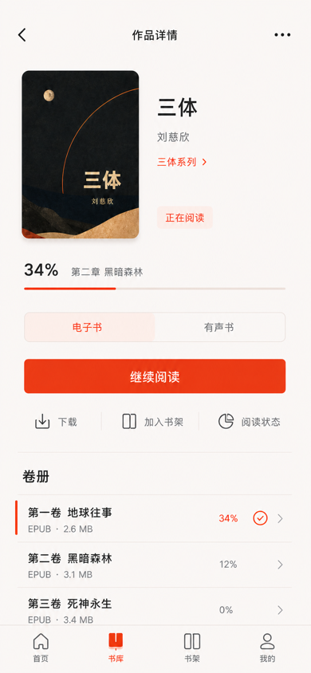
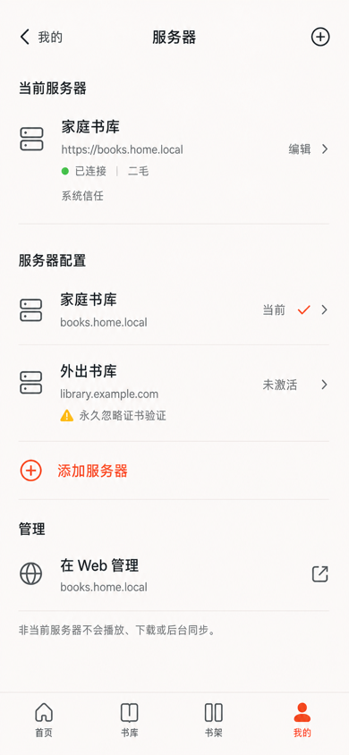

# 移动 App 第五阶段：1:1 高保真视觉锚点

> 横切实现规范：[`mobile-app-development-global-guidelines.md`](mobile-app-development-global-guidelines.md)

## 1. 目的与约束优先级

本文件固化方向 A“暖白书页”按画布尺寸 1:1 输出的高保真页面锚点，供后续锚点、状态变体和未来原生实现校准；1:1 只描述画布与构图，不要求系统组件逐像素复制。当前已覆盖 Compact 的 Home、Library、Work Detail、Shelves、Me、Downloads、Server，以及沉浸层 Reader Paper 与 Audio Now Playing，不创建或重建 `apps/mobile`。

约束优先级固定为：

1. Phase 1 决定功能、API、数据与权限事实；
2. Phase 2 决定页面归属、导航、返回和覆盖层；
3. Phase 3 决定任务流、内容顺序和动作优先级；
4. Phase 4 决定令牌、排版、Cover、Progress、图标与动效；
5. 全局开发规范决定系统组件所有权、允许定制范围、平台差异和分层视觉验收；
6. 本文件的图像只冻结页面级构图和视觉密度。

图像不得覆盖前四阶段和全局开发规范的文字约束。实现时仍须使用语义令牌与平台原生组件，不能从 PNG 采样颜色、重绘系统图标或把图像中的演示封面视为产品数据。App 自有内容区域应严格还原；系统组件区域只冻结语义、位置和内容，不冻结系统圆角、阴影、字形度量与动效。

## 2. 共同画布

- 画布：`390 × 844`，不含设备外框和演示板；
- 外观：Shell 页面使用 `App Light`，Reader 使用 `Paper`，Audio 使用方向 A 的暖铜沉浸外观；
- 内容：九页复用同一用户、服务器和作品身份；出现媒体内容时继续复用同一封面、作者、阅读位置和进度；
- 视觉：暖白 Canvas、黑色正文、克制珊瑚红、2:3 Cover、系统无衬线与原生图标；
- 纸感只来自背景、排版、封面和内容节奏，不增加仿纸卡片、UI 噪点或装饰纹理；
- System status bar 未纳入锚点，未来实现由原生安全区和系统状态栏接管。
- 当前 PNG 不能充当 iOS 与 Android 共用的系统组件像素基准；实现阶段必须分别生成真实平台基准。

## 3. Home

文件：[Home App Light v1](assets/mobile-app-hifi-v1/home-app-light-v1.png)

冻结项：

- 大标题“首页”，不放搜索；
- “继续阅读”是首屏唯一独立任务容器和唯一强 CTA；
- 最近阅读与最近入库通过 Cover、标题和留白形成连续节奏，不堆叠卡片；
- 两组横向内容在 390pt 宽度下保留三个可扫描目标；
- 四项 Tab 顺序固定，首页使用 filled 选中图标与 Accent。

## 4. Library

文件：[Library App Light v1](assets/mobile-app-hifi-v1/library-app-light-v1.png)

冻结项：

- 搜索、`全部 / 系列 / 作者`、结果上下文和作品网格按任务顺序连续排列；
- 活动筛选使用内联摘要，不使用整条彩色胶囊或筛选卡片；
- 标准 `390pt` Compact 默认三列 2:3 Cover 网格，一屏每行展示三本；
- 标题与作者各保留一个可读行，Dynamic Type 或窄屏空间不足时自适应为两列或 List，不继续压缩字体；
- 只有存在阅读进度的作品显示 Progress；
- 四项 Tab 顺序固定，书库使用 filled 选中图标与 Accent。

## 5. Work Detail

文件：[Work Detail App Light v1](assets/mobile-app-hifi-v1/work-detail-app-light-v1.png)

冻结项：

- 使用系统返回、折叠标题语义和 overflow，不自绘 Web 式 Header；
- Cover 与作品名组成第一视觉层，作者、系列和阅读状态依次降级；
- 媒介切换后只保留一个全宽主 CTA；下载、加入书架和阅读状态为次级动作；
- Volume 使用连续列表、Divider 和小型选中标记，不使用卡片墙；
- Work Detail 仍位于 LibraryStack 的 AuthenticatedShell 内，因此保留四项 Tab；只有 Reader 隐藏 Tab 与 mini player。

## 6. Reader Paper

文件：[Reader Paper v1](assets/mobile-app-hifi-v1/reader-paper-v1.png)

冻结项：

- Reader 是 Shell 之上的沉浸层，隐藏 Tab 与 mini player；
- Paper 的纸感只来自暖色、宋体、行高、段距和正文留白，不使用纸纹、噪点或装饰材质；
- controls visible 状态包含系统返回、作品上下文、书签、更多、系统 Slider 与四个底部动作；
- 正文是唯一第一视觉层，控制 Surface 使用 Divider 分隔，不形成悬浮玻璃面板；
- 目录入口只承载目录与书签，不出现笔记；Reader 返回仍须先完成本地 progress 事务且不等待网络。

## 7. Audio Now Playing

文件：[Audio Now Playing v1](assets/mobile-app-hifi-v1/audio-now-playing-v1.png)

冻结项：

- Now Playing 使用方向 A 的单一暖铜沉浸底色，Cover 是唯一大型图像焦点；
- 顶部折叠动作表示回到 mini player，不停止播放；全屏层不显示 Tab 或 mini player；
- 时间轴使用系统 Slider；播放控制固定为上一章、后退、播放/暂停、前进和下一章；
- 次级动作固定为当前倍速、章节、睡眠定时和查看作品，不使用卡片或胶囊；
- 不使用波形、封面旋转、装饰渐变或持续动画表达播放状态。

## 8. Shelves

文件：[Shelves App Light v1](assets/mobile-app-hifi-v1/shelves-app-light-v1.png)

冻结项：

- 大标题“书架”，添加动作使用系统 Menu 入口，不增加搜索；
- 合集使用三本 Cover 叠放组图，书架使用三本 Cover 并列预览，依靠组图方式、层级和 Divider 区分语义；
- 合集行只显示成员书架摘要，不直接展示或操作作品；
- 智能书架只使用克制的规则 glyph 与摘要表达只读计算结果，不提供手工添加入口；
- 普通行不使用圆角卡片、彩色底板或阴影；四项 Tab 顺序固定，书架为选中项。

## 9. Me

文件：[Me App Light v1](assets/mobile-app-hifi-v1/me-app-light-v1.png)

冻结项：

- 大标题“我的”，用户头像只出现一次；身份信息不使用独立卡片或品牌装饰；
- 账户、离线与存储、服务器、偏好和产品使用连续系统设置行、Divider 与原生 chevron；
- 下载数量、当前服务器、语言和 Web 管理域名作为次级信息，不能抢占行标题层级；
- P1 的手工导入、Kindle 设置与任务在交付前整组隐藏；
- “在 Web 管理”只表示通过系统浏览器打开当前服务器域名，不建立 App 内管理 route；四项 Tab 中“我的”为选中项。

## 10. Downloads

文件：[Downloads App Light v1](assets/mobile-app-hifi-v1/downloads-app-light-v1.png)

冻结项：

- 使用从“我的”压入的系统导航语义，标题“下载”，右侧为选择/管理动作；
- 正常锚点同时展示存储占用、一个进行中、两个已完成和一个失败任务，不使用临时 Sheet 代替持久页面；
- determinate 下载进度为 4pt，并同时显示百分比或传输量；已完成项明确“离线可用”；
- 下载失败使用稳定摘要和行内“重试”，不弹逐项 Dialog；移除离线副本等破坏性动作仍按 Phase 2 进入确认 Dialog；
- 页面属于 MeStack，保留四项 Tab 且“我的”为选中项；当前正常锚点不显示 offline/401 宽限 Banner 或 mini player。

## 11. Server Center

文件：[Server Center App Light v1](assets/mobile-app-hifi-v1/servers-app-light-v1.png)

冻结项：

- 主锚点采用“一个 active profile + 一个 inactive profile”的管理状态；从“我的”进入时显示系统返回，添加服务器使用原生加号动作；
- 当前服务器摘要同时显示名称、base URL、连接状态、当前用户和 `systemTrust` 语义；
- profile 使用连续行和 Divider，选择行不等于激活；非 active profile 不执行播放、下载或后台同步；
- `insecureSkipAllValidation` 风险只绑定对应 profile，并持续显示系统警示色与“永久忽略证书验证”；禁止用珊瑚红表达安全错误，也禁止做全局 TLS Switch；
- “在 Web 管理”使用系统浏览器打开明确域名，不建立 App 内管理页面；页面属于 MeStack，保留四项 Tab 且“我的”为选中项。

## 12. 本轮验收结论

- 九张资产均为 `390 × 844` PNG，并使用同一用户、服务器、内容身份与视觉语言；
- Home 没有第二套搜索，Library 是唯一发现入口；
- Library 活动筛选已去除大面积胶囊背景；
- Home 与 Library 在标准 `390pt` Compact 宽度下均保持一行三本的信息密度；
- Work Detail 的主次动作、媒介切换、Volume 层级和返回来源可辨认；
- Reader 的正文/控制层、Paper/系统字体和沉浸导航边界可辨认；
- Audio 的折叠、播放、时间轴与次级动作没有被自定义视觉吞没；
- Shelves 的合集、静态书架与智能书架可通过层级和三封面组图区分；
- Me 的用户身份、设置分组和系统行语义清楚，头像没有重复成为装饰；
- Downloads 的存储、进行中、已完成和失败状态同时可扫描，失败恢复保持行内；
- Server Center 的 active profile、inactive profile、连接状态与 profile 级 TLS 风险边界清楚；
- 页面没有新增 Web-only、P1 占位或 Phase 1 排除能力；
- Home、Library、Work Detail、Shelves、Me、Downloads 与 Server Center 的 App 自有内容区按严格视觉回归验收；Reader 与 Audio 的业务内容区同样严格验收；Navigation、Tab、Slider、播放控件和 overflow 按平台独立验收，不要求跨平台同形；
- 当前锚点不代表 App Dark、Expanded、Dynamic Type 或异常状态已经验收，这些仍按 Phase 3–4 的矩阵单独制作。

服务器首次连接、TLS 风险、Login、Setup 与 Reauthenticate 的高保真闭环见 [`mobile-app-phase-6-server-auth-high-fidelity.md`](mobile-app-phase-6-server-auth-high-fidelity.md)。

书库 Search、系列/作者分组、共享 Facet 与返回上下文的高保真闭环见 [`mobile-app-phase-7-library-discovery-high-fidelity.md`](mobile-app-phase-7-library-discovery-high-fidelity.md)。
