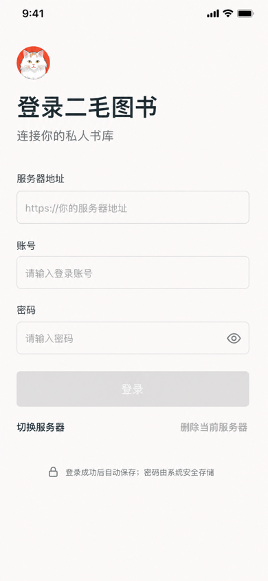
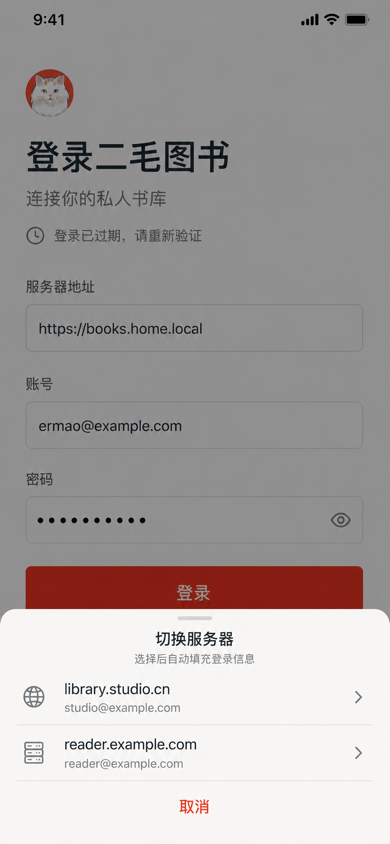
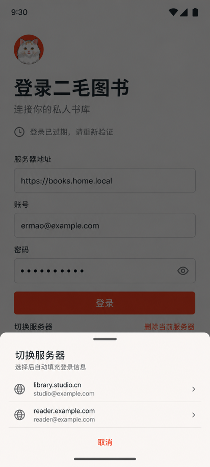
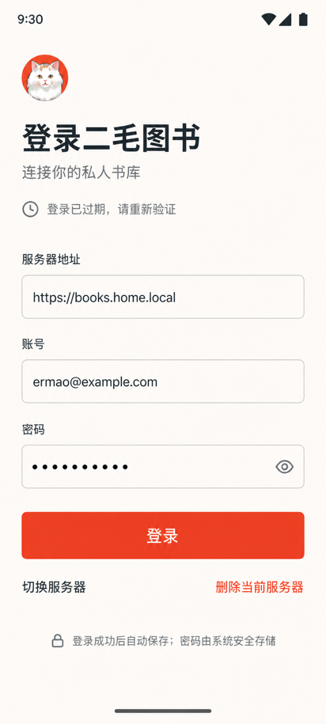
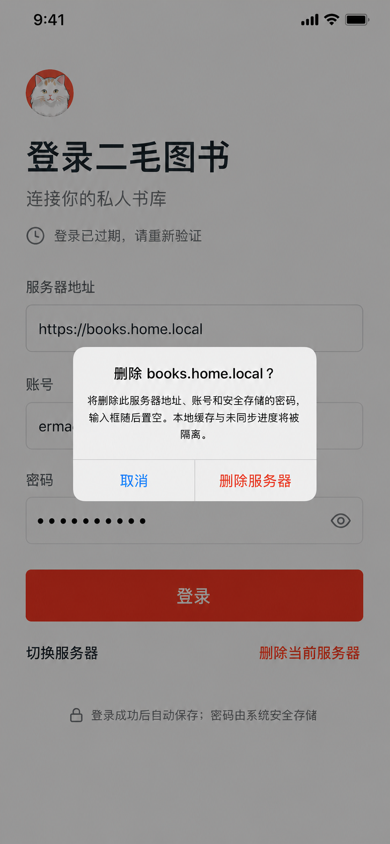
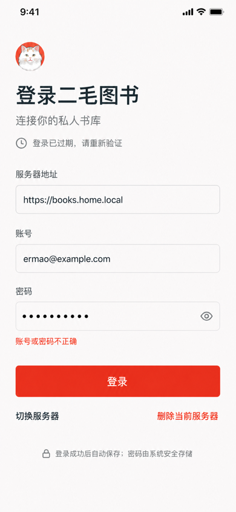
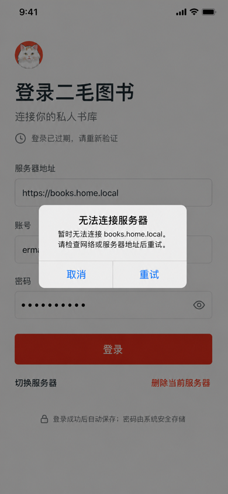
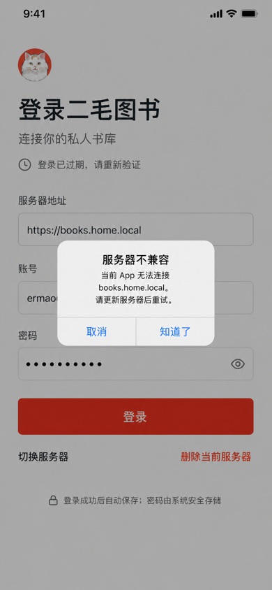
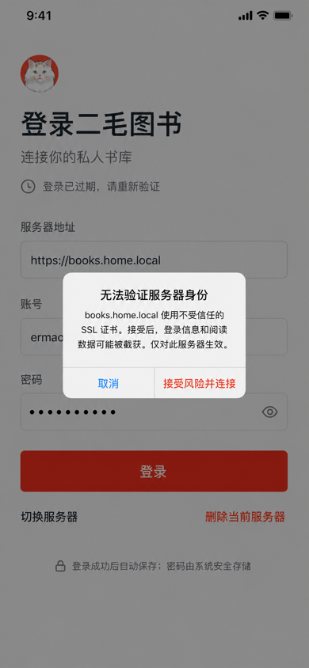

# 移动 App 第六阶段：服务器登录与认证高保真闭环 v3

> 状态：已采纳的服务器登录与认证视觉基线
> 版本：3.0
> 决策日期：2026-08-12
> 横切实现规范：[`mobile-app-development-global-guidelines.md`](mobile-app-development-global-guidelines.md)

## 1. 目的与替换范围

本文件在 Phase 1–5 约束之上冻结服务器登录、保存与切换、按需连接检查、初始化和重新认证的 Compact 高保真基线。

v3 以“登录表单始终是第一任务”为核心，完整替换 v2 的服务器网格入口、末项添加卡片、页内添加/编辑区、卡片 Menu 和先选服务器再展开登录的交互。入口不再要求用户先管理 profile，服务器 profile 是一次成功登录后的自动结果。

权威主路径为：

```text
App 启动且没有有效登录会话
→ server.entry 直接显示服务器地址、账号、密码
→ 首次使用或删除后字段为空
→ 曾成功登录但鉴权过期时，回填上次使用的服务器、账号与可用的安全凭证
→ 点击“登录”才执行连接、兼容性、setup status 与 TLS 检查
→ 未初始化：auth.setup
→ 已初始化：POST /api/auth/login → GET /api/auth/me
→ 成功后自动保存或更新 profile，displayName = URL hostname
→ tab.home

“切换服务器”
→ 平台原生 Sheet 列出其他已保存 profile
→ 选择后只回填当前表单，不自动连接或登录

“删除当前服务器”
→ 平台原生确认
→ 删除成功后清空三个输入框并停留当前页
```

当前交付八张 iOS `390 × 844` App Light PNG 与两张 Android `412 × 915` App Light PNG。Setup、Reauthenticate、账户停用与 entitlement 到期继续使用不与本决策冲突的 v1 资产。

## 2. 共同视觉与交互约束

- Bootstrap/Auth Gate 不显示四项 Tab、mini player 或被遮蔽的私有页面；
- 第一视觉层固定为服务器地址、账号、密码组成的登录表单，主动作固定为“登录”；
- 登录下方同一行左侧为“切换服务器”，右侧为“删除当前服务器”，二者必须明显低于主按钮；
- 不展示服务器网格、profile 名称输入、添加服务器按钮、编辑模式或卡片 overflow；
- 输入一个未保存地址就是添加意图，不增加独立的保存步骤；只有登录成功才自动保存或更新 profile；
- `displayName` 由标准化 URL 的 `hostname` 自动生成，不允许用户在此流程内编辑；端口和 base path 保留在 `baseUrl`，不进入显示名称；
- 切换 Sheet 只列出当前 profile 之外的已保存 profile；选择后关闭 Sheet 并回填，不自动发起请求；
- 删除只作用于当前表单所对应的已保存 profile；未匹配已保存 profile 或字段全空时删除按钮禁用；
- 删除完成后服务器地址、账号和密码全部置空；不隐式选择下一台服务器；
- 只有点击“登录”才触发可达性、兼容性、setup status 与 TLS 检查；
- 页面不显示在线/离线状态、兼容性徽标、证书验证行、TLS Switch 或内部 TLS 模式；
- 网络不可达、不兼容和不安全 SSL 使用平台原生阻断提示，不创建 route 或长期错误状态；
- 使用 App Light 的 `canvas`、`surface`、文字、Divider 与 Accent 语义令牌；
- 表单使用平台原生输入、键盘、密码管理、自动填充、焦点、加载和错误播报；
- 密码只进入平台安全凭证存储，不写入普通 profile、日志、分析或可读缓存；
- 危险动作与安全风险使用系统 destructive/warning 语义，不用品牌 Accent 伪装风险。

## 3. `server.entry` 页面状态

`server.entry` 是一个全屏页面及其平台覆盖层，不为添加、编辑、切换、删除或普通连接问题建立子 route：

```text
form-empty
form-restored(profileId)
form-dirty(profileId?)
authenticating(profileId?)
login-invalid(profileId?)
switch-sheet(profileId?, profiles)
delete-confirmation(profileId)
unavailable-alert(profileId?)
incompatible-alert(profileId?)
unsafe-ssl-alert(profileId?)
```

约束：

- `form-restored` 可以来自冷启动最近 profile、鉴权过期的 active profile 或切换 Sheet 选择；
- 用户编辑任一字段后进入 `form-dirty`；只有标准化后的地址命中 profile 时才保留其删除资格；
- 同时最多一个系统 Sheet 或 Alert；覆盖层关闭后焦点回到触发控件；
- `authenticating` 只锁定当前表单与主动作，必须能被视图销毁或新意图取消，旧结果不得覆盖新表单；
- 登录成功且 `/me` 成功后才保存/更新 profile 并离开 Gate；失败不得制造“已保存”假象；
- profile 的 Cookie、凭证、缓存、outbox 与 entitlement 始终使用 `serverIdentity + userId` namespace 隔离。

## 4. iOS 登录主页面


文件：[Server Login Saved iOS App Light v3](assets/mobile-app-hifi-v1/server-login-saved-ios-app-light-v3.png)

冻结项：

- 品牌标题“登录二毛图书”与说明“连接你的私人书库”后直接进入表单，不放服务器列表或装饰卡片；
- 字段顺序固定为“服务器地址 / 账号 / 密码”；地址接收完整 URL，base path 是地址的一部分；
- 有最近成功 profile 时回填地址与账号；安全凭证仍可用时由系统密码存储回填密码并保持遮蔽；
- “登录”是页面唯一全宽、实色、强层级动作；加载时按钮保持位置并提供进度语义；
- 主按钮下方左“切换服务器”、右“删除当前服务器”，二者使用文本/低强调样式；删除采用系统 destructive 语义但不获得主按钮视觉重量；
- 没有已保存 profile 时“切换服务器”禁用或隐藏；当前表单不匹配已保存 profile 时删除禁用；
- Dynamic Type 导致空间不足时允许纵向滚动，不能压缩字体、触摸目标或把次级动作提升到主动作之前。

## 5. 首次使用与删除后的空表单



文件：[Server Login Empty iOS App Light v3](assets/mobile-app-hifi-v1/server-login-empty-ios-app-light-v3.png)

冻结项：

- 三个字段为空，placeholder 分别说明“你的服务器地址 / 请输入登录账号 / 请输入密码”，不写入虚构的已保存数据；
- 必填字段有效前登录按钮禁用；
- 没有其他 profile 时切换按钮禁用；删除按钮始终禁用；
- 用户输入未保存地址、账号与密码后直接点击登录，无额外“添加”或“保存并登录”动作；
- 登录成功后，以标准化地址建立 profile，并用 hostname 自动生成名称。

## 6. 切换服务器 Sheet



文件：[Server Switch Sheet iOS App Light v3](assets/mobile-app-hifi-v1/server-switch-sheet-ios-app-light-v3.png)



文件：[Server Switch Sheet Android App Light v3](assets/mobile-app-hifi-v1/server-switch-sheet-android-app-light-v3.png)

冻结项：

- 点击登录下方左侧次级动作后，以平台原生 Sheet 展示“切换服务器”；
- 列表排除当前 profile，只显示其他已保存项；每行以 hostname 作为名称，并展示最后成功账号；完整地址在选择后回填至主表单；
- 点击整行立即选择、关闭 Sheet，并把地址、账号及安全存储中可用的密码回填至当前表单；
- 选择不触发连接探测、登录、active namespace 切换或页面跳转；用户仍须点击主“登录”；
- 空列表不打开空 Sheet；入口应禁用，并具有可访问说明；
- iOS 使用系统 Sheet detent、列表和关闭行为；Android 使用 Modal Bottom Sheet、Material 列表、48dp 触摸目标与系统返回，不复制 iOS 几何。

## 7. Android 登录主页面



文件：[Server Login Saved Android App Light v3](assets/mobile-app-hifi-v1/server-login-saved-android-app-light-v3.png)

冻结项：

- 与 iOS 共享字段顺序、主次动作和保存/切换/删除语义；
- 使用 Android 系统栏、Material 输入与密码显隐、48dp 触摸目标、Ripple 和原生 Bottom Sheet；
- Android 系统/预测性返回先关闭键盘或 Sheet，再按 Gate 规则处理；Gate 根状态不能返回私有 Shell；
- 不复制 iOS 输入圆角、Sheet、Alert、状态栏或按压反馈。

## 8. 删除当前服务器



文件：[Server Delete Confirmation iOS App Light v3](assets/mobile-app-hifi-v1/server-delete-confirmation-ios-app-light-v3.png)

冻结项：

- 删除入口只在当前标准化地址匹配已保存 profile 时可用；
- 使用平台原生确认，标题和正文明确对象、登录信息、本地缓存与未同步进度后果；
- 取消回到原表单且不改字段；确认后删除当前 profile 的普通记录与安全凭证，并隔离待同步 outbox；
- 删除成功后清空服务器地址、账号与密码，不自动回填其他服务器；
- 如果仍有其他 profile，切换按钮恢复可用；如果没有，切换与删除均禁用；
- destructive 外观只属于确认动作和删除文本，不把整个页面染成警告色。

## 9. 登录错误与按需连接提示



文件：[Server Login Invalid iOS App Light v3](assets/mobile-app-hifi-v1/server-login-invalid-ios-app-light-v3.png)



文件：[Server Unavailable iOS App Light v3](assets/mobile-app-hifi-v1/server-unavailable-ios-app-light-v3.png)



文件：[Server Incompatible iOS App Light v3](assets/mobile-app-hifi-v1/server-incompatible-ios-app-light-v3.png)

冻结项：

- 地址格式错误在地址字段内显示，聚焦修正；
- 普通 401 使用“账号或密码不正确”的字段/表单错误，保留地址与账号，不弹 Dialog，不泄露账号存在性；
- 服务不可达只在点击登录后的探测失败时使用平台原生 Alert；关闭后完整保留表单，可修正地址或重试；
- 服务不兼容只在点击登录后的版本检查失败时提示；不允许忽略或强制登录；
- 失败 profile 不自动保存；已存在 profile 的最后成功数据不被失败草稿覆盖；
- 关闭提示后不显示永久错误徽标，下一次登录重新检查。

## 10. 不安全 SSL 按需确认



文件：[Server Unsafe SSL iOS App Light v3](assets/mobile-app-hifi-v1/server-unsafe-ssl-ios-app-light-v3.png)

冻结项：

- 只有点击登录且系统证书验证失败时才显示；
- 使用一个平台原生阻断 Alert，说明账号、密码与阅读数据可能被截获；
- 动作为“取消”和系统 destructive/warning“接受风险并连接”；
- 接受范围绑定标准化服务器 identity；若尚未有 profile，只能作为本次登录尝试的临时策略，登录及 `/me` 成功后再随新 profile 保存；
- 页面不显示证书验证、TLS 模式、证书指纹、`systemTrust`、`insecureSkipAllValidation` 或持续风险行；
- 本稿冻结用户确认语义，不冻结平台 Alert 的圆角、阴影、按钮排列或未来系统视觉变化。

## 11. Setup


文件：[Setup App Light v1](assets/mobile-app-hifi-v1/auth-setup-app-light-v1.png)

冻结项保持不变：

- Setup 与普通登录互斥，只在登录意图的 setup status 检查确认未初始化时出现；
- 移动端只创建首位管理员，字段为用户名、登录邮箱、登录密码和确认密码；
- 不配置服务器/NAS 目录、监控文件夹、导入或元数据；
- 成功建立 Cookie 会话并继续 `/me`；只有 `/me` 成功后才按 hostname 自动保存 profile；
- setup 409 重新检查状态后回到 `server.entry`，回填刚才的服务器与账号，不跳到旧网格或独立 Login 页。

## 12. Reauthenticate、账户停用与 entitlement 到期

以下既有高保真资产继续有效：

- [Reauthenticate Offline Grace App Light v1](assets/mobile-app-hifi-v1/auth-reauthenticate-offline-grace-app-light-v1.png)
- [Reauthenticate Expired App Light v1](assets/mobile-app-hifi-v1/auth-reauthenticate-expired-app-light-v1.png)
- [Account Disabled App Light v1](assets/mobile-app-hifi-v1/auth-account-disabled-app-light-v1.png)
- [Setup Conflict Redirect App Light v1](assets/mobile-app-hifi-v1/auth-setup-conflict-redirect-app-light-v1.png)

v3 语义调整：

- 鉴权过期时默认回填 active/最近成功 profile 的服务器地址、账号与安全存储中可用的密码；
- Reauthenticate 保留离线宽限说明与“进入离线模式”分支，但在线重新登录的表单和主次动作遵循 v3；
- “选择其他服务器”改为登录主按钮下方的“切换服务器”并打开原生 Sheet；
- Setup 409 回到回填后的 `server.entry`；
- entitlement 有效时仍可选择进入受限离线模式；到期后只允许重新认证或切换服务器；
- 账户停用不得通过切换表单继续展示旧服务器的私有内容。

## 13. 组件所有权与平台适配

| 区域 | 所有权 | 验收 |
|---|---|---|
| 页面标题、表单编排、主次动作布局 | C/App-owned | 严格验证内容顺序、令牌、间距、层级、禁用状态和触摸目标 |
| 输入、密码显隐、加载 | B/Native-themed | 使用平台原生行为、键盘、密码管理、自动填充、焦点和读屏语义 |
| 切换 Sheet、Alert、删除确认 | A/System-owned | 分平台验证角色、返回、焦点恢复和真实组件行为，不跨平台逐像素比较 |
| 表单回填 | 平台布局状态变化 | 不依赖动画表达服务器已选择；Reduced Motion 下语义完整 |

iOS 与 Android 共享任务和内容，但系统栏、Sheet、Alert、图标、输入、按压反馈和返回行为必须分别设计、实现和验收。

## 14. 验收结论

- 无有效会话时首屏直接显示服务器地址、账号和密码，不先展示服务器列表；
- 鉴权过期时回填上次成功 profile 和平台安全存储中仍可用的凭证；
- 登录是唯一主动作，切换服务器与删除当前服务器位于其下并保持次级层级；
- 用户输入任意新地址并登录成功后自动保存 profile，名称严格取标准化 URL hostname；
- 切换服务器使用平台原生 Sheet，选择只回填表单，不自动登录；
- 删除只删除当前 profile，确认成功后三个字段置空且不自动选择其他 profile；
- 可达性、兼容性、setup status 与不安全 SSL 只在点击登录后检查或提示；
- 页面完全移除网格、添加/编辑模式、名称输入、持久连接状态、证书验证行与 TLS 设置；
- 普通 401 保持字段级错误和反枚举语义；
- Setup、Reauthenticate、离线宽限、账户停用和 entitlement 到期契约保持兼容；
- iOS 与 Android 分别使用原生系统组件，不将一张平台无关稿作为共同像素基准；
- 当前交付仍需在实现中完成 `zh-CN`/`en-US`、Dynamic Type、VoiceOver/TalkBack、App Dark、Reduced Motion/Transparency 与物理真机验收。
