# 移动 App 第六阶段：服务器与认证高保真闭环

> 横切实现规范：[`mobile-app-development-global-guidelines.md`](mobile-app-development-global-guidelines.md)

## 1. 目的与范围

本文件在 Phase 1–5 约束之上冻结首次启动、服务器连接、初始化、登录和重新认证的 Compact 高保真基线。当前交付十二张 `390 × 844` App Light PNG，其中六张是主路径页面，六张是异常与恢复状态；不创建或重建 `apps/mobile`。

约束优先级保持不变：Phase 1 决定 API、数据、权限和功能范围；Phase 2 决定 route、返回、离线 entitlement 与覆盖层；Phase 3 决定任务顺序和状态；Phase 4 决定视觉令牌与原生组件边界；Phase 5 决定已登录 Shell 的页面密度；本文件只冻结服务器与认证闭环的页面级构图。

本批覆盖：

```text
server.profiles(empty gate)
→ server.add
→ TLS risk + native confirmation Dialog（条件分支）
→ auth.login 或 auth.setup
→ /api/auth/me
→ tab.home

任意受保护页面明确 401
→ auth.reauthenticate
→ 重新登录或有效期内的 offline grace
```

本文件已冻结 unavailable、incompatible、login 401 字段错误、setup 409、账户停用和 entitlement expired。网络中断恢复仍按 Phase 2–3 的状态矩阵交付，不在本轮视觉资产中扩展。

## 2. 共同视觉与交互约束

- 画布：`390 × 844`，不含设备外框、演示板和伪造 status bar；
- Bootstrap/Auth Gate 不显示四项 Tab、mini player 或被遮蔽的私有页面；
- 使用 App Light 的 `canvas`、`surface`、文字、Divider 与 Accent 语义令牌；
- 品牌猫图标只在首次 Gate 与普通 Login 各出现一次，不成为背景装饰；
- 表单使用原生输入、键盘、密码管理、自动填充、焦点和错误播报；PNG 不冻结系统字形、光标或键盘像素；
- 服务器名称与域名在 Login、Setup 和 Reauthenticate 中保持一致，避免向错误 profile 提交凭证；
- TLS 风险使用系统警示/破坏性色，不使用珊瑚红伪装错误或危险；
- 纸感仍只来自暖色背景、排版和内容节奏，不使用纸纹、噪点、装饰渐变或卡片墙。

## 3. Server Profiles Empty Gate

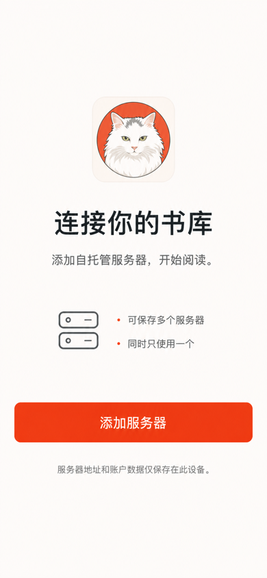

文件：[Server Profiles Empty Gate App Light v1](assets/mobile-app-hifi-v1/server-profiles-empty-gate-app-light-v1.png)

冻结项：

- 无 server profile 时不可返回 Shell，也不显示 Tab；
- 首屏只有一个品牌标识、一段任务说明和唯一主动作“添加服务器”；
- 不提供跳过、演示服务器、云账户、登录或上传入口；
- “可保存多个服务器 / 同时只使用一个”只解释产品模型，不创建第二个选择步骤。

## 4. Add Server

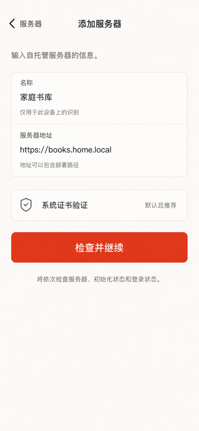

文件：[Add Server App Light v1](assets/mobile-app-hifi-v1/server-add-app-light-v1.png)

冻结项：

- 只收集显示名称和完整服务器地址；base path 是 URL 的一部分，不拆成技术字段；
- 默认 `systemTrust`，仅显示“系统证书验证 · 默认且推荐”，禁止 TLS Switch 或不安全快捷选项；
- 主动作“检查并继续”依次触发 health、setup status 和认证分支；
- 地址错误贴近字段，连接中使用按钮/局部 progress，网络中断保留草稿。

## 5. TLS Risk + Confirmation Dialog

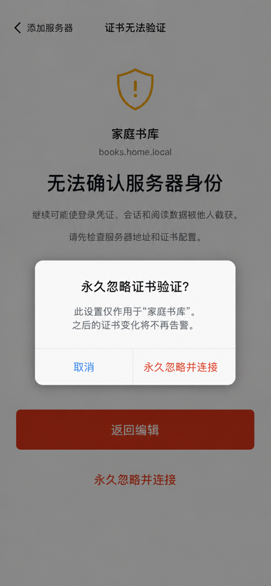

文件：[TLS Risk Confirmation App Light v1](assets/mobile-app-hifi-v1/server-tls-risk-confirmation-app-light-v1.png)

冻结项：

- TLS 校验失败先进入完整风险页，安全主路径为“返回编辑”；
- 风险页明确登录凭证、会话和阅读数据可能被截获，不用弱化文案；
- “永久忽略并连接”必须再触发一个平台原生确认 Dialog；
- Dialog 明确设置仅作用于“家庭书库”，按钮必须写全“永久忽略并连接”；
- 确认后该 profile 使用 `insecureSkipAllValidation`，不是全局默认值，后续证书变化不再告警。

## 6. Login

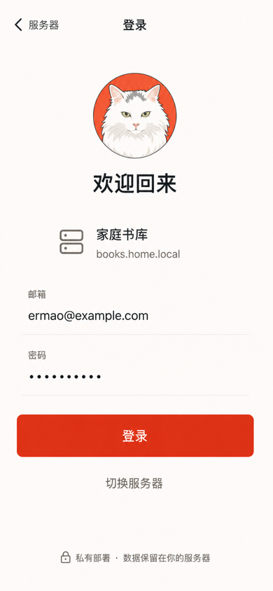

文件：[Login App Light v1](assets/mobile-app-hifi-v1/auth-login-app-light-v1.png)

冻结项：

- 页面始终显示服务器名称和域名；返回或“切换服务器”回到 profiles；
- P0 只包含邮箱、密码和登录动作，不新增社交登录、注册或未审计的密码找回；
- 登录失败只在字段/表单内呈现并保留邮箱，普通 401 不使用 Dialog；
- 登录成功后仍须请求 `/api/auth/me`，不能仅凭 Cookie 直接进入 Shell。

## 7. Setup

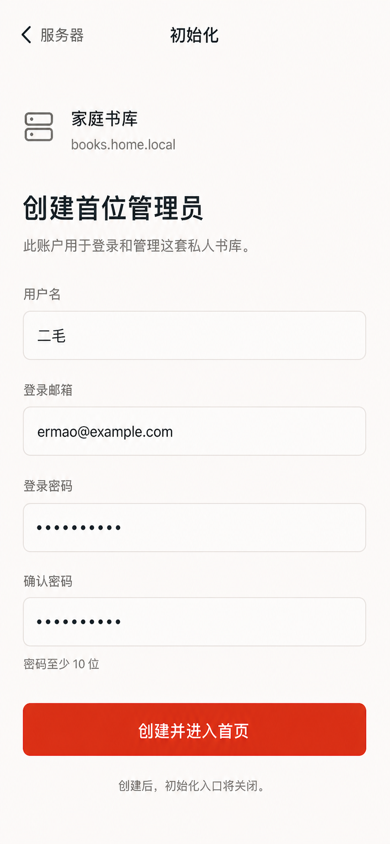

文件：[Setup App Light v1](assets/mobile-app-hifi-v1/auth-setup-app-light-v1.png)

冻结项：

- Setup 与 Login 互斥，只在 setup status 未初始化时出现；
- 移动端只创建首位管理员，字段为用户名、登录邮箱、登录密码和确认密码；
- 密码规则至少 10 位，422 错误贴近字段；
- 不在移动端 Setup 中配置服务器/NAS 目录、监控文件夹、导入或元数据；
- 主动作成功建立 Cookie 会话并继续 `/me`，setup 409 重新检查状态并转 Login。

## 8. Reauthenticate with Offline Grace

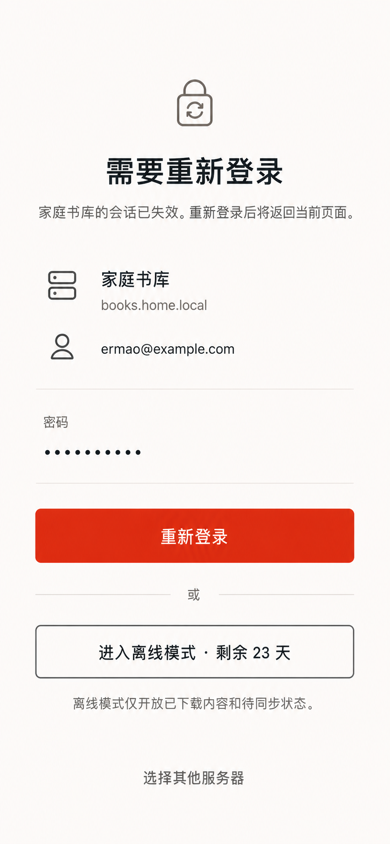

文件：[Reauthenticate Offline Grace App Light v1](assets/mobile-app-hifi-v1/auth-reauthenticate-offline-grace-app-light-v1.png)

冻结项：

- 明确 401 使用全屏 `auth.reauthenticate`，不是覆盖旧私有 UI 的 Dialog；
- 页面固定显示 server/user identity，重新登录为主动作；
- entitlement 有效时显示“进入离线模式 · 剩余 X 天”，视觉层级低于重新登录；
- 离线模式只开放完整下载、本地书签和待同步状态，不要求额外 PIN、生物识别或 App Lock；
- 同一 server/user 登录成功后恢复合法 intent；换用户时清除四个 Stack 回首页。

## 9. Server Unavailable — Inline Recovery

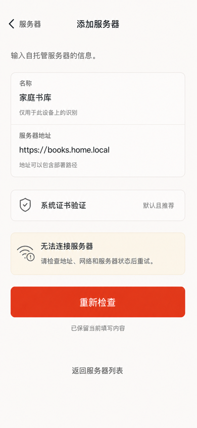

文件：[Server Unavailable Inline App Light v1](assets/mobile-app-hifi-v1/server-unavailable-inline-app-light-v1.png)

冻结项：

- 服务不可达是 `server.add` 的原位状态，不创建新的返回历史；
- 名称、地址和证书模式草稿全部保留，错误区位于证书行与主动作之间；
- 主动作变为“重新检查”，用户仍可编辑地址或返回服务器列表；
- 使用中性/警示语义表达连接失败，珊瑚红仍只代表安全动作；
- 不用 Dialog、全屏错误页或会导致草稿丢失的自动返回。

## 10. Server Incompatible — Full-screen Problem

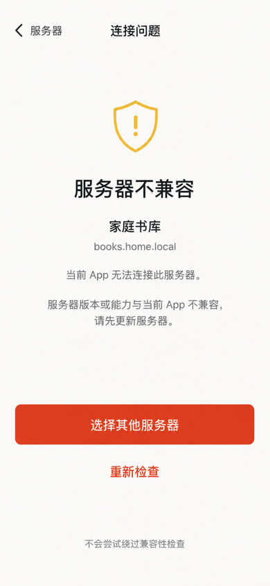

文件：[Server Incompatible App Light v1](assets/mobile-app-hifi-v1/server-incompatible-app-light-v1.png)

冻结项：

- 服务不兼容进入 `server.connection-problem(mode=incompatible)` 全屏状态；
- 页面保留 server identity，并明确版本或能力不兼容；
- 主路径为选择其他服务器，允许重新检查，但不提供忽略、强制连接或 TLS 绕过；
- 页面不得跳到 Login/Setup，也不得让用户在兼容性未通过时输入凭证。

## 11. Login 401 — Field Error

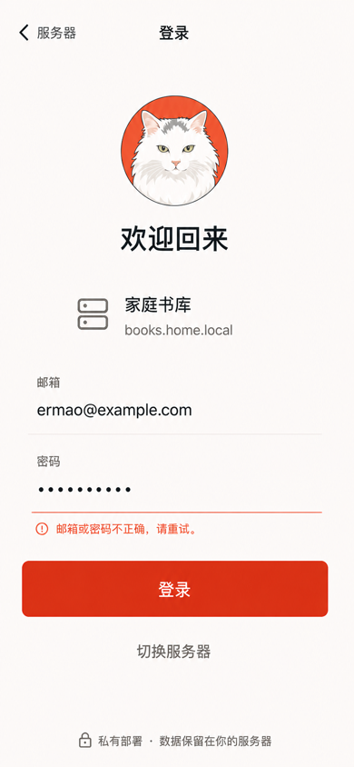

文件：[Login Invalid Password App Light v1](assets/mobile-app-hifi-v1/auth-login-invalid-password-app-light-v1.png)

冻结项：

- 401 作为密码字段关联错误就地呈现，不新建页面、不弹 Dialog；
- 邮箱、密码输入和当前 server identity 全部保留，用户可以直接重试；
- 文案使用“邮箱或密码不正确”保持反枚举语义，不暴露具体哪一项匹配；
- 错误使用平台 danger 语义色，珊瑚红只保留给登录动作。

## 12. Setup 409 — Automatic Login Redirect

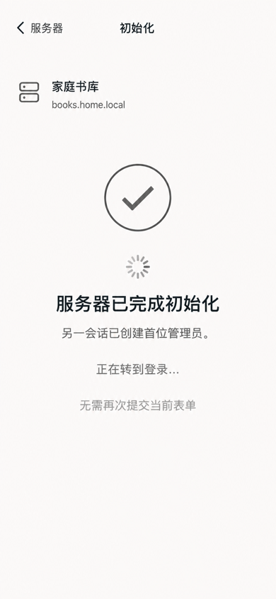

文件：[Setup Conflict Redirect App Light v1](assets/mobile-app-hifi-v1/auth-setup-conflict-redirect-app-light-v1.png)

冻结项：

- setup 409 立即重新请求 setup status；确认已初始化后自动 replace 到 Login；
- 过渡状态沿用 Setup 的导航身份和 server identity，不保留可再次提交的表单；
- 使用系统进度和中性成功状态，不将并发初始化误报为用户错误；
- 过渡态不提供按钮、重试、Dialog 或返回后重复提交的路径。

## 13. Account Disabled — Blocking Gate

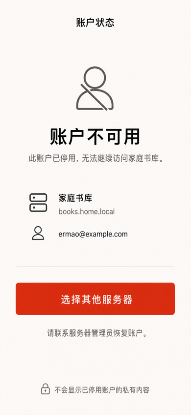

文件：[Account Disabled App Light v1](assets/mobile-app-hifi-v1/auth-account-disabled-app-light-v1.png)

冻结项：

- 账户停用使用全屏阻断 Gate，不能返回已缓存的私有页面；
- 页面固定显示 server/user identity，说明需由服务器管理员恢复账户；
- 唯一可执行主动作是选择其他服务器，不提供重新提交密码或假性重试；
- 私有内容在认证恢复前保持遮蔽，不能以底层 underlay、缩略图或 mini player 泄露。

## 14. Offline Entitlement Expired

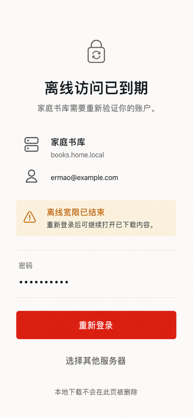

文件：[Reauthenticate Expired App Light v1](assets/mobile-app-hifi-v1/auth-reauthenticate-expired-app-light-v1.png)

冻结项：

- entitlement 到期仍是 `auth.reauthenticate` 的页面变体，不建立新 route；
- 页面完全移除“进入离线模式”与剩余天数，只保留重新登录和选择其他服务器；
- 明确重新登录后才能继续打开已下载内容，不提供设备解锁旁路；
- 认证页不会静默删除本地下载；主动退出登录的清理规则仍由 Phase 2 的安全契约控制。

## 15. 验收结论

- 十二张资产均为 `390 × 844` PNG，并与 Phase 5 的 Server、Me、Home 使用同一视觉语言；
- Gate、Page、Auth Gate 与 Dialog 层级可明确区分，返回路径和关闭顺序不含歧义；
- 登录和 Setup 分支互斥，移动端 Setup 没有复制 Web 的服务器目录配置；
- TLS 风险绑定单个 profile，并经过风险页和原生二次确认；
- Reauthenticate 同时表达重新登录和 30 天离线宽限，未引入设备解锁；
- unavailable 保留草稿，incompatible 阻止绕过，Login 401 保留输入，Setup 409 自动转 Login；
- 账户停用不会暴露旧私有 UI，entitlement expired 不再显示离线入口；
- 所有页面仍需在实现阶段补齐 `zh-CN`/`en-US`、Dynamic Type、VoiceOver/TalkBack、Android 系统返回、Reduced Motion/Transparency 和真实平台输入控件验收。

书库搜索、系列/作者 Facet 和返回上下文的高保真内容流见 [`mobile-app-phase-7-library-discovery-high-fidelity.md`](mobile-app-phase-7-library-discovery-high-fidelity.md)。网络中断恢复在对应表单与连接任务的交互态批次一并冻结。
