# 移动 App 第七阶段：书库发现流高保真闭环

> 横切实现规范：[`mobile-app-development-global-guidelines.md`](mobile-app-development-global-guidelines.md)

## 1. 目的与范围

本文件在 Phase 1–6 之上冻结书库搜索、系列/作者分组、共享 Facet、返回上下文、筛选/菜单覆盖层与关键结果状态的 Compact 高保真基线。现行 `390 × 844` App Light PNG 只覆盖页面锚点、覆盖层/结果变体、局部请求失败和权限重验；不创建或重建 `apps/mobile`。

本阶段只增加既有 route 的页面级构图，不新增能力：

```text
tab.library(scope=books)
→ library.search(books, query)
→ book.detail(bookId)

tab.library(scope=series)
→ books.facet(series, facetId)
→ book.detail(bookId)

tab.library(scope=authors)
→ books.facet(author, facetId)
→ book.detail(bookId)
```

从 `book.detail` 点击作者或系列时复用同一 `books.facet` 页面，但压入当前来源 Stack；从哪里进入就回到哪里。

## 2. 共同视觉与数据约束

- 画布：`390 × 844`，不含设备外框、伪造 status bar 或演示板；
- 使用 Phase 4 App Light 语义令牌、8pt 节奏、系统无衬线、原生导航与 Tab；
- 作品网格在标准 Compact 宽度保持每行三本，Cover 为 `2:3`、8pt 圆角；
- 系列/作者分组使用平面列表、Cover 组图、Divider 和系统 chevron，不引入头像体系或卡片墙；
- `facetKind + facetId` 是页面身份，动态名称只展示，不作为 route key；
- 只有存在真实进度的作品显示 Progress；媒体类型不使用装饰性 Badge；
- 纸感来自暖色背景、排版、封面和内容节奏，不使用纸纹、噪点、装饰渐变或仿纸卡片；
- 本文演示书名、作者、数量和封面只用于视觉校准，不覆盖 Phase 1 的真实 API 与数据契约。

## 3. Books Search Results


文件：[Library Works Search Results App Light v1](assets/mobile-app-hifi-v1/library-search-works-results-app-light-v1.png)

冻结项：

- `library.search` 是 LibraryStack 页面，保留 Library Tab，不在首页建立第二套搜索；
- 原生搜索字段、`全部 / 系列 / 作者` scope、结果数、Filter 和结果按任务顺序排列；
- Filter 只在 books scope 出现，进入草稿型 Filter Sheet；
- 结果按服务端稳定顺序分页，标准 Compact 使用三列网格；
- 点击图书进入共享 `book.detail(bookId)`，返回时 query、scope、结果顺序和 scroll anchor 不变。

## 4. Series Scope

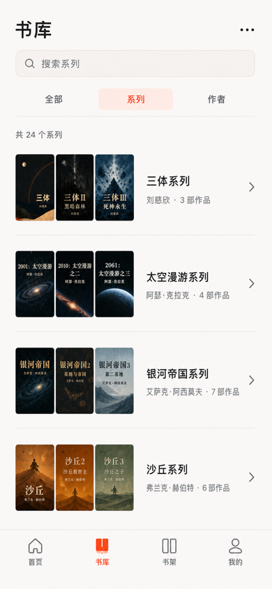

文件：[Library Series Scope App Light v1](assets/mobile-app-hifi-v1/library-series-scope-app-light-v1.png)

冻结项：

- 系列是 `tab.library` 的根页面状态，不新增 Tab 或独立一级页面；
- 搜索只匹配 series grouping，不复用 books Filter；
- 每行由三本 Cover 组图、系列名、作者/作品数和系统 chevron 组成；
- 分组列表使用 Divider，不使用独立卡片、投影、彩色底板或头像；
- 点击分组使用真实 `facetId` 进入共享 Series Facet。

## 5. Series Facet

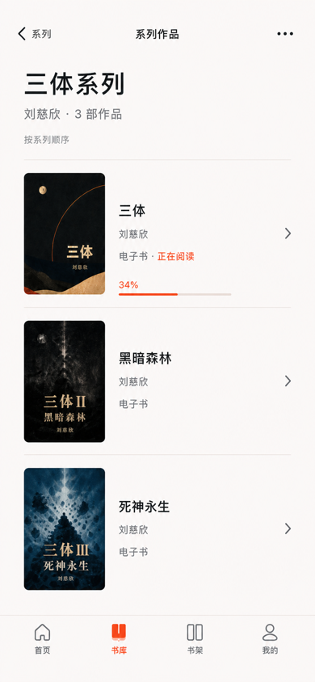

文件：[Library Series Facet App Light v1](assets/mobile-app-hifi-v1/library-series-facet-app-light-v1.png)

冻结项：

- 页面标题表达 Facet 类型，内容头表达动态系列身份与作品数；
- 系列顺序是首要语义，因此使用有序连续列表，不改用视觉上无序的网格；
- 每行显示 Cover、作品名、作者、媒介摘要和进入指示；只有有意义的进度才显示 Progress；
- 从 Library 系列分组进入时返回系列 scope；从 Book Detail 的系列入口进入时返回原 Book Detail；
- 当前 Facet 重复打开同一 `facetId` 时复用/刷新页面实例，不重复叠栈。

## 6. Authors Scope

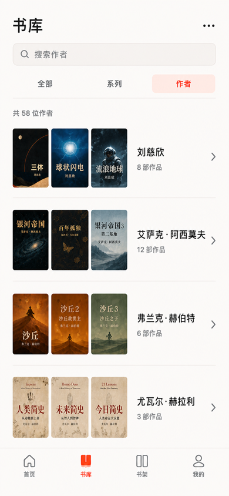

文件：[Library Authors Scope App Light v1](assets/mobile-app-hifi-v1/library-authors-scope-app-light-v1.png)

冻结项：

- 作者与系列使用同一个 Library 外壳和分组列表语法；
- 作者身份由作者名、作品数和代表 Cover 组图表达，不新增缺乏真实数据来源的头像；
- 长作者名优先保证可读文字与触摸目标，空间不足时允许 Cover 组图缩减，不压缩字号；
- 搜索只查当前 author grouping；切换 scope 时分别恢复各自 query 和 scroll；
- 点击作者使用真实 `facetId` 进入共享 Author Facet。

## 7. Author Facet

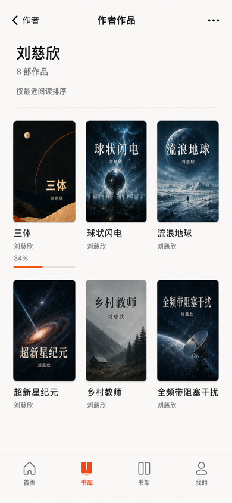

文件：[Library Author Facet App Light v1](assets/mobile-app-hifi-v1/library-author-facet-app-light-v1.png)

冻结项：

- 内容头只显示作者名、作品数和当前排序摘要，不添加虚构简介或头像；
- 作者作品没有强制阅读顺序，标准 Compact 使用三列作品网格；
- 点击图书进入共享 `book.detail(bookId)`；返回恢复 Facet 的排序、分页窗口和 scroll anchor；
- 从 Book Detail 点击作者进入该共享页面时，返回必须回到触发的 Book Detail；
- 403/404 不区分不存在或无权，使用统一不可访问状态并清除失效对象缓存。

## 8. 查询、返回与页面实例契约

每个 scope 独立保存：

```text
scopeState =
  query + sort + viewMode + filters? +
  loadedPageWindow + scrollAnchor + selectedBookId?
```

- `filters` 只存在于 books scope；series/authors 禁止继承 books Filter；
- 切换 scope 只切换当前根状态，不把每次 scope 变化写入历史栈；
- Search → Book Detail → Back 恢复 Search；Grouping → Facet → Book Detail → Back 逐层恢复；
- 返回恢复期间不闪回顶部、不重新排序已加载结果，也不重复提交搜索；
- 返回时保留当前内存中的已成功加载页；重新请求成功后以可识别作品恢复 anchor，而不是强制跳顶；
- route 实例使用 `routeKey + entityId`，同一 Book 或 Facet 不重复叠栈；
- Deep Link 进入 Book 时由 Library 根构造 canonical underlay，但不得伪造旧 query/scroll；
- mini player 只在存在音频会话时出现在 Tab 上方，本批静态锚点未显示不代表取消该规则。

## 9. 状态矩阵

| 状态 | Search | Series/Authors | Facet |
|---|---|---|---|
| Loading | 原生搜索保持可用；结果区局部加载 | 保留 scope；列表区局部加载 | 保留身份头；内容区局部加载 |
| Empty | 显示当前 query 与“无匹配作品” | 显示当前 query 与“无匹配系列/作者” | 显示身份与“暂无可访问作品” |
| Error | 结果区行内重试，不清 query | 列表区行内重试，不切 scope | 内容区行内重试，不丢返回来源 |
| Permission | 遮蔽旧结果并重新授权 | 遮蔽旧分组 | 不可访问时统一 404 呈现 |

普通网络失败、空状态和 403/404 不使用 Dialog。首屏或显式刷新失败不恢复旧页面；下一页失败仅保留本次 generation 已成功加载的页面。

## 10. Works Filter Sheet

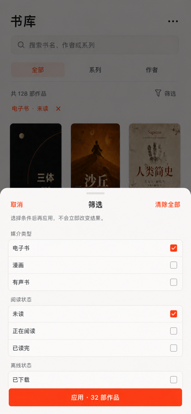

文件：[Library Filter Sheet App Light v1](assets/mobile-app-hifi-v1/library-filter-sheet-app-light-v1.png)

冻结项：

- `library.filter` 只在 books scope 出现，是草稿型原生 Sheet，不进入页面历史；
- 打开时从已应用条件复制草稿；勾选不会立即改变 underlay 的结果数、筛选摘要或滚动；
- “应用”一次性提交草稿，“清除全部”重置草稿，“取消”丢弃草稿；
- 阅读状态使用可访问的原生单选行，不使用彩色 Tag 墙；不提供 downloaded-only 或离线状态筛选；
- Sheet 不提供 P1 高级规则入口，不嵌套第二个 Sheet；动态字体不足时升为全高；
- 应用或取消关闭后焦点回到 Filter 触发控件。

## 11. Sort Menu

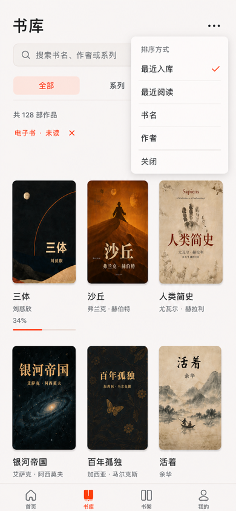

文件：[Library Sort Menu App Light v1](assets/mobile-app-hifi-v1/library-sort-menu-app-light-v1.png)

冻结项：

- `library-sort` 使用平台原生 Menu，锚定 Library overflow；
- 最近入库、最近阅读、书名和作者为有限单选，当前项使用系统 check；
- 点击立即应用并关闭 Menu，不增加“应用”步骤、不打开 Sheet；
- 排序变化保留 query、scope、filters 和 viewMode，并以新顺序重新建立可识别 scroll anchor；
- Menu 不承载错误、权限教育、长说明或自定义动画。

## 12. View Menu

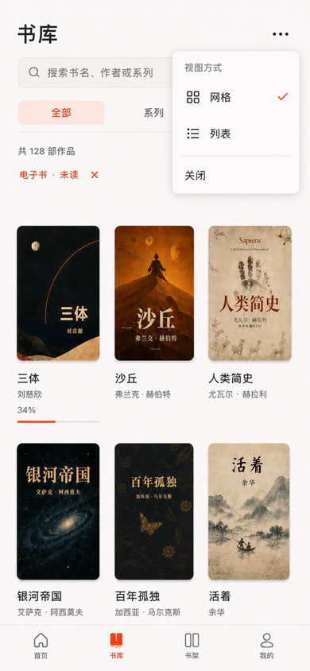

文件：[Library View Menu App Light v1](assets/mobile-app-hifi-v1/library-view-menu-app-light-v1.png)

冻结项：

- `library-view` 与排序使用相同的原生 Menu 语义，但只包含 Grid/List 两项；
- 当前 viewMode 使用系统 check；点击立即应用、关闭并保留当前结果上下文；
- Grid/List 是单选状态，不使用 Switch、预览卡或二级自定义面板；
- Menu 打开时不存在其他 App modal；系统返回先关闭 Menu；
- 文字缩放导致三列不可读时允许自动降为两列或 List，但不能默默改写用户持久偏好。

## 13. Search Empty

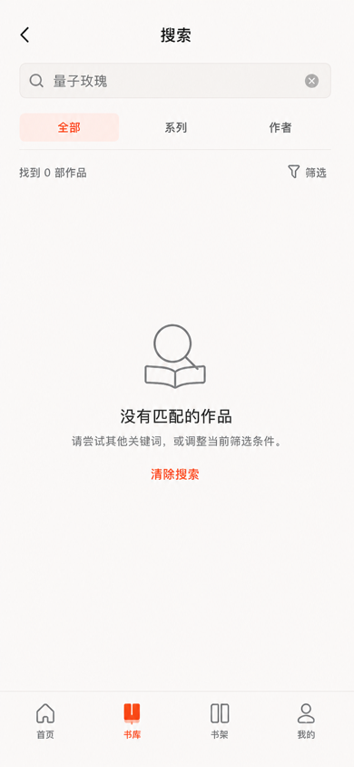

文件：[Library Search Empty App Light v1](assets/mobile-app-hifi-v1/library-search-empty-app-light-v1.png)

冻结项：

- 空结果保留当前 query、scope 和 Filter 入口，不退出 Search 或清空输入；
- 结果区只显示系统图标、明确标题、调整建议和“清除搜索”动作；
- 不伪造推荐内容、不显示错误红色、不弹 Dialog/Snackbar；
- “清除搜索”清空 query 并回到该 scope 的默认结果，filters 仍保留，除非用户在 Filter Sheet 清除；
- VoiceOver/TalkBack 必须读出 query 与 0 个结果。

## 14. Pagination Error

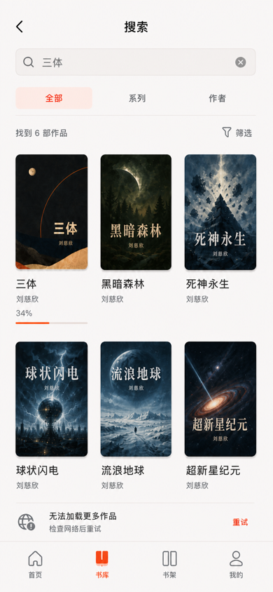

文件：[Library Pagination Error App Light v1](assets/mobile-app-hifi-v1/library-pagination-error-app-light-v1.png)

冻结项：

- 下一页失败只在已加载结果末端显示一条平面 Inline Error，不清空已有作品、不改变 query、scope、filters、sort、viewMode 或 scroll anchor；
- 状态必须明确写出“无法加载更多作品”，避免被误读为整页搜索失败；网络图标和错误文案使用中性色，只有“重试”使用 `actionAccent`；
- “重试”复用同一个稳定分页游标并拒绝重复提交；请求期间把该行切换为原生局部 loading，不在页面上叠加第二个 Spinner；
- 成功后原位移除错误行并追加下一页，失败则保留同一行；不得跳顶、重复已有作品或重新排列当前页；
- Pagination Error 不触发第二套 Shell、Dialog、Snackbar、登录或全页错误。

## 15. Ordinary Network Error

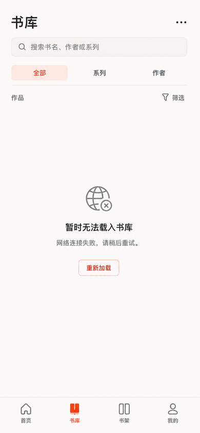

文件：[Library Network Error App Light v1](assets/mobile-app-hifi-v1/library-network-error-app-light-v1.png)

冻结项：

- 首次结果请求或显式刷新失败时，保留 Library 标题、Search、scope、Filter 和 Tab 上下文，只替换结果区，不恢复旧 GET 页面；
- 结果区使用一个中性系统网络图标、明确标题、简短说明和“重新加载”动作，不使用错误红色、插画、卡片或全局遮罩；
- “重新加载”只重试当前 query/scope/filter 请求；加载时使用结果区原生 indicator，不能重建 route 或丢失输入；
- 普通请求失败不是 401、403/404 或服务器身份变化，因此不显示登录、权限或服务器切换入口；
- 该错误不用 Dialog、Banner 或 Snackbar，网络恢复后直接回到当前结果上下文。

## 16. Permission Revalidation

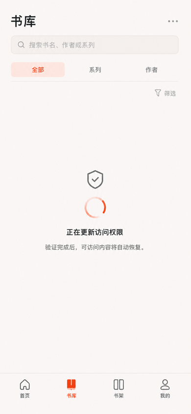

文件：[Library Permission Revalidation App Light v1](assets/mobile-app-hifi-v1/library-permission-revalidation-app-light-v1.png)

冻结项：

- `authzVersion` 变化后立即移除旧 Cover、标题、作者、进度和 Filter 摘要，不通过模糊或透明遮罩继续暴露旧私有内容；
- Library 外壳和选中 Tab 保留，Search、scope、overflow 与 Filter 使用系统 disabled 处理；内容区只显示原生 indicator、权限语义图标和自动恢复说明；
- 重验是自动短时 gate，没有重试、登录或取消按钮，也不进入导航历史和系统恢复状态；
- 验证成功后按新 namespace 原位恢复允许内容；资源不再可访问时进入统一“内容不存在或当前不可访问”，明确 401 则交给 `auth.reauthenticate`；
- 该状态不使用 Dialog、Sheet、Snackbar、旧数据 Skeleton 或大面积珊瑚红。

## 17. 验收结论

- 现行资产均为 `390 × 844` PNG，并继承 Phase 5 Library、Book Detail 的内容密度与视觉语言；
- Works Search 保持三列密度，系列/作者分组用平面列表，Series Facet 用有序列表，Author Facet 用三列网格；
- 搜索、scope、Facet 与 Book Detail 的返回来源明确，不增加 Tab 历史；
- books、series、authors 各自保存 query 和 scroll，Filter 不跨 scope 泄漏；
- Filter Sheet 保持草稿/应用语义；排序和视图 Menu 单选即关闭；覆盖层不进入恢复历史；
- 空结果保留 query；Download Center 是 completed 本地下载的唯一发现入口；
- Pagination Error 保留本次 generation 已加载结果；首次或刷新网络错误只替换结果区；权限重验不泄漏旧私有内容；
- network error 与 permission revalidation 在同一时刻只有一个明确呈现层，不叠加 Banner、Dialog、Snackbar 或重复 loading；
- 页面没有仿纸卡片、纹理噪点、装饰渐变、非必要投影或 Material 化漂移；
- 实现阶段仍须补齐 App Dark、Expanded split view、Dynamic Type、`zh-CN`/`en-US`、VoiceOver/TalkBack、Reduced Motion/Transparency 与真实返回恢复测试。

下一批优先冻结 Series/Authors/Facet 的 loading、empty、局部网络错误与统一不可访问状态。
