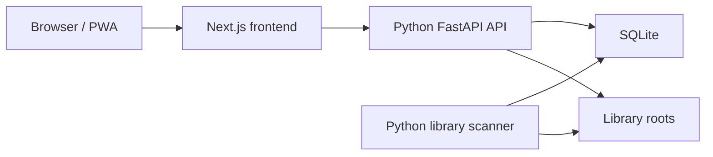

# Python Backend Runtime

Shuku Starship uses Python for the backend runtime. Next.js is the React frontend and an
internal `/api/*` rewrite target.

## Runtime boundaries

- `apps/web` renders pages and calls `/api/...`.
- `apps/api-python/app/main.py` serves public API routes through FastAPI.
- `apps/api-python/app/worker` scans configured library roots and processes import tasks.
- SQLite and persistent application files live under `STORAGE_ROOT`.
- Original publications remain in separately mounted library roots.



The scanner interprets each root's `FLAT`, `VOLUMES`, or `AUDIOBOOK` directory topology,
materializes Work/Version/Volume identity, and only then enqueues original-file parsing.
See [Library Root Layout](library-root-layout.md).

## Fresh schema baseline

Alembic has one current revision:
`0001_library_topology_baseline` (library topology, version covers, and ADR 0018
readable-resource overlay tables). Startup behavior is intentionally narrow:

- an empty database is created at the current head;
- a database already stamped at the current head is accepted;
- any populated unversioned database or other revision is rejected.

There is no historical schema upgrade, data backfill, backup compatibility bridge, or
implicit repair. Deploy this refactor with a new SQLite database and rescan the original
library roots. `app/db/seed.py` inserts only current baseline settings and built-in metadata
providers.

The API and worker both pass `verify_current_schema` before serving work. Run the same
prestart path manually with:

```bash
cd apps/api-python
uv run python -m app.bootstrap.prestart
```

## Verification

- `scripts/verify-python-backend-migration.mjs` verifies the unified runtime, current
  schema barrier, frontend contracts, and Compose topology; the historical filename is a
  build-script entry point, not a promise of database migration compatibility.
- `docker-compose.prod.yml` exposes only the unified Web service.
- New backend behavior belongs under a capability in `apps/api-python/app/modules`, not in
  Next.js API route handlers.
