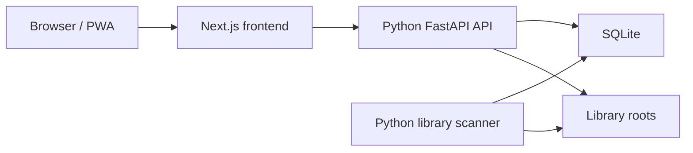

# Python Backend Runtime

Shuku Starship uses Python for the backend runtime. Next.js is the React frontend and an
internal `/api/*` rewrite target.

## Runtime boundaries

- `apps/web` renders pages and calls `/api/...`.
- `apps/api-python/app/main.py` serves public API routes through FastAPI.
- `apps/api-python/app/worker` scans configured library roots and processes import tasks.
- SQLite and persistent application files live under `STORAGE_ROOT`.
- Original publications remain in separately mounted library roots.



The scanner interprets each root's `FLAT` or `VOLUMES` directory topology,
materializes Book/ReadableResource/ResourceAsset identity, and only then enqueues
original-file parsing.
See [Library Root Layout](library-root-layout.md).

## Schema revisions

Alembic uses a linear revision chain under `app/db/alembic/versions`.
The current head is `0009_reader_v5_opaque_progress`; schema ownership and upgrade
behavior live in `app/db/runner.py`. Startup behavior is intentionally narrow:

- an empty database is created at the current head;
- a database already stamped at the current head is accepted;
- a database stamped at a known ancestor is upgraded to the current head;
- any populated unversioned database or unknown revision is rejected.

There is no implicit repair for unversioned or unknown schemas. `app/db/seed.py` inserts
baseline settings, the persistent server identity and built-in metadata providers.

The API and worker both pass `verify_current_schema` before serving work. Run the same
prestart path manually with:

```bash
cd apps/api-python
uv run python -m app.bootstrap.prestart
```

## Windows one-click development service

On Windows, double-click `start-windows.cmd` in the repository root, or run:

```powershell
pnpm dev:test:windows
```

The Windows-native launcher runs the schema prestart check and then starts the FastAPI API,
import worker, Next.js development server, and unified port-3000 gateway. It uses
`apps/api-python/.venv-windows`, stores runtime state and per-process logs under
`.tmp/windows-dev`, and restarts a previous instance that it launched. Press `Ctrl+C` in the
launcher window to stop all four processes. The launcher never invokes WSL.

### Windows Python environment / Windows Python 环境

基础 Python 放在 `.runtime-windows/python`，依赖放在
`apps/api-python/.venv-windows`。虚拟环境仍依赖基础解释器，不能只复制
`Scripts/python.exe`。安装环境是独立的一次性操作，先停止开发服务，再从仓库根目录
执行以下命令。uv 路径按本机安装调整；运行时目录不提交到 Git。

```powershell
$projectRoot = (Get-Location).Path
$uv = Join-Path $projectRoot '.runtime-windows\uv.exe'
$api = Join-Path $projectRoot 'apps\api-python'
$pythonVersion = (Get-Content (Join-Path $api '.python-version') -Raw).Trim()
$pythonRoot = Join-Path $projectRoot '.runtime-windows\python'
$basePython = Join-Path $pythonRoot "cpython-$pythonVersion-windows-x86_64-none\python.exe"
$env:UV_PROJECT_ENVIRONMENT = Join-Path $api '.venv-windows'
& $uv python install $pythonVersion --install-dir $pythonRoot --no-bin --no-registry
if ($LASTEXITCODE) { throw 'Python installation failed' }
& $uv venv --clear $env:UV_PROJECT_ENVIRONMENT --python $basePython
if ($LASTEXITCODE) { throw 'Virtual environment creation failed' }
& $uv sync --project $api --extra dev --locked --python $basePython --link-mode copy
if ($LASTEXITCODE) { throw 'Dependency installation failed' }
& "$api\.venv-windows\Scripts\python.exe" -c "import sys, sqlalchemy, uvicorn; print(sys.base_prefix)"
Remove-Item Env:UV_PROJECT_ENVIRONMENT
```

移动仓库或删除基础解释器后需重建环境。启动入口会先检查 Python
依赖，再停止旧服务。Windows 启动验收应包含资源管理器实际双击。

## Verification

- `scripts/verify-python-backend-migration.mjs` verifies the unified runtime, current
  schema barrier, frontend contracts, and Compose topology; the historical filename is a
  build-script entry point, not a promise of database migration compatibility.
- `docker-compose.prod.yml` exposes only the unified Web service.
- New backend behavior belongs under a capability in `apps/api-python/app/modules`, not in
  Next.js API route handlers.
